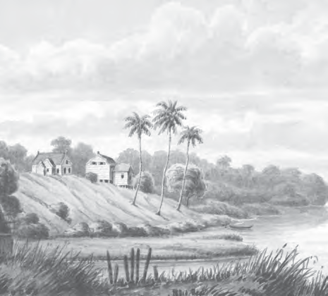
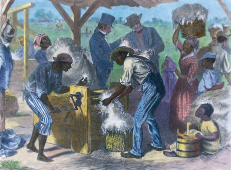
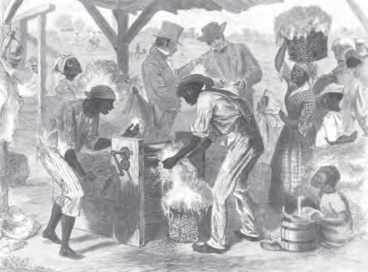
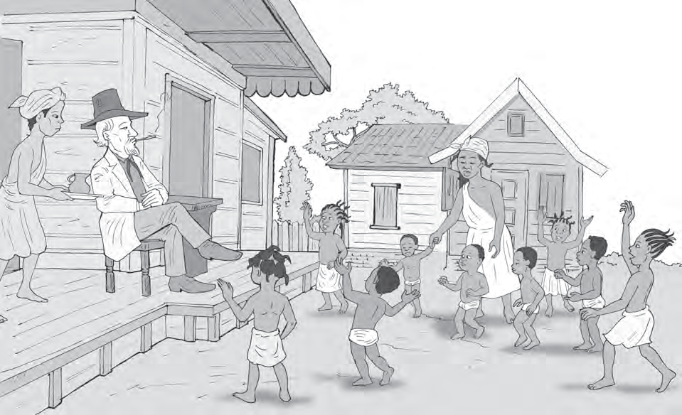
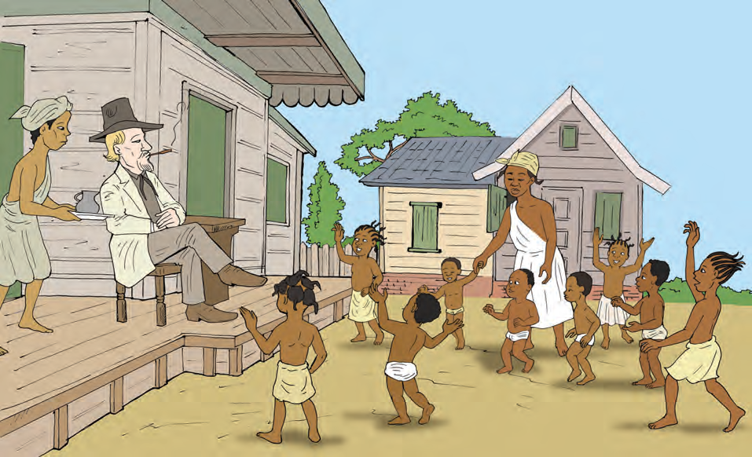
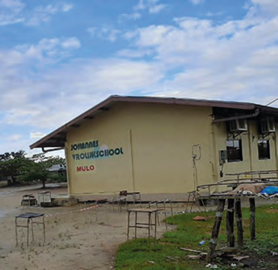

# Topic 2: Education in Our Country

## Lesson 1: How Was It in the Past?

In the time when only Indigenous people lived in our country, there were no schools. But that does not mean that Indigenous children did not need to learn. In the village where they lived, they learned from adults all kinds of things they would need later in life. From a very young age, they helped their parents with work. With building huts, making tools, clothing, and pots. And also with hunting, fishing, planting, and cooking. An important person among the Indigenous people was the piai. The piai knew a lot about medicinal plants and herbs and could heal sick people. A piai always had a few students to whom the knowledge of nature was passed on. The adults also sang songs and told stories to the children. This is how they learned the history of their own people.

When the Europeans took possession of our country in the 17th century, the first schools in our country were established. However, these schools were only intended for European children. For example, a school was already opened in Jodensavanne in 1677 for Jewish children. At the beginning, there were only a few European children and therefore also few schools in our country. At those schools, children learned to read and write. Religious education about the Christian faith was very important. But they also learned that it was God's will that there were enslaved people!

The children of enslaved people were not allowed to go to school. The European plantation owners did not want them to learn to read and write. Enslaved people had to remain ignorant. The plantation owners thought they could continue to dominate the enslaved people in this way. The plantation owners also thought that it was not necessary for work on the plantation to be able to read and write. The children could learn the work of adult enslaved people.

#### ASSIGNMENT

- What are the children doing in the picture?
- Why did they not go to school?
- Are there still children in our country who do not go to school?

Thus, although most enslaved children did not learn to read and write, from their parents they did learn about the injustice of slavery. The little children were cared for by a krioromama. She told the children stories and taught them that they had to be submissive to the master. But the children also learned to speak Sranan and later the odo's and songs sung by older enslaved people. They were also told about brave enslaved people who had fled and became Maroons. And they learned about Africa and their own culture.

In 1760, a school was opened in our country for the children of the free-colored population. Children of manumitted people (freed people), who could pay the school fees, went to this school. Education was not free. Most students at this school were colored people. In our country at that time, there was only primary school. Sometimes someone had the chance to study further in the Netherlands. An example of this is Johannes Vrolijk. In 1809, he returned to Suriname and opened a school here. With this, Johannes Vrolijk became the first colored teacher in our country. In the district of Wanica, a Mulot school is named after him.

#### ASSIGNMENT

- Who was Johannes Vrolijk?
- In which district is the Johannes Vrolijk Mulot school located?

#### REMEMBER

- Indigenous children learned from the elders in the village. Some children learned from the piai about medicinal herbs and plants.
- The first schools in our country were only for European children. They learned to read and write and also received religious education.
- Children of enslaved people were not allowed to go to school.
- The krioromama and the older enslaved people told enslaved children about the injustice of slavery and about their own culture.
- In 1760, a school was opened in our country for the free-colored population.
- Johannes Vrolijk became the first colored teacher in our country in 1809. A Mulot school in Wanica is named after him.

---

## QUESTIONS

**1.** a. From whom did Indigenous children learn what they needed to know and be able to do?
b. How did Indigenous children learn about the history of their own people?

**2.** Below are a number of things that children can learn from their parents. Which three things did Indigenous children NOT learn from their parents?
dancing, cycling, hunting, cooking, reading, planting, writing, fishing, singing

**3.** Which of the statements below is correct?
I. The piai could make sick people better.
II. The piai gave all children education about plants and herbs.
- A. Only statement I is correct.
- B. Only statement II is correct.
- C. Statements I and II are both correct.
- D. Statements I and II are both incorrect.

**4.** The school in Jodensavanne was opened in 1766.
- a. Calculate how long ago that was.
- b. Who went to this school?
- c. What subjects did children receive at school then?

**5.** What did European children learn in religious education?

**6.** Why were children of enslaved people not allowed to go to school?

**7.** Is the krioromama comparable to a daycare? Why yes/no?

**8.** Name three points that enslaved children learned from adult enslaved people.

**9.** In 1760, a school was opened for colored people. This was in the...
- a. First half of the 17th century.
- b. Second half of the 17th century.
- c. First half of the 18th century.
- d. Second half of the 18th century.

**10.** What is not correct about Johannes Vrolijk?
- A. A Mulot school in Wanica is named after him.
- B. He studied to become a teacher in the Netherlands.
- C. He was born in 1809.
- D. He was the first colored teacher in our country.

---

## Images

---

*Source: suriname-history.pdf (students)*
