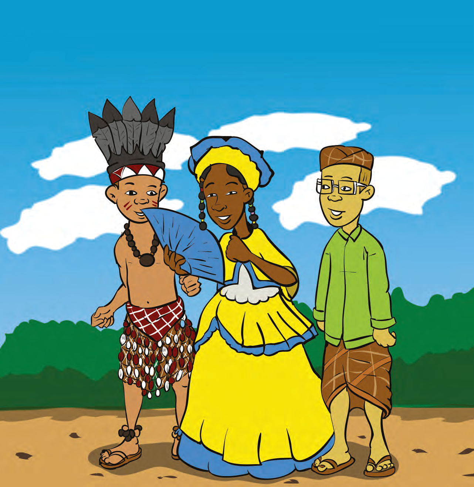
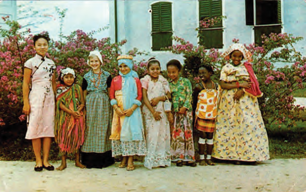

# Topic 3: Different Cultures in Our Country

## Introduction: Different Cultures in Our Country

Green, red, yellow, so many different colors and costumes. Everyone has something different on, but all equally beautiful. In this topic, it is told that there are different population groups with different cultures living in our country. In the first lesson, it is explained what is meant by culture, and examples are given of the cultures of the population groups. In lesson two, you learn that the population of our country did not always have the freedom to experience their own culture. But rules and laws could not stop the experiencing of one's own culture. In lesson three, it is explained that the different cultures in our country learn from and also adopt each other's culture.

### KEY TERMS

- Culture
- Multicultural society
- Cultural heritage
- Inferior
- Oppressed
- Poelepantje
- Johanna Schouten-Elsenhout
- Freedom of cultural experience
- Cultural association
- Melting pot
- National
- Cultural exchange
- To respect
- Unity
- Robin Ravales (pseudonym: Dobru)

---

## Images

---

*Source: suriname-history.pdf (students)*
