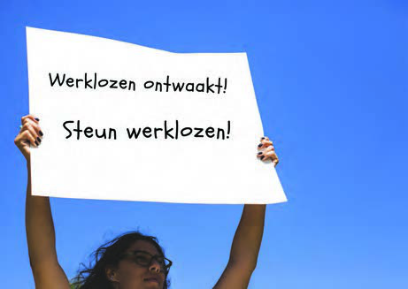

# Topic 1: Workers Stand Up for a Better Life

## Lesson 1: A Time of Crisis and Unemployment

In 1929, a bad time began for many countries in the world. In that year, an economic world crisis arose. We speak of an economic crisis in a country when things are going badly with the economy. Businesses and factories have to close because they make little or no profit. Trade in goods and agricultural products also decreases. Many people become unemployed and have no money. When such a situation occurs not in just one country, but in many countries around the world, we speak of an economic world crisis.

Before the economic world crisis of 1929, many countries in North America and Europe were actually experiencing a period of prosperity. After the end of the First World War in 1918, many factories were established and work in agriculture also increased. People borrowed money from banks to invest in businesses or agriculture. There was enough work for workers and production kept growing. Then a period began when the large quantity of products could no longer be sold. Not to people in their own country and not to people abroad. In other countries too, there were businesses and factories that made the same products. They too were stuck with their products. Wages were lowered and workers were laid off. Some businesses and factories could not repay the money they had borrowed from the bank. They went bankrupt and had to close their doors. A crisis arose.

Unemployment and poverty also increased in our country. At that time, there were not many businesses or factories, but our country did supply raw materials for factories in Europe. For example, sugar, coffee, cocoa, and balata. The prices for these raw materials dropped, with the result that workers' wages also decreased. More and more workers were laid off, and production was stopped on plantations. Poverty among workers and their families thus increased. A large part became unemployed, and the other part could barely get by on the meager wages they still received.

### Rising Unemployment

The crisis did not only result in lower wages and unemployment for workers. Small-scale farmers also had difficulties; they could no longer sell their products at a good price. Trade decreased because people had no money to buy products at the market. We say that purchasing power had decreased. What small shopkeepers and craftsmen earned also decreased as a result of the reduced purchasing power.

#### ASSIGNMENT

- Explain why many businesses and factories were closed during the crisis.
- Why did the prices of raw materials in our country fall?
- Explain why purchasing power decreased.

In the year 1931, the number of unemployed and poor people in our country had increased greatly as a result of the economic world crisis. Work on plantations and in gold, balata, and wood extraction had decreased. Many unemployed workers moved to Paramaribo. Surinamese workers who had worked on Curaçao and were laid off also joined them. The colonial administration had little understanding for the situation of the unemployed, and the government actually cut back on many things. People lived under very poor conditions. There were no medical facilities, and people often became sick. Many children did not have enough to eat and could not go to school because their parents were poor. Despite many people having difficulties, the government still raised taxes. In June 1931, a meeting was convened by unemployed workers where it was decided to work together and organize to stand up for the interests of workers. You will learn more about this in the next lesson.

#### ASSIGNMENT

- Explain why the number of unemployed in our country increased sharply in the years after 1930.
- Under what conditions did the unemployed live in our country?
- Why do you think unemployed people went out into the streets in groups?

#### REMEMBER

- In 1929, an economic world crisis began. In many countries, the economy was doing badly, and many people became unemployed.
- Before 1929, there was a period of prosperity in North America and Europe.
- During the prosperity period, overproduction arose. Products could no longer be sold. Businesses and factories went bankrupt.
- In our country too, unemployment rose and poverty grew. And purchasing power decreased.
- The government had little understanding for the situation of the unemployed.
- Unemployed workers moved to Paramaribo and came together. They wanted to stand up for their interests.

---

## QUESTIONS

**1.** Which answer is correct?
In the year 1929, an economic world crisis arose. This was in the:

- A. First half of the 19th century.
- B. Second half of the 19th century.
- C. First half of the 20th century.
- D. Second half of the 20th century.

**2.** Write in a circle: economic crisis.

- a. Around it, write things that are related to an economic crisis.
- b. Explain when there is an economic world crisis.

**3.** Write in a circle: period of prosperity.

- a. Write things around it that are related to an economic prosperity period in a country.
- b. Explain how the prosperity period changed into an economic crisis.

**4.** Which answer is correct? During the economic world crisis of 1929, workers in our country had difficulties because:

- A. Workers were often punished.
- B. Diseases broke out among plantation crops.
- C. Many workers had to join the army.
- D. Many businesses and plantations had to stop their production.

**5.** Explain what happens when a factory or plantation produces a lot and sells little.

**6.** Explain why small-scale farmers could not sell their products during a crisis period.

**7.** Explain why the population's purchasing power decreases when unemployment rises.

**8.** The economic crisis of 1929 caused a difficult time in our country. Which of the groups below felt it the most? Why do you say so?

- a. Members of the government.
- b. Factory workers.
- c. Small-scale farmers.

**9.** a. Why did many unemployed workers in our country move to Paramaribo?
b. Was that a good decision? Why or why not?

**10.** What is not correct?
People lived under poor conditions because...

- A. Workers earned very little money.
- B. Taxes were lowered.
- C. Children could not go to school.
- D. They often became sick.

---

## Teacher's Answers

**1.** C. First half of the 20th century.

**2.** a. *The answer will vary per student.*
b. We speak of an economic world crisis when things are going badly with the economy in many countries around the world. (Businesses and factories have to close because they make little or no profit. Trade in goods and agricultural products also decreases. People lose their jobs and have no money.)

**3.** a. *The answer will vary per student.*
b. The prosperity period changed into an economic crisis when businesses could no longer sell their products due to overproduction. Businesses that had borrowed money from the bank could not repay it and went bankrupt. People lost their jobs, and thus a crisis arose.

**4.** D. Many businesses and plantations had to stop their business activities.

**5.** When a factory or plantation produces more than they can sell, they are stuck with their products. This results in wages being lowered and workers being laid off.

**6.** The small-scale farmers also could not sell their products because trade had decreased. People no longer had money to buy products at the market.

**7.** When people are unemployed, they no longer receive wages. With little or no money, they can buy little to nothing. So purchasing power decreases.

**8.** b. Factory workers, because they became unemployed and could not plant or grow anything themselves to provide food for their needs and those of their families.

**9.** a. They came to Paramaribo hoping to find work here, because there was no more work on the plantations.
b. No, that was not a good decision, because there was also no work to be found in Paramaribo.

**10.** B. Taxes were lowered.

---

## Images

---

*Source: suriname-history.pdf (students) and suriname-history-teacher-guide.pdf (teacher)*
