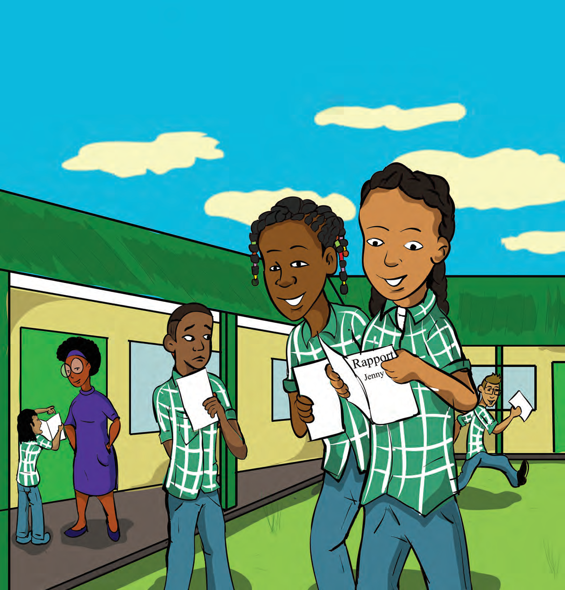
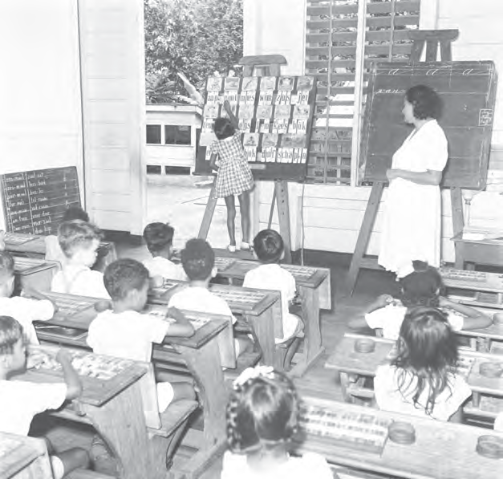
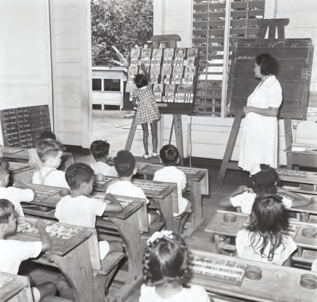

# Topic 2: Education in Our Country

## Introduction: Education in Our Country

This topic is about education in our country. How it was in the past and what changes there have been. Today, almost all children in our country go to school. But that was different in the past. You will learn more about this in Lesson 1. Lesson 2 explains that in 1876, a law was introduced that imposed the obligation for children to follow education. The number of schools in our country then increased. Lesson 3 gives a picture about the importance of good education.

### KEY TERMS

- Piai (former name for enslaved people)
- Religious education
- Injustice
- Krioromama
- Culture
- Colored people
- Johannes Vrolijk
- Christian communities
- Sranan
- Compulsory education
- Education inspector
- Herman Benjamins
- School language
- School books
- Maria Vlier
- School environment
- Independent
- Vocational education
- General education
- Pre-university education
- Special education

---

## Images

---

*Source: suriname-history.pdf (students)*
