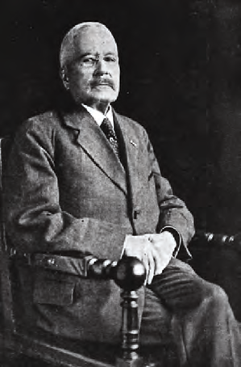
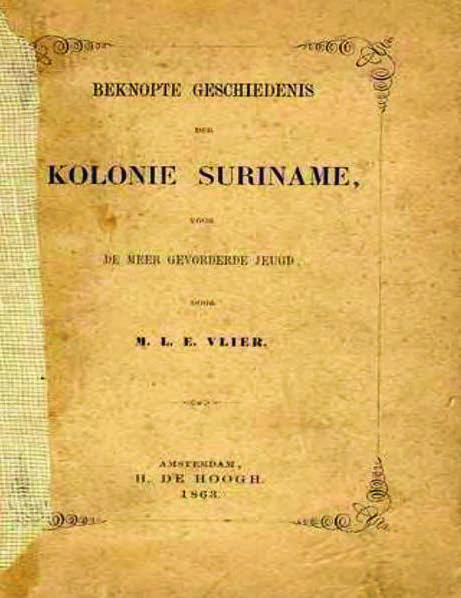

# Topic 2: Education in Our Country

## Lesson 2: Education Changes

At the beginning of the 19th century, the trade in enslaved people was abolished, and also slavery in our neighboring countries. In the Netherlands too, people began to understand that slavery could not always continue. The government was afraid that the enslaved people would take revenge on the Europeans when slavery was abolished. The idea arose that the enslaved people had to be prepared for a life in peace, without violence and resistance against the Europeans. Christian Communities were therefore given permission in 1844 to educate the enslaved people through religious education and reading lessons in Christianity. With the Bible in hand, religious teachers told the enslaved people that they had to have respect for God and authority. They were never allowed to contradict or be disrespectful to authority. So also not the authority of the Europeans. Lessons were given in Sranan. The children therefore only learned to read what had been translated into Sranan.

With the abolition of slavery in 1863, a new situation arose in our country. Our country changed, and changes also came in education. An important change was the introduction of compulsory education in 1876. That was a law that obliged parents to have their children aged 7 to 12 follow education. The government thought it was important that the children of the freed people were educated in Dutch culture. They did not learn much about their own culture. After the introduction of compulsory education, schools were also built by the government. An important change was also that primary education became free. When compulsory education was introduced, the government also decided that there had to be an education inspector.

From 1878 to 1910, Mr. Herman Benjamins was the inspector of education. Mr. Benjamins had a lot of say about education in our country.

The government thought it was important that the population of our country learned to know Dutch culture. The population had to love the Netherlands, as the mother country of Suriname. The compulsory school language therefore became Dutch. Children in our country also often received lessons from Dutch school books. From these, they learned a lot about the Netherlands, but little about their own country.

Maria Vlier was a Surinamese female teacher. She was the daughter of a manumitted woman. She found it very sad that children at school learned about the history of other countries, but nothing about their own country. Therefore, in 1863, she wrote the first history book about Suriname, which was used in schools in our country. In the preface of her book, Mrs. Vlier writes that she wanted students to learn more about the history of their own country and thus come to love the country more.

During the period when Mr. Benjamins was inspector, many schools were added in our country, and the number of children going to school increased. But, especially far from Paramaribo, education was not yet entirely in order. The school environment was not always good. Old school buildings with too many students in a classroom. The school books looked worn and there were often too few. Sometimes there was a shortage of teachers. Some of these problems still exist today. This means that in some places in our country, children cannot receive good education. That is unfortunate, because good education is for all children the key to a better future!

#### ASSIGNMENT

- What would you like to see changed in education?
- If you were a teacher, what would you change in this class?

#### REMEMBER

- From 1844, religious education and reading instruction were given to children of enslaved people. This education was in Sranan.
- In 1876, compulsory education was introduced in our country.
- Mr. Herman Benjamins was the first education inspector in our country.
- Education in our country was given in Dutch. Education had to form children according to Dutch culture.
- Maria Vlier was a Surinamese female teacher. She wrote the first school book about Surinamese history.
- The school environment was not always good.

---

## QUESTIONS

**1.** Copy the timeline below into your notebook:

1800 ——— 1900

- a. Which century does this timeline indicate?
- b. Place the correct year next to the following events on the timeline:
  - a. Beginning of religious education for enslaved people.
  - b. Abolition of slavery.
  - c. Introduction of compulsory education.

**2.** a. For which two reasons did the government give permission to give religious education to children of enslaved people?
b. What did children of enslaved people learn in religious education?
c. Why do you think this education was given in Sranan?

**3.** Choose the correct answer. In 1876, compulsory education was introduced in our country. Compulsory education means that:

- A. The government is obliged to build schools.
- B. Children are obliged to follow education.
- C. Teachers are obliged to teach children.
- D. Parents are obliged to send their children to school.

**4.** Name three things that the government also did after the introduction of compulsory education.

**5.** a. Tell in your own words or look up in a dictionary what work an inspector generally does.
b. What did Mr. Benjamins have to inspect?

**6.** Which statement is correct?
I. After the introduction of compulsory education, it was compulsory to speak Dutch at school.
II. Schools in our country always used Dutch school books.
- A. Only statement I is correct.
- B. Only statement II is correct.
- C. Statements I and II are both correct.
- D. Statements I and II are both incorrect.

**7.** Which statement about Mrs. Vlier is not correct?
- A. Her mother was formerly an enslaved person.
- B. She became the first minister of Education in our country.
- C. She wrote the first school book about the history of our country.
- D. She was a Surinamese female teacher.

**8.** a. Why did Mrs. Vlier write a history book about Suriname?
b. Which two things did she want to achieve in students with her book?

**9.** a. Why must it have been difficult to especially get education far from Paramaribo properly organized?
b. Explain whether today education far from Paramaribo is still less well organized.

**10.** Write in your notebook the word school environment.
- a. Write four words that according to you are related to the school environment. Then tell why you chose these words.
- b. What is the school environment of your school like?

---

## Images

---

*Source: suriname-history.pdf (students)*
