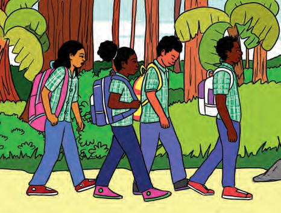
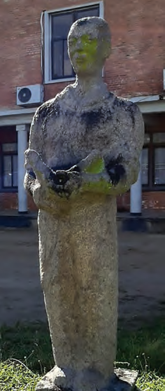
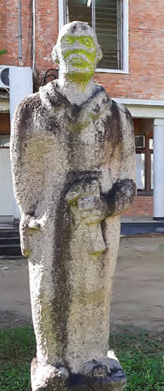
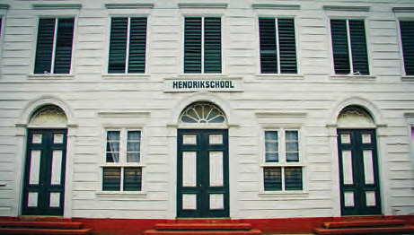
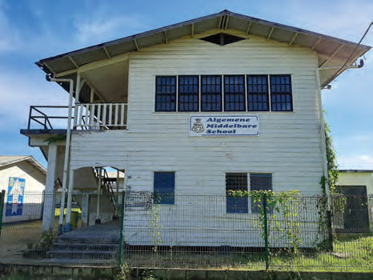

# Topic 2: Education in Our Country

## Lesson 3: How Important Is Good Education?

Perhaps you have wondered why you have to go to school. Why is it necessary to learn all those subjects? Learning of course does not only happen at school. When you are young, you learn all kinds of things that are needed later in life to be able to function independently. In a country, there are people needed who can practice various professions. These professions are, for example, nurses, teachers, police officers, carpenters, and masons. You cannot practice these professions without training, and at home you cannot always learn it. Therefore, children go to school.

In the past, there was only primary education in our country. Slowly this changed. For example, in 1887, the Hendrikschool was established as the first MULO (More Extended Primary Education) school in Paramaribo. A year later, the Vocational School was also established. Here, students were trained to become, for example, carpenter, mason, or painter. This education is now called vocational education. You learn a trade at such a school, and after getting your diploma, you can immediately practice a profession.

Next to vocational education, there is also general education. At these schools, you do not learn a specific profession, but general educational school subjects. In 1950, the Algemene Middelbare School (AMS - General Secondary School) and the Surinamese Teacher Training College were established. The AMS is a VWO school. That means: Preparatory Scientific Education. It belongs to general education. Students who have a MULO diploma can go to a VWO school. At such a school, you are prepared for higher education at, among others, a university. For example, if you want to become a doctor or an engineer. At the teacher training college (now the Pedagogical Institutes), teachers were trained.

Some children cannot go to a regular school. For example, because they were born with a physical limitation. Children who are hard of hearing or visually impaired need special education. In our country, there are various schools for children who need special attention. This way, they too can learn a trade and later make their profession of it.

Our education looks completely different now. In your Language Book A (Topic 1, Lesson 11), you can discover the Surinamese education system of today.

#### ASSIGNMENT

- What can you see that the children are going to a primary school?
- Explain in your own words why it is important to go to school.
- Name a profession yourself that people can practice if they have gone to school.

#### REMEMBER

- When you are young, you learn all kinds of things to be able to be independent later.
- In a country, there are people needed who practice various professions.
- The Hendrikschool is the oldest MULO school in our country. This school was opened in 1887.
- At the vocational school, students could learn a trade. This is called vocational education.
- There are also schools for general education and preparatory scientific education.
- At the Teacher Training College, teachers were trained.
- At schools for special education, lessons are given to children with a disability. This way, they too can learn a trade and later be independent.

---

## QUESTIONS

**1.** a. Describe in your own words or look up in a dictionary what the concept independent means.
b. Is it important that you practice a profession to be independent? Why?

**2.** Why is it important to go to school?

**3.** a. When was the first MULO school in Paramaribo established?
b. Calculate how long ago that was.
c. What is the name of this MULO school?

**4.** Why is the education at a vocational school or technical school called vocational education?

**5.** Which word is not a synonym for craft? Two words are called synonyms when they have (approximately) the same meaning.
- A. Profession
- B. Handicraft
- C. Product
- D. Trade

**6.** a. Is vocational education important for the development of our country?
b. Give reasons why or why not?

**7.** Which statement is correct?
I. At the MULO school, vocational education is given.
II. With the diploma of primary school, you can practice a profession.
- A. Only statement I is correct.
- B. Only statement II is correct.
- C. Statements I and II are both correct.
- D. Statements I and II are both incorrect.

**8.** Name one difference between vocational education and general education.

**9.** What is the correct order? Which schools must you still attend after primary school if you want to become a doctor or engineer later?
- A. Vocational school - VWO - University
- B. MULO - University - VWO
- C. MULO - VWO - University
- D. Technical school - MULO - University

**10.** Name two reasons why there are special schools for children with a disability.

---

## Images

---

*Source: suriname-history.pdf (students)*
