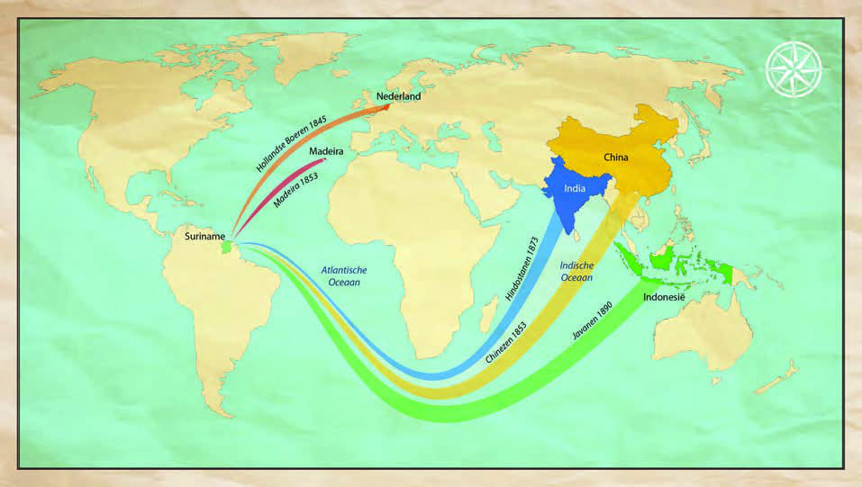
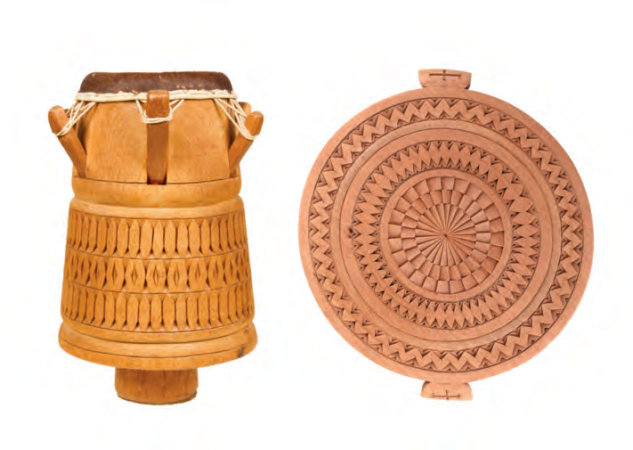
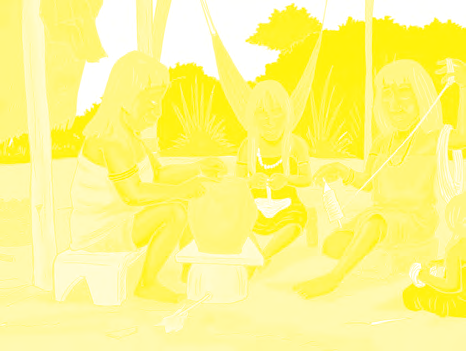
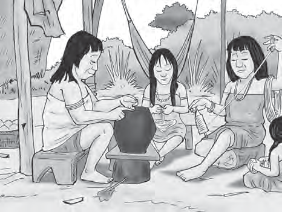
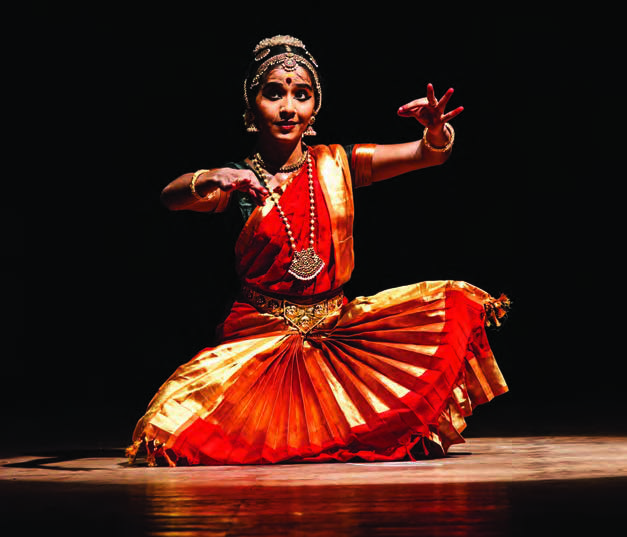
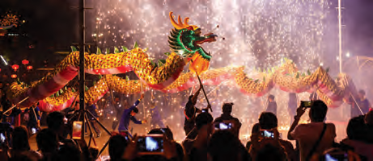

# Topic 3: Different Cultures in Our Country

## Lesson 1: How We Came Together Here

In our country, there are population groups that come from different parts of the world. In year 7, it was told how and why our ancestors came to Suriname. Most groups were brought to our country to work in agriculture. With their arrival, they also brought various customs and practices, such as their language, clothing, religion, music, eating habits, and the way they treat illness. The customs and practices of a group or a people together form their culture.

#### ASSIGNMENT

- Name three population groups that were brought to our country.
- What is meant by culture?
- Think of three cultural customs that were brought to our country.

With the people, their culture also came to our country (immigration of cultures before 1900).

Because of the arrival of so many groups of people who all brought their own culture, there are different cultures in our country. We can say that our country is a multicultural society. It is impossible to list all the uses and customs of all these groups and cultures. Therefore, we only mention a few examples. You yourself can surely think of more.

The Indigenous people were the first inhabitants of our country. If you think of this population group, you think, for example, of planting and processing cassava. Also think of spinning and weaving cotton, pottery of earthenware such as jars and pots of clay, and barbecuing meat and fish.

The Europeans who came to our country to establish plantations also brought their customs and practices. Some very old houses and buildings that you encounter in our country were built by them. They also brought the Christian religion and education. And the Dutch brought the Dutch language, which is the official language in our country.

The African enslaved people who were brought to our country also brought their own culture. Although they often could not take belongings on their journey to our country, they did bring their knowledge. The music and religion of their ancestors, the stories of Anansi, and their own language. From the different African and European languages that were spoken in our country, Sranan arose. With this language, people in our country could talk to each other and also understand each other.

The different groups of contract workers who were brought from countries in Asia to our country also brought their customs and practices, including their religions such as Hinduism and Islam. But also their own language, music, dance, clothing, eating habits, and dishes came along. The knowledge to plant rice in swamp areas was also brought from Asia. And also think of the fireworks, the food, and the dragon dance of the Chinese.

The buildings, customs, and practices of all population groups together form the cultural heritage of our country.

You may think it is quite normal that so many different people and cultures live peacefully together, but in many countries, it is different. Sometimes between groups of people with different cultures, there is also arguing or war. Our society is therefore quite special, and we may be proud of it and also be an example for other countries.

#### ASSIGNMENT

- Name examples of cultural practices from the different population groups.

#### REMEMBER

- Different population groups that were brought to our country brought their culture with them.
- Culture is formed by the customs and practices of a group.
- Our country has a multicultural society. Many different population groups and cultures live together.
- Examples of culture are language, religion, clothing, music, buildings, and stories.
- The buildings, customs, and practices of all population groups in our country form our cultural heritage.

---

## QUESTIONS

**1.** Write the word culture in your notebook.
- a. Write four words next to it that you think belong to culture.
- b. Tell what the culture of a group is called. Use the four words you wrote in part a.

**2.** Our country is a multicultural society. What does that mean?

**3.** Choose the correct answer. In our country, different cultures live. This is because:
- a. many tourists come to our country.
- b. our country was a colony of the Netherlands.
- c. our ancestors come from different parts of the world.
- d. many people settle freely in our country.

**4.** The Indigenous people are the original inhabitants of our country. Then other population groups came to our country. From which continents and in what order did these groups come?
- a. Africa – Asia – South America
- b. Africa – Europe – Asia
- c. Europe – Africa – Asia
- d. Europe – Africa – South America

**5.** The contract workers who were brought from Asia to our country also brought their own customs and practices.
- a. Write an example next to the following points:
  - Religion:
  - Language:
  - Food (dish):
  - Clothing:
  - Dance:
- b. Also write next to which group the example belongs.

**6.** a. From which different languages did Sranan arise?
b. Why was Sranan important for the enslaved people?

**7.** Which statement is correct?
I. The stories of Anansi were already told in our country before the arrival of African enslaved people.
II. Today, most population groups in our country know the stories of Anansi.
- a. Only statement I is correct.
- b. Only statement II is correct.
- c. Statements I and II are both correct.
- d. Statements I and II are both incorrect.

**8.** Look at image 7.
- a. Is this also an example of culture?
- b. From which continent does this originally come?

**9.** What forms the cultural heritage of our country?

**10.** Choose the correct answer. Our country can be an example for other countries because...
- a. there are many different cultures in our country.
- b. many different languages are spoken in our country.
- c. in our country, people from different cultures live friendly and in peace with each other.
- d. different population groups live in our country.

---

## Images

---

*Source: suriname-history.pdf (students)*
