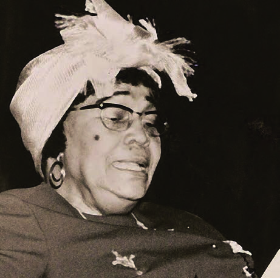
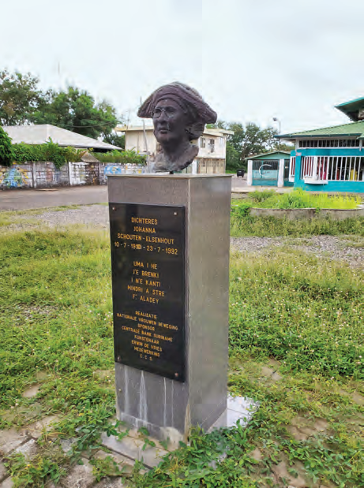
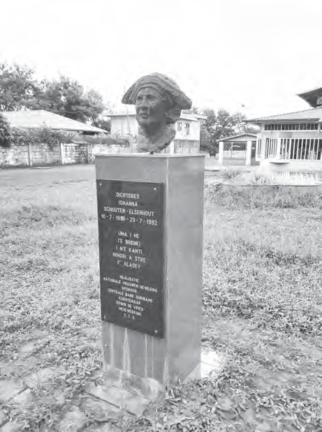

# Topic 3: Different Cultures in Our Country

## Lesson 2: Experiencing Culture

In the time when our country was still a colony, people were not always free to live according to their own culture. The Europeans thought they were the boss in our country. They thought European culture was better and more important than the cultures of the other groups in our country. The Indigenous, African, and Asian cultures were inferior in the eyes of the Europeans.

The Dutch wanted to impose their culture on our people, among other things at school, as can be read in the previous topic. The children who went to school learned Dutch culture there. Also through the radio and newspapers, and with the help of laws and rules, the own cultures were suppressed.

For example, the Winti religion of the freed people was banned by law in 1874. And Maroons were not allowed to enter the city if they were dressed in a panji. At Poelepantje, the Maroons had to take off their panji and put on other clothing.

A prohibition on practicing one's own culture is of course not good. How would you feel if it was forbidden to speak your own language and to dance or sing your own songs?

Fortunately, we see that in the 20th century in our country, people dared to write or sing about their own culture. And not only in Dutch, which they were obligated to learn at school.

As an example, Johanna Schouten-Elsenhout can be mentioned. She was born in 1910 and was one of the first Surinamese women who wrote poems in Sranan. In her poems, she makes much use of odo's. According to her, language is an important part of the culture of people. And the odo's are a part of her culture that she learned from her mother. Her first collection of poems appeared in 1963, with the title Tide Ete (Today Still).

In front of the building of CCS (Cultureel Centrum Suriname) on Henck Arronstraat in Paramaribo, a bust of Johanna Schouten-Elsenhout has been placed.

#### ASSIGNMENT

- What was the attitude of the Europeans towards other cultures?

#### REMEMBER

- In the past, people in our country were not always free to experience their own culture.
- The Europeans considered other cultures inferior.
- The experiencing of one's own culture was suppressed in the past through laws and rules.
- Johanna Schouten-Elsenhout is an example that people dared to experience their own culture.
- Today, people in our country have the right and freedom to experience their own culture.
- Cultural associations provide information about culture and hold activities.

Experiencing and expressing culture is something we all do. Everyone does it in their own way. Whether you sing songs or make music, cook delicious food, or write poems. Fortunately, it can and may be done today. People have the right to experience their own culture, language, and religion. The culture of one group is not more important or better than that of the other. Nobody may impose their culture on another. Fortunately, it is also the case in our country today that people and also children have the right and freedom to experience their own culture.

In many neighborhoods, cultural associations or buildings were also established in the 20th century. Here, information can be found about culture, and activities are also held.

---

## QUESTIONS

**1.** Which answer is not correct?
In the past, not all people in our country were free to experience their own culture because...
- a. Other cultures were inferior in the eyes of Europeans.
- b. The cultures were suppressed through laws and rules.
- c. Europeans thought only their own culture was important.
- d. People all wanted to live according to European culture.

**2.** Explain in your own words what is meant by inferior.

**3.** Name two ways how the Europeans wanted to impose their culture on our people.

**4.** Name two examples of how one's own culture was suppressed in colonial times.

**5.** The place in Paramaribo where people from the interior arrived in the past is called Poelepantje.
- a. What did people from the interior have to do at this place?
- b. Say in Sranan: "Take off your panji."
- c. Do you recognize the place name Poelepantje in the answer to question b?

**6.** a. Did the prohibition by Europeans on practicing one's own culture work?
b. Explain why you say that.

**7.** Which statement about Johanna Schouten-Elsenhout is not true?
- a. Her first collection of poems was titled Tide Ete.
- b. Her poems were written in Dutch.
- c. She thought language was an important part of culture.
- d. She was one of the first Surinamese female poets.

**8.** People have the right to experience their own culture. How should you behave towards people with a different culture?

**9.** What does a cultural association do?

**10.** Is there a cultural association in the neighborhood where you live? If yes, have you ever been there, and why?

---

## Images

---

*Source: suriname-history.pdf (students)*
