# Topic 3: Different Cultures in Our Country

## Lesson 3: Our Country, a Melting Pot of Cultures

Culture is not something that always has to remain the same. In the course of time, it can change. Because circumstances change or if we take over things from other cultures. All people with different cultures who live together in one country take over uses and customs from each other. Their culture changes a little as a result. Suriname is a beautiful example of this. Our country is a large melting pot of cultures.

#### ASSIGNMENT

- What is meant by a melting pot?
- Why is our country a beautiful example of this?

An example of this melting pot can be seen on some national holidays in our country. We know many holidays that are related to cultures in our country. These days are not only celebrated by the own cultural group. They are also celebrated nationally. You also encounter music, delicious food, and cultural clothing of other cultural groups.

Children of different population groups and cultures together at school.

The cultures in our country learn from each other and also take over things from each other. This is called cultural exchange. We not only take over food from each other, but you also notice this in music, songs, and dance. We also learn to speak each other's language. Some words are even used by everyone. Children of different cultures often sit together at school, and there they also learn from each other.

By having interest in the culture of someone else, you learn to understand that other person better. It is also good to learn to know and respect each other's culture. The opposite of this is that groups look down on each other. That is not good for the unity of our country. Precisely by learning from each other, we can develop new ideas together. This is how our country can move forward.

Music is a way to tell about culture and to learn to appreciate it. Songs and poems are also used more often to write about the unity of our country. A well-known poem is that of poet/writer Robin Ravales (known as Dobru). In 1973, he wrote the poem Wan bon, of which you can read some lines here. With this poem, he wanted to emphasize the coming together of so many different cultures.

Wan bon
Wan bon
Someni wiwiri
Wan bon...

Wan Sranan
Someni wiwiri
Someni skin
Someni tongo
Wan pipel.

#### ASSIGNMENT

As a poet, Robin Ravales used a pseudonym.

- Look up in a dictionary what a pseudonym is.
- What is the pseudonym of Robin Ravales?
- A few children may recite the poem Wan bon together in class.

#### REMEMBER

- Culture changes; it does not always stay the same.
- Our country is a melting pot of cultures. People with different cultures live here who take over some things from each other.
- The various cultural holidays in our country are celebrated nationally.
- In cultural exchange, people from different cultures learn from each other.
- It is good to learn to know and respect each other's culture.
- Robin Ravales, known by his pseudonym Dobru, wrote the poem Wan bon.

---

## QUESTIONS

**1.** Culture can change. Think of a reason why people sometimes change their customs.

**2.** Look up the word melting pot in a dictionary or on the internet. Write in your own words what is meant by a melting pot of cultures.

**3.** Below are two lists. Copy them into your notebook. In the first list are three national holidays. In the second list, four cultures in our country are mentioned. Draw a line between the national holiday and the culture it belongs to.

National holiday / Culture:
- Chinese New Year / Chinese culture
- Holi Phagwa / European culture
- Christmas / Hindustani culture
- / Indigenous culture

**4.** The national holidays mentioned in question 3 are also celebrated by other cultural groups.

- a. What do you think about that?
- b. Also explain why you think that.

**5.** Here you see different dishes.
- a. What are the names of these dishes?
- b. From which culture do these dishes originally come?

**6.** What is meant by cultural exchange?

**7.** In what way do radio, television, and the internet ensure that cultures change?

**8.** You have been in contact with things from other cultures since you were very young, for example at school. Sometimes you also take over something from another culture. Give an example of what is taken over from each other.

**9.** Why is it important to respect each other's culture?

**10.** Which statement about Dobru is not true?
- A. Dobru is a well-known Surinamese poet/writer.
- B. Dobru is a pseudonym of Robin Ravales.
- C. Dobru wrote the poem Wan bon.
- D. Dobru was born in 1973.

---

## Images

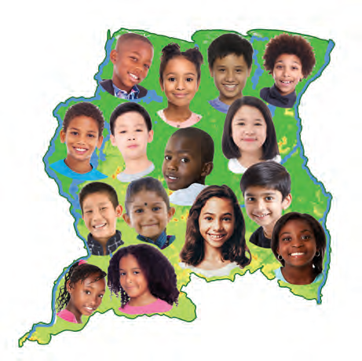

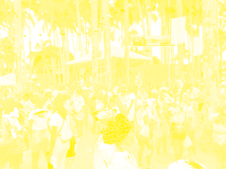

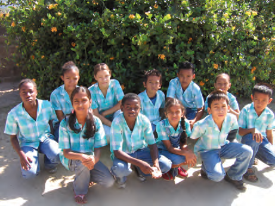

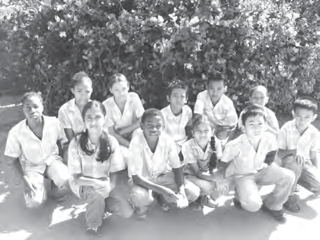

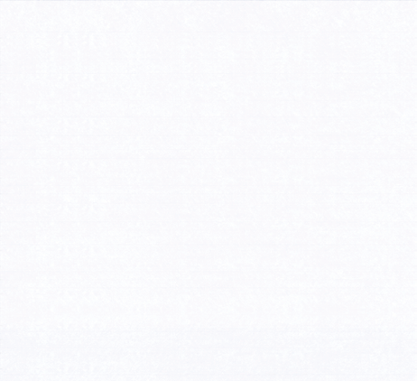

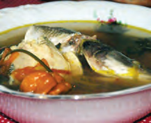

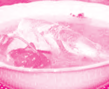

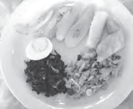

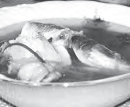

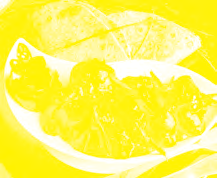

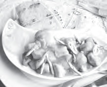

---

*Source: suriname-history.pdf (students)*
