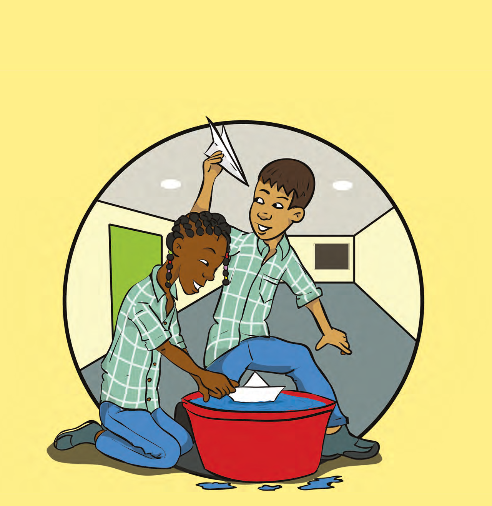
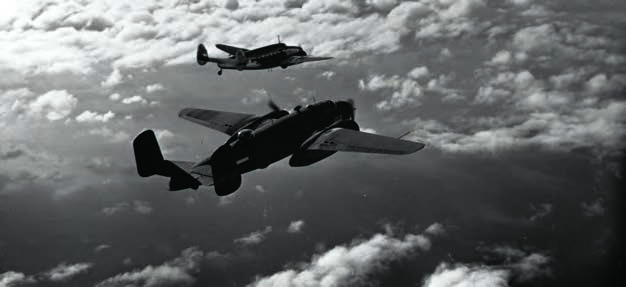

# Topic 4: Our Country During World War II

## Introduction: Our Country During World War II

Airplanes and bombs. Submarines and air raid alarms. A war is not a nice time. Soldiers from different countries fight against each other, and daily life is different. This topic is about World War II and what it was like in our country during this war. In the first lesson, it is told that our country was also involved in the war. In lesson 2, you learn what measures were taken for the safety of our country. The bauxite that was mined in our country was very important for the construction of fighter planes. More about this is told in the last lesson.

### KEY TERMS

- World war
- Occupied
- Governor Kielstra
- State of siege
- Internment
- Prison camp
- Goslar
- Traitors
- Blackout
- Air raid shelters
- Air raid alarm
- TRIS
- Militia
- Military service
- Volunteer corps
- War monument
- Spitfire fund
- Scarcity
- Bauxite industry
- American troops
- Zanderij airfield
- Military base

---

## Images

---

*Source: suriname-history.pdf (students)*
