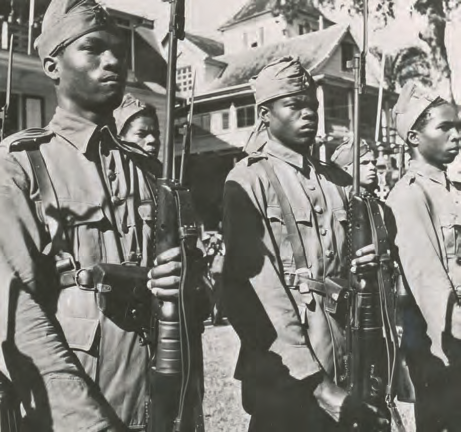
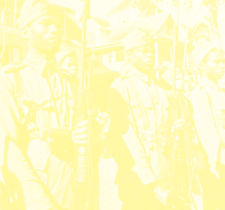
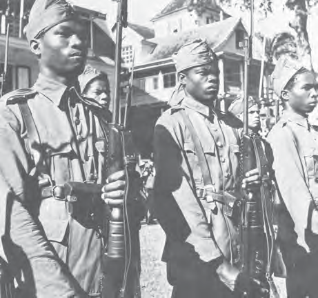
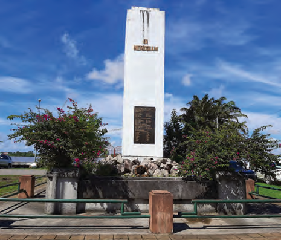
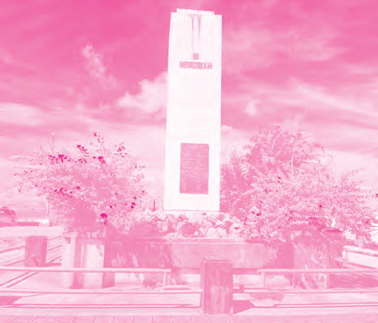

# Our Country During World War II

## Lesson 2: Safety in Our Country

---

### Student Textbook Content

Safety in Our Country

Governor Kielstra did not rule out the possibility that our country could be attacked by the Germans. For example, they could drop bombs with airplanes. The governor ordered blackout measures, meaning that from seven in the evening until seven in the morning, no lights were allowed to be on anywhere. Dark curtains had to be hung in front of windows. People who were still outside on the street were not allowed to turn on a lamp. Only the moon provided light.

An announcement about blackout and air raid warning

Shelters were also built, which were used as protection during an air attack. Drills were held with air raid warnings, during which a siren would sound and people had to go to the shelters as quickly as possible.

ASSIGNMENT

- What is meant by blackout?
- What is meant by air raid warning?
- Why were alarm drills held? SEE IMAGE 7

In our country, there were Dutch soldiers from the colonial army. They were also called the Troops in Suriname (TRIS). In 1939, the Schutterij (militia) was established as an addition to the colonial army. At first, Surinamese men and women could voluntarily sign up to participate in the Schutterij. But in 1942, conscription was also introduced in our country. Men between 18 and 43 years old were called up for the Schutterij. Not everyone responded to the call, and approximately 30 percent of the people were rejected. Still, the number of soldiers in the Schutterij rose to five thousand.

Members of the Surinamese Schutterij

There was also still a volunteer corps within the Schutterij. This included the City and Country Watch Corps and the Women's Volunteer Corps. The women had more supportive tasks, but they also received shooting lessons and military training. During World War II, approximately 450 Surinamese volunteers also actively participated in the fight. To commemorate Suriname's participation in World War II, a war monument was placed at the Waterkant in Paramaribo. Every year, a wreath is laid at this monument.

Our country also supported the Netherlands in other ways during the war. For example, money was collected to buy a fighter plane. This is known as the Spitfire Fund. School children were asked to bring one cent to school every Monday. A little song was even sung about it:

"Don't forget your Monday cent, children
Don't forget it, children
Whatever happens or occurs
Don't forget your Monday cent, children."

The fund raised an amount of 38,000 guilders in 1941 for the purchase of a Spitfire fighter plane. For that time, that was a lot of money. The purchased plane was given the name "Suriname."

REMEMBER

- Measures were taken against a possible air attack by the Germans. At night, no lights were allowed to be on, and there were shelters and air raid drills.
- In our country, there was TRIS, the Dutch Troops in Suriname. In 1939, the Surinamese Schutterij was also established.
- In 1942, conscription was introduced in our country. Men between 18 and 43 years old were called up for the Schutterij.
- There was also a volunteer corps. Both men and women participated in it.
- In Paramaribo, at the Waterkant, there is a war monument commemorating Suriname's participation in World War II.
- Our country also collected money for the Spitfire Fund to buy a fighter plane for the Netherlands.

The war monument at the Waterkant

---

QUESTIONS

1. Governor Kielstra did not rule out the possibility of an air attack on our country. Therefore, measures were taken. Which one does not belong?
   A. Building shelters
   B. Handing in lamps
   C. Air raid drills
   D. Blackout order

2. Explain what the blackout measure involved. Also explain why this measure was in place.

3. a. Who protects the country and citizens during a war?
   b. Should a country be protected? Also tell why you say that.

4. Which statement is correct?
   I. In 1939, the Schutterij was established in our country.
   II. Surinamese men and women were required to join the Schutterij.
   A. Only statement I is correct.
   B. Only statement II is correct.
   C. Statements I and II are both correct.
   D. Statements I and II are both incorrect.

5. Are the following statements true or false? Also explain why you say that.
   a. With conscription, people are required to serve in the army.
   b. Volunteering for military service is the opposite of conscription.
   c. Women did not have conscription. They were not allowed to serve in the army.

6. Look at image 9 again.
   a. What monument is shown?
   b. What does this monument remind us of?
   c. Where is this monument located?

7. Explain what the Spitfire Fund was for?

8. What are fighter planes used for during a war?

9. Copy the following years into your notebook. What happened in our country in those years during World War II? Choose from the second list and write it behind the correct year.
   1939 • •building war monument
   1941 • •introduction of conscription
   1942 • •Spitfire Fund collection
   •establishment of Schutterij

10. Choose the correct answer.
    World War II took place in the...
    A. first half of the 19th century.
    B. second half of the 19th century.
    C. first half of the 20th century.
    D. second half of the 20th century.

---

### Lesson Images

---

### Teacher's Guide - Answers and Explanations

Topic 4 – Our Country During World War II
The Safety in Our Country

QUESTIONS AND ANSWERS

1. Governor Kielstra did not rule out the possibility of an air attack on our country.
   Therefore, measures were taken. Which one does not belong?
   a. Building shelters
   b. Handing in lamps
   c. Air raid drills
   d. Blackout order

2. Explain what the blackout measure involved. Also explain why this measure was in place.
   In the evening, no lights were allowed to be on, so that German planes could not see where they could drop bombs.

3. a. Who protects the country and the citizens during a war?
   During a war, the army protects the country and the citizens.
   b. Should a country be protected? Also tell why you say that.
   Yes, a country must be protected. The explanation may differ per student.

4. Which statement is correct?
   I. In 1939, the Schutterij was established in our country.
   II. Surinamese men and women were required to join the Schutterij.
   a. Only statement I is correct.
   b. Only statement II is correct.
   c. Statements I and II are both correct.
   d. Statements I and II are both incorrect.

5. Are the following statements true or false? Also explain why you say that.
   a. With conscription, people are required to serve in the army.
   True. Men between 18 and 43 years old were called up for the Schutterij.
   b. Volunteering for military service is the opposite of conscription.
   True, volunteering is the opposite of being required.
   c. Women did not have conscription. They were not allowed to serve in the army.
   Not true, women did not have conscription, but they did participate in the volunteer corps.

6. Look at image 9 again.
   a. What monument is shown?
   The war monument.
   b. What does this monument remind us of?
   It reminds us of World War II.
   c. Where is this monument located?
   This monument is located at the Waterkant.

7. Explain what the Spitfire Fund was for?
   The Spitfire Fund was for collecting money to buy a fighter plane for the Netherlands.

8. What are fighter planes used for during a war?
   They are used to drop bombs on enemy territories.

9. Copy the following years into your notebook. What happened in our country in those years during World War II?
   1939 • •building war monument
   1941 • •introduction of conscription
   1942 • •Spitfire Fund collection
   •establishment of Schutterij

10. Choose the correct answer.
    World War II took place in the...
    a. first half of the 19th century.
    b. second half of the 19th century.
    c. first half of the 20th century.
    d. second half of the 20th century.

---

*Source: suriname-history.pdf (students) and suriname-history-teacher-guide.pdf (teacher)*
