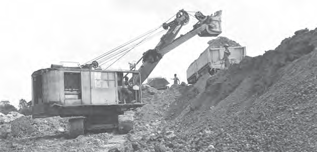
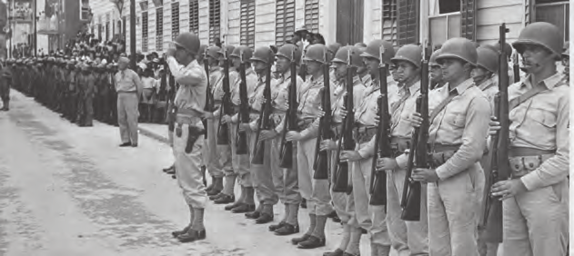
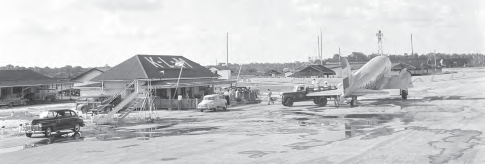
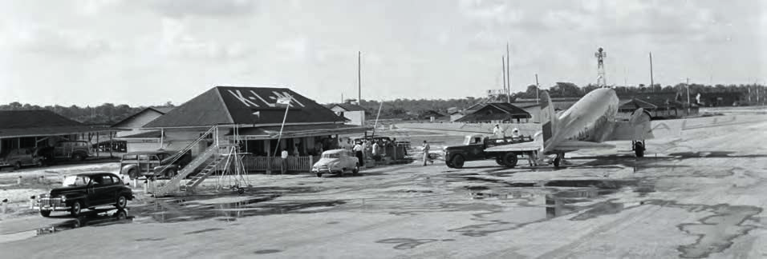

# Our Country During World War II

## Lesson 3: The Bauxite Industry in Our Country

---

### Student Textbook Content

The Bauxite Industry in Our Country

As a result of the war, our country could not import products from Europe. A shortage of some products developed and prices went up. Especially in Paramaribo, the population noticed this. They could no longer afford the expensive items. They also often had to wait in long lines.

ASSIGNMENT

- Why did people stand in lines in front of stores?
- Which goods do you think were scarce?

During World War II, the bauxite industry in our country also grew. Bauxite became an important export product of Suriname. Aluminum is made from bauxite. And aluminum is used, among other things, for building airplanes. Most American fighter planes during World War II were made from Surinamese bauxite. Because our bauxite was so important to the Americans, work was done day and night in Paranam, Onverdacht, and Moengo to extract bauxite from the ground. With the sale of bauxite, our country earned a lot of money. There was also work for many laborers.

Mining of bauxite

Because there was a lot of bauxite in our country, which was important for building war planes, there was also a risk. Our country could be attacked. Especially because the defense of our country was not very strong. The President of the United States of America proposed to the Netherlands to send American troops to Suriname. They could take over the defense of our country. The Netherlands could not send enough soldiers to our country itself. They could hardly refuse the offer.

American soldiers in our country

The first American troops arrived in November 1941 at Zanderij airport. They had received permission from the Dutch government to build a military base at the airport. The airport was used for stopovers to, for example, Africa. During World War II, Zanderij was expanded by the American soldiers with paved runways. They also built the road from Onverwacht to Zanderij. In 1947, the last American soldiers left our country and the airport was officially handed back to Suriname.

REMEMBER

- During World War II, there was a shortage of some products in our country, and local production grew.
- Bauxite became an important export product, which caused the bauxite industry in our country to grow.
- Aluminum is made from bauxite. Aluminum is used, among other things, for building airplanes.
- American soldiers came to our country to protect the bauxite mines and our country.
- Zanderij Airport became a military base, and the airport was expanded.

Zanderij Airport was a military base during the war

---

QUESTIONS

1. Why was there a shortage of some products in our country during World War II?

2. Name two consequences of the shortage: an unpleasant consequence and a positive consequence.

3. What product is made from bauxite and used for building airplanes?

4. Why did the export of bauxite increase during World War II?

5. Which answer is not correct? Work was done day and night to extract bauxite from the ground, because...
   A. bauxite brought a lot of money to our country.
   B. bauxite was important for building fighter planes.
   C. there were no digging machines at that time to mine bauxite.
   D. there were many workers to do the work.

6. In which three places was bauxite mined during that period in our country?

7. Choose the correct answer.
   During World War II, American soldiers came to our country to...
   A. protect the bauxite mines.
   B. repair military posts.
   C. build shelters for the people.
   D. train Surinamese soldiers.

8. Explain what is meant by a military base.

9. Describe how the American soldiers expanded Zanderij Airport and made it more accessible.

10. Calculate how many years the American soldiers stayed in our country.

---

### Lesson Images

---

### Teacher's Guide - Answers and Explanations

Topic 4 – Our Country During World War II
The Bauxite Industry in Our Country

QUESTIONS AND ANSWERS

1. Why was there a shortage of some products in our country during World War II?
   There was a shortage of some products in our country because we could not import products from Europe.

2. Name two consequences of the shortage: an unpleasant consequence and a positive consequence.
   An unpleasant consequence: prices go up and long lines form to purchase products.
   A positive consequence: local production in the country increases. People start growing and cultivating things themselves.

3. What product is made from bauxite and used for building airplanes?
   Aluminum is made from bauxite and used in building airplanes.

4. Why did the export of bauxite increase during World War II?
   The export increased because aluminum is made from bauxite, which is then used for building airplanes. Most American planes were made from Surinamese bauxite.

5. Which answer is not correct?
   a. bauxite brought a lot of money to our country.
   b. bauxite was important for building fighter planes.
   c. there were no digging machines at that time to mine bauxite.
   d. there were many workers to do the work.

6. In which three places was bauxite mined during that period in our country?
   Bauxite was mined in Paranam, Moengo, and Onverdacht.

7. Choose the correct answer.
   a. protect the bauxite mines.
   b. repair military posts.
   c. build shelters for the people.
   d. train Surinamese soldiers.

8. Explain what is meant by a military base.
   A military base refers to built accommodations at a certain location where military personnel can stay.

9. Describe how the American soldiers expanded Zanderij Airport and made it more accessible.
   The airport was expanded with paved runways. They also built the road from Onverwacht to Zanderij to make it more accessible.

10. Calculate how many years the American soldiers stayed in our country.
    The American soldiers stayed 6 years in our country (1941-1947).

---

PROCESSING ASSIGNMENTS

1. Below are five answers given. In groups, you come up with five questions for these answers.
   Then you can exchange the questions with other groups. See if you can find the correct answer to the question.
   1. world war
   2. Governor Kielstra
   3. Copieweg prison camp
   4. the wreck of the Goslar
   5. Jodensavanne

   The 5 questions per answer will differ per group.

2. Discuss with each other whether you think the wreck of the Goslar is a war monument.
   - Do you think it should remain as a memorial, or should it be removed from the river?
   - If it should be removed, which country should do it according to you and why?

   The answers may differ per student.

3. In groups, write a short essay of 150 words about our country during World War II. You can ask information from your (grand)parents or another family member or adult. You can also look up information on the internet.
   Use one or more of the following words in the essay:
   - Germans
   - prison camp
   - blackout
   - air raid warning
   - conscription
   - shortage
   - bauxite

   The assignment will differ per student.

4. Classwide text collage.
   In pairs, write a quote (from the lessons) about World War II and our country on a piece of paper. Write something that you remember from the lessons, that you found interesting, or that is important to you. These quotes are pasted on a large piece of paper.

   An example of such a text collage looks like this:

   Many countries are involved
   in a world war. In 1940, the Netherlands was
   occupied by Germany.Our bauxite was important
   for building American fighter
   planes.The Goslar can still be
   seen.Germans in our country were
   imprisoned.

   The Surinamese Schutterij was established. World War II from
   1939 to 1945.

   Zanderij Airport was a
   military base.In Jodensavanne was a
   prison camp.War monument at the
   Waterkant.

---

*Source: suriname-history.pdf (students) and suriname-history-teacher-guide.pdf (teacher)*
