# Development of Our Country After 1945

## Lesson 1: Development Aid to Our Country

---

### Student Textbook Content

Development Aid to Our Country

After World War II, countries in Europe had to be rebuilt. Major cities were in ruins after bombings, and daily life had to resume. Europe received development aid from the United States of America. This aid is known as the Marshall Plan and was intended for the reconstruction of the economy and the restoration of destruction in the war-affected countries.

ASSIGNMENT

- What do you see in the photo?
- When could this photo have been taken approximately?
- What caused the buildings in the photo to be so destroyed? SEE IMAGE 2

Destruction after a bombing

In our country as well, the government believed that something had to be done to address poverty and unemployment. Although it seemed like things were going well for our country during World War II, due to the export of bauxite, this was only appearance. There were still many people unemployed and poor. Many products were also scarce and expensive. Therefore, in consultation with the Dutch government, a proposal for development aid arose. The money for this aid also came in part from the Marshall Plan. And so, in 1947, the Surinamese Prosperity Fund was established.

The Prosperity Fund had the goal of developing our country. For this plan, the Dutch government had made 40 million Dutch guilders available. It was a plan of approximately five years, and various projects were included, such as the establishment of the People's Credit Bank (VCB) and the Planning Bureau. This bureau was tasked with developing and executing plans.

Research was also conducted on natural resources, such as the amount of bauxite in the soil and which types of wood occurred in our forests. Aerial photographs were taken to map our country. In 1959, this was followed by Operation Grasshopper. Within a few years, seven airfields or airstrips were built in our interior.

The airfields built during Operation Grasshopper

One of the pilots involved in the aerial photographs and the construction of the airstrips was Ronald Kappel. In building the airstrips, he made many flights as a pilot. He was a pioneer in Surinamese aviation. That means he was one of the first pilots in our country. Zorg en Hoop Airport, which was a military base during World War II, was expanded. In 1953, a piece of land was purchased, where a runway was built. Domestic air traffic in our country still takes place from here today. Ronald Kappel also participated in Operation Grasshopper, and under his leadership, an airstrip was built at the foot of the Table Mountain. Unfortunately, Ronald Kappel lost his life when the plane he was in with pilot Vincent Fayks crashed on October 6, 1959. The airstrip at Table Mountain was later named after Ronald Kappel.

REMEMBER

- After World War II, countries in Europe were rebuilt with development aid from the Marshall Plan.
- In our country, plans for development also came about. The first plan was the Surinamese Prosperity Fund.
- During the Prosperity Fund, the Planning Bureau was established for thinking up and executing plans.
- Ronald Kappel was a pioneer in Surinamese aviation. He died in an airplane accident during Operation Grasshopper.
- During the Prosperity Fund, the Foundation for Mechanized Agriculture (SML) and the Wageningen Plan were also established.

Pilot Ronald Kappel

During the Prosperity Fund, the neglected polders in the districts of Nickerie and Coronie were also restored. New ones were also added. This is how the Wageningen Plan was set up in the Nickerie district. For this, the Foundation for Mechanized Agriculture (SML) was established in 1949. The plan aimed at mechanized cultivation of rice, mainly by Dutch farmers. Within five years, Wageningen was developed. For that time, it was one of the most modern, mechanized rice enterprises in the world. There was also an experimental polder, where experiments were conducted for the improvement of various rice varieties. Until 1975, this company was in Dutch hands. At independence, it was transferred to Suriname.

An old aerial photo of Wageningen

ASSIGNMENT

- Which place do you see in this photo?
- Tell what you see in this photo.
- In which district was this photo taken? SEE IMAGE 5

---

QUESTIONS

1. After the war, countries in Europe received development aid.
   a. Why did these countries receive development aid?
   b. Which country gave this development aid?

2. Explain why our country also received development aid after World War II.

3. What is generally the purpose of development aid?

4. Which statement is correct?
   I. Our country received development aid because it had been bombed during the war.
   II. Development aid was not necessary for our country because things were going well for our country.
   a. Only statement I is correct.
   b. Only statement II is correct.
   c. Statements I and II are both correct.
   d. Statements I and II are both incorrect.

5. Name three projects from the Prosperity Fund.

6. Ronald Kappel was a pioneer of Surinamese aviation.
   a. Look up the word "pioneer" in a dictionary or on the internet.
   b. Tell in your own words who is called a pioneer.

7. What is not correct about Ronald Kappel?
   A. He died in an airplane accident.
   B. He was a pilot in Surinamese aviation.
   C. Under his leadership, the airstrips in our interior were built.
   D. Ronald Kappel participated in Operation Grasshopper.

8. Briefly explain what the Wageningen Plan involved.

9. a. What does the abbreviation SML stand for?
   b. In which year was this company transferred to Suriname?

10. Look at the following photos. Explain whether you can speak of mechanized rice cultivation.

---

### Lesson Images

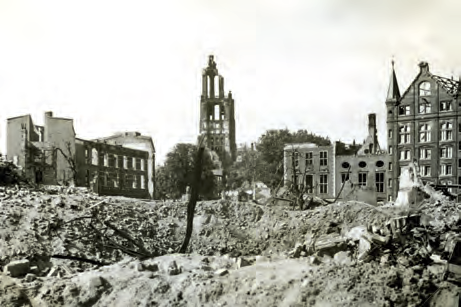

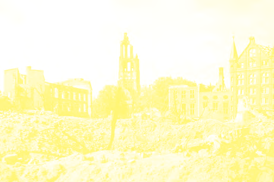

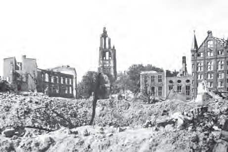

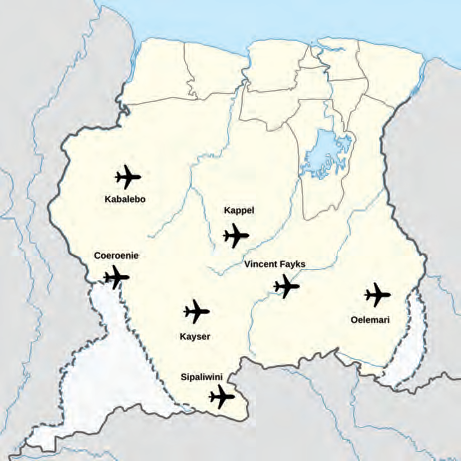

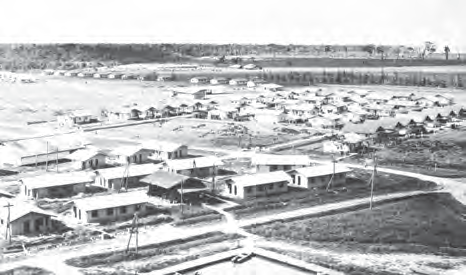

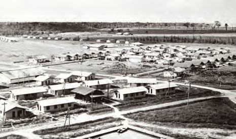

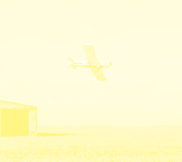

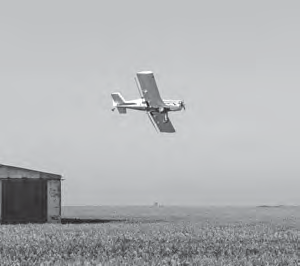

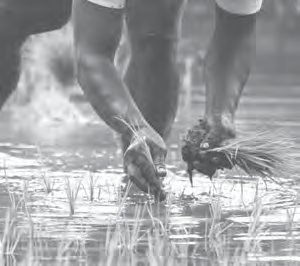

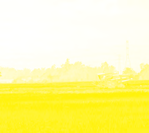

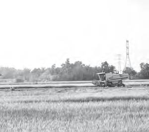

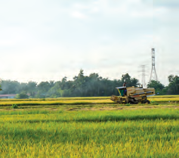

---

### Teacher's Guide - Answers and Explanations

Topic 5 – Development of Our Country After 1945
Development Aid to Our Country

QUESTIONS AND ANSWERS

1. After the war, countries in Europe received development aid.
   a. Why did these countries receive development aid?
   Countries received development aid after the war because they had to rebuild everything after the bombings and daily life had to resume.

   b. Which country gave this development aid?
   Development aid came from the United States of America.

2. Explain why our country also received development aid after World War II.
   Our country also received development aid after World War II because there were many people unemployed and poor. Many products were scarce and expensive.

3. What is generally the purpose of development aid?
   The purpose of development aid is to help a country that is in difficulty to rebuild, among other things by creating employment.

4. Which statement is correct?
   I. Our country received development aid because it had been bombed during the war.
   II. Development aid was not necessary for our country because things were going well for our country.
   a. Only statement I is correct.
   b. Only statement II is correct.
   c. Statements I and II are both correct.
   d. Statements I and II are both incorrect.

5. Name three projects from the Prosperity Fund.
   - Establishment of the People's Credit Bank (VCB)
   - Establishment of the Planning Bureau
   - Research on natural resources

6. Ronald Kappel was a pioneer of Surinamese aviation.
   a. Look up the word "pioneer" in a dictionary or on the internet.
   b. Tell in your own words who is called a pioneer.
   The description may differ per student.
   A pioneer is someone who is the first to do something. He or she does groundbreaking work and cannot rely on the experiences of others.

7. What is not correct about Ronald Kappel?
   a. He died in an airplane accident.
   b. He was a pilot in Surinamese aviation.
   c. Under his leadership, the airstrips in our interior were built.
   d. Ronald Kappel participated in Operation Grasshopper.

8. Briefly explain what the Wageningen Plan involved.
   In the Wageningen Plan, new rice polders were established in the Nickerie district. Rice was cultivated mechanically by Dutch farmers.

9. a. What does the abbreviation SML stand for?
   The abbreviation SML stands for Foundation for Mechanized Agriculture.
   b. In which year was this company transferred to Suriname?
   The SML was transferred to Suriname in 1975.

10. Look at the following drawings.
    Explain whether you can speak of mechanized rice cultivation.
    Drawing 1 = mechanized agriculture
    Drawing 2 = not mechanized agriculture
    Drawing 3 = mechanized agriculture
    You can speak of mechanized rice cultivation in drawing 1 and drawing 3. Drawing 2 is not an image of mechanized rice cultivation.

---

*Source: suriname-history.pdf (students) and suriname-history-teacher-guide.pdf (teacher)*
