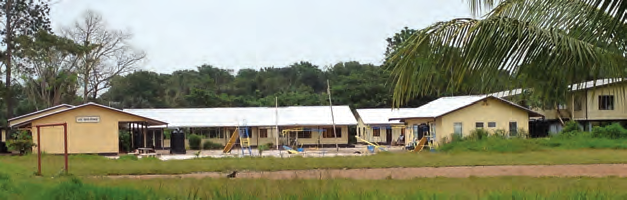
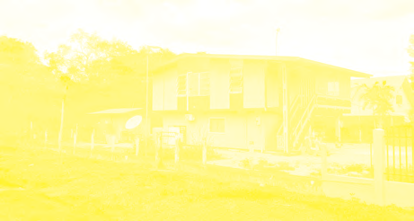
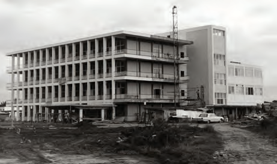

# Development of Our Country After 1945

## Lesson 3: Social Development

---

### Student Textbook Content

Social Development

In the various plans, the intention was to develop our country so that the people would have better living and working conditions. Developing a country does not happen overnight. First, a plan must be made, a development plan. In such a plan, among other things, it states what the goal is and how that goal will be achieved. It also states what it will cost, where the needed money will or can be found, and how much time will be needed for the execution of various projects. For example, establishing businesses for more employment, building schools to give the population good education that connects to possible employment. The plan also includes how many houses need to be built, where roads will be laid, and how healthcare will be addressed. Schools and teachers' houses were also built. Only with healthy people and good education can a country progress through hard work.

ASSIGNMENT

- Tell what you see in the image.
- Point out the teacher's house.

When the Ten-Year Plan ended in 1966, two Five-Year Plans followed (1967-1971 and 1972-1976). These plans were also developed by the Planning Bureau. More than in the previous plans, part of the money was intended for social development. This included addressing unemployment and housing for the population, among other things. The housing shortage in Paramaribo was great. There were many old houses, and many people also moved from the districts to the capital. In Paramaribo, there was more employment, better education, and more extensive healthcare. When many people from the countryside move to a city, we call this urbanization. SEE IMAGE 9

A school with teacher's house

Example of a housing project

There was thus a need for houses. Therefore, housing projects were also carried out during the development plans. In 1951, the Surinamese Public Housing Foundation (SVS) was established for building public housing. One of the first housing projects was Zorg en Hoop. Houses were also built in, among other places, the Marowijne project, Beekhuizen, and Latour.

In some of these projects, Bruynzeel houses were built. In 1947, Bruynzeel Suriname Wood Company N.V. was established, a wood factory. At this company, people could also buy a house. It was actually a complete wooden building kit. The houses could be assembled quickly and easily.

Example of a Bruynzeel house

ASSIGNMENT

- What kind of house do you see in this image?
- Which company supplied such houses?
- Why were houses built?

Not only houses were built for the population. Various businesses were also established where people could work. Hospitals were also built. Furthermore, the dairy center and a juice factory were established. And the aluminum factory, which was written about in the previous lesson.

Not only in Paramaribo, but also in the districts, projects were carried out and businesses were set up. To ensure that people did not all move to Paramaribo, among other things, employment had to be created. Examples of this are the banana businesses in Jarikaba and Nickerie and the Victoria oil palm project in Brokopondo. In the oil palm project, a large area of land on the old Victoria plantation on the Suriname River was cleared and planted with oil palms. And a factory was built for the production of palm oil. In all these projects, money was also used for research and construction of roads, buildings, agricultural land, and maintenance. SEE IMAGE 11

Hospital under construction

Planting of oil palms

REMEMBER

- In a development plan, it is described what the goal is and how the goal will be achieved.
- With social development, the living and working conditions of the population are meant.
- In the various plans, there were also projects for housing and setting up businesses.
- Bruynzeel was a wood company in our country that sold building kits for houses.
- Projects were carried out not only in Paramaribo but also in the districts.

---

QUESTIONS

1. Give two examples of things that can be included in a development plan.

2. What is generally described in a development plan?

3. Which answer is correct?
   Development plans were executed to...
   A. strengthen the bond between the Netherlands and our country.
   B. obtain independence for our country.
   C. improve the defense of our country.
   D. increase the prosperity of our country.

4. Below are two statements. What do you think of these statements?

   "If I were to write a plan for our country, I would especially build many roads and establish businesses where people can work. Schools and houses are not so important. If people can work, they can earn money themselves and build their own houses."

   "If I were to write a plan for our country, I would build many schools. If children go to school and learn well, they can find better jobs later. I would also set up a fund where people can borrow money to start their own business."

5. Which project does not belong to social development?
   A. Construction of the Academic Hospital
   B. Victoria oil palm project
   C. Operation Grasshopper
   D. Housing project

6. Which statement is correct?
   I. The housing shortage in Paramaribo increased due to urbanization.
   II. To counteract urbanization, there were also projects in the districts.
   A. Only statement I is correct.
   B. Only statement II is correct.
   C. Statements I and II are both correct.
   D. Statements I and II are both incorrect.

7. Why was the Surinamese Public Housing Foundation established?

8. Here you see a drawing of a Bruynzeel house.
   a. Why are these houses called Bruynzeel houses?
   b. What material were these houses built from?
   c. Where did that material come from?

9. Businesses were also established where people could work. Below are examples given. Which three were in Paramaribo?
   Academic Hospital, Dairy Center, Aluminum factory, Juice factory, Banana business, Victoria

10. Briefly explain what the Victoria oil palm project involved.

---

### Lesson Images

---

### Teacher's Guide - Answers and Explanations

Topic 5 – Development of Our Country After 1945
Social Development

QUESTIONS AND ANSWERS

1. Give two examples of things that can be included in a development plan.
   The answers may differ per student.
   In a development plan, for example, it can state:
   1. which businesses will be established.
   2. where schools need to be built.

2. What is generally described in a development plan?
   In a development plan, it is described what the goal is and how this will be achieved.

3. Which answer is correct?
   Development plans were executed to...
   a. strengthen the bond between the Netherlands and our country.
   b. obtain independence for our country.
   c. improve the defense of our country.
   d. increase the prosperity of our country.

4. Below are two statements. What do you think of these statements?
   Statement 1: "If I were to write a plan for our country, I would especially build many roads and establish businesses where people can work. Schools and houses are not so important. If people can work, they can earn money themselves and build their own houses."

   Statement 2: "If I were to write a plan for our country, I would build many schools. If children go to school and learn well, they can find better jobs later. I would also set up a fund where people can borrow money to start their own business."

   The opinions will differ per student.

5. Which project does not belong to social development.
   a. Construction of the Academic Hospital
   b. Victoria oil palm project
   c. Operation Grasshopper
   d. Housing project

6. Which statement is correct?
   I. The housing shortage in Paramaribo increased due to urbanization.
   II. To counteract urbanization, there were also projects in the districts.
   a. Only statement I is correct.
   b. Only statement II is correct.
   c. Statements I and II are both correct.
   d. Statements I and II are both incorrect.

7. Why was the Surinamese Public Housing Foundation established?
   The Surinamese Public Housing Foundation was established for building public housing.

8. Here you see a drawing of a Bruynzeel house.
   a. Why are these houses called Bruynzeel houses?
   These houses are called Bruynzeel houses because they were built by the Bruynzeel factory.
   b. What material were these houses built from?
   Wood
   c. Where did that material come from?
   The material came from Bruynzeel Suriname Wood Company N.V., a wood factory. The wood was from trees in the Surinamese forest.

9. Businesses were also established where people could work. Below are examples given. Which three were in Paramaribo?
   Academic Hospital, Dairy Center, Aluminum factory, Juice factory, Banana business, Victoria

10. Briefly explain what the Victoria oil palm project involved.
    For the oil palm project, a large area of land on the old Victoria plantation on the Suriname River was cleared and planted with oil palms. A factory was also built for the production of palm oil.

---

*Source: suriname-history.pdf (students) and suriname-history-teacher-guide.pdf (teacher)*
