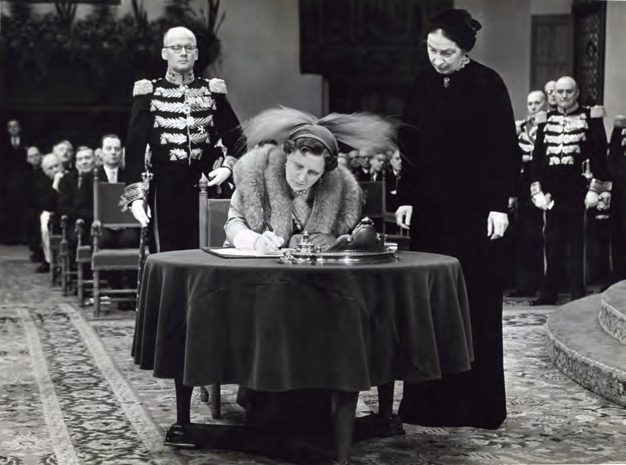

# How Our Country Was Governed

## Introduction: How Our Country Was Governed

---

### Student Textbook Content

6THEME How Our Country
Was Governed

From Colony to Republic

---

INTRODUCTION

Good leadership is needed to govern a school, an association, or a country well. In this theme, you will learn more about the government of our country. The different lessons tell how that was in the past. In Lesson 1, it tells about the government of our country from the 17th century. In the second lesson, you will get information about the changes after the abolition of slavery and the introduction of voting rights. In the third lesson, you will learn more about the government and voting rights in our country after World War II.

KEY CONCEPTS

- Society of Suriname with Letters Patent
- Political Council
- Minister of Colonies
- District Commissioner
- Colonial States
- Census suffrage
- States of Suriname
- Capacity suffrage
- States Monument
- Conflicts
- Wim Bos Verschuur
- Radio speech
- Union Suriname
- Round Table Conferences
- Council of Ministers
- Universal suffrage
- Grace Schneiders-Howard
- Autonomy
- Charter

Signing of the Charter by the Dutch queen

---

### Lesson Images

---

*Source: suriname-history.pdf (students) and suriname-history-teacher-guide.pdf (teacher)*
