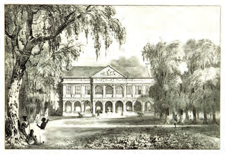
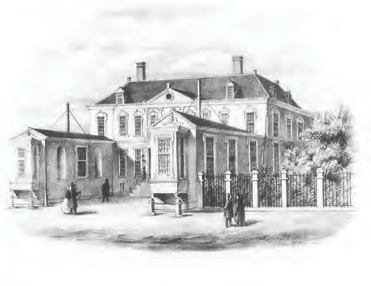

# How Our Country Was Governed

## Lesson 1: The Governor and the Political Council

---

### Student Textbook Content

The Governor and the Political Council

In the time when only Indigenous people lived in our country, the different groups had their own rules and government. When the Europeans came, they not only took possession of the land but also made their own laws and rules. In 1650, our country was taken possession of by the English under the leadership of Lord Willoughby. Later, it was conquered by the Netherlands. The government of our country came into the hands of foreign rulers. In 1683, the Society of Suriname with Letters Patent was established. This Society received permission or a charter from the Netherlands to govern the colony and became the new owner of our country. The charter stated, among other things, how the government should be organized. The governor had the highest authority in the colony and was appointed by the Society. So in 1683, Cornelis van Aerssen van Sommelsdijck became the governor of our country.

The governor was assisted in governing the country by the Political Council, also called the Court of Police. The members of the Political Council were appointed by the governor. For each member, the governor had to choose from two candidates, who were first chosen by the white colonists. Because this council consisted of wealthy plantation owners, you understand that they especially served their own interests. The enslaved people and a very large part of the free population in our country had no influence on the government. The Political Council had to approve the governor's decisions and laws, but they were not always in agreement with each other. This was because the governor served the interests of the Society and the Council stood up for the plantation owners. More often, disputes arose, for example, about the taxes the colonists had to pay.

The coat of arms of the Society of Suriname with Letters Patent

The government of our country during the Society of Suriname with Letters Patent

Society of Suriname with Letters Patent
Governor
Political Council
appoints
chooses
form
the government of
our country
candidates
white colonists

ASSIGNMENT

- By whom was the government of our country formed?
- Fill in: The governor represented the ...
- Fill in: The Political Council represented the ... SEE IMAGE 3

The Society of Suriname with Letters Patent was dissolved in 1795. The Netherlands was occupied by France in that year. Our country came under the authority of England in 1799. This remained so until 1816. This period is called the English interim government. Not much changed in the government of our country; only English governors were in our country during this period. An important measure during this period was the ban on the slave trade in 1808. England returned Suriname to the Netherlands in 1816, on the condition that the ban on the slave trade remained in effect.

REMEMBER

- In 1683, the Society of Suriname with Letters Patent became the owner of our country. This Society existed until 1795.
- Our country was governed at that time by a governor, assisted by the Political Council.
- In 1816, our country came under the direct authority of the Dutch king.
- The Dutch king appointed a Minister of Colonies, who gave orders to the governor.
- From 1816 to 1866, the government of our country was in the hands of the governor alone.

The governor's palace in our country

Building of the Ministry of Colonies

From 1816 onward, the government of the colony of Suriname came under the direct authority of the Dutch king. Some changes then came in the government of our country. In the Netherlands, there was a Council of Ministers who helped the king govern the country. For the colonies, there was a Minister of Colonies. He gave orders to the governor in the colony. In our country, the powers of the Political Council were greatly limited. It only had an advisory role. The government of our country was in the hands of the governor alone until 1866. And he was only accountable to the Minister of Colonies.

ASSIGNMENT

- In which country was this building located?
- What task did the Minister of Colonies have?
- To whom did the minister give orders? SEE IMAGE 5

---

QUESTIONS

1. Copy the timeline into your notebook.
   1600 1700 1800 1900
   Place the following events in the correct order on the timeline:
   - Establishment of the Society of Suriname with Letters Patent
   - Dissolution of the Society of Suriname with Letters Patent
   - Period of English interim government

2. In 1683, the Society of Suriname with Letters Patent became the owner of our country. This Society existed until 1795. Calculate how many years the Society of Suriname with Letters Patent existed.

3. By whom was the government of our country formed in the 18th century?
   1. In the Netherlands by: ...
   2. In Suriname by: ...

4. Explain how someone became a member of the Political Council.

5. Explain why the cooperation between the governor and the Political Council was not always good.

6. Which statement about the Political Council is not correct?
   A. Another name for Political Council was Court of Police.
   B. The governor appointed the members of the Political Council.
   C. The Political Council represented the population of our country.
   D. Between 1816 and 1866, the Political Council had no governing authority.

7. The period from 1799 to 1816 is called the English interim government. Explain this term.

8. In 1799, our country came under English authority.
   a. How many years did this English authority last?
   b. What important measure was taken during this period?
   c. Name the year in which that measure was taken.

9. Name one difference in the powers of the Political Council in the period before 1816 and after.

10. Which statement is correct?
    I. The government of our country was determined in the Netherlands between 1816 and 1866.
    II. The government of our country was formed by the governor and the Political Council between 1816 and 1866.
    A. Only statement I is correct.
    B. Only statement II is correct.
    C. Statements I and II are both correct.
    D. Statements I and II are both incorrect.

---

### Lesson Images

---

### Teacher's Guide - Answers and Explanations

Topic 6 – How Our Country Was Governed
The Governor and the Political Council

QUESTIONS AND ANSWERS

1. Copy the timeline into your notebook.
   1600 1700 1800 1900
   Place the following events in the correct order on the timeline:
   - Establishment of the Society of Suriname with Letters Patent – 1683
   - Dissolution of the Society of Suriname with Letters Patent – 1795
   - Period of English interim government – from 1799 to 1816

2. In 1683, the Society of Suriname with Letters Patent became the owner of our country. This Society existed until 1795. Calculate how many years the Society of Suriname with Letters Patent existed.
   The Society of Suriname with Letters Patent existed for 112 years. (1795 – 1683 = 112)

3. By whom was the government of our country formed in the 18th century?
   1. In the Netherlands by: Society of Suriname with Letters Patent
   2. In Suriname by: Governor and Political Council

4. Explain how someone became a member of the Political Council.
   The members of the Political Council were appointed by the governor. For each member, the governor had to choose from two candidates, who were first chosen by the white colonists.

5. Explain why the cooperation between the governor and the Political Council was not always good.
   The cooperation between the governor and the Political Council was not always good because they were not always in agreement with each other. This was because the governor served the interests of the Society and the Council stood up for the plantation owners.

6. Which statement about the Political Council is not correct?
   a. Another name for Political Council was Court of Police.
   b. The governor appointed the members of the Political Council.
   c. The Political Council represented the population of our country.
   d. Between 1816 and 1866, the Political Council had no governing authority.

7. The period from 1799 to 1816 is called the English interim government. Explain this term.
   In this period, our country was under the authority of England. English governors governed our country. It is called interim government because this English government falls between two periods of Dutch government.

8. In 1799, our country came under English authority.
   a. How many years did this English authority last?
   This authority lasted 17 years. (1816-1799 = 17)
   b. What important measure was taken during this period?
   An important measure during this period was the ban on the slave trade.
   c. Name the year in which that measure was taken.
   In 1808, the measure was taken.

9. Name one difference in the powers of the Political Council in the period before 1816 and after.
   Before 1816, the governor governed together with the Political Council. After 1816, the Political Council only had an advisory role, and the governor governed the country alone.

10. Which statement is correct?
    I. The government of our country was determined in the Netherlands between 1816 and 1866.
    II. The government of our country was formed by the governor and the Political Council between 1816 and 1866.
    a. Only statement I is correct.
    b. Only statement II is correct.
    c. Statements I and II are both correct.
    d. Statements I and II are both incorrect.

---

*Source: suriname-history.pdf (students) and suriname-history-teacher-guide.pdf (teacher)*
