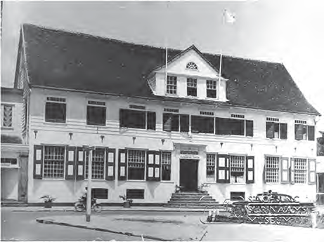

# How Our Country Was Governed

## Lesson 2: Introduction of Voting Rights

---

### Student Textbook Content

Introduction of Voting Rights

In 1863, slavery was abolished in our country. Because of this, much changed in our society. From that year, there were no more enslaved people in our country. After the abolition of slavery, there followed ten years of State Supervision. During this period, our country was divided into districts for the first time. The districts came under the leadership of a district commissioner. The district commissioner was appointed by the governor and was the highest official in a district. He was also the head of the police in that area, and he mainly had to ensure peace and order.

ASSIGNMENT

- Which official lived in this house?
- By whom is the district commissioner appointed?
- What tasks did the district commissioner have?
- When was our country divided into districts for the first time? SEE IMAGE 6

Official residence of a district commissioner

Other changes in the government of the country also took place. The decision was made to establish the Colonial States in our country. The Colonial States represented the people of our country and consisted of 13 members. Of these, the governor appointed 4 members, the remaining 9 members were elected for six years through census suffrage. The first elections were held on April 5, 1866.

Actually, only representatives of the richest people in our country sat in the Colonial States because at that time only census suffrage existed. This meant that only those who paid a certain amount of tax or had a certain income were allowed to vote. In this way, the vast majority of our population had no voting rights. When this suffrage was introduced in 1866, only 250 citizens in our country were allowed to vote.

ASSIGNMENT

- Which building do you see in the image?
- Who met in this building?
- Calculate how long ago the Colonial States was established. SEE IMAGE 7

The building in which the Colonial States met. This building unfortunately burned down (but is being rebuilt).

Together with the governor, the Colonial States formed the government of the country. Proposed laws from the governor were first reviewed by the Colonial States. At that time, there were no ministers yet. The governor governed the country. The governor was appointed and dismissed by the Dutch government.

In 1937, a few changes took place in the government. The name of the Colonial States changed to States of Suriname. The number of members sitting in the states was increased to 15. Of these, ten were elected and five were appointed by the governor.

The suffrage also changed. Alongside census suffrage, capacity suffrage was now also introduced. This suffrage was given to people with at least a ULO diploma. This meant that more people could vote. Not only wealthy plantation owners and colonists, but also teachers and officials. Still, the number of voters was always less than 2% of the total population.

In 1966, the States Monument was unveiled at Vaillant Square in Paramaribo, at the corner of Keizerstraat and Heiligenweg. This monument was erected to commemorate 100 years of Colonial States.

REMEMBER

- During State Supervision, our country was divided into districts that were under the leadership of a district commissioner. The district commissioners were appointed by the governor.
- In 1866, the Colonial States was established and consisted of 13 members.
- Nine members of the Colonial States were elected through census suffrage and four were appointed by the governor.
- The States Monument commemorates the establishment of the Colonial States.
- In 1937, the name Colonial States changed to States of Suriname, and the number of members was increased to 15.
- Alongside census suffrage, capacity suffrage was also introduced.

The States Monument in Paramaribo

---

QUESTIONS

1. Copy the timeline into your notebook.
   1850 1900 1950
   Place the following events in the correct order on the timeline:
   - Period of State Supervision.
   - Establishment of Colonial States
   - Introduction of capacity suffrage

2. Which two events in the government of our country took place during State Supervision?
   A. Establishment of Court of Police and creation of districts.
   B. Establishment of Colonial States and creation of districts.
   C. Establishment of Colonial States and introduction of universal suffrage.
   D. Establishment of Colonial States and introduction of capacity suffrage.

3. Explain which people could vote according to census suffrage.

4. Did the Colonial States represent the entire population of our country? Also explain why you say that.

5. Which answer is correct?
   The Colonial States was established in 1866. This was in the ...
   A. first half of the 18th century.
   B. second half of the 18th century.
   C. first half of the 19th century.
   D. second half of the 19th century.

6. a. When was the States Monument erected?
   b. On the occasion of which event was this?

7. Which statement is correct?
   I. Laws in our country were made by the governor and the Colonial States.
   II. The governor and the Colonial States together formed the government of our country.
   A. Only statement I is correct.
   B. Only statement II is correct.
   C. Statements I and II are both correct.
   D. Statements I and II are both incorrect.

8. Name three changes that took place in 1937 in the government of our country.

9. Explain which people could vote according to capacity suffrage.

10. Copy the table into your notebook and fill it in:
    Colonial States / States of Suriname
    Year of establishment
    Number of members
    Suffrage

---

### Lesson Images

---

### Teacher's Guide - Answers and Explanations

Topic 6 – How Our Country Was Governed
Introduction of Voting Rights

QUESTIONS AND ANSWERS

1. Copy the timeline into your notebook.
   1850 1900 1950
   Place the following events in the correct order on the timeline:
   - Period of State Supervision – 1863-1873
   - Establishment of Colonial States – 1866
   - Introduction of capacity suffrage – 1937

2. Which two events in the government of our country took place during State Supervision?
   a. Establishment of Court of Police and creation of districts.
   b. Establishment of Colonial States and creation of districts.
   c. Establishment of Colonial States and introduction of universal suffrage.
   d. Establishment of Colonial States and introduction of capacity suffrage.

3. Explain which people could vote according to census suffrage.
   According to census suffrage, only those people could vote who had a certain income or paid a certain amount of tax.

4. Did the Colonial States represent the entire population of our country? Also explain why you say that.
   No, the Colonial States only represented the richest people in our country because only they were allowed to vote according to census suffrage. The majority of the population had no voting rights.

5. Which answer is correct?
   The Colonial States was established in 1866. This was in the ...
   a. first half of the 18th century.
   b. second half of the 18th century.
   c. first half of the 19th century.
   d. second half of the 19th century.

6. a. When was the States Monument erected?
   The States Monument was erected in 1966.
   b. On the occasion of which event was this?
   To commemorate 100 years of Colonial States.

7. Which statement is correct?
   I. Laws in our country were made by the governor and the Colonial States.
   II. The governor and the Colonial States together formed the government of our country.
   a. Only statement I is correct.
   b. Only statement II is correct.
   c. Statements I and II are both correct.
   d. Statements I and II are both incorrect.

8. Name three changes that took place in 1937 in the government of our country.
   a. The name of the Colonial States changed to States of Suriname
   b. The number of members was increased from 13 to 15. 10 were elected and 5 were appointed by the governor.
   c. The suffrage changed. Alongside census suffrage, capacity suffrage was now also introduced.

9. Explain which people could vote according to capacity suffrage.
   According to capacity suffrage, people with at least a ULO diploma could vote.

10. Copy the table into your notebook and fill it in:
    Colonial States / States of Suriname
    Year of establishment: 1866 / 1937
    Number of members: 13 / 15
    Suffrage: Census suffrage / Capacity suffrage

---

*Source: suriname-history.pdf (students) and suriname-history-teacher-guide.pdf (teacher)*
