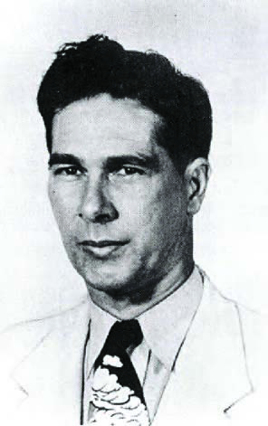
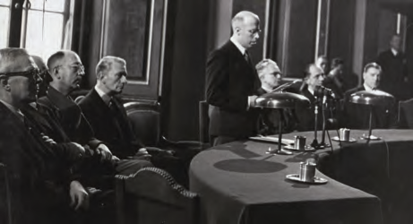
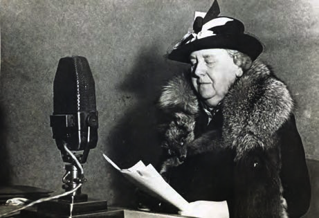
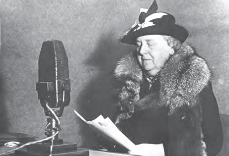
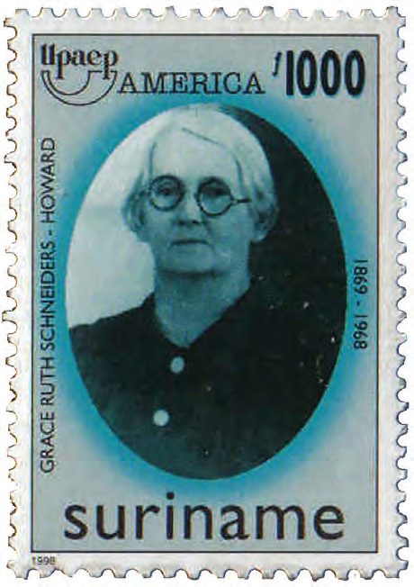

# How Our Country Was Governed

## Lesson 3: Boss in Your Own House!

---

### Student Textbook Content

Boss in Your Own House!

The governor and the States members were not always in agreement with each other. There were sometimes conflicts. The governor was appointed by the Dutch government. He paid more attention to Dutch interests than to those of the Surinamese people. The States members were the representatives of the Surinamese people. These disagreements were not new. In Lesson 1, you also read that the governor and the Political Council sometimes quarreled.

The conflicts between the governor and the States members especially increased during the government of Governor Kielstra. He was governor of our country from 1933 to 1944. During World War II, he declared a state of siege in our country when the Netherlands was occupied by Germany. In the interest of the country, he was allowed to do what he thought was right; he did not need permission from the States members for that. The government was then determined solely by the governor. But not everyone always agreed with him. Anyone who gave too much criticism was arrested and locked up in prison. This happened, for example, to States member Wim Bos Verschuur. He was elected as a States member in 1942 and from the beginning was a fierce opponent of the governor. Even before he became a member of the Colonial States, Wim Bos Verschuur was an active fighter for the people and advocated for workers.

A governor giving a speech to the States of Suriname

ASSIGNMENT

- Where do you think the people are?
- Point out the governor.
- Which interests did the governor represent? SEE IMAGE 9

States member Wim Bos Verschuur

When the war was over, pressure was applied from Suriname to the Dutch government for the promised changes. Among others, the organization Union Suriname pushed for negotiations on self-government, under the slogan "Boss in Your Own House." In 1948, negotiations on self-government with the Netherlands began. These negotiations are known as the Round Table Conferences. Two important topics were suffrage and self-government.

In 1948, after the first Round Table Conference, several changes were already introduced in the government of our country:

1. Alongside the governor, there came a group of people who governed the country together with him. This group was first called the Board of General Affairs. From 1950, the name changed to Council of Ministers or Cabinet.

2. The number of States members was brought to 21. The members were elected for four years, according to universal suffrage.

Opening of the Round Table Conference in 1948

ASSIGNMENT

- How can you see that there was literally a round table during these discussions?
- What was discussed during the Round Table Conference of 1948? SEE IMAGE 12

Universal suffrage meant that people who had reached the age of 23 were allowed to vote. Later, this age was lowered to 21, and today it is 18 years.

The suffrage that was introduced in 1948 was for both men and women. Before 1948, women were not allowed to vote. However, they could be elected as States members. The first woman in our country to become a States member was Grace Schneiders-Howard. She was elected as a member of the States of Suriname in 1938.

During World War II, our country produced much more bauxite than before. Because of this, our country earned a lot of money. So in 1942, for the first time since 1866, our country had enough money to pay all expenses itself. On December 7, 1942, the Dutch queen promised the colonies via a radio speech that after the war they would have more say in the government of their own country. The colonies would get self-government.

The Dutch queen during a radio speech

In 1954, a second Round Table Conference took place. At this meeting, self-government or autonomy of our country was discussed. The agreements were recorded in an official regulation, the Charter for the Kingdom of the Netherlands. Through the Charter, our country got self-government in domestic affairs. But everything related to foreign affairs, such as making agreements with other countries and the defense of the kingdom, remained in the hands of the Netherlands. Many people were happy. Our country could now, after all, manage its own affairs. However, it soon appeared that even after 1954, the influence of the Netherlands on our country was great. The desire for full independence grew, although opinions were divided. There were people who wanted independence as quickly as possible. There were also others who believed the country first had to be economically independent to be able to be politically independent. Eventually, our country became independent on November 25, 1975. Our country became a Republic on that day. You will read more about this in Theme 7.

Grace Schneiders-Howard

REMEMBER

- There were sometimes conflicts between the governor and the States members.
- Wim Bos Verschuur was elected as a States member in 1942. He had much criticism of Governor Kielstra's policy.
- After World War II, Round Table Conferences were held on suffrage and self-government.
- In 1948, universal suffrage was introduced in our country.
- Grace Schneiders-Howard became the first female States member in 1938.
- In 1954, the Charter for the Kingdom of the Netherlands came about. With this, our country got autonomy or self-government.

---

QUESTIONS

1. a. Tell in your own words or look up in a dictionary what conflict means.
   b. Explain why there were conflicts between the governor and the States members.

2. In Theme 4, the state of siege was discussed.
   a. What did that entail again?
   b. Why won't everyone always have agreed with the governor?

3. Which statement about Wim Bos Verschuur is not correct?
   A. He had much criticism of Governor Kielstra's policy.
   B. He stood up for the Surinamese people.
   C. Governor Kielstra had him arrested and locked up.
   D. In 1942, he was appointed by the governor as a States member.

4. What promise did the Dutch queen make to our country in 1942?

5. Explain what is meant by the slogan: "Boss in Your Own House."

6. Which two important topics were discussed during the Round Table Conferences?

7. Explain which people could vote according to universal suffrage in 1948.

8. Which statement about Grace Schneiders-Howard is correct?
   A. She introduced women's suffrage.
   B. She was the first woman allowed to vote.
   C. She was the first female States member.
   D. She was elected according to universal suffrage.

9. a. In which year did the Charter take effect in our country?
   b. What did self-government mean for our country?

10. Which statement is correct?
    I. With autonomy, our country could decide everything itself.
    II. Many people in our country were dissatisfied with autonomy.
    A. Only statement I is correct.
    B. Only statement II is correct.
    C. Statements I and II are both correct.
    D. Statements I and II are both incorrect.

---

### Lesson Images

---

### Teacher's Guide - Answers and Explanations

Topic 6 – How Our Country Was Governed
Boss in Your Own House!

QUESTIONS AND ANSWERS

1. a. Tell in your own words or look up in a dictionary what conflict means.
   Conflict means a disagreement or argument.

   b. Explain why there were conflicts between the governor and the States members.
   There were sometimes conflicts between the governor and the States members because the governor paid more attention to Dutch interests than to those of the Surinamese people.

2. In Theme 4, the state of siege was discussed.
   a. What did that entail again?
   During the state of siege, the governor got all power in his hands, so he could make decisions alone.
   b. Why won't everyone always have agreed with the governor?
   Not everyone will always have agreed with the governor because he often made enough decisions for the benefit of the Netherlands.

3. Which statement about Wim Bos Verschuur is not correct?
   a. He had much criticism of Governor Kielstra's policy.
   b. He stood up for the Surinamese people.
   c. Governor Kielstra had him arrested and locked up.
   d. In 1942, he was appointed by the governor as a States member.

4. What promise did the Dutch queen make to our country in 1942?
   The Dutch queen promised that the colonies would have more say in the government of their own country after the war.

5. Explain what is meant by the slogan: "Boss in Your Own House."
   With the slogan "Boss in Your Own House," it is meant that you are the boss in your own house. In your own house, you are the one in charge. In this case, "your own house" means our own country (Suriname).

6. Which two important topics were discussed during the Round Table Conferences?
   Two important topics at the Round Table Conferences were suffrage and self-government.

7. Explain which people could vote according to universal suffrage in 1948.
   With universal suffrage, people who had reached the age of 23 were allowed to vote. Later, this age was lowered to 21, and today it is 18 years.

8. Which statement about Grace Schneiders-Howard is correct?
   a. She introduced women's suffrage.
   b. She was the first woman allowed to vote.
   c. She was the first female States member.
   d. She was elected according to universal suffrage.

9. a. In which year did the Charter take effect in our country?
   In 1954
   b. What did self-government mean for our country?
   That meant that our country could manage domestic affairs itself.

10. Which statement is correct?
    I. With autonomy, our country could decide everything itself.
    II. Many people in our country were dissatisfied with autonomy.
    a. Only statement I is correct.
    b. Only statement II is correct.
    c. Statements I and II are both correct.
    d. Statements I and II are both incorrect.

---

*Source: suriname-history.pdf (students) and suriname-history-teacher-guide.pdf (teacher)*
