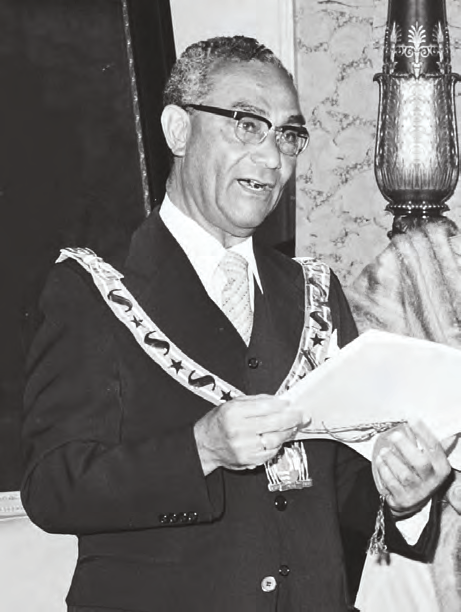
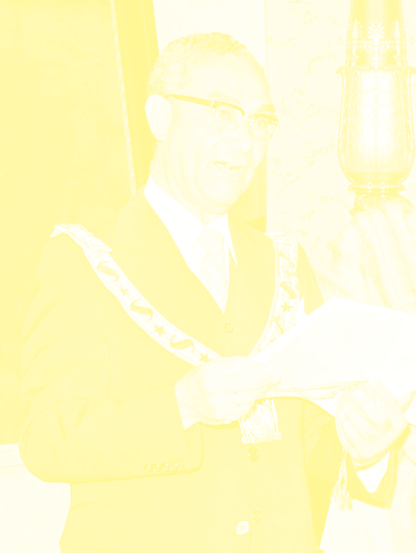

# Our Country, an Independent Republic

## Lesson 1: The Independence of Our Country

---

### Student Textbook Content

The Independence of Our Country

On November 25, 1975, Suriname became independent. From that moment, our country was no longer a colony of the Netherlands, and our country could independently make all decisions. This did not happen suddenly, of course. Many conversations between the government in Suriname and the Netherlands preceded this day. On November 25, 1975, the Dutch flag was lowered and the new Surinamese flag was hoisted for the first time. For the first time, the Surinamese national anthem was sung with a verse in Sranan.

Suriname became a Republic; with this, the government of our country changed. From independence, the highest authority was no longer with the Netherlands. They no longer appointed the governor in our country. The position of governor was abolished. The highest official of our country became the president. Dr. Johan Ferrier became the first president. Until November 25, 1975, he was the governor of Suriname. Our last governor thus became our first president. Also, the name of the States of Suriname changed to the Parliament of the Republic of Suriname. The States members became parliament members.

The president is the head of the government.

A government must govern the country. For this, there are laws and rules. The most important laws and rules in a country are laid down in a constitution. A constitution states, among other things, how the country should be governed. It also states what rights the citizens in the country have. A constitution is the basis for all other laws. At independence in 1975, Suriname also received a Constitution. For example, it states in our Constitution that children have the right to good education. It also states that people in the country have the right to unite in organizations.

The hoisting of the new Surinamese flag

Our first president, Johan Ferrier

Along with rights, people also have duties. The duties are also stated in the Constitution. For example, the duty to pay taxes. Everyone is also required to obey the authorities in the country. The government, in turn, is required to govern the country well. It must be able to justify its governance.

ASSIGNMENT

- What do you see in this image?
- What else is stated in a constitution?
- Name one civil right and one civil duty. SEE IMAGE 4

REMEMBER

- On November 25, 1975, Suriname became an independent Republic.
- The last governor, Johan Ferrier, became our first president.
- The States of Suriname changed to the Parliament of the Republic of Suriname
- Suriname received a Constitution, which stated how the country should be governed and also the rights and duties of citizens.
- The flag, the national anthem, and the coat of arms are our national symbols.

The Constitution of 1975

The coat of arms of the Republic of Suriname

At independence, our country thus received its own Constitution and a president. Henck Arron became the first prime minister of the Republic of Suriname. The position of prime minister was replaced in 1987 by Vice President of Suriname. At the beginning of this lesson, it was already written that we also received our own flag (and a different version than the first flag from 1959) and national anthem. Suriname also has a national coat of arms. A coat of arms is an image, usually in the form of a shield. The coat of arms of our country is shown in image 5.

ASSIGNMENT

- Describe the coat of arms of our country
- Why do you think there are two Indigenous people on our coat of arms? SEE IMAGE 5

The flag, the national anthem, and the coat of arms are the national symbols of our country. These symbols have a special meaning. They symbolize our country and its inhabitants, not only in our country but especially abroad. For example, when sports competitions between different countries are held, Surinamese athletes sing the Surinamese national anthem. You also see the flags of the different countries participating in the competitions. The image of the Surinamese coat of arms, for example, is on the Surinamese passport, but also on driver's licenses and identity cards.

---

QUESTIONS

1. a. Look up the word "independent" in a dictionary or on the internet and explain in your own words what it means.
   b. When did Suriname become independent?

2. Which answer is correct?
   At independence, our country became a ...
   A. Colony
   B. Kingdom
   C. Republic
   D. Realm part

3. Copy into your notebook and fill in:
   Suriname became independent on ... Since that day, our country is a ... The government of our country changed. Instead of a governor, we got a ... The name of the States of Suriname changed to the ... Suriname also received a ... in which, among other things, it states how the country should be governed.

4. Which statement is correct?
   I. Johan Ferrier was the first governor of Suriname.
   II. Johan Ferrier was the first president of Suriname.
   A. Only statement I is correct.
   B. Only statement II is correct.
   C. Statements I and II are both correct.
   D. Statements I and II are both incorrect.

5. a. Explain in your own words what a constitution is.
   b. What kind of things are written in a constitution?

6. Explain in your own words what rights and duties are.

7. Which answer is not a civil right?
   A. Giving your own opinion.
   B. Paying taxes.
   C. Receiving good education.
   D. Establishing an association.

8. Name one duty of the government.

9. Name the three national symbols of Suriname.

10. Explain what meaning the national symbols have.

---

### Lesson Images

---

### Teacher's Guide - Answers and Explanations

Topic 7 – Our Country, an Independent Republic
The Independence of Our Country

QUESTIONS AND ANSWERS

1. a. Look up the word "independent" in a dictionary or on the internet and explain in your own words what it means.
   Independent means no longer dependent. When someone is independent, it means that the person is self-sufficient.
   b. When did Suriname become independent?
   Our country became independent on November 25, 1975.

2. Which answer is correct?
   At independence, our country became a ...
   a. Colony
   b. Kingdom
   c. Republic
   d. Realm part

3. Copy into your notebook and fill in:
   Suriname became independent on November 25, 1975. Since that day, our country is a republic. The government of our country changed. Instead of a governor, we got a president. The name of the States of Suriname changed to the Parliament (of the Republic of Suriname).
   Suriname also received a Constitution in which, among other things, it states how the country should be governed.

4. Which statement is correct?
   I. Johan Ferrier was the first governor of Suriname.
   II. Johan Ferrier was the first president of Suriname.
   a. Only statement I is correct.
   b. Only statement II is correct.
   c. Statements I and II are both correct.
   d. Statements I and II are both incorrect.

5. a. Explain in your own words what a constitution is.
   A constitution is the basis for all other laws.
   b. What kind of things are written in a constitution?
   In a constitution, it is written how a country should be governed. The rights and duties of all citizens are also noted in the constitution.

6. Explain in your own words what rights and duties are.
   Rights are rules that indicate what you are allowed to do, while duties are the rules that indicate what you must do.

7. Which answer is not a civil right?
   a. Giving your own opinion.
   b. Paying taxes.
   c. Receiving good education.
   d. Establishing an association.

8. Name one duty of the government.
   The answer may differ per student.
   For example: A duty of the government is to provide its citizens with good health facilities.

9. Name the three national symbols of Suriname.
   The three national symbols of our country are the national anthem, the flag, and the coat of arms.

10. Explain what meaning the national symbols have.
    These three symbols symbolize our country and its inhabitants both in our own country and abroad.

---

*Source: suriname-history.pdf (students) and suriname-history-teacher-guide.pdf (teacher)*
