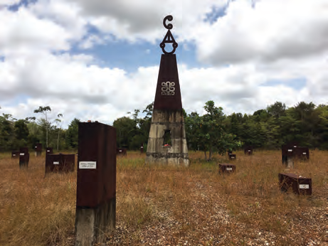
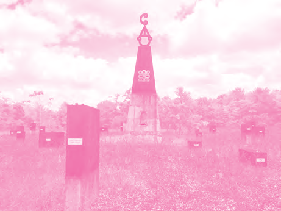
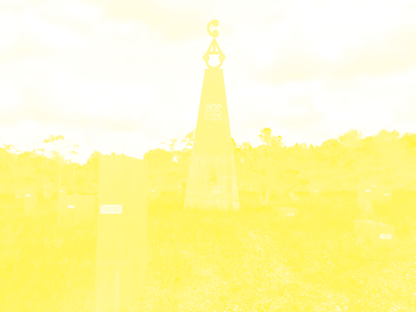
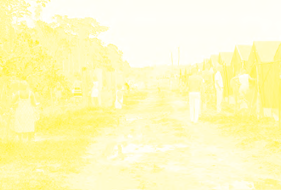

# Our Country, an Independent Republic

## Lesson 3: Changes in Government

---

### Student Textbook Content

Changes in Government

From 1985, conversations were held to organize free elections and have an elected government in our country. The Military Council and the various political parties wanted to come to solutions through peaceful consultation. But then in July 1986, the Civil War broke out in our country, a civil war. This war was fought between the Jungle Commando and the National Army. During this war, especially in the east of our country, much destruction was caused. Albina was almost completely destroyed, and also villages like Pokigron and Moiwana where innocent residents were killed by the National Army.

Moiwana Monument to commemorate the victims of the Civil War

Refugee camp in French Guiana

During the Civil War, people from the warring parties lost their lives. Others fled. Many refugees crossed the border to French Guiana, where they were received in refugee camps.

In 1987, the warring parties began conversations about ending the war, but it was not until 1992 that there officially came an end to the Civil War. An agreement was reached, and the Lelydorp Agreement was signed in Lelydorp. This was an important step toward peace and security in our country.

ASSIGNMENT

- Tell what you see in the image.
- In which country was this photo taken?
- Why did people flee from Suriname? SEE IMAGE 12

During the military period, the Constitution in our country had been suspended. A proposal for a new Constitution was drafted. This proposal was presented to the people by means of a referendum. Citizens were allowed to cast their vote for or against the new Constitution. In September 1987, the new Constitution was approved by the Surinamese people. A few months later, elections were held.

ASSIGNMENT

- In which year was a referendum held in Suriname?
- What was voted on in the referendum?

With the Constitution of 1987, a number of changes took place in the government of Suriname. The Parliament was called from then on The National Assembly (DNA). There are 51 members who are elected by the people in general elections. The members of the National Assembly are also called representatives.

The members of the National Assembly choose the president and the vice president. The government is formed by the president, the vice president, and the Council of Ministers. The president is at the head of the government, and he appoints and dismisses the ministers. The ministers each lead a ministry. Together, the ministers form the Council of Ministers. At the head of the Council of Ministers is the vice president. The vice president is also the replacement of the president.

Every five years, elections are held in which various political parties participate. In an election, people vote for persons who are on the list of a political party. The persons who are elected are the representatives or DNA members.

REMEMBER

- In 1986, the Civil War broke out in Suriname, a struggle of the Jungle Commando against the National Army.
- During this war, villages and settlements were destroyed, and there were casualties. People also fled.
- It was not until 1992 that there officially came an end to the Civil War with the Lelydorp Agreement.
- In 1987, our country received a new Constitution, and general elections were held.
- In elections, people may vote for candidates from political parties. This is how the members of The National Assembly are elected for a term of five years.

GOVERNMENT

Is at the head of
Appoints and dismisses
elect
Elect 51 representatives
PRESIDENT
VICE-
PRESIDENT
DNA: THE NATIONAL
ASSEMBLY
THE SURINAMESE
PEOPLE
COUNCIL OF
MINISTERS

The government of our country

---

QUESTIONS

1. Copy into your notebook and fill in:
   In July 1986, the struggle of the ... began against the Military Authority. A ... broke out, in which especially in the ... of our country much was destroyed. Places were destroyed and there were also deaths. Many people ... away, to, for example, French Guiana. There they were received in ...

2. a. What is meant by reaching an agreement?
   b. What is the agreement called that was signed between the government and the Jungle Commando?

3. Calculate how long the Civil War lasted.

4. Which statement is correct?
   I. Between 1980 and 1987, our Constitution was suspended.
   II. In 1987, our country received its own Constitution for the first time.
   A. Only statement I is correct.
   B. Only statement II is correct.
   C. Statements I and II are both correct.
   D. Statements I and II are both incorrect.

5. a. Look up in a dictionary or on the internet the word "referendum."
   b. Explain in your own words what is meant by a referendum.

6. Which statement is correct?
   I. In our country, a referendum was held in 1987.
   II. The referendum of 1987 was about a new Constitution.
   A. Only statement I is correct.
   B. Only statement II is correct.
   C. Statements I and II are both correct.
   D. Statements I and II are both incorrect.

7. Copy into your notebook and fill in:
   In 1987, our country received a new ... There were changes in the ... of our country. The parliament changed to ... There are ... members, who are elected by the people. The elected members are therefore also called ... Every five years, there are ... in which various political parties participate.

8. Every five years, elections are held in Suriname. For whom may the population then vote?
   A. The ministers
   B. The president
   C. The vice president
   D. The representatives

9. The government of our country is formed by the:
   1. ...
   2. ...
   3. ...

10. Who are the current president and vice president of Suriname?

---

### Lesson Images

---

### Teacher's Guide - Answers and Explanations

Topic 7 – Our Country, an Independent Republic
Changes in Government

QUESTIONS AND ANSWERS

1. Copy into your notebook and fill in:
   In July 1986, the struggle of the Jungle Commando began against the Military Authority. A civil war broke out, in which especially in the east of our country much was destroyed. Places were destroyed and there were also deaths. Many people fled away to, for example, French Guiana. There they were received in refugee camps.

2. a. What is meant by reaching an agreement?
   By reaching an agreement, it is meant that consensus was reached. Finally finding a solution that all parties agree with.
   b. What is the agreement called that was signed between the government and the Jungle Commando?
   The agreement that was signed between the government and the Jungle Commando is called the Lelydorp Agreement.

3. Calculate how long the Civil War lasted.
   The Civil War lasted six years. (1986-1992)

4. Which statement is correct?
   I. Between 1980 and 1987, our Constitution was suspended.
   II. In 1987, our country received its own Constitution for the first time.
   a. Only statement I is correct.
   b. Only statement II is correct.
   c. Statements I and II are both correct.
   d. Statements I and II are both incorrect.

5. a. Look up in a dictionary or on the internet the word "referendum."
   b. Explain in your own words what is meant by a referendum.
   By referendum, it is meant that you may give your opinion on whether you agree or disagree with a proposal.

6. Which statement is correct?
   I. In our country, a referendum was held in 1987.
   II. The referendum of 1987 was about a new Constitution.
   a. Only statement I is correct.
   b. Only statement II is correct.
   c. Statements I and II are both correct.
   d. Statements I and II are both incorrect.

7. Copy into your notebook and fill in:
   In 1987, our country received a new Constitution. There were changes in the government of our country. The parliament changed to The National Assembly. There are 51 members, who are elected by the people. The elected members are therefore also called representatives. Every five years, there are elections in which various political parties participate.

8. Every five years, elections are held in Suriname. For whom may the population then vote?
   a. The ministers
   b. The president
   c. The vice president
   d. The representatives

9. The government of our country is formed by the:
   1. President
   2. Vice President
   3. Council of Ministers

10. Who are the current president and vice president of Suriname?
    The answer depends on the school year in which this book is used.

---

*Source: suriname-history.pdf (students) and suriname-history-teacher-guide.pdf (teacher)*
