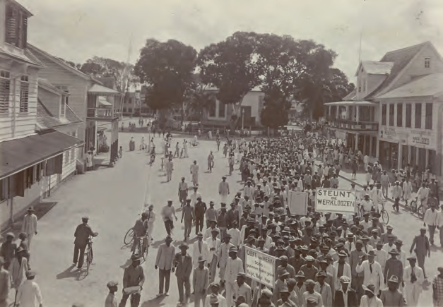
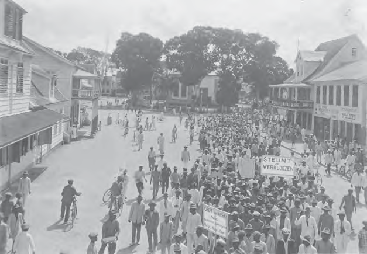

# Arbeiders komen op voor een beter bestaan

## Introducción: Arbeiders komen op voor een beter bestaan

---

### Contenido del Libro de Estudiantes

1

Arbeiders komen op

voor een beter bestaanTHEMA

---

INLEIDING

Als de omstandigheden waaronder mensen werken en

leven niet goed zijn, dan protesteren ze daartegen. In dit thema kom je te weten dat veel arbeiders in ons land in het begin van de 20e eeuw werkloos werden. Er was geen werk en dus konden de mensen geen geld verdienen. Mensen waren arm en protesteerden tegen de slechte omstandigheden. In les één wordt uitgelegd dat ook in andere landen de omstandigheden slecht waren. Er was sprake van een economische wereldcrisis. In les twee wordt verteld over Louis Doedel en Anton de Kom, twee Surinamers die opkwamen voor de belangen van arbeiders. In les drie wordt uitleg gegeven over het ontstaan en het doel van vakbonden.KERNBEGRIPPEN

• economische (wereld)crisis

• bloeiperiode

• failliet

• werkloosheid

• koopkracht

• gouvernement

• samenwerking

• organisatie

• Comité van Actie

• Louis Doedel

• Surinaamse Volksbond

• psychiatrische inrichting

• Anton de Kom

• adviesbureau

• Bok Sark

• SAWO

• vakbonden

• staking

• vakcentrale

• RAVAKSUR

• SIVIS

Demonstratie in ons land tijdens de crisisjaren1

12

---

### Imágenes de la Lección

---

### Guía del Profesor - Respuestas y Explicaciones

11

2 Werkwijze leermateriaalDoor rekening te houden met het niveau van de klasgroep en de individuele leerlingen, kan

u ook optimaal inspelen op de specifieke leeraanpak en interesses van de leerlingen. U kan

daarbij kiezen voor een uniform of een aangepast gebruik van het leermateriaal (bijvoorbeeld

door middel van puzzels, strips, opdrachten, spelletjes, samenwerkingsopdrachten, presen -

taties, enzovoort). Het is ook nuttig dat u de leerlingen zoveel als mogelijk stimuleert om ook

zelf op zoek te gaan en interessante en relevante informatie mee te brengen. Deze aanpak laat

u als leerkracht toe om in te spelen op de individuele interesses van leerlingen en daarbij de

koppeling te maken tussen heden en verleden vanuit het geschiedenisonderwijs.

2.5. Evaluatie en beoordeling

Zoals reeds eerder in dit inleidend hoofdstuk aangehaald, worden in het leerlingenboek

voor elke les, thema en kwartaal opdrachten aangereikt. Uiteraard hebben deze opdrach-

tenreeksen een belangrijke functie op vlak van formatieve evaluatie.

De opdrachten dragen op twee manieren bij tot het evalueren van het leerproces.

Enerzijds stellen zij de leerling in staat zelfstandig zijn/haar voortgang te monitoren en te

bewaken. U kan de tussentijdse en eindopdrachten van elke les immers door de leerlingen

zelfstandig of in groep laten uitwerken. Door middel van de antwoorden die beschikbaar

zijn in het leerkrachtenboek – die u indien gewenst kan delen met de leerlingen die zelf-

standig werken via een kopieerblad of digitale versie – kunnen de leerlingen zichzelf of

elkaar onmiddellijk verbeteren. Dit heeft als voordeel dat de leerlingen onmiddellijk zelf

feedback ontvangen omtrent hun antwoorden en gestimuleerd worden op het vlak van

zelfsturend leren (zowel in uitvoering, bijsturing als zelfevaluatie). Bovendien stelt deze

aanpak u in staat extra begeleiding of verlengde instructie te bieden aan leerlingen die nog

moeilijkheden ervaren met bepaalde leerinhouden of opdrachten.

Anderzijds bieden de opdrachtenreeksen u de mogelijkheid om bij alle leerlingen na te

gaan of zij de leerstof van de les of het thema begrijpen en beheersen. Deze formatieve

evaluatiemomenten bieden u inzicht in de voortgang van de leerlingen en indicaties waar

bijkomende aandacht of bijsturing nodig is.

Om de samenhang tussen de lessen per thema nog meer te verduidelijken zijn er na elk

thema bijkomende verwerkingsopdrachten voorhanden. De samenhang tussen de verschil-

lende thema’s wordt extra benadrukt door de kwartaalopdrachten.

Alle activiteiten en opdrachten om de leerlijn en -doelen voor Geschiedenis te bereiken,

kunnen geëvalueerd worden aan de hand van de vooraf bepaalde criteria in de evaluatie -

wijzer (zie Bijlage 1). Dit geldt zowel voor de mondelinge als de schriftelijke opdrachten.

Met behulp van deze evaluatiewijzer kunt u het leerproces en de leerprestaties van de

leerlingen zo objectief mogelijk beoordelen en opvolgen. De evaluatiewijzer kan zowel

formatief (tijdens het leerproces) als summatief (op het einde van het leerproces) worden

gebruikt. Het is aan te raden de evaluatiewijzer te gebruiken als een diagnostisch evalua-

tie-instrument (bijvoorbeeld: Hebben de leerlingen de leerstof begrepen? Zijn er leerlingen

die bijkomende instructie of begeleiding nodig hebben?) en evenuteel als een beoorde -

lingsinstrument (bijvoorbeeld: kwartaalopdrachten als herhalingstoets). De belangrijkste

functie van de opdrachten en de evaluatiewijzer is echter het diagnostisch en formatief

gebruik.

---

12

2 Werkwijze leermateriaalIn het leerkrachtenboek zal u telkens wanneer de evaluatiewijzer gebruikt kan worden

een specifiek evaluatie-pictogram zien staan. Telkens wordt daarbij een suggestie gedaan

over welke onderdelen u kan beoordelen. Uiteraard bent u daar vrij om dit voor uzelf en

de leerlingen aan te passen. Tot slot is het uiteraard nuttig om aan leerlingen (en eventueel

ouders) ook aan te geven op welke criteria zij zullen worden geëvalueerd tijdens bijvoor -

beeld presentaties en werkstukken.

2.6. 21e-eeuwse vaardigheden

Wereldwijd evolueert de maatschappij naar een kennis- en netwerksamenleving. De

toenemende digitalisering versnelt deze tendens. Dit vraagt om een aanpassing in het

functioneren en dus ook naar andere vaardigheden. Deze vaardigheden vormen een leer -

gebiedoverschrijdend kader van competenties, waarbij de nadruk wordt gelegd op sociale

vaardigheden, digitale geletterdheid en leren leren. Deze competenties vormen de basis

voor de ontwikkeling van ‘21e-eeuwse vaardigheden’.

Deze vaardigheden kan u ook tijdens de lessen Geschiedenis door de leerlingen laten

oefenen. Een koppeling van de leerinhouden met andere leergebieden is ook mogelijk.

Tabel 2. Voorbeelden van 21e-eeuwse vaardigheden toegepast in Geschiedenis.

21e-eeuwse vaardigheid Voorbeelden van integratie binnen Geschiedenis

Sociale vaardigheden:

communicerenU kan één of meerdere leerlingen vragen kort samen te

vatten wat zij in de vorige les hebben geleerd.

Zelfregulatie U kan leerlingen stimuleren om de eigen of elkaars

antwoorden op de opdrachten na te kijken en waar nodig te

verbeteren.

Creatief denken U kan de leerlingen vragen een historische gebeurtenis te

vertellen vanuit een bepaald perspectief, bijvoorbeeld vanuit

de lucht (zie ook het KCE-domein Beeldende Vorming voor

bijkomende suggesties omtrent Geschiedenis).

---

13

3 Structuur leerkrachtenboekDe lesinhouden, de leerstof en opdrachten van zowel het leerkrachten- als het leerlin-

genboek, zijn op elkaar afgestemd. Echter, het leerkrachtenboek kent daarbij een andere

opbouw dan het leerlingenboek. U kan het leerkrachtenboek vooral gebruiken als een

inspiratiebron om de eigen lesvoorbereidingen op te baseren (in functie van de beginsitu-

atie en voorkennis van de leerlingen).

In het leerkrachtenboek vindt u bij elk thema de volgende onderdelen:

• een veronderstelde beginsituatie van de leerling.

• het algemeen doel van het thema en de lesdoelen.

• de kernbegrippen met betrekking tot het thema.

• het leermateriaal.

• eventuele aandachtspunten.

• een introductie en mogelijke activiteiten per les.

• achtergrondinformatie bij de kernbegrippen.

• antwoorden op de opdrachten uit het leerlingenboek.

• waar nodig kopieerblad(en).

Een goed verloop van de les heeft natuurlijk te maken met een goede voorbereiding door

inzicht te verwerven in de lesdoelen, zich de inhoudelijke informatie van de les eigen te

maken en de achtergrondinformatie door te nemen. Ook het bestuderen van illustraties,

foto’s en tekeningen is zeer waardevol bij het voorbereiden van een thema en les. Verder is

het aangewezen om relevant aanschouwend materiaal, waarover u of de school beschikt

zoals een geografische kaart of globe te betrekken bij de lessen Geschiedenis, evenals zelf

opgezocht materiaal door u of de leerlingen en steeds de nodige kopieerbladen te voorzien.

Bij veel thema’s kan een (wereld)kaart, globe of atlas zinvol zijn en als ondersteunend en

aanschouwend materiaal gebruikt worden. Ook het maken van een tijdlijn, die u in de

klas, zelfs blijvend, aan de muur kunt bevestigen, kan leerlingen helpen om het overzicht

te bewaren. Specifiek ondersteunend en aanschouwend materiaal verschilt per thema. U

kan dit zelf verzamelen of de leerlingen vragen om dit van huis mee te brengen. Naar eigen

inzicht kunt u natuurlijk altijd bijkomende voorwerpen gebruiken.

Per les vindt u in de introductie steeds mogelijke activiteiten die u voor, tijdens of aan het

einde van de les kunt gebruiken. Daarnaast zijn er voldoende opdrachten in het leerlin-

genboek opgenomen om te differentiëren in niveaugroepen van leerlingen en om als

leerkracht de les of het thema te evalueren.

In het onderdeel ‘achtergrondinformatie’ krijgt u telkens op een toegankelijke manier

de benodigde vakinhoudelijke informatie over gebruikte kernbegrippen in de les. Het is

een handvat dat u kan helpen om de geschiedenisles op een inspirerende manier over te

brengen aan de leerlingen.

Gebruikte pictogrammen

In je boek kom je soms een pictogram tegen. Hieronder kan je zien wat elke pictogram wilt zeggen.

Hier gebruikt je leerkracht een evaluatiewijzer. De leerkracht vertelt je vooraf op wat je

beoordeeld wordt.

Je krijgt van je leerkracht een kopieerblad voor de opdracht uit te voeren.3 STR UCTUUR LEERKRACHTENBOEK

---

*Fuente: suriname-history.pdf (estudiantes) y suriname-history-teacher-guide.pdf (profesor)*
