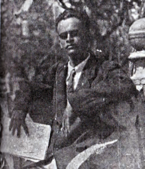
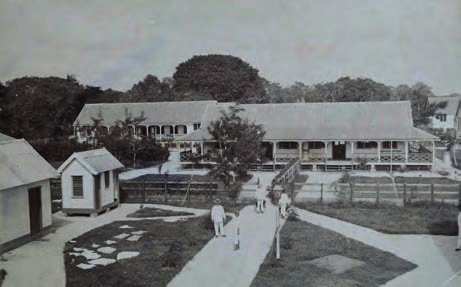
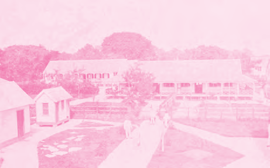
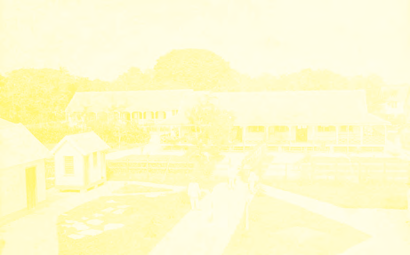
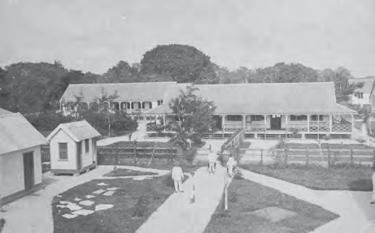
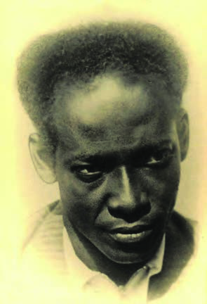
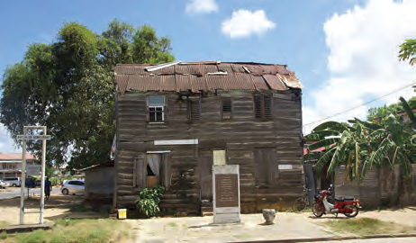

# Arbeiders komen op voor een beter bestaan

## Lección 2: Louis Doedel en Anton de Kom

---

### Contenido del Libro de Estudiantes

Louis Doedel en Anton de Kom 2

Louis Doedel4Om aandacht te vragen voor de noden van de werklozen,

werd in juni 1931 het Comité van Actie opgericht. Het Comité werd geleid door Louis Doedel.

Louis Doedel was zelf werkloos teruggekeerd uit Curaçao.

Dit Comité stelde een plan op dat zij aan de gouverneur voorlegde. In dit plan werd voorgesteld om:1. aan werklozen gratis een stuk grond te geven om landbouw uit te oefenen of voor het ontginnen van goud.

2. steun van de overheid te verlenen aan werklozen die bereid waren te werken.

3. gratis voedsel te geven aan ondervoede kinderen.

De gouverneur beloofde aan dit plan te werken. Maar na vier maanden was nog niet veel gedaan. De gouverneur had wel een steun-comité opgericht en een aantal concessies uitgegeven om goud te delven. Beide maatregelen hadden weinig resultaat. Op 28 oktober 1931 werd door de Surinaamse Volksbond een vergadering georganiseerd om over de

situatie te praten. De nood was hoog en de mensen verhongerden. Men was boos, omdat men vond dat het gouvernement niet genoeg deed. Tijdens deze vergadering konden de mensen zich niet langer bedwingen. In protest trokken ze de straat op. Omdat de mensen honger hadden en wanhopig waren, werden winkels en bakkerijen geplunderd. De politie trad hard op met als gevolg één dode, veertig arrestaties en veel gewonden. Ondanks het harde optreden van het gouvernement waren de arbeiders niet ervan te weerhouden zich te bundelen. Louis Doedel bleef, samen met anderen, zich inzetten voor de arbeiders en werklozen. Maar na verschillende acties werd hij in 1937 opgepakt door de politie toen hij een voorstel aan de gouverneur wilde overhandigen. Hij werd, zonder dat hij door een rechter was veroordeeld, opgesloten in een psychiatrische inrichting.

Het gebeurde wel vaker dat het gouvernement mensen die protesteerden tegen het bestuur, voor een korte tijd liet opsluiten en observeren. Maar Louis Doedel werd niet meer vrijgelaten. Het leek wel alsof men hem was vergeten. Pas in 1980, toen hij oud en ziek was werd hij overgebracht naar een bejaardenhuis waar hij in datzelfde jaar overleed. Hij was toen 75 jaar oud.

Psychiatrische inrichting Wolffenbuttel5OPDRACHT

• Wie was Louis Doedel?

• Waar werd hij opgesloten?

• Heb je eerder van deze inrichting gehoord?

• Wat vind je ervan dat het gouvernement dit zomaar kon doen?BIJ AFBEELDINGEN 4 EN 5

Nog een voorbeeld van iemand die opkwam voor de arbeiders en de werklozen is Anton de Kom . Hij werd geboren te Paramaribo op 22 februari 1898. In Suriname was hij boekhouder

bij een balatabedrijf. In 1920 vertrok hij naar Nederland. Vanuit Nederland bleef hij contact onderhouden met vrienden in Suriname die opkwamen voor de belangen van de arbeiders. In 1933 keerde hij met zijn gezin terug naar Suriname.

16

Thema 1 | Les 2 – Louis Doedel en Anton de Kom Les

---

De situatie van de arbeiders, zoals Anton de Kom die aantrof, was zeer triest. De Kom

leverde kritiek op deze wantoestanden en schreef een programma, dat veranderingen zou moeten brengen in de toestand van de arbeiders. In dit programma wilde hij onder andere:1. een eenheidsbeweging voor alle arbeiders en landbouwers.

2. invoering van een achturige werkdag, verbod op kinderarbeid en opheffing van contractarbeid.

3. onafhankelijkheid van Suriname.

4. vrijheid van organisatie van arbeiders en landbouwers.

Zijn boek “Wij slaven van Suriname” heeft veel invloed gehad in ons land. Anton de Kom wilde lezingen en openbare vergaderingen houden voor het volk. Maar het gouvernement verbood dit. Daarom opende de Kom een adviesbureau op het erf van zijn ouderlijke huis aan de Pontewerfstraat. Veel mensen kwamen met hun klachten naar hem toe. Het gouvernement vond dit alles niet goed en was van mening dat de Kom een onrustzaaier en opruier was. Daarom werd hij op 31 januari 1933 gearresteerd en gevangen gezet in het Fort Zeelandia.

OPDRACHT

• Wie was Anton de Kom?

• Heb je eerder de naam Anton de Kom gehoord? Waar?

• Waarom werd hij uit ons land verbannen? BIJ AFBEELDING 6

Anton de Kom6

Een paar dagen later eiste een grote groep mensen de vrijlating van Anton de Kom. Hierbij werd door de politie op de mensen geschoten en vielen er doden en gewonden. De Kom bleef in de gevangenis en in mei 1933 werd hij in het geheim op de boot gezet en naar Nederland gestuurd. Hij werd verbannen uit Suriname. In Nederland steunde hij het verzet tegen Duitsland in de Tweede Wereldoorlog. Hij werd door Duitsland gevangen genomen. Op 24 april 1945 stierf hij in Duitsland. Anton de Kom wordt herinnerd als verzetsheld.

Het ouderlijk huis van Anton de Kom7

OM TE ONTHOUDEN

• In 1931 werd het Comité van Actie opgericht onder leiding van Louis Doedel.

• Het Comité van Actie legde een hulpplan voor werklozen voor aan de gouverneur.

• In oktober 1931 gingen werklozen in protest de straat op, omdat het plan niet werd uitgevoerd door de gouverneur.

• Louis Doedel werd in 1937 door het gouvernement opgepakt en opgesloten in ’s Lands Psychiatrische Inrichting.

• Ook Anton de Kom kwam op voor de belangen van arbeiders en werklozen. Hij had hiervoor een programma opgesteld.

• Het gouvernement verbood Anton de Kom lezingen te houden, daarom opende hij een adviesbureau op zijn erf.

• In 1933 werd Anton de Kom door het gouvernement verbannen uit Suriname.

17

Thema 1 | Les 2 – Louis Doedel en Anton de Kom

---

VRAGEN

1. Welk antwoord is niet juist?

Het Comité van Actie stelde voor om:

A. gratis voedsel te geven aan ondervoede kinderen.

B.contractarbeid op te heffen.

C. steun van de overheid te verlenen aan werklozen die wilden werken.

D.Werklozen een stuk land te geven voor landbouw of goudwinning.

2. Op 28 oktober 1931 brak na een vergadering van werklozen onrust uit.a. Waarom gingen de mensen over tot het plunderen van winkels en bakkerijen?

b. Het gouvernement vond deze plunderingen brutaal. Ben je het daarmee eens of niet? Waarom zeg je dat?

c. Vertel wat de reactie was van het gouvernement op deze onrust.

3. Waarom denk je dat het gouvernement Louis Doedel liet oppakken en opsluiten?

4. Louis Doedel is overleden in 1980. Hij was toen 75 jaar oud.a. In welk jaar is hij geboren?

b. Hoe oud was hij toen hij werd opgepakt en opgesloten?

c. Hoeveel jaar heeft hij opgesloten gezeten?

5. Vertel in het kort wie Anton de Kom was. Beantwoord hierbij de volgende vragen:a. Wanneer is hij geboren?

b. In welk land is hij geboren?

c. Waar heeft hij gewerkt?

d. Wat wilde hij voor de arbeiders en werklozen?

e. Wat wilde hij voor Suriname als land?6. Welk antwoord is niet juist?Anton de Kom schreef een programma. Voorstellen hierin waren:

A. een eenheidsbeweging voor arbeiders en landbouwers.

B.invoering van een achturige werkdag.

C. gratis eten voor ondervoede kinderen.

D.onafhankelijkheid van Suriname.

7. Waarom opende Anton de Kom een adviesbureau?

8. Anton de Kom opende het adviesbureau op het erf van zijn familie aan de Pontewerfstraat. Hoe heet deze straat tegenwoordig?

9. Zoek het woord opruien op in het woordenboek. a. Leg met eigen woorden uit wie een opruier genoemd wordt.

b. Waarom zag het gouvernement Anton de Kom als een opruier?

c. Vind jij dat Anton de Kom een opruier was? Waarom zeg je dat?

10. Welke bewering is juist?I. Anton de Kom werd gearresteerd en daarna uit Suriname verbannen.

II. Louis Doedel stierf in Duitsland.

A. Alleen bewering I is juist.

B.Alleen bewering II is juist.

C. Bewering I en II zijn juist.

D.Bewering I en II zijn niet juist.

18

Thema 1 | Les 2 – Louis Doedel en Anton de Kom

---

### Imágenes de la Lección

---

### Guía del Profesor - Respuestas y Explicaciones

31

Les

Thema 1 – Arbeiders komen op voor een beter bestaanLouis Doedel en Anton de Kom

VRAGEN EN ANTWOORDEN

1. Welk antwoord is niet juist?

Het Comité van Actie stelde voor om:

a. gratis voedsel te geven aan ondervoede kinderen.

b. contractarbeid op te heffen.

c. steun van de overheid te verlenen aan werklozen die wilden werken.

d. werklozen een stuk land te geven voor landbouw of goudwinning.

2. Op 28 okt ober 1931 brak er na een vergadering van werklozen onrust uit.

a. Waarom gingen de mensen over tot het plunderen van winkels en bakkerijen?

De mensen gingen over tot het plunderen van winkels en bakkerijen omdat zij honger

hadden en wanhopig waren omdat de gouverneur nog niet veel had ondernomen.

b. Het gouv ernement vond deze plunderingen brutaal. Ben je het daarmee eens of

niet? Waarom zeg je dat?

Het antwoord zal per leerling verschillen.

c. Vertel wat de reactie was van het gouvernement op deze onrust.

De reactie van het gouvernement was het harde optreden van de politie, waarbij er

een dode en veel gewonden vielen en veertig arrestaties werden verricht.

3. Waarom denk je dat het gouvernement Louis Doedel liet oppakken en opsluiten?

Het gouvernement liet Louis Doedel oppakken en opsluiten omdat hij tegen het gouver -

nement protesteerde.

4. Louis Doedel is overleden in 1980. Hij was toen 75 jaar oud.

a. In welk jaar is hij geboren?

Hij is geboren in het jaar 1905.

b. Hoe oud w as hij toen hij werd opgepakt en opgesloten?

Hij werd opgepakt in 1937. Hij was toen 32 jaar.

c. Hoev eel jaar heeft hij opgesloten gezeten?

Hij heeft opgesloten gezeten van 1937 tot 1980. Dat is 43 jaar.

5. Vertel in het kort wie Anton de Kom was. Beantwoord hierbij de volgende vragen:

a. Wanneer is hij geboren?

Anton de Kom is geboren op 22 februari 1898.

b. In welk land is hij geboren?

Anton de Kom is geboren te Paramaribo, in Suriname.

c. Waar heeft hij gewerkt?

Hij heeft als boekhouder bij een balatabedrijf gewerkt.

d. Wat wilde hij voor de arbeiders en werklozen?

Voor de arbeiders en werklozen wilde hij het volgende:

1. Een eenheidsbeweging voor alle arbeiders en landbouwers.

2. Invoering van een achturige werkdag, verbod op kinderarbeid en opheffing van

contractarbeid.

3. Vrijheid van organisatie van arbeiders en landbouwers.

e. Wat wilde hij voor Suriname als land?

Hij wilde onafhankelijkheid van Suriname.2

---

32

Thema 1 – Arbeiders komen op voor een beter bestaan6. Welk antwoord is niet juist?

Anton de Kom schreef een programma. Voorstellen hierin waren:

a. een eenheidsbew eging voor arbeiders en landbouwers.

b. invoering van een achturige werkdag.

c. gratis eten voor ondervoede kinderen.

d. onafhankelijk heid van Suriname.

7. Waarom opende Anton de Kom een adviesbureau?

Omdat de regering hem verbood om lezingen en openbare vergaderingen te houden

voor het volk. Bij het adviesbureau konden mensen naar hem toekomen met hun

problemen.

8. Anton de Kom opende het adviesbureau op het erf van zijn familie aan de Pontewerf -

straat. Hoe heet deze straat tegenwoordig?

Tegenwoordig heet deze straat de Anton de Komstraat.

9. Zoek het woord opruien op in het woordenboek.

a. Leg met eigen woorden uit wie een opruier genoemd wordt.

Een opruier is iemand die anderen aanzet om negatieve dingen te doen.

b. Waarom zag het gouvernement Anton de Kom als een opruier?

Omdat Anton de Kom de mensen hielp met hun klachten. Het gouvernement vond dit

niet goed en was van mening dat hij de mensen tegen het gouvernement ophitste.

c. Vind jij dat Anton de Kom een opruier was? Waarom zeg je dat?

Het antwoord kan per leerling verschillen.

10. Welke bewering is juist?

I. Anton de Kom werd gearresteerd en daarna uit Suriname verbannen.

II. Louis Doedel stierf in Duitsland.

a. Alleen bewering I is juist.

b. Alleen bewering II is juist.

c. Bewering I en II zijn juist.

d. Bewering I en II zijn niet juist.

---

*Fuente: suriname-history.pdf (estudiantes) y suriname-history-teacher-guide.pdf (profesor)*
