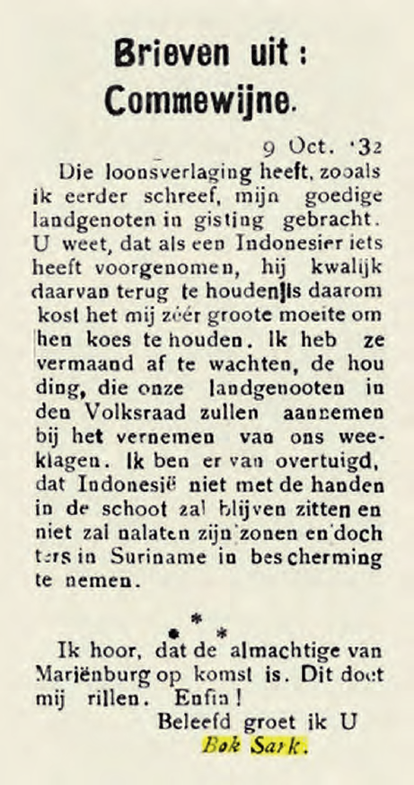
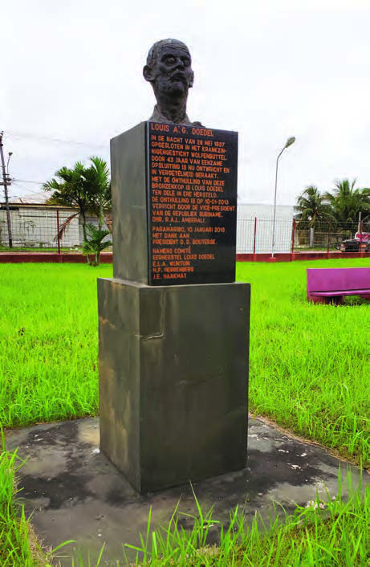

# Arbeiders komen op voor een beter bestaan

## Lección 3: Vakbonden en vakcentrales

---

### Contenido del Libro de Estudiantes

Vakbonden en vakcentrales

In de vorige les heb je gelezen dat het gouvernement hard optrad tegen mensen die

opkwamen voor de arbeiders. Er bestonden nog geen wetten die arbeiders het recht gaven om zich te bundelen. Daarom kon het gouvernement arbeidersorganisaties verbieden. Ook mochten er geen openbare vergaderingen of lezingen gehouden worden. Leiders werden opgepakt en gestraft. Zo werd Louis Doedel voor de rest van zijn leven in een gekkenhuis opgesloten en Anton de Kom werd uit het land verbannen.

Met zulke maatregelen is het te begrijpen dat sommige mensen liever niet op de voorgrond

traden. Dat wil niet zeggen dat zij niet ontevreden waren! Een voorbeeld hiervan zijn brieven die tussen 1932 en 1935 in een krant in ons land verschenen. Deze brieven werden ondertekend met Bok Sark. Bok Sark was een schuilnaam. Deze persoon was in het echt een man. Hij stelde zich voor als een Javaanse vrouw die op een plantage woonde en schreef over de slechte omstandigheden en de loonsverlagingen. Het gouvernement probeerde deze vrouw te vinden, maar niemand wist wie zij was. Pas veel later, in 1992 kwam een onderzoeker er achter dat deze brieven eigenlijk door een man geschreven waren. 3

OPDRACHT

• Lees de tekst: uit welke woorden blijkt dat de Javaanse contractarbeiders boos waren over loonsverlagingen?

• Leg uit of het schrijven van zo een brief ook een vorm van protest is.

• Waarom denk je dat de schrijver een schuilnaam gebruikte om de brieven te ondertekenen?

In de jaren rond 1930 was het een moeilijke tijd om op te komen voor de belangen van arbeiders en werklozen. De arbeiders en werklozen hadden geen rechten en het gouvernement trad hard op als zij protesteerden. Toen Louis Doedel samen met anderen in 1932 de SAWO (Surinaamse

Arbeiders en Werkers Organisatie) oprichtte, werd deze al gauw verboden door het gouvernement. Toch was dit een van de eerste vakbonden. Vakbonden zijn verenigingen van werknemers die hetzelfde werk doen of in hetzelfde bedrijf werken. Werknemers zijn de mensen die in dienst

zijn van een bedrijf of een werkgever. De werkgever is vaak de eigenaar van een

bedrijf. BIJ AFBEELDING 8

Een deel van een brief uit de krant van 12 oktober 1932,

ondertekend door Bok Sark8

19

Thema 1 | Les 3 – Vakbonden en vakcentralesLes

---

Het doel van een vakbond is om samen op te komen voor betere arbeidsomstandigheden.

Voorbeelden hiervan zijn:• betere werktijden

• het verbieden van kinderarbeid

• een goede zorgverzekering

• loonsverhoging

• een goed pensioen

Als werknemers ontevreden zijn over hun arbeidsomstandigheden kan de vakbond in gesprek gaan met de werkgever. Maar soms weigert de werkgever om in te gaan op de wensen van de vakbond. -De vakbond en de werkgever luisteren dan niet meer naar elkaar. In zo een geval kan de vakbond oproepen tot een staking. Werknemers leggen het werk neer en eisen dat de werkgever de arbeidsomstandigheden verbetert.

In de 20e eeuw bundelden steeds meer arbeiders zich in vakbonden. In de tweede helft van

de 20e eeuw gingen de vele kleine vakbonden zich bundelen in grotere organisaties. Deze organisaties zijn vakcentrales. Bij een actie of een staking van één vakbond kan deze steun krijgen van de andere vakbonden die aangesloten zijn bij dezelfde vakcentrale. Samen bereik je vaak meer dan alleen.

Drie vakcentrales bundelen zich in RAVAKSUR9

In ons land zijn er verschillende vakcentrales. Omdat organisatie en samenwerking zo belangrijk zijn hebben deze vakcentrales zich ook weer verenigd in één organisatie. Op 1 mei 1987 werd RAVAKSUR (Raad van Vakcentrales in Suriname) opgericht.

Er kwamen steeds meer vakbonden in ons land. Er waren vakbonden van arbeiders bij

particuliere bedrijven, maar ook vakbonden van arbeiders die bij de overheid werkten. Voor de vakbondsleden was het belangrijk dat het bestuur genoeg kennis had van vakbondszaken. Daarom werden cursussen opgezet om het vakbondswerk te leren. Er ontstond zelfs een vakbondsschool in 1969 waar vakbondsmensen werden opgeleid. Dat is het SIVIS (Scholings Instituut voor de Vakbeweging in Suriname). Voor het gebouw waarin SIVIS is gehuisvest, is in 2013 een borstbeeld van Louis Doedel geplaatst.

20

Thema 1 | Les 3 – Vakbonden en vakcentrales

---

OPDRACHT

• Voor welk gebouw is het borstbeeld van

Louis Doedel geplaatst?

• Waarom denk je dat er gekozen is om het borstbeeld van Louis Doedel juist hier te plaatsen?BIJ AFBEELDING 10

Borstbeeld van Louis Doedel10

OM TE ONTHOUDEN

• Het gouvernement trad hard op tegen de eerste vakbondsleiders.

• De ontevredenheid van het volk was ook in brieven in de krant te lezen.

• De SAWO was een van de eerste vakbonden.

• Vakbonden zijn verenigingen die opkomen voor betere arbeidsomstandigheden.

• Vakbonden kunnen in gesprek gaan met de werkgever. Als dit niet helpt, kan de vakbond een staking van de werknemers uitroepen.

• Vakbonden zijn verenigd in vakcentrales. De vakcentrales in ons land zijn verenigd in RAVAKSUR.

• Op de vakbondsschool SIVIS kunnen vakbondsmensen worden opgeleid.

21

Thema 1 | Les 3 – Vakbonden en vakcentrales

---

VRAGEN

1. Louis Doedel bleef zich samen met

anderen inzetten voor de arbeiders en werklozen. We kunnen zeggen: Louis Doedel was een vakbondsleider van het eerste uur . Wat wordt hiermee bedoeld?

2. Bok Sark schreef brieven over de onrust onder de Javaanse contractarbeiders.a. Waarom was er onrust onder de Javaanse contractarbeiders?

b. Leg uit waarom het gouvernement Bok Sark niet kon vinden?

c. Wat denk je dat het gouvernement zou hebben gedaan als ze Bok Sark wel hadden gevonden?

3. Leg aan de hand van twee voorbeelden uit de les uit waarom het rond het jaar 1930 moeilijk was om op te komen voor de belangen van arbeiders en werklozen.

4. Welk antwoord is juist?Een vakbond komt op voor…

A. de belangen van de bestuursleden.

B.de belangen van het gouvernement.

C. de belangen van de werkgever.

D.de belangen van werknemers.

5. Noem twee voorbeelden van arbeidsomstandigheden waarvoor een vakbond kan opkomen.

6. Noem een voorbeeld van nu waarbij arbeiders opkomen voor hun belangen. Vertel ook hoe deze arbeiders voor hun belangen zijn opgekomen.7. Welke bewering is juist?I. Staken is wanneer arbeiders het werk neerleggen, het bedrijf sluiten en voor langere tijd met vakantie gaan.

II. Staken is wanneer arbeiders het werk neerleggen om betere arbeidsomstandigheden af te dwingen

a. Alleen bewering I is juist.

b. Alleen bewering II is juist.

c. Bewering I en II zijn juist.

d. Bewering I en II zijn onjuist.

8. a. Waarom werden vakcentrales

opgericht?

b. Welk voordeel hadden vakbonden die zich aansloten bij een vakcentrale?

9. a. Wanneer is het Dag van de Arbeid?

b. Wanneer werd RAVAKSUR opgericht?

c. Is het toevallig dat deze organisatie juist op die dag werd opgericht? Waarom zeg je dat?

10. In 1969 werd in ons land een vakbondsschool opgericht.a. Hoe heet deze vakbondsschool?

b. Wie kan er naar deze vakbondsschool gaan?

c. Wat leren ze op deze vakbondsschool?

22

Thema 1 | Les 3 – Vakbonden en vakcentrales

---

### Imágenes de la Lección

---

### Guía del Profesor - Respuestas y Explicaciones

33

Les

Thema 1 – Arbeiders komen op voor een beter bestaanVakbonden en vakcentrales

VRAGEN EN ANTWOORDEN

1. Louis Doedel bleef zich samen met anderen inzetten voor de arbeiders en werklozen.

We kunnen zeggen: Louis Doedel was een vakbondsleider van het eerste uur. Wat wordt

hiermee bedoeld?

Van het eerste uur: een van de eerste zijn, of van(af) het begin erbij zijn.

2. Bok Sark schreef brieven over de onrust onder de Javaanse contractarbeiders.

a. Waarom was er onrust onder de Javaanse contractarbeiders?

Er was onrust onder de Javaanse contractarbeiders, omdat hun loon werd verlaagd

b. Leg uit waarom het gouvernement Bok Sark niet kon vinden?

Het gouvernement kon Bok Sark niet vinden, omdat zij ervan uitgingen dat Bok Sark

een vrouw was. Terwijl Bok Sark in werkelijkheid een man was.

c. Wat denk je dat het gouvernement zou hebben gedaan als ze Bok Sark wel hadden

gevonden?

Het gouvernement zou Bok Sark in de gevangenis laten opsluiten of uit het land

verbannen.

3. Leg aan de hand van twee voorbeelden uit de les uit waarom het rond het jaar 1930

moeilijk was om op te komen voor de belangen van arbeiders en werklozen.

Rond het jaar 1930 was het moeilijk om voor de belangen van arbeiders en werklozen

op te komen, omdat het gouvernement hard optrad als zij protesteerden. Er waren geen

wetten om de arbeider te beschermen en die de arbeiders het recht gaven te protesteren.

De voorbeelden kunnen per leerling verschillen.

4. Welk antwoord is juist?

Een vakbond komt op voor…

a. de belangen v an de bestuursleden.

b. de belangen v an het gouvernement.

c. de belangen v an de werkgever.

d. de belangen van werknemers.

5. Noem t wee voorbeelden van arbeidsomstandigheden waarvoor een vakbond kan

opkomen.

De voorbeelden kunnen per leerling verschillen.

Een vakbond kan opkomen voor:

a. betere werktijden.

b. het v erbieden van kinderarbeid.

c. een goede zorgverzekering.

d. loonsverhoging.

e. een goed pensioen.

6. Noem een v oorbeeld van nu waarbij arbeiders opkomen voor hun belangen. Vertel ook

hoe deze arbeiders voor hun belangen zijn opgekomen.

De voorbeelden zullen per leerling verschillen. (diverse protestacties)3

---

34

Thema 1 – Arbeiders komen op voor een beter bestaan7. Welke bewering is juist?

I. Staken is dat arbeiders het werk neerleggen, het bedrijf sluiten en voor langere tijd

met vakantie gaan.

II. Staken is dat arbeiders het werk neerleggen om betere arbeidsomstandigheden te

eisen.

a. Alleen bewering I is juist.

b. Alleen bewering II is juist.

c. Bewering I en II zijn juist.

d. Bewering I en II zijn onjuist.

8. a. Waarom werden vakcentrales opgericht?

Vakcentrales werden opgericht omdat met samenwerken vaak meer bereikt wordt

dan alleen.

b. Welk voordeel hadden vakbonden die zich aansloten bij een vakcentrale?

De vakbonden die aangesloten waren bij vakcentrales kregen steun van andere

vakbonden bij een actie of staking.

9. a. Wanneer is het Dag van de Arbeid?

De Dag van de Arbeid is op 1 mei.

b. Wanneer werd RAVAKSUR opgericht?

RAVAKSUR werd opgericht op 1 mei 1987.

c. Is het t oevallig dat deze organisatie juist op die dag werd opgericht? Waarom zeg je

dat?

Nee, het is geen toeval dat deze organisatie op die dag werd opgericht, omdat de

organisatie staat of opkomt voor de belangen van de arbeiders en werklozen.

10. In 1969 werd in ons land een vakbondsschool opgericht.

a. Hoe heet dez e vakbondsschool?

De vakbondsschool heet SIVIS (Scholings Instituut voor de Vakbeweging in Suriname).

b. Wie kan er naar deze vakbondsschool gaan?

Vakbondsleden konden/kunnen naar deze vakbondsschool gaan.

c. Wat leren ze op deze vakbondsschool?

Op deze vakbondsschool leerden/leren ze het belang van bestuur en konden/kunnen

ze kennis vergaren over vakbondszaken.

---

*Fuente: suriname-history.pdf (estudiantes) y suriname-history-teacher-guide.pdf (profesor)*
