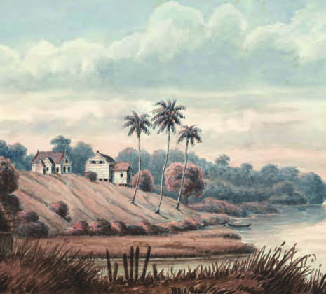
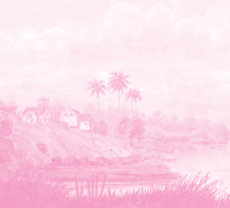
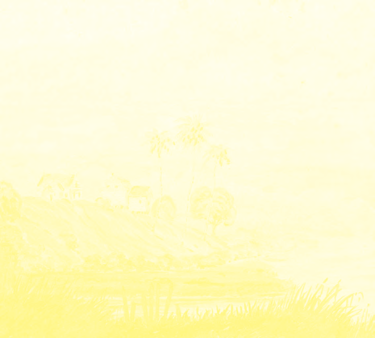

# Het onderwijs in ons land

## Lección 1: Hoe was het vroeger?

---

### Contenido del Libro de Estudiantes

Hoe was het vroeger?

In de tijd dat er in ons land nog alleen Inheemsen woonden, waren er geen scholen. Maar

dat wil niet zeggen dat de Inheemse kinderen niet hoefden te leren. In het dorp waar ze woonden, leerden zij van volwassenen allerlei zaken die ze in het latere leven nodig zouden hebben. Al heel jong hielpen ze hun ouders met het werk. Met het bouwen van hutten, het maken van gereedschap, kleding en potten. En ook met jagen, vissen, planten en koken. Een belangrijke persoon bij de Inheemsen was de piai. De piai wist veel van geneeskrachtige planten en kruiden en kon zieke mensen genezen. Een piai had altijd een paar leerlingen aan wie de kennis van de natuur werd doorgegeven. De grote mensen zongen ook liederen en vertelden verhalen aan de kinderen. Zo leerden ze de geschiedenis van hun eigen volk kennen.1

Toen de Europeanen in de 17e eeuw ons land in bezit namen, werden de eerste scholen in ons land opgericht. Deze scholen waren echter alleen bedoeld voor Europese kinderen. Ook werd bijvoorbeeld al in 1677 in Jodensavanne een school geopend voor Joodse kinderen. Er waren in het begin maar weinig Europese kinderen en dus ook weinig scholen in ons land. Op die scholen leerden de kinderen lezen en schrijven. Godsdienstles over het Christelijke geloof was erg belangrijk. Maar ze leerden ook dat het de wil van God wasdat er slaafgemaakten waren!

In Jodensavanne werd in 1677 een school geopend 2De kinderen van slaafgemaakten mochten niet naar school. De Europese plantage-eigenaren wilden niet dat zij leerden lezen en schrijven. Slaafgemaakten moesten onwetend blijven. De plantage-eigenaren dachten dat zij op die manier over de slaafgemaakten konden blijven heersen. Ook vonden de plantage-eigenaren dat het voor het werk op de plantage toch niet nodig was om te kunnen lezen en schrijven. De kinderen konden het werk van de volwassen slaafgemaakten leren.

OPDRACHT

• Wat doen de kinderen op de afbeelding?

• Waarom gingen zij niet naar school?

• Zijn er in ons land nog steeds kinderen die niet naar school gaan? BIJ AFBEELDING 4

Slaafgemaakten en kinderen aan het werk op een plantage3

27

Thema 2 | Les 1 – Hoe was het vroeger?Les

---

Al leerden de meeste slaafgemaakte kinderen dus niet lezen en schrijven, van hun ouders

leerden ze wel over het onrecht van de slavernij. De kleine kinderen werden door een krioromama verzorgd. Zij vertelde de kinderen verhaaltjes en leerde hen dat zij onderdanig moesten zijn aan de meester. Maar de kinderen leerden ook het Sranan spreken en later de odo’s en liedjes die gezongen werden door oudere slaafgemaakten. Zij vertelden hen ook van moedige slaafgemaakten die waren gevlucht en Marrons werden. En ze leerden over Afrika en over hun eigen cultuur.

Krioromama met slaafgemaakte kinderen4

In 1760 werd in ons land een school geopend voor de kinderen van de vrije gekleurde bevolking. Naar deze school gingen kinderen van gemanumitteerden (vrijverklaarden), die het schoolgeld konden betalen. Want onderwijs was niet gratis. De meeste leerlingen op deze school waren kleurlingen. In ons land was er in die tijd alleen de lagere school. Soms had iemand de kans om in Nederland verder te leren. Een voorbeeld hiervan is Johannes Vrolijk. In 1809 kwam hij terug naar Suriname en opende hier een school. Hiermee werd Johannes Vrolijk de eerste kleurlingonderwijzer in ons land. In het district Wanica is een Muloschool naar hem vernoemd.

28

Thema 2 | Les 1 – Hoe was het vroeger?

---

OM TE ONTHOUDEN

• Inheemse kinderen leerden van de ouderen in het dorp. Enkele kinderen leerden van de

piai over geneeskrachtige kruiden en planten.

• De eerste scholen in ons land waren alleen voor Europese kinderen. Zij leerden lezen en schrijven en kregen ook godsdienstles.

• Kinderen van slaafgemaakten mochten niet naar school.

• De krioromama en de oudere slaafgemaakten vertelden de slaafgemaakte kinderen over het onrecht van de slavernij en over hun eigen cultuur.

• In 1760 werd in ons land een school geopend voor de vrije gekleurde bevolking.

• Johannes Vrolijk werd in 1809 de eerste kleurlingonderwijzer in ons land. In Wanica is een Muloschool naar hem vernoemd.

Johannes Vrolijk Muloschool in Wanica5OPDRACHT

• Wie was Johannes Vrolijk?

• In welk district staat de Johannes Vrolijk Muloschool?BIJ AFBEELDING 6

29

Thema 2 | Les 1 – Hoe was het vroeger?

---

VRAGEN

1. a. Van wie leerden de Inheemse

kinderen vroeger wat zij moesten

kennen en kunnen?

b. Hoe leerden de Inheemse kinderen over de geschiedenis van hun eigen volk?

2. Hierna staan een aantal zaken die kinderen kunnen leren van hun ouders. Welke drie zaken leerden Inheemse kinderen vroeger niet van hun ouders?dansen fietsen jagen

koken lezen planten

schrijven vissen zingen

3. Welke van de onderstaande beweringen is juist?I. De piai kon zieke mensen beter maken.

II. De piai gaf alle kinderen onderwijs over planten en kruiden.

A. Alleen bewering I is juist.

B.Alleen bewering II is juist.

C. Bewering I en II zijn juist.

D.Bewering I en II zijn onjuist.

4. De school in Jodensavanne werd in 1766 geopend. a. Reken uit hoe lang geleden dat is.

b. Wie ging er naar deze school?

c. Welke vakken kregen kinderen toen op school?

5. Wat leerden de Europese kinderen bij de godsdienstles?6. Waarom mochten kinderen van slaafgemaakten niet naar school?

7. Is de krioromama te vergelijken met een peuteropvang? Waarom wel/niet?

8. Noem drie punten op die slaafgemaakte kinderen van de volwassen slaafgemaakten leerden.

9. In 1760 werd een school geopend voor kleurlingen. Dit was in de …a. eerste helft van de 17e eeuw.

b. tweede helft van de 17e eeuw.

c. eerste helft van de 18e eeuw.

d. tweede helft van de 18e eeuw.

10. Wat is niet juist over Johannes Vrolijk?

A. In Wanica is een Muloschool naar hem vernoemd.

B.Hij heeft in Nederland voor onderwijzer gestudeerd.

C. Hij is geboren in 1809.

D.Hij was de eerste kleurlingonderwijzer in ons land.

30

Thema 2 | Les 1 – Hoe was het vroeger?

---

### Imágenes de la Lección

---

### Guía del Profesor - Respuestas y Explicaciones

44

Les

Thema 2 – Het onderwijs in ons landHoe was het vroeger?

VRAGEN EN ANTWOORDEN

1. a. Van wie leerden de Inheemse kinderen vroeger wat zij moesten kennen en kunnen?

Vroeger leerden de Inheemse kinderen van hun ouders en andere volwassenen wat zij

later in het leven moesten kennen en kunnen.

b. Hoe leer den de Inheemse kinderen over de geschiedenis van hun eigen volk?

De Inheemse kinderen leerden via verhalen en liederen, die door volwassenen verteld

of gezongen werden, over hun geschiedenis.

2. Hierna staan een aantal zaken die kinderen kunnen leren van hun ouders. Welke drie

zaken leerden Inheemse kinderen vroeger niet van hun ouders?

O dansen O fietsen O jagen

O koken O lezen O planten

O schrijven O vissen O zingen

3. Welke van de onderstaande beweringen is juist?

I. De piai kon zieke mensen beter maken.

II. De piai gaf alle kinderen onderwijs over planten en kruiden.

a. Alleen bewering I is juist.

b. Alleen bewering II is juist.

c. Bewering I en II zijn juist.

d. Bewering I en II zijn onjuist.

4. De school in Jodensavanne werd in 1766 geopend.

a. Reken uit hoe lang geleden dat is.

Antwoord afhankelijk van het schooljaar.

b. Wie ging er naar deze school?

Alleen Joodse kinderen gingen naar deze school.

c. Welke vakken kregen kinderen toen op school?

Lezen, schrijven en godsdienstlessen.

5. Wat leerden de Europese kinderen bij de godsdienstles?

De kinderen leerden dat God de wereld wilde hebben zoals die toen was. Het was de wil

van God dat er slaafgemaakten waren.

6. Waarom mochten kinderen van slaafgemaakten niet naar school?

Omdat de Europese plantage-eigenaren niet wilden dat de kinderen van de slaafge -

maakten moesten leren lezen en schrijven. Slaafgemaakten moesten onwetend blijven.

7. Is de k rioromama te vergelijken met een peuteropvang? Waarom wel/niet?

Ja, want de kinderen werden opgevangen door de krioromama terwijl de ouders aan het

werk waren.

Motivering kan per leerling verschillen.1

---

45

Thema 2 – Het onderwijs in ons land8. Noem dr ie punten op die slaafgemaakte kinderen van de volwassen slaafgemaakten

leerden.

-De kinderen leerden in het Sranan spreken en leerden ook odo’s en liedjes die door

volwassenen gezongen werden.

-Ze leerden over Afrika en hun eigen cultuur

-Ze leerden over de slaafgemaakten die gevlucht waren en marrons werden.

9. In 1760 werd een school geopend voor kleurlingen. Dit was in de …

a. eerst e helft van de 17e eeuw.

b. tweede helft van de 17e eeuw.

c. eerst e helft van de 18e eeuw.

d. tweede helft van de 18e eeuw.

10. Wat is niet juist over Johannes Vrolijk?

a. In Wanica is een Muloschool naar hem vernoemd.

b. Hij heeft in Nederland voor onderwijzer gestudeerd.

c. Hij is geboren in 1809.

d. Hij was de eerste kleurlingonderwijzer in ons land.

---

*Fuente: suriname-history.pdf (estudiantes) y suriname-history-teacher-guide.pdf (profesor)*
