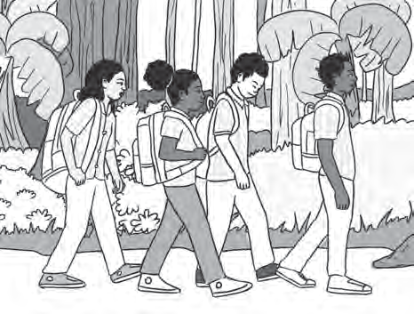
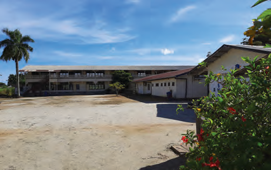

# Het onderwijs in ons land

## Lección 3: Hoe belangrijk is goed onderwijs?

---

### Contenido del Libro de Estudiantes

Hoe belangrijk is goed onderwijs?

Misschien heb jij je wel eens afgevraagd waarom je naar school moet. Waarom is het nodig

al die vakken te leren? Leren gebeurt natuurlijk niet alleen op school. Als je jong bent, leer je allerlei zaken die later in het leven nodig zijn om zelfstandig te kunnen functioneren. In een land zijn er mensen nodig die verschillende beroepen kunnen uitoefenen. Deze beroepen zijn bijvoorbeeld verpleegsters, leerkrachten, politieagenten, timmerlieden en metselaars. Deze beroepen kan je zonder opleiding niet uitoefenen en thuis kan je het niet altijd leren. Daarom gaan kinderen naar school.3

Lagereschoolkinderen op weg naar school8OPDRACHT

• Waaraan kun je zien dat de kinderen op een lagere school zitten?

• Leg in je eigen woorden uit waarom het belangrijk is om naar school te gaan.

• Noem zelf een beroep, dat mensen kunnen uitoefenen als ze naar school zijn gegaan.BIJ AFBEELDING 9

Vroeger was er in ons land alleen lager onderwijs. Langzaam kwam hier verandering in. Zo werd in 1887 de Hendrikschool de eerste MULO (Meer Uitgebreid Lager Onderwijs) school opgericht in Paramaribo. Een jaar later werd ook de Ambachtsschool opgericht. Hier werden leerlingen opgeleid tot bijvoorbeeld timmerman, metselaar of schilder. Dit onderwijs wordt nu beroepsgericht onderwijs genoemd. Je leert op zo een school een vak en na het halen van je diploma kan je gelijk een beroep uitoefenen.

Handenarbeid en kennis (hersenarbeid) kunnen samengaan9OPDRACHT

Het monument bestaat uit twee standbeelden van mannen.• Wat houden de twee mannen in hun handen?

• Welke van de twee mannen is een symbool voor beroepsonderwijs?

• Wat stelt de andere man voor? BIJ AFBEELDING 10

34

Thema 2 | Les 3 – Hoe belangrijk is goed onderwijs?Les

---

Naast beroepsgericht onderwijs bestaat

er ook algemeen vormend onderwijs.

Op deze scholen leer je niet een bepaald beroep, maar algemeen vormende schoolvakken.

In 1950 werden de Algemene Middelbare

School (AMS) en de Surinaamse Kweekschool opgericht. De AMS is een V.W.O. school. Dat betekent: VoorbereidendWetenschappelijk Onderwijs. Het hoort tot

het algemeen vormend onderwijs. Leerlingen die een Mulodiploma hebben, kunnen naar een VWO-school gaan. Op zo een school word je voorbereid op een hogere studie aan onder andere een universiteit. Bijvoorbeeld als je dokter wilt worden, of ingenieur. Op de kweekschool (nu de Pedagogische Instituten) werden onderwijzers opgeleid.

Sommige kinderen kunnen niet naar een

gewone school. Bijvoorbeeld omdat ze met een lichamelijke beperking geboren zijn. Kinderen die slechthorend of slechtziend zijn, hebben behoefte aan speciaal onderwijs. In ons land zijn er verschillende scholen voor kinderen die speciale aandacht nodig hebben. Zo kunnen zij ook een vak leren en later daar hun beroep van maken.

Ons onderwijs ziet er ondertussen helemaal

anders uit. In je Taalboek A (Thema 1, les 11) kan je het Surinaams onderwijssysteem van vandaag ontdekken.

De Hendrikschool: de oudste Muloschool in Paramaribo10

OM TE ONTHOUDEN

• Als je jong bent leer je van alles om later zelfstandig te kunnen zijn.

• In een land zijn er mensen nodig die verschillende beroepen uitoefenen.

• De Hendrikschool is de oudste Muloschool in ons land. Deze school werd in 1887 geopend.

• Op de ambachtsschool konden leerlingen een vak leren. Dit wordt beroepsgericht onderwijs genoemd.

• Er zijn ook scholen voor algemeen vormend onderwijs en voorbereidend wetenschappelijk onderwijs.

• Op de Kweekschool werden onderwijzers opgeleid.

• Op scholen voor speciaal onderwijs wordt les gegeven aan kinderen met een beperking. Zij kunnen zo ook een vak leren en later zelfstandig zijn.

De AMS: de eerste VWO-school in ons land11

35

Thema 2 | Les 3 – Hoe belangrijk is goed onderwijs?

---

VRAGEN

1. a. Omschrijf in je eigen woorden of

zoek op in een woordenboek wat

met het begrip zelfstandig wordt bedoeld.

b. Is het belangrijk dat je een beroep uitoefent om zelfstandig te zijn? Waarom?

2. Waarom is het belangrijk om naar school te gaan?

3. a. Wanneer werd de eerste Muloschool

in Paramaribo opgericht?

b. Reken uit hoe lang geleden dat is.

c. Wat is de naam van deze Muloschool?

4. Waarom wordt het onderwijs op een ambachtsschool of een technische school beroepsgericht onderwijsgenoemd?

5. Welk woord is geen synoniem voor ambacht? Twee woorden worden synoniemen genoemd als ze (ongeveer) dezelfde betekenis hebben.

A. Beroep

B.Handwerk

C. Product

D.Vak

6. a. Is beroepsgericht onderwijs belangrijk voor de ontwikkeling van ons land?

b. Geef aan waarom wel of niet?7. Welke bewering is juist?I. Op de Muloschool wordt er beroepsgericht onderwijs gegeven.

II. Met het diploma van de lagere school kun je een beroep uitoefenen.

A. Alleen bewering I is juist.

B.Alleen bewering II is juist.

C. Bewering I en II zijn juist.

D.Bewering I en II zijn onjuist.

8. Noem een verschil tussen beroepsgericht onderwijs en algemeen vormend onderwijs.

9. Wat is de goede volgorde?Welke scholen moet je na de lagere school nog doorlopen als je later dokter of ingenieur wil worden?

A. Ambachtsschool – VWO – Universiteit

B.Mulo – Universiteit – VWO

C. Mulo – VWO – Universiteit

D.Technische school – Mulo – Universiteit

10. Noem twee redenen waarom er voor kinderen met een beperking speciale scholen zijn.

36

Thema 2 | Les 3 – Hoe belangrijk is goed onderwijs?

---

### Imágenes de la Lección

---

### Guía del Profesor - Respuestas y Explicaciones

48

Les

Thema 2 – Het onderwijs in ons landHoe belangrijk is goed onderwijs?

VRAGEN EN ANTWOORDEN

1. a. Omschr ijf met eigen woorden of zoek op in een woordenboek wat met het begrip

zelfstandig wordt bedoeld.

Met zelfstandig wordt bedoeld dat je zelf iets kunt doen of ondernemen.

b. Is het belang rijk dat je een beroep uitoefent om zelfstandig te zijn? Waarom?

Het antwoord zal per leerling verschillen.

2. Waarom is het belangrijk om naar school te gaan?

Het is belangrijk om naar school te gaan, zodat je een bepaald beroep kunt leren

uitoefen wat je thuis niet kunt leren.

3. a. Wanneer werd de eerste Muloschool in Paramaribo opgericht?

De eerste Muloschool werd opgericht in 1887.

b. Reken uit hoe lang geleden dat is.

Antwoord afhankelijk van het schooljaar.

c. Wat is de naam van deze Muloschool?

Deze school wordt de Hendrikschool genoemd.

4. Waarom wordt het onderwijs op een ambachtsschool of een technische school beroeps -

gericht onderwijs genoemd?

Het onderwijs op een ambachtsschool of een technische school wordt beroepsgericht

onderwijs genoemd, omdat je op zo een school een bepaald vak leert, waarbij je na het

behalen van je diploma, meteen een beroep kunt uitoefenen.

5. Welk woord is geen synoniem voor ambacht? Twee woorden worden synoniemen

genoemd als ze (ongeveer) dezelfde betekenis hebben.

a. Beroep

b. Handwerk

c. Product

d. Vak

6. a. Is ber oepsgericht onderwijs belangrijk voor de ontwikkeling van ons land?

Het antwoord zal per leerling verschillen.

b. Geef aan waarom wel of niet?

Het antwoord zal per leerling verschillen.

7. Welke bewering is juist?

I. Op de M uloschool wordt er beroepsgericht onderwijs gegeven.

II. Met het diploma van de lagere school kun je een beroep uitoefenen.

a. Alleen bewering I is juist.

b. Alleen bewering II is juist.

c. Bewering I en II zijn juist.

d. Bewering I en II zijn onjuist.3

---

49

Thema 2 – Het onderwijs in ons land8. Noem een v erschil tussen beroepsgericht onderwijs en algemeen vormend onderwijs.

Een verschil tussen beroepsgericht onderwijs en algemeen vormend onderwijs is dat

je op het algemeen vormend onderwijs geen beroep leert, maar algemeen vormende

schoolvakken.

9. Wat is de goede volgorde?

Welke scholen moet je na de lagere school nog doorlopen als je later dokter of ingenieur

wilt worden?

a. Ambachtsschool – VWO – Universiteit

b. Mulo – Universiteit – VWO

c. Mulo – VWO – Universiteit

d. Technische school – Mulo – Universiteit

10. Noem t wee redenen waarom er voor kinderen met een beperking speciale scholen zijn.

Voor kinderen met een beperking zijn er speciale scholen, omdat:

1. zij niet als a ndere kinderen op een gewone school kunnen leren vanwege hun beper -

king.

2. zij op dez e scholen toch kunnen leren om een beroep uit te oefenen en later zelf -

standig te zijn.

---

*Fuente: suriname-history.pdf (estudiantes) y suriname-history-teacher-guide.pdf (profesor)*
