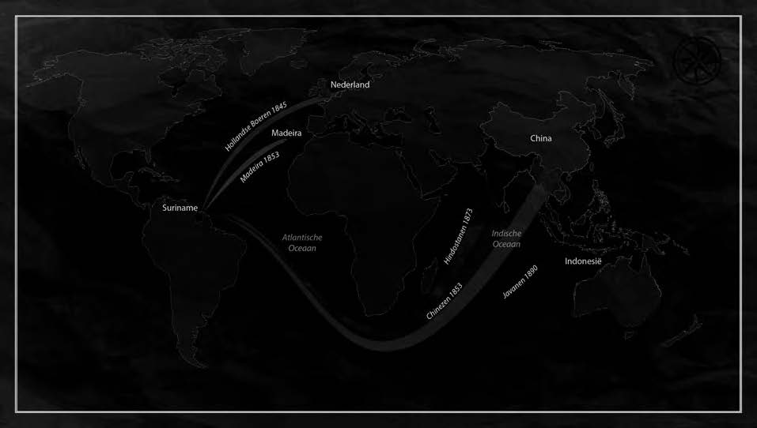
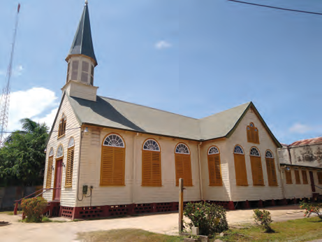
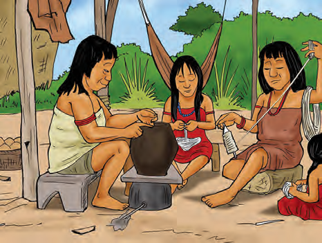
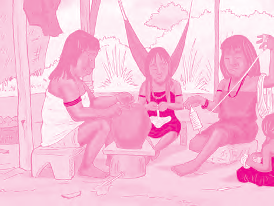

# Verschillende culturen in ons land

## Lección 1: Hoe wij hier ook samenkwamen

---

### Contenido del Libro de Estudiantes

Hoe wij hier ook samenkwamen

In ons land wonen bevolkingsgroepen, die uit verschillende delen van de wereld afkomstig

zijn. In leerjaar 7 is verteld hoe en waarom onze voorouders in Suriname gekomen zijn. De meeste groepen werden naar ons land gebracht om in de landbouw te werken. Met hun komst brachten ze ook allerlei gewoonten en gebruiken mee, zoals hun taal, kleding, godsdienst, muziek, eetgewoonten en de manier waarop ze ziekten behandelen. De gewoonten en gebruiken van een groep of een volk vormen samen hun cultuur. 1

OPDRACHT

• Noem drie bevolkingsgroepen die naar ons land gebracht zijn.

• Wat wordt met cultuur bedoeld?

• Bedenk drie culturele gebruiken die naar ons land gebracht zijn.BIJ AFBEELDING 2

Met de mensen kwam ook hun cultuur naar ons land (immigratie van culturen voor 1900)2

Door de komst van zoveel groepen mensen die allemaal hun eigen cultuur meebrachten zijn er in ons land verschillende culturen. We kunnen zeggen dat ons land een multiculturele samenleving is. Het is onmogelijk om van al deze groepen en al deze culturen alle gebruiken en gewoonten op te noemen. Daarom noemen we alleen een paar voorbeelden. Zelf kan je er vast nog wel meer bedenken.De Inheemsen waren de eerste bewoners van ons land. Als je aan deze bevolkingsgroep denkt, dan denk je bijvoorbeeld aan het planten en verwerken van cassave. Denk ook aan het spinnen en weven van katoen, het pottenbakken van aardewerk zoals kruiken en potten van klei en het barbecotten van vlees en vis.

41

Thema 3 | Les 1 – Hoe wij hier ook samenkwamenLes

---

De Europeanen die naar ons land kwamen om plantages aan te leggen brachten ook hun

gewoonten en gebruiken mee. Sommige heel oude huizen en gebouwen die je in ons land tegenkomt, werden door hen gebouwd. Ze brachten ook de Christelijke godsdienst en onderwijs mee. En de Nederlanders brachten de Nederlandse taal, die in ons land de officiële taal is.

De Afrikaanse slaafgemaakten die naar ons land werden gebracht, namen ook hun eigen

cultuur mee. Hoewel zij vaak geen spullen mee konden nemen op hun reis naar ons land, brachten zij wel hun kennis mee. De muziek en de godsdienst van hun voorouders, de verhalen van Anansi en hun eigen taal. Uit de verschillende Afrikaanse en Europese talen die er in ons land gesproken werden ontstond het Sranan. Met deze taal konden de mensen in ons land met elkaar praten en ook verstaan.

Een oude Christelijke kerk4

Afrikaanse cultuurelementen5

Inheemse vrouwen bezig met het spinnen van katoen3

42

Thema 3 | Les 1 – Hoe wij hier ook samenkwamen

---

Ook de verschillende groepen contractarbeiders die uit landen in Azië naar ons land werden

gebracht namen hun gewoonten en gebruiken mee, waaronder hun godsdiensten zoals het Hindoeïsme en de Islam. Maar ook hun eigen taal, muziek, dans, kleding, eetgewoonten en gerechten kwamen mee. Ook de kennis om rijst in zwampgebieden te planten werd meegebracht uit Azië. En denk bijvoorbeeld ook aan het vuurwerk, het eten en de drakendans van de Chinezen.

De gebouwen, gebruiken en gewoonten van alle bevolkingsgroepen vormen samen het

cultureel erfgoed van ons land.Je vindt het misschien heel normaal, dat zoveel verschillende mensen en culturen vreed-zaam met elkaar samenleven, maar in veel landen is dat anders. Soms ontstaat er tussen groepen mensen met verschillende culturen ook ruzie of oorlog. Onze samenleving is daarom best wel bijzonder en we mogen daar trots op zijn en ook een voorbeeld zijn voor andere landen.Aziatische cultuurelementen6

OM TE ONTHOUDEN

• Verschillende bevolkingsgroepen die naar ons land werden gebracht, namen hun cultuur mee.

• Cultuur wordt gevormd door de gewoonten en gebruiken van een groep.

• Ons land heeft een multiculturele samenleving. Er wonen veel verschillende bevolkingsgroepen en culturen samen.

• Voorbeelden van cultuur zijn taal, godsdienst, kleding, muziek, gebouwen en verhalen.

• De gebouwen, gebruiken en gewoonten van alle bevolkingsgroepen in ons land vormen ons cultureel erfgoed.

43

Thema 3 | Les 1 – Hoe wij hier ook samenkwamen

---

VRAGEN

1. Schrijf het woord cultuur in je schrift.

a. Schrijf daarbij vier woorden die volgens jou bij cultuur horen.

b. Vertel wat de cultuur van een groep wordt genoemd. Gebruik daarbij de vier woorden die je bij a geschreven hebt.

2. Ons land is een multiculturele samenleving. Wat wordt daarmee bedoeld?

3. Kies het juiste antwoord. In ons land wonen verschillende culturen. Dit komt omdat:a. er veel toeristen naar ons land komen.

b. ons land een kolonie was van Nederland.

c. onze voorouders uit verschillende delen van de wereld komen.

d. veel mensen zich vrij in ons land vestigen.

4. De Inheemsen zijn de oorspronkelijke bewoners van ons land. Daarna kwamen er nog andere bevolkingsgroepen naar ons land.Uit welke werelddelen en in welke volgorde kwamen deze groepen?a. Afrika – Azië – Zuid-Amerika

b. Afrika – Europa – Azië

c. Europa – Afrika – Azië

d. Europa – Afrika – Zuid-Amerika

5. De contractarbeiders die uit Azië naar ons land werden gebracht namen ook hun eigen gebruiken en gewoonten mee. a. Schrijf bij de volgende punten een voorbeeld op:• Godsdienst:

• Taal:

• Eten (gerecht):

• Klederdracht:

• Dans:

b. Schrijf ook op bij welke groep het voorbeeld hoort.6. a. Uit welke verschillende talen is het

Sranan ontstaan?

b. Waarom was het Sranan belangrijk voor de slaafgemaakten?

7. Welke bewering is juist?I. De verhalen van Anansi werden al voor de komst van Afrikaanse slaafgemaakten in ons land verteld.

II. Tegenwoordig kennen de meeste bevolkingsgroepen in ons land de verhalen van Anansi.

a. Alleen bewering I is juist.

b. Alleen bewering II is juist.

c. Bewering I en II zijn juist.

d. Bewering I en II zijn onjuist.

8. Bekijk de afbeelding 7.

a. Is dit ook een voorbeeld van cultuur?

b. Uit welk werelddeel komt dit

oorspronkelijk?

9. Waardoor wordt het cultureel erfgoed van ons land gevormd?

10. Kies het juiste antwoord. Ons land kan een voorbeeld zijn voor andere landen, omdat…a. in ons land veel verschillende culturen zijn.

b. in ons land veel verschillende talen gesproken worden.

c. in ons land de mensen van verschillende culturen vriendelijk en in vrede met elkaar leven.

d. in ons land verschillende bevolkingsgroepen wonen.

Chinese drakendans7

44

Thema 3 | Les 1 – Hoe wij hier ook samenkwamen

---

### Imágenes de la Lección

---

### Guía del Profesor - Respuestas y Explicaciones

57

Les

Thema 3 – Verschillende culturen in ons landHoe wij hier ook samenkwamen

VRAGEN EN ANTWOORDEN

1. Schrijf het woord cultuur in je schrift.

a. Schrijf daarbij vier woorden die volgens jou bij cultuur horen.

Antwoord kan verschillen per leerling.

Bijvoorbeeld: taal, klederdracht, voeding en muziek.

b. Vertel wat de cultuur van een groep wordt genoemd. Gebruik daarbij de vier

woorden die je bij a geschreven hebt.

Antwoord kan verschillen per leerling.

Bijvoorbeeld: Verschillende groepen kwamen naar ons land. Daarbij namen ze hun

eigen klederdracht, voeding en muziek mee. Ook spraken ze hun eigen taal. Dit alles

bij elkaar en nog veel meer wordt cultuur genoemd.

2. Ons land is een multicultur ele samenleving. Wat wordt daarmee bedoeld?

Daarmee wordt bedoeld dat er in ons land bevolkingsgroepen met verschillende culturen

wonen en samenleven.

3. Kies het juiste antwoord.

In ons land bestaan verschillende culturen. Dit komt omdat:

a. er veel toeristen naar ons land komen.

b. ons land een kolonie w as van Nederland.

c. onze voorouders uit verschillende delen van de wereld komen.

d. veel mensen zich vrij in ons land vestigen.

4. De Inheemsen zijn de oorspronkelijke bewoners van ons land. Daarna kwamen er nog

andere bevolkingsgroepen naar ons land.

Uit welke werelddelen en in welke volgorde kwamen deze groepen?

a. Afrika – Azië – Zuid-Amerika

b. Afrika – Europa – Azië

c. Europa – Afrika – Azië

d. Europa – Afrika – Zuid-Amerika

5. De contractarbeiders die uit Azië naar ons land werden gebracht namen ook hun eigen

gebruiken en gewoonten mee.

a. Schrijf bij de volgende punten een voorbeeld op:

• Godsdienst: Islam - Javanen

• Taal: Hindi - Hindostanen

• Eten (gerecht): Nasi - Javanen

• Klederdracht: Sari - Hindostanen

• Dans: Drankendans - Chinezen

b. Schrijf ook op bij welke groep het voorbeeld hoort.

De antwoorden van a en b kunnen per leerling verschillen. Hierboven zijn voor -

beelden genoemd.

6. a. Uit w elke verschillende talen is het Sranan ontstaan?

Het Sranan is ontstaan uit verschillende Afrikaanse en Europese talen.

b. Waarom was het Sranan belangrijk voor de slaafgemaakten?

Het Sranan was belangrijk voor de slaafgemaakten, omdat zij middels deze taal met

elkaar konden praten en elkaar ook konden verstaan.1

---

58

Thema 3 – Verschillende culturen in ons land7. Welke bewering is juist?

I. De verhalen van Anansi werden al voor de komst van Afrikaanse slaafgemaakten in

ons land verteld.

II. Tegenwoordig kennen de meeste bevolkingsgroepen in ons land de verhalen van

Anansi.

a. Alleen bewering I is juist.

b. Alleen bewering II is juist.

c. Bewering I en II zijn juist.

d. Bewering I en II zijn onjuist.

8. Bekijk afbeelding 7 (zie leerlingenboek).

a. Is dit ook een v oorbeeld van cultuur?

Ja.

b. Uit w elk werelddeel komt dit oorspronkelijk?

Uit Azië.

9. Waardoor wordt het cultureel erfgoed van ons land gevormd?

Het cultureel erfgoed van ons land wordt gevormd door de gebouwen, gebruiken en

gewoonten van alle bevolkingsgroepen samen.

10. Kies het juiste antwoord.

Ons land kan een voorbeeld zijn voor andere landen, omdat…

a. in ons land v eel verschillende culturen zijn.

b. in ons land v eel verschillende talen gesproken worden.

c. in ons land de mensen van verschillende culturen vriendelijk en in vrede met elkaar leven.

d. in ons land v erschillende bevolkingsgroepen wonen.

---

*Fuente: suriname-history.pdf (estudiantes) y suriname-history-teacher-guide.pdf (profesor)*
