# Verschillende culturen in ons land

## Lección 3: Ons land, een smeltkroes van culturen

---

### Contenido del Libro de Estudiantes

Ons land, een smeltkroes van culturen

Cultuur is niet iets dat steeds hetzelfde hoeft te blijven. In de loop van de tijd kan het

veranderen. Doordat omstandigheden veranderen of als we zaken overnemen van andere culturen. Alle mensen met verschillende culturen, die samen in één land wonen, gaan gebruiken en gewoonten van elkaar overnemen. Hun cultuur verandert daardoor een beetje. Suriname is daar een mooi voorbeeld van. Ons land is een grote smeltkroes van culturen. 3

Smeltkroes van culturen11OPDRACHT

• Wat wordt bedoeld met een smeltkroes?

• Waarom is ons land daar een mooi voorbeeld van?

Een voorbeeld van deze smeltkroes zie je op sommige nationale vrije dagen in ons land. Wij kennen veel vrije dagen die te maken hebben met culturen in ons land. Deze dagen worden niet alleen gevierd door de eigen culturele groep. Ze worden ook nationaal gevierd. Je komt dan ook muziek, lekker eten en culturele kleding van andere culturele groepen tegen. BIJ AFBEELDING 12

Viering van een nationale vrije dag door verschillende culturen12

Kinderen van verschillende bevolkingsgroepen en culturen samen

op school13

De culturen in ons land leren van elkaar en nemen ook zaken van elkaar over. Dit noemt

men culturele uitwisseling. Niet alleen het eten nemen we van elkaar over, maar ook bij muziek, liedjes en dans merk je dit. Ook leren we elkaars taal spreken. Sommige woorden worden zelfs door iedereen gebruikt. Kinderen van verschillende culturen zitten vaak samen op school en daar leren ze ook van elkaar.

48

Thema 3 | Les 3 – Ons land, een smeltkroes van culturenLes

---

Door interesse te hebben voor de cultuur van iemand anders leer je die andere ook beter

begrijpen. Het is ook goed om elkaars cultuur te leren kennen en te respecteren. Het

tegenovergestelde daarvan is dat groepen op elkaar neerkijken. Dat is niet goed voor de eenheid van ons land. Juist door van elkaar te leren kunnen we samen nieuwe ideeën ontwikkelen. Zo kan ons land vooruit gaan.

Muziek is een manier om over cultuur te vertellen en het te leren waarderen. Liedjes en

gedichten worden ook vaker gebruikt om over de eenheid van ons land te schrijven. Een bekend gedicht is dat van de dichter/schrijver Robin Ravales (bekend als Dobru). Hij schreef in 1973 het gedicht Wan bon waarvan je hier enkele regels kan lezen. Met dit

gedicht wilde hij het samenkomen van zoveel verschillende culturen benadrukken.

Wan bonWan bon

Wan bon

someni wiwiri

wan bon.

…

Wan Sranan

someni wiwiri

someni skin

someni tongo

wan pipel.

OPDRACHT

Als dichter gebruikte Robin Ravales een pseudoniem.

• Zoek in een woordenboek op wat een pseudoniem is.

• Wat is het pseudoniem van Robin Ravales?

• Enkele kinderen mogen samen in de klas het gedicht Wan bon voordragen.BIJ AFBEELDING 14Robin Ravales14

OM TE ONTHOUDEN

• Cultuur verandert, het blijft niet altijd hetzelfde.

• Ons land is een smeltkoes van culturen. Er wonen mensen met verschillende culturen, die sommige zaken van elkaar overnemen.

• De verschillende culturele vrije dagen in ons land worden nationaal gevierd.

• Bij culturele uitwisseling leren mensen van verschillende culturen van elkaar.

• Het is goed om elkaars cultuur te leren kennen en te respecteren.

• Robin Ravales, bekend onder zijn pseudoniem Dobru, schreef het gedicht Wan bon.

49

Thema 3 | Les 3 – Ons land, een smeltkroes van culturen

---

VRAGEN

1. Cultuur kan veranderen.

Bedenk een reden waarom mensen soms hun gewoonten veranderen.

2. Zoek het woord smeltkroes op in een woordenboek of op het internet. Schrijf met eigen woorden op wat wordt bedoeld met een smeltkroes van culturen.

3. Hieronder staan twee rijtjes. Neem ze over in je schrift.In het eerste rijtje staan drie nationale vrije dagen. In het tweede rijtje worden vier culturen in ons land genoemd.Trek een lijn tussen de nationale vrije dag en de cultuur die daarbij hoort.

Nationale vrije dagcultuur

Chinees nieuwjaar• •Chinese cultuur

Holi Phagwa • •Europese cultuur

Kerstfeest • •Hindostaanse cultuur

•Inheemse cultuur

4. De nationale vrije dagen die bij vraag 3 zijn genoemd worden ook door andere culturele groepen gevierd. a. Wat vind jij daarvan?

b. Leg ook uit waarom je dat vindt.

5. Hier zie je verschillende gerechten. a. Wat zijn de namen van deze gerechten?

b. Uit welke cultuur komen deze gerechten oorspronkelijk?6. Wat wordt bedoeld met culturele uitwisseling?

7. Op welke manier zorgen radio, televisie en internet ervoor dat culturen veranderen?

8. Jullie komen al heel jong in contact met zaken uit andere culturen, bijvoorbeeld op school. Soms neem je ook iets van een andere cultuur over.Geef een voorbeeld van wat er van elkaar wordt overgenomen.

9. Waarom is het belangrijk om elkaars cultuur te respecteren?

10. Welke bewering over Dobru is niet waar?a. Dobru is een bekende Surinaamse dichter/schrijver.

b. Dobru is een pseudoniem van Robin Ravales.

c. Dobru schreef het gedicht Wan bon.

d. Dobru werd geboren in 1973.

1 3 2 4

50

Thema 3 | Les 3 – Ons land, een smeltkroes van culturen

---

### Imágenes de la Lección

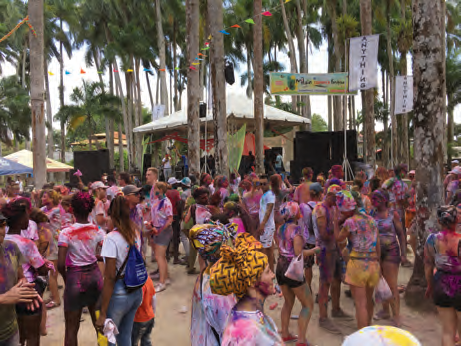

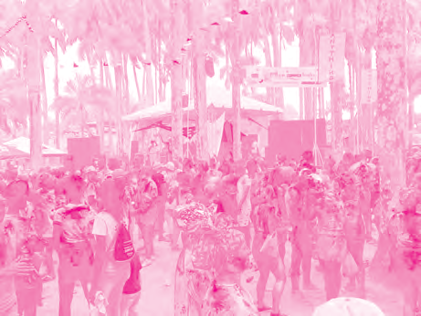

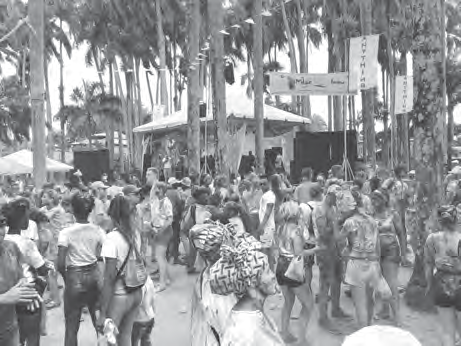

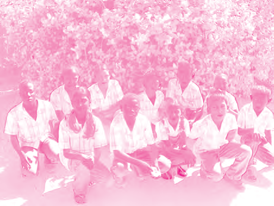

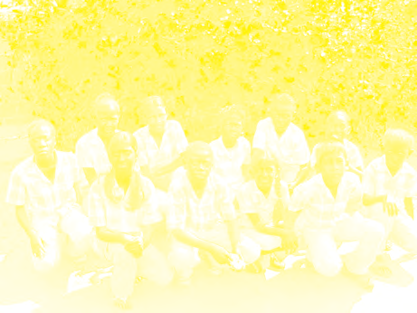

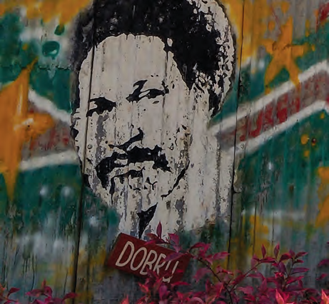

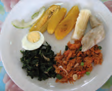

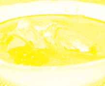

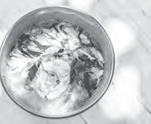

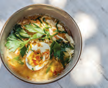

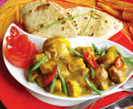

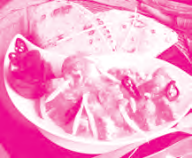

---

### Guía del Profesor - Respuestas y Explicaciones

61

Les

Thema 3 – Verschillende culturen in ons landOns land, een smeltkroes van culturen

VRAGEN EN ANTWOORDEN

1. Cultuur kan veranderen.

Bedenk een reden waarom mensen soms hun gewoonten veranderen.

Het antwoord kan per leerling verschillen.

Cultuur kan veranderen wanneer je bijvoorbeeld bent getrouwd met iemand met een

ander geloof of met een andere culturele achtergrond.

2. Zoek het woord smeltkroes op in een woordenboek of op het internet.

Schrijf met eigen woorden op wat wordt bedoeld met een smeltkroes van culturen.

Onder smeltkroes verstaat men ook wel een mengelmoes van verschillende culturen die

steeds zaken van elkaar overnemen.

3. Hieronder staan twee rijtjes. Neem ze over in je schrift.

In het eerste rijtje staan drie nationale vrije dagen. In het tweede rijtje worden vier

culturen in ons land genoemd.

Trek een lijn tussen de nationale vrije dag en de cultuur die daarbij hoort.

Nationale vrije dag cultuur

Chinees nieuwjaar • •Chinese cultuur

Holi Phagwa • •Europese cultuur

Kerstfeest • •Hindostaanse cultuur

•Inheemse cultuur

4. De nationale vrije dagen die bij vraag 3 zijn genoemd worden ook door andere culturele

groepen gevierd.

a. Wat vind jij daarvan?

b. Leg ook uit waarom je dat vindt.

De antwoorden kunnen per leerling verschillen.

5. Hier zie je verschillende gerechten.

a. Wat zijn de namen van deze gerechten?

Tekening 1 = Peprewatra met cassavebrood

Tekening 2 = saoto

Tekening 3 = roti

Tekening 4 = her’heri

b. Uit w elke cultuur komen deze gerechten oorspronkelijk?

Peprewatra met cassavebrood – Inheems

Saoto – Javaans / Indonesisch

Roti – Hindostaans / Indiaas

Her’heri – Afro-Surinaams

6. Wat wordt bedoeld met culturele uitwisseling?

Hiermee wordt bedoeld dat de verschillende culturen in ons land van elkaar leren en

zaken (zoals gebruiken en gewoonten) van elkaar overnemen.3

---

62

Thema 3 – Verschillende culturen in ons land7. Op w elke manier zorgen radio, televisie en internet ervoor dat culturen veranderen?

Radio- en televisiestations zenden verschillende programma’s uit, die door personen

van verschillende culturen worden beluisterd of bekeken. Zo leren zij ook over andere

culturen en zorgt dit ervoor dat culturen gaan veranderen.

8. Jullie komen al heel jong in c ontact met zaken uit andere culturen, bijvoorbeeld op

school. Soms neem je ook iets van een andere cultuur over.

Geef een voorbeeld van wat er van elkaar wordt overgenomen.

Eten (diverse gerechten) is een van de dingen die het meest van elkaar wordt overge -

nomen.

9. Waarom is het belangrijk om elkaars cultuur te respecteren?

Het is van belang om elkaars cultuur te respecteren, omdat je op die manier veel van

elkaar kunt leren en elkaar respecteert.

10. Welke bewering over Dobru is niet waar?

a. Dobru is een bekende Surinaamse dichter/schrijver.

b. Dobru is een pseudoniem van Robin Ravales.

c. Dobru schreef het gedicht Wan bon.

d. Dobru werd geboren in 1973.

---

*Fuente: suriname-history.pdf (estudiantes) y suriname-history-teacher-guide.pdf (profesor)*
