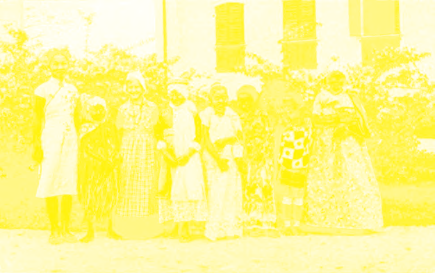
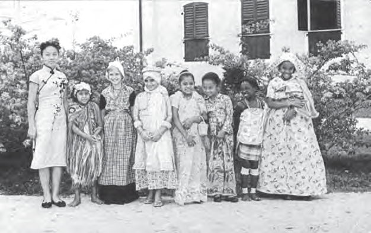

# Verschillende culturen in ons land

## Introducción: Verschillende culturen in ons land

---

### Contenido del Libro de Estudiantes

3THEMAVerschillende culturen

in ons land

Hoe wij hier ook samenkwamen

---

INLEIDING

Groen, rood, geel, zoveel verschillende kleuren en

klederdrachten. Iedereen heeft wat anders aan, maar allemaal even mooi. In dit thema wordt verteld dat er in ons land verschillende bevolkingsgroepen met verschillende culturen wonen. In de eerste les wordt uitgelegd wat met cultuur bedoeld wordt en worden voorbeelden gegeven van de culturen van de bevolkingsgroepen. In les twee leer je dat de bevolking van ons land niet altijd de vrijheid had om de eigen cultuur te beleven. Maar regels en wetten konden het beleven van de eigen cultuur niet tegenhouden. In les drie wordt uitgelegd dat de verschillende culturen in ons land van elkaars cultuur leren en ook overnemen.KERNBEGRIPPEN

• cultuur

• multiculturele samenleving

• cultureel erfgoed

• minderwaardig

• onderdrukt

• Poelepantje

• Johanna Schouten-Elsenhout

• Vrijheid van cultuurbeleving

• culturele vereniging

• smeltkroes

• nationaal

• culturele uitwisseling

• respecteren

• eenheid

• Robin Ravales (pseudoniem: Dobru)

Klederdrachten van verschillende culturen in ons land (circa 1950-1960)1

40

---

### Imágenes de la Lección

---

### Guía del Profesor - Respuestas y Explicaciones

39

Thema 2 – Het onderwijs in ons landALGEMENE INTRODUCTIE OP HET THEMA

Dit thema gaat over het onderwijs in ons land. Hoe het vroeger was en welke veranderingen

en ontwikkelingen er in het onderwijs zijn geweest.

Tegenwoordig gaan bijna alle kinderen in ons land naar school. Maar dat was vroeger

anders. Daarover gaat les 1 en in les 2 wordt uitgelegd dat in 1876 een wet werd ingevoerd,

die de verplichting oplegde kinderen naar school te sturen. Aan de hand van les 3 krijgen de

leerlingen een beeld van de verschillende schooltypen in ons land en het belang van goed

onderwijs.

TIJDSCHEMA

Voor het thema zijn vier weken beschikbaar. Per les is uitgegaan van 3 x 30 minuten (een

week) aan lestijd. Leerlingen lezen de tekst en maken de opdrachten in de klas.

De overige lestijd (week 4) is voor de verwerkingsopdrachten en evaluatie.

AANDACHTSPUNTEN

In ons land zijn er vanaf het midden van de 20e eeuw veel schooltypen en opleidingen

bijgekomen. Het is niet de bedoeling dat de leerlingen al deze schooltypen kennen. De

laatste les in dit thema is slechts een korte kennismaking met de mogelijkheden die er na de

lagere school zijn.

De leerlingen zitten dit schooljaar in leerjaar 8. Het is een goed moment om een klassenge -

sprek te voeren over de verschillende mogelijkheden na de lagere school.

Let wel: De keuze voor een beroepsgerichte school is niet minder dan de wens om naar de

universiteit te gaan. In ons land zijn veel vakbekwame, goed opgeleide mensen nodig.

Bij elke les zijn er mogelijke bijkomende activiteiten uitgewerkt die u voor, tijdens of op het

einde van de les kunt gebruiken indien u dit wenst.

Na elke les worden er 10 vragen (+ antwoorden thema 2) gesteld die individueel of in een

groep beantwoord moeten worden.

LES 1 HOE WAS HET VROEGER?

introductie

U bekijkt samen met de leerlingen de afbeelding bij de inleiding van dit thema. De

inleiding wordt (voor)gelezen of u vertelt waar dit thema over zal gaan.

Uw leerlingen zijn actieve deelnemers aan het lager onderwijs. Vanuit deze invalshoek

zijn er mogelijkheden uit de eigen omgeving die als introductie op het thema gebruikt

kunnen worden. U kunt ook beginnen door de vraag te stellen of onderwijs (leren)

belangrijk is. Ook het leren thuis. Van hieruit kunt u de overstap maken naar Les 1 en het

leven van de Inheemsen in ons land.

activiteit (en)

Deze opdracht wordt aan het begin van de les uitgevoerd. Aan het begin van deze les

geeft u de opdracht om de afbeeldingen uit deze les individueel te bekijken. U geeft de

instructie aan de leerlingen om te bedenken wat de afbeeldingen te maken hebben met

leren en/of met onderwijs volgen. Na deze opdracht wordt de les behandeld. Doordat de

leerlingen eerst individueel de afbeeldingen hebben bekeken, worden ze nieuwsgierig

en stellen ze vragen over de inhoud van deze les. Tijdens de les koppelt u terug naar de

afbeeldingen.

Verwerkingsopdracht 1 kan ook bekeken en gemaakt worden.

Om deze activiteit te beoordelen kunt u de evaluatiewijzer gebruiken. Let op ‘Inhoud

opdracht’ en ‘Luisterhouding’ .

---

40

Thema 2 – Het onderwijs in ons landLES 2 HET ONDERWIJS VERANDERT

introductie

U begint de les met vragen over de vorige les. Stel de leerlingen de vraag of ze kunnen

vertellen hoe het onderwijs vroeger was. En of de school in het begin voor alle kinderen

toegankelijk was.

De leerlingen vertellen dan in het kort wat ze weten uit de vorige les. U vertelt ze

vervolgens dat deze les gaat over de veranderingen in het onderwijs.

activiteit (en)

Aan het einde van deze les kunt u een kort ‘wie ben ik?’-spel met de leerlingen doen. In les

1 is Johannes Vrolijk bij naam genoemd, maar ook de piai en de krioromama zijn bekende

personen. In deze les worden Herman Benjamins en Maria Vlier bij naam genoemd. U

kunt dit spel op twee manieren spelen:

• Bij de eerste variant geeft u een omschrijving van de persoon en moeten de leerlingen

raden wie het is. Zie hiervoor ook verwerkingsopdracht 3.

• Een andere mogelijkheid is dat u een persoon in gedachten neemt. De leerlingen stellen

vragen om erachter te komen wie dat is. U mag slechts ja of nee zeggen. Het spel stopt

als een leerling de persoon geraden heeft. Daarna kan deze leerling een persoon in

gedachten nemen.

LES 3 HOE BELANGRIJK IS GOED ONDERWIJS?

introductie

U kunt de les beginnen met verwerkingsopdracht 4. Bij deze opdracht zijn tekeningen

van mensen die verschillende beroepen uitoefenen. U kunt vragen stellen zoals:

• Welke beroepen herken je?

• Moet je naar school om deze beroepen te leren?

• Weet jij al wat je later wil worden?

Zo kunt u een overstap maken naar de les. Deze les gaat erover dat het belangrijk is om

goed onderwijs te kunnen volgen.

Een andere optie is dat u zelf enkele afbeeldingen van beroepen laat zien en daar de

vragen bij stelt. U kunt verwerkingsopdracht 4 dan bij de evaluatie gebruiken.

activiteit (en)

Aan het begin van les 3 kunt u Verwerkingsopdracht 4 gebruiken. De leerlingen bekijken

de tekeningen waarbij verschillende beroepen uitgebeeld worden. In een klassengesprek

worden deze tekeningen besproken.

Om deze activiteit te beoordelen kunt u de evaluatiewijzer gebruiken. Let op ‘Luisterhouding’ .

Deze les kan ook een aanleiding vormen om te bespreken wat de leerlingen later zelf

willen worden. U kunt ze een korte opdracht geven om iets meer te onderzoeken over het

beroep dat ze later willen uitoefenen.

Om deze activiteit te beoordelen kunt u de evaluatiewijzer gebruiken. Let op ‘Uitwerking

opdracht’ .

Eventueel kan ook een ouder uitgenodigd worden om op school over haar/zijn werk/

beroep te vertellen.

Geef aan dat alle beroepen gelijkwaardig zijn! Doe geen denigrerende uitspraken over

wat kinderen later willen worden.

Om vraag 6 te beoordelen kunt u de evaluatiewijzer gebruiken. Let op ‘Inhoud opdracht’

en ‘Geschiedenis Vaardigheden’ .

---

41

Thema 2 – Het onderwijs in ons landACHTERGRONDINFORMATIE

Algemeen vormend onderwijs: Bij alge -

meen vormend onderwijs moet gedacht

worden aan onderwijs in algemeen

vormende vakken, niet rechtstreeks gericht

op het leren van een beroep. Op de lagere

school of basisschool volgen leerlingen

algemeen vormend onderwijs. In Suriname

kan een leerling na de bassischool naar het

MULO of LBO.

De algemeen vormende studierichting

MULO/VOJ (voortgezet onderwijs op juni-

orenniveau) laat toe na afloop verder te

studeren op VOS-niveau (voortgezet onder -

wijs op seniorenniveau). Het VOS is gesplitst

naar algemeen vormend onderwijs (VWO)

met een studieduur van 3 jaar en hoger

algemeen voortgezet onderwijs (HAVO), dat

2 jaar duurt.

Beroepsgericht onderwijs: Deze vorm

van onderwijs leidt leerlingen op tot een

beroep, afhankelijk van de gekozen studie -

richting. De opleiding biedt naast beroeps-

vormende vakken ook algemeen vormende

vakken, zodat studenten na de voltooiing

van hun opleiding, eventueel verder kunnen

studeren op een hoger niveau.

De beroepsgerichte opleidingen op VOJ

niveau, ook wel bekend als het Lager

Beroepsonderwijs (LBO) in ons land is

onderverdeeld in drie niveaus.

• Het LBO-A is praktisch georiënteerd. Je

doorloopt er A1, A2 en A3. Na LBO-A3

met succes te hebben doorlopen, kan

de leerling met een LBO-A diploma gaan

werken of verder studeren op LBO-B3 of

Avond LBO-B3.

• Het LBO-B is ook praktisch georiën-

teerd. Je krijgt een LBO-B4 diploma als

je vier leerjaren met succes doorloopt.

Vervolgens kan je gaan werken of verder

studeren op LBO-C4 (schakeljaar MBO) of

op de Avondopleiding MBO.

• Het LBO-C-niveau is theoretisch geori-

enteerd. Na vier leerjaren met succes

te hebben doorlopen ontvang je een

LBO-C diploma. Vervolgens kan je verder

studeren op MBO-niveau.Christelijke gemeenten: Eerst was het de

Hervormde Gemeente die zich in Suriname

vestigde in de 17e eeuw. Daarna de Evan-

gelische Broeder Gemeente in 1735 en de

Rooms Katholieke Gemeente in 1785 die

met zendings-en missiewerk begonnen

waar het geven van (godsdienst)onderwijs

een belangrijk onderdeel van was.

Cultuur: Cultuur omvat de taal, gewoonten

en gebruiken van een volk dat woont in

een bepaald gebied. Bij verhuizing naar een

andere woon- of leefomgeving neemt een

volk vaak (een deel van) de cultuur mee.

Godsdienstles: Een schoolvak waarin

kinderen leren over een bepaalde religie.

In de context van de les gaat het om het

Christendom. Tegenwoordig wordt levens-

beschouwelijk onderwijs gegeven over de

religies van de wereld. Hierdoor wordt de

leerlingen geleerd om verschillende stand-

punten en visies op het leven naast elkaar

te zetten zodat ze gaandeweg, eigen keuzes

kunnen maken.

Herman Benjamins: Herman Daniël Benja-

mins werd geboren in Paramaribo op 25

februari 1850. Hij stierf op 23 januari 1933.

Na zijn opleiding tot wis- en natuurkundige

in Nederland, was hij van 1878 tot 1910 als

onderwijsinspecteur verantwoordelijk voor

het gehele onderwijs in ons land. In die rol

propageerde hij het Nederlands als schooltaal.

Aan de christelijke gemeenten die in ons

land onderwijs verzorgden in het Sranan,

schreef hij een brief met de duidelijke

instructie dat het lesgeven voortaan in

het Nederlands moest gebeuren. Het was,

voor de leerlingen en de onderwijzers een

onverwachte grote verandering om over

te stappen van de huistaal, het Sranan,

naar de schooltaal; het Nederlands. Maar

de opdracht van de inspecteur werd opge -

volgd. Soms heel extreem toegepast door

onderwijzers op school, maar ook thuis

verlangden ouders van hun kinderen uitslui -

tend Nederlands te spreken.

Inspecteur Benjamins stimuleerde weliswaar

het Nederlands als schooltaal, maar liet

daarnaast ook het Sranan bestuderen en

vastleggen.

---

*Fuente: suriname-history.pdf (estudiantes) y suriname-history-teacher-guide.pdf (profesor)*
