# Ons land tijdens de Tweede Wereldoorlog

## Lección 1: Oorlog met Duitsland

---

### Contenido del Libro de Estudiantes

Oorlog met Duitsland

Als groepen binnen een land of als twee of meer landen tegen elkaar vechten, dan spreken

we van een oorlog. Als bij een gevecht veel landen (in verschillende werelddelen) betrokken zijn, dan spreekt men van een wereldoorlog. Zulke grote oorlogen komen gelukkig niet vaak voor. Toch zijn er in de 20e eeuw twee wereldoorlogen geweest. We noemen ze de Eerste Wereldoorlog en de Tweede Wereldoorlog.De Tweede Wereldoorlog begon in Europa in 1939. De oorlog eindigde in 1945. Tijdens deze oorlog vochten verschillende Europese landen tegen elkaar. Andere landen raakten ook bij deze oorlog betrokken. De landen kunnen worden verdeeld in twee groepen. Aan de ene kant waren er Duitsland, Italië en Japan. De andere groep bestond uit Engeland, Frankrijk, Noord-Amerika, Rusland en China. Beide groepen kregen steun van andere landen.1

Nederland werd tijdens de Tweede Wereldoorlog bezet door Duitsland. En omdat ons land in die tijd nog een kolonie was van Nederland, was Suriname toen ook in oorlog met Duitsland. Tijdens de oorlogsjaren was het bestuur van ons land in handen van gouverneur Kielstra. Toen Nederland in mei 1940 werd bezet door de Duitsers, werd in ons land de staat van beleg afgekondigd. Hierbij kreeg de gouverneur alle macht. Hij kon in zijn eentje besluiten nemen, zonder dat hij daarvoor toestemming nodig had van anderen.

Militairen in een strijd2

Eén van de beslissingen die gouverneur Kielstra toen nam, was dat Duitsers die in ons land woonden, opgepakt werden en geïnterneerd in een gevangenenkampaan de Copieweg. De meeste Duitsers woonden al langer in ons land en hadden gewone beroepen als onderwijzer of koopman. Plotseling waren ze vijanden.

Gouverneur Kielstra3

55

Thema 4 | Les 1 – Oorlog met DuitslandLes

---

OPDRACHT

• Welke mensen werden in dit kamp

gevangen gezet?

• Waarom werden zij gevangen gezet?

• Wat vind je daarvan?BIJ AFBEELDING 4

OM TE ONTHOUDEN

• Bij een wereldoorlog zijn veel landen in verschillende werelddelen betrokken.

• Tijdens de Tweede Wereldoorlog werd Nederland bezet door Duitsland. Als Nederlandse kolonie was ons land toen ook in oorlog met Duitsland.

• Gouverneur Kielstra kondigde in 1940 de staat van beleg af in Suriname.

• De Duitsers in ons land werden in een gevangenenkamp opgesloten.

• Het Duitse schip, de Goslar, werd door de stuurman tot zinken gebracht in de Surinamerivier. Het wrak ligt daar nu nog.

• In Jodensavanne werden 146 mannen opgesloten. Het waren gevangenen uit de Nederlandse kolonie Oost-Indië. Ze werden verdacht van landverraad en werden heel slecht behandeld.

Kamp aan de Copieweg4

In de haven van Paramaribo lag ook een Duits schip, de Goslar. In september 1939 was dit vrachtschip de Surinamerivier opgevaren, uit vrees voor een aanval op zee. De Duitse bemanning bleef in Suriname. Ook zij werden in mei 1940 opgepakt en opgesloten. De gouverneur gaf opdracht om het schip in beslag te nemen, maar de stuurman van het schip had de avond daarvoor een luik opengezet. Water stroomde het schip binnen en het maakte slagzij; het kantelde. Tot de dag van vandaag ligt het wrak nog in de Surinamerivier. Een deel ervan steekt nog steeds boven het water uit.

In 1942 kwamen in ons land 146 mannen aan uit de Nederlandse kolonie Oost-Indië.

Zij waren daar als landverraders in de gevangenis gezet. Oost-Indië werd in 1942 door Japan bezet en Nederland besloot deze gevangenen naar Suriname over te brengen. De gouverneur ontving geen papieren die konden bewijzen dat deze mannen echt landverraders waren. Maar hij kon ze ook niet zomaar vrij laten. Daarom werd in Jodensavanne een kamp ingericht waar deze mannen werden opgesloten en verplicht waren te werken. Rondom het kamp waren drie rijen prikkeldraad en op elke hoek stond een wachttoren. Pas in juli 1946 werden de overgebleven mannen vrijgelaten en vertrokken ze met een schip naar Nederland.

Het wrak van de Goslar in de Surinamerivier5

56

Thema 4 | Les 1 – Oorlog met Duitsland

---

VRAGEN

1. Wanneer spreken we van een

wereldoorlog?

2. De landen die tijdens de Tweede Wereldoorlog tegen elkaar vochten kunnen verdeeld worden in twee groepen.a. Maak in je schrift twee rijtjes en schrijf in elk rijtje drie van die landen op.

b. Schrijf ook Suriname erbij in het juiste rijtje.

3. Waarom was ons land bij de Tweede Wereldoorlog betrokken?

4. Gouverneur Kielstra kondigde de staat van beleg af. Wat hield deze maatregel in?

5. Waarom liet gouverneur Kielstra Duitsers in ons land oppakken en opsluiten in een gevangenis?

6. Welke bewering is juist?I. De meeste Duitsers in ons land hadden gewone beroepen zoals onderwijzer of koopman.

II. De Duitsers in ons land werden opgepakt omdat Nederland was bezet door Duitsland en Suriname daardoor ook in oorlog geraakte met Duitsland.

A. Alleen bewering I is juist.

B.Alleen bewering II is juist.

C. Bewering I en II zijn juist.

D.Bewering I en II zijn onjuist.7. Bekijk de foto hierna.

a. Uit welk land kwam dit schip?

b. Hoe heet dit schip?

c. In welke rivier ligt het wrak?

8. Vertel hoe het schip op de foto bij vraag

7 tot zinken is gebracht.

9. Leg uit waarom Nederland in 1942 gevangenen van Oost-Indië naar ons land liet overbrengen.

10. Zoek het woord landverrader op in je woordenboek of op het internet. Vertel met eigen woorden wie een landverrader wordt genoemd.

Scheepswrak6

57

Thema 4 | Les 1 – Oorlog met Duitsland

---

### Imágenes de la Lección

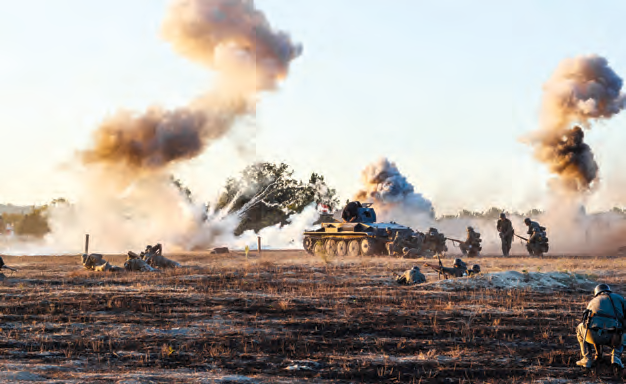

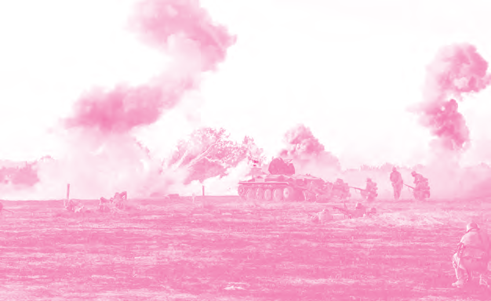

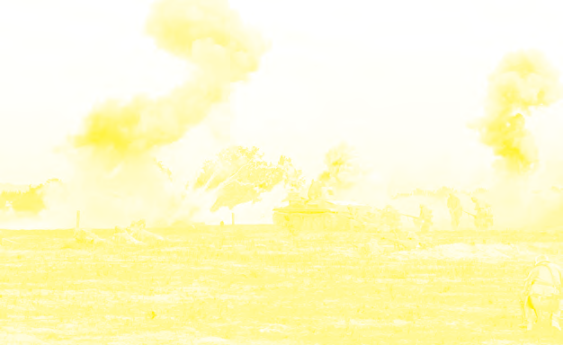

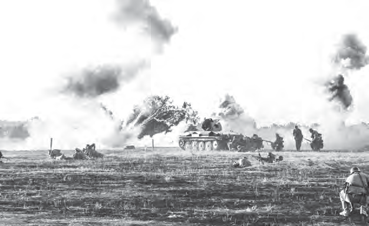

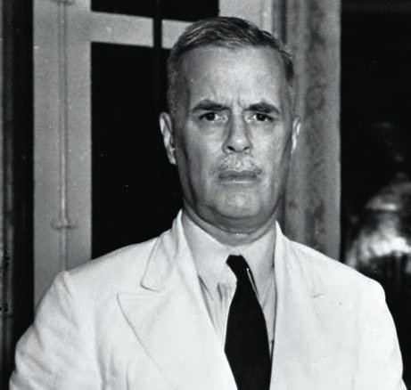

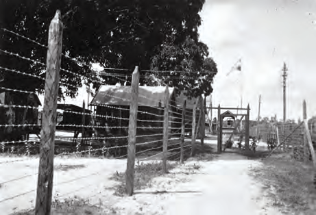

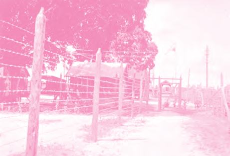

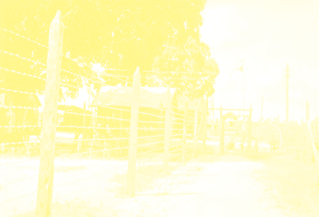

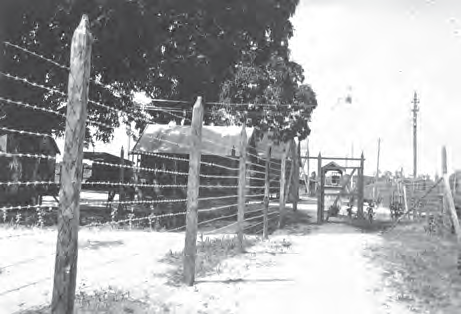

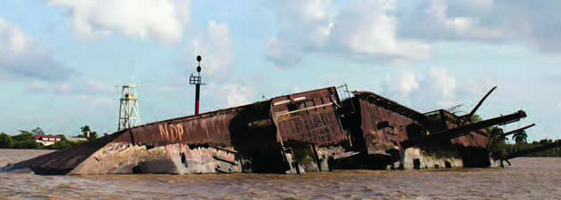

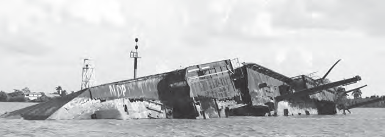

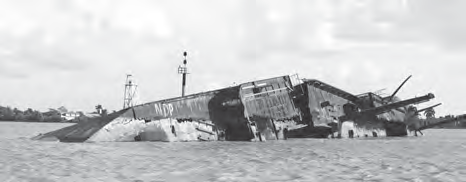

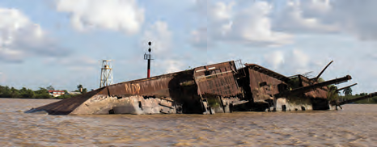

---

### Guía del Profesor - Respuestas y Explicaciones

76

Les

Thema 4 – Ons land tijdens de Tweede Wereldoorlog Oorlog met Duitsland

VRAGEN EN ANTWOORDEN

1. Wanneer spreken we van een wereldoorlog?

We spreken van een wereldoorlog wanneer landen uit verschillende werelddelen

betrokken zijn bij een gevecht.

2. De landen die tijdens de Tweede Wereldoorlog tegen elkaar vochten kunnen verdeeld

worden in twee groepen.

a. Maak in je schrift twee rijtjes en schrijf in elk rijtje drie van die landen op.

Duitsland Engeland

Italië Frankrijk

Japan Rusland

* Suriname

b. Schrijf ook Suriname erbij in het juiste rijtje.

Zie * in de tabel bij vraag 2. a.

3. Waarom was ons land bij de Tweede Wereldoorlog betrokken?

Ons land was bij de Tweede Wereldoorlog betrokken, omdat ons land toen nog een

kolonie was van Nederland en Nederland werd tijdens de Tweede Wereldoorlog bezet

door Duitsland.

4. Gouverneur Kielstra kondigde de staat van beleg af. Wat hield deze maatregel in?

Bij de staat van beleg kreeg de gouverneur alle macht in handen, waardoor hij in zijn

eentje besluiten kon nemen, zonder dat hij daarvoor toestemming nodig had van

anderen.

5. Waarom liet gouverneur Kielstra Duitsers in ons land oppakken en opsluiten in een

gevangenis?

Gouverneur Kielstra liet Duitsers in ons land oppakken en opsluiten, omdat hij hen als

vijanden beschouwde toen Nederland werd bezet door de Duitsers.

6. Welke bewering is juist?

I. De meeste Duitsers in ons land hadden gewone beroepen zoals onderwijzer of

koopman.

II. De Duitsers in ons land werden opgepakt omdat Nederland was bezet door Duits -

land en Suriname daardoor ook in oorlog geraakte met Duitsland.

a. Alleen bewering I is juist.

b. Alleen bewering II is juist.

c. Bewering I en II zijn juist.

d. Bewering I en II zijn onjuist.1

---

77

Thema 4 – Ons land tijdens de Tweede Wereldoorlog 7. Bekijk de foto hierna (zie afbeelding 6 leerlingenboek).

a. Uit w elk land kwam dit schip?

Het schip kwam uit Duitsland.

b. Hoe heet dit schip?

Goslar

c. In welke rivier ligt het wrak?

De Surinamerivier

8. Vertel hoe het schip op de foto bij vraag 7 tot zinken is gebracht.

De stuurman van het schip had een luik opengezet, waardoor water binnenstroomde.

(Het schip is op haar zij gekanteld.)

9. Leg uit waarom Nederland in 1942 gevangenen van Oost-Indië naar ons land liet over -

brengen.

Nederland liet de gevangenen naar Suriname overbrengen omdat de Nederlandse

kolonie Oost-Indië door Japan bezet werd. De mannen waren gevangengenomen omdat

ze ervan werden verdacht landverraders te zijn.

10. Zoek het woord landverrader op in je woordenboek of op het internet. Vertel met eigen

woorden wie een landverrader wordt genoemd.

Een landverrader is iemand die geheime informatie van zijn land doorgeeft aan de

vijand.

Het antwoord kan per leerling verschillen.

---

*Fuente: suriname-history.pdf (estudiantes) y suriname-history-teacher-guide.pdf (profesor)*
