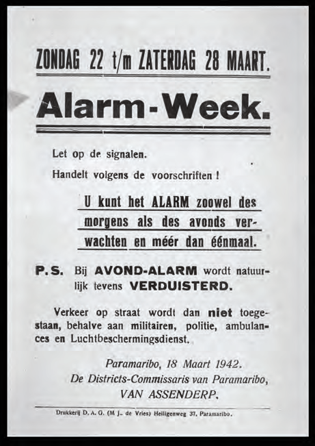
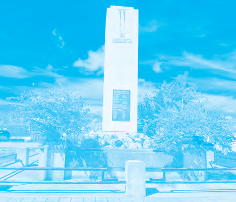
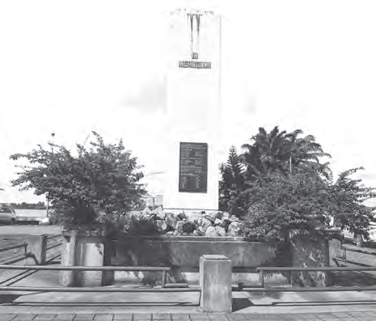
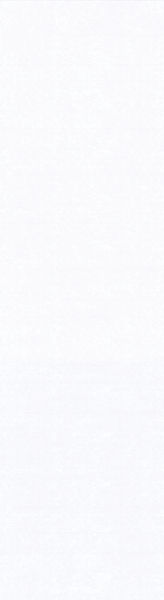

# Ons land tijdens de Tweede Wereldoorlog

## Lección 2: De veiligheid in ons land

---

### Contenido del Libro de Estudiantes

De veiligheid in ons land

Gouverneur Kielstra sloot de mogelijkheid niet uit dat ons land kon worden aangevallen

door de Duitsers. Met vliegtuigen konden zij bijvoorbeeld bommen laten vallen. De gouverneur gaf opdracht tot verduistering, dat wil zeggen dat er vanaf zeven uur ’s avonds

tot zeven uur ’s morgens nergens licht mocht branden. Voor de ramen moesten donkere gordijnen hangen. Mensen die nog op straat waren mochten geen lamp aandoen. Alleen de maan gaf licht. 2

Mededeling over de verduistering en het luchtalarm7Er werden ook schuilkelders aangelegd, die werden gebruikt als schuilplaats bij een luchtaanval. Er werden oefeningen gehouden met een luchtalarm, waarbij er een sirene afging en mensen zo snel als ze konden naar de schuilkelders moesten gaan.

OPDRACHT

• Wat wordt bedoeld met verduistering?

• Wat wordt bedoeld met luchtalarm?

• Waarom werden er alarm-oefeningen gehouden?BIJ AFBEELDING 7

In ons land waren er Nederlandse soldaten van het koloniale leger. Ze werden ook wel de Troepenmacht in Suriname (TRIS) genoemd. In 1939 werd als aanvulling van het koloniale leger de Schutterij opgericht. In het begin konden Surinaamse mannen en vrouwen zich vrijwillig opgeven om deel te nemen aan de Schutterij. Maar in 1942 werd ook in ons land de dienstplicht ingevoerd. Mannen van 18 tot 43 jaar werden opgeroepen voor de Schutterij. Niet iedereen reageerde op de oproep en ongeveer 30 procent van de mensen werd afgekeurd. Toch steeg het aantal soldaten in de Schutterij tot vijfduizend.

Manschappen van de Surinaamse Schutterij8

58

Thema 4 | Les 2 – De veiligheid in ons landLes

---

Er was ook nog altijd een vrijwilligerskorps

binnen de Schutterij. Zo was er het Korps Stads- en Landwachten en het Vrouwen Vrijwilligerskorps. De vrouwen hadden meer ondersteunende taken, maar ook zij kregen schietles en militaire training. Tijdens de Tweede Wereldoorlog hebben ook ongeveer 450 Surinaamse vrijwilligers actief deelgenomen aan de strijd. Ter herdenking aan de deelname van Suriname aan de Tweede Wereldoorlog is aan de Waterkant in Paramaribo een oorlogsmonument geplaatst. Elk jaar wordt bij dit monument een krans gelegd.

Ons land heeft Nederland ook op andere manieren gesteund tijdens de oorlog. Er werd

bijvoorbeeld geld ingezameld om een gevechtsvliegtuig te kopen. Dit staat bekend als het Spitfire-fonds. Aan schoolkinderen werd gevraagd om iedere maandag een cent mee te brengen naar school. Er werd zelfs een liedje bij gezongen

Het fonds bracht in 1941 een bedrag van 38.000 gulden bijeen voor de aankoop van een

Spitfire gevechtsvliegtuig. Voor die tijd was dat veel geld. Het gekochte vliegtuig kreeg als naam “Suriname” .

OM TE ONTHOUDEN

• Er werden maatregelen genomen tegen een mogelijke luchtaanval door de Duitsers. ’s Avonds mochten er geen lichten branden en er waren schuilkelders en luchtalarmoefeningen.

• In ons land was de TRIS, de Nederlandse Troepenmacht in Suriname. In 1939 werd ook de Surinaamse Schutterij opgericht.

• In 1942 werd in ons land de dienstplicht ingevoerd. Mannen van 18 tot 43 jaar werden opgeroepen voor de Schutterij.

• Er was ook een vrijwilligerskorps. Hierin namen zowel mannen als vrouwen deel.

• In Paramaribo, aan de Waterkant staat een oorlogsmonument ter herdenking aan de deelname van Suriname aan de Tweede Wereldoorlog.

• Ons land zamelde ook geld in voor het Spitfire-fonds om een gevechtsvliegtuig voor Nederland te kopen.

“Kinderen vergeet je maandagcentje niet

Kinderen vergeet het maar niet

Wat er gebeurt of wat er geschiedt

Kinderen vergeet je maandagcentje niet.”

Het oorlogsmonument aan de Waterkant9

59

Thema 4 | Les 2 – De veiligheid in ons land

---

VRAGEN

1. Gouverneur Kielstra sloot de

mogelijkheid van een luchtaanval op ons land niet uit. Daarom werden maatregelen getroffen. Welke hoort er niet bij?

A. Aanleggen van schuilkelders

B.Inleveren van lampen

C. Oefeningen met luchtalarm

D.Opdracht tot verduisteren

2. Leg uit wat de maatregel tot verduistering inhield. Leg ook uit waarom die maatregel er was.

3. a. Wie beschermt het land en de

burgers tijdens een oorlog?

b. Moet een land beschermd worden? Vertel ook waarom je dat zegt.

4. Welke bewering is juist?I. In 1939 werd in ons land de Schutterij opgericht.

II. Surinaamse mannen en vrouwen waren verplicht om in dienst te treden van de Schutterij.

A. Alleen bewering I is juist.

B.Alleen bewering II is juist.

C. Bewering I en II zijn juist.

D.Bewering I en II zijn onjuist.

5. Zijn de volgende beweringen waar of niet waar? Leg ook uit waarom je dat zegt.a. Bij dienstplicht zijn mensen verplicht om in het leger te dienen.

b. Vrijwillig in het leger dienstnemen is het tegenovergestelde van dienstplicht.

c. Vrouwen hadden geen dienstplicht. Zij mochten niet in het leger dienen. 6. Bekijk afbeelding 9 nog eens.a. Welk monument is te zien?

b. Waaraan herinnert dit monument ons?

c. Waar staat dit monument?

7. Leg uit waarvoor het Spitfire-fonds was?

8. Waarvoor worden gevechtsvliegtuigen tijdens een oorlog gebruikt?

9. Neem de volgende jaartallen over in je schrift. Wat gebeurde er in ons land in die jaren tijdens de Tweede Wereldoorlog? Kies uit het tweede rijtje en schrijf het achter het juiste jaartal.

1939 • •bouw oorlogsmonument

1941 • •invoering dienstplicht

1942 • •inzameling Spitfire-fonds

•oprichting Schutterij

10. Kies het juiste antwoord.De Tweede Wereldoorlog vond plaats in de …

A. eerste helft van de 19e eeuw.

B.tweede helft van de 19e eeuw.

C. eerste helft van de 20e eeuw.

D.tweede helft van de 20e eeuw.

60

Thema 4 | Les 2 – De veiligheid in ons land

---

### Imágenes de la Lección

---

### Guía del Profesor - Respuestas y Explicaciones

78

Les

Thema 4 – Ons land tijdens de Tweede Wereldoorlog De veiligheid in ons land

VRAGEN EN ANTWOORDEN

1. Gouverneur Kielstra sloot de mogelijkheid van een luchtaanval op ons land niet uit.

Daarom werden maatregelen getroffen. Welke hoort er niet bij?

a. Bouwen van schuilkelders

b. Inleveren van lampen

c. Oefeningen met luchtalarm

d. Opdr acht tot verduisteren

2. Leg uit wat de maatregel tot verduistering inhield. Leg ook uit waarom die maatregel er

was.

In de avond mocht er geen licht aan, zodat de Duitse vliegtuigen niet konden zien waar

ze bommen konden laten vallen.

3. a. Wie beschermt het land en de burgers tijdens een oorlog?

Tijdens een oorlog worden het land en de burgers beschermd door het leger.

b. Moet een land beschermd worden? Vertel ook waarom je dat zegt.

Ja, een land moet beschermd worden. Uitleg kan per leerling verschillen.

4. Welke bewering is juist?

I. In 1939 werd in ons land de Schutterij opgericht.

II. Surinaamse mannen en vrouwen waren verplicht om in dienst te treden van de

Schutterij.

a. Alleen bewering I is juist.

b. Alleen bewering II is juist.

c. Bewering I en II zijn juist.

d. Bewering I en II zijn onjuist.

5. Zijn de v olgende beweringen waar of niet waar? Leg ook uit waarom je dat zegt.

a. Bij dienstplich t zijn mensen verplicht om in het leger te dienen.

Waar. Mannen van 18 tot 43 jaar werden opgeroepen voor de Schutterij.

b. Vrijwillig in het leger dienstnemen is het tegenovergestelde van dienstplicht.

Waar, vrijwillig is het tegenovergestelde van verplicht.

c. Vrouwen hadden geen dienstplicht. Zij mochten niet in het leger dienen.

Niet waar, de vrouwen hadden geen dienstplicht, maar namen wel deel in het vrijwil-

ligerskorps.

6. Bekijk afbeelding 9 nog eens.

a. Welk monument is te zien?

Het oorlogsmonument.

b. Waaraan herinnert dit monument ons?

Het herinnert ons aan de Tweede Wereldoorlog.

c. Waar staat dit monument?

Dit monument staat aan de Waterkant.2

---

79

Thema 4 – Ons land tijdens de Tweede Wereldoorlog 7. Leg uit waarvoor het Spitfire-fonds was?

Het Spitfire-fonds was voor het inzamelen van geld voor het kopen van een gevechts -

vliegtuig voor Nederland.

8. Waarvoor worden gevechtsvliegtuigen tijdens een oorlog gebruikt?

Deze worden gebruikt om bommen te werpen op gebieden van de vijanden.

9. Neem de v olgende jaartallen over in je schrift. Wat gebeurde er in ons land in die jaren

tijdens de Tweede Wereldoorlog?

Kies uit het tweede rijtje en schrijf het achter het juiste jaartal.

1939 • •bouw oorlogsmonument

1941 • •invoering dienstplicht

1942 • •inzameling Spitfire-fonds

•oprichting Schutterij

10. Kies het juiste antwoord.

De Tweede Wereldoorlog vond plaats in de …

a. eerst e helft van de 19e eeuw.

b. tweede helft van de 19e eeuw.

c. eerste helft van de 20e eeuw.

d. tweede helft van de 20e eeuw.

---

*Fuente: suriname-history.pdf (estudiantes) y suriname-history-teacher-guide.pdf (profesor)*
