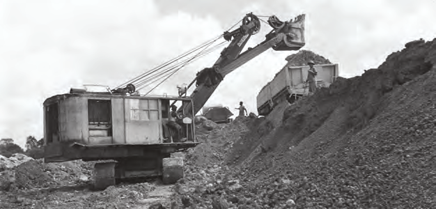
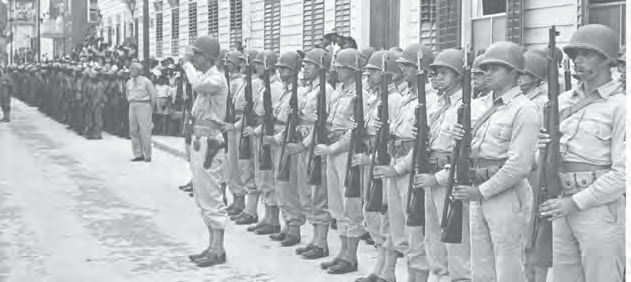

# Ons land tijdens de Tweede Wereldoorlog

## Lección 3: De bauxietindustrie in ons land

---

### Contenido del Libro de Estudiantes

De bauxietindustrie in ons land

Als gevolg van de oorlog kon ons land geen producten importeren uit Europa. Er ontstond

een schaarste aan sommige producten en de prijzen gingen omhoog. Vooral in Paramaribo merkte de bevolking dat. Zij konden de duur geworden spullen niet meer kopen. Ook moesten zij vaak in lange rijen wachten.Toch had de schaarste ook een positieve kant. De eigen productie in het land nam toe. De kleinlandbouwers konden hun producten op de markt brengen. Kleine bedrijfjes als schoenmakers, kleermakers en limonadefabriekjes werden opgericht.

OPDRACHT

• Waarom stonden de mensen in rijen voor de winkels?

• Welke goederen waren schaars denk je?

Tijdens de Tweede Wereldoorlog groeide ook de bauxietindustrie in ons land. Bauxiet werd een belangrijk exportproduct van Suriname. Van bauxiet wordt aluminium gemaakt. En aluminium wordt onder meer gebruikt voor de bouw van vliegtuigen. De meeste Amerikaanse oorlogsvliegtuigen werden tijdens de Tweede Wereldoorlog gemaakt van Surinaamse bauxiet. Omdat onze bauxiet zo belangrijk was voor de Amerikanen, werd in Paranam, Onverdacht en Moengo dag en nacht gewerkt om bauxiet uit de grond te halen. Met de verkoop van bauxiet verdiende ons land veel geld. Ook was er werk voor veel arbeiders.3

Omdat er in ons land veel bauxiet was, dat belangrijk was voor de bouw van oorlogsvliegtuigen, was er ook een risico. Ons land zou aangevallen kunnen worden. Vooral ook, omdat de verdediging van ons land niet zo best was. De president van de Verenigde Staten van Amerika deed het voorstel aan Nederland om Amerikaanse troepen naar

Suriname te sturen. Zij konden de verdediging van ons land op zich nemen. Nederland kon zelf niet genoeg soldaten sturen naar ons land. Zij konden het aanbod moeilijk weigeren.

Het ontginnen van bauxiet 10

Amerikaanse soldaten in ons land11

61

Thema 4 | Les 3 – De bauxietindustrie in ons landLes

---

De eerste Amerikaanse troepen kwamen in november 1941 aan op het vliegveld Zanderij.

Zij hadden van de Nederlandse regering toestemming gekregen om op het vliegveld een

militaire basis aan te leggen. Het vliegveld werd gebruikt voor tussenlandingen naar

bijvoorbeeld Afrika. Tijdens de Tweede Wereldoorlog werd Zanderij door de Amerikaanse soldaten uitgebreid met verharde start- en landingsbanen. Zij bouwden ook de weg van Onverwacht naar Zanderij. In 1947 vertrokken de laatste Amerikaanse soldaten uit ons land en werd het vliegveld officieel weer aan Suriname overgedragen.

OM TE ONTHOUDEN

• Tijdens de Tweede Wereldoorlog was er in ons land een schaarste aan sommige producten en de eigen productie groeide.

• Bauxiet werd een belangrijk exportproduct, waardoor de bauxietindustrie in ons land groeide.

• Van bauxiet wordt aluminium gemaakt. Aluminium wordt onder andere gebruikt bij de bouw van vliegtuigen.

• Amerikaanse soldaten kwamen naar ons land om de bauxietmijnen en ons land te beschermen.

• Vliegveld Zanderij werd een militaire basis en het vliegveld werd uitgebreid.

Vliegveld Zanderij was tijdens de oorlog een militaire basis12

62

Thema 4 | Les 3 – De bauxietindustrie in ons land

---

VRAGEN

1. Waarom was er in ons land tijdens de

Tweede Wereldoorlog schaarste aan sommige producten?

2. Noem twee gevolgen van de schaarste: een vervelend gevolg en een positief gevolg.

3. Welk product wordt uit bauxiet gemaakt en gebruikt voor de bouw van vliegtuigen?

4. Waarom nam de export van bauxiet toe tijdens de Tweede Wereldoorlog?

5. Welk antwoord is niet juist?Er werd dag en nacht gewerkt om bauxiet uit de grond te halen, want ...

A. bauxiet leverde veel geld op voor ons land.

B.bauxiet was belangrijk voor de bouw van gevechtsvliegtuigen.

C. er waren in die tijd nog geen graafmachines om bauxiet te graven.

D.er waren veel arbeiders om het werk te doen.6. Op welke drie plaatsen werd in die periode bauxiet gewonnen in ons land?

7. Kies het juiste antwoord.Tijdens de Tweede Wereldoorlog kwamen Amerikaanse soldaten naar ons land, om …

A. de bauxietmijnen te beschermen.

B.militaire posten te herstellen.

C. schuilkelders voor het volk te bouwen.

D.Surinaamse soldaten te trainen.

8. Leg uit wat wordt bedoeld met een militaire basis.

9. Vertel hoe de Amerikaanse soldaten het vliegveld Zanderij uitgebreid hebben en beter bereikbaar hebben gemaakt.

10. Reken uit hoeveel jaren de Amerikaanse soldaten in ons land zijn gebleven.

63

Thema 4 | Les 3 – De bauxietindustrie in ons land

---

### Imágenes de la Lección

---

### Guía del Profesor - Respuestas y Explicaciones

80

Les

Thema 4 – Ons land tijdens de Tweede Wereldoorlog De bauxietindustrie in ons land

VRAGEN EN ANTWOORDEN

1. Waarom was er in ons land tijdens de Tweede Wereldoorlog schaarste aan sommige

producten?

Er was schaarste aan sommige producten in ons land, omdat wij geen producten konden

importeren uit Europa.

2. Noem t wee gevolgen van de schaarste: een vervelend gevolg en een positief gevolg.

Een vervelend gevolg: de prijzen gaan omhoog en er ontstaan lange rijen om producten

aan te schaffen.

Een positief gevolg: eigen productie in het land neemt toe. Mensen gaan zelf planten en

kweken.

3. Welk product wordt uit bauxiet gemaakt en gebruikt voor de bouw van vliegtuigen?

Aluminium wordt gemaakt uit bauxiet en gebruikt bij de bouw van vliegtuigen.

4. Waarom nam de export van bauxiet toe tijdens de Tweede Wereldoorlog?

De export nam toe omdat er aluminium wordt gemaakt uit bauxiet dat vervolgens wordt

gebruikt voor het bouwen van vliegtuigen. De meeste Amerikaanse vliegtuigen zijn

gemaakt van Surinaamse bauxiet.

5. Welk antwoord is niet juist?

Er werd dag en nacht gewerkt om bauxiet uit de grond te halen, want …

a. bauxiet lev erde veel geld op voor ons land.

b. bauxiet w as belangrijk voor de bouw van gevechtsvliegtuigen.

c. er waren in die tijd nog geen graafmachines om bauxiet te graven.

d. er w aren veel arbeiders om het werk te doen.

6. Op w elke drie plaatsen werd in die periode bauxiet gewonnen in ons land?

Bauxiet werd gewonnen in Paranam, Moengo en Onverdacht.

7. Kies het juiste antwoord.

Tijdens de Tweede Wereldoorlog kwamen Amerikaanse soldaten naar ons land, om …

a. de bauxietmijnen te beschermen.

b. militair e posten te herstellen.

c. schuilkelders v oor het volk te bouwen.

d. Surinaamse soldaten te trainen.

8. Leg uit wat wordt bedoeld met een militaire basis.

Met een militaire basis worden gebouwde accommodaties op een bepaalde plek bedoeld

waar militairen kunnen verblijven.

9. Vertel hoe de Amerikaanse soldaten het vliegveld Zanderij uitgebreid hebben en beter

bereikbaar hebben gemaakt.

Het vliegveld werd uitgebreid met verharde start- en landingsbanen. Ze bouwden ook de

weg van Onverwacht naar Zanderij om het beter bereikbaar te maken.

10. Reken uit hoeveel jaren de Amerikaanse soldaten in ons land zijn gebleven.

De Amerikaanse soldaten zijn 6 jaren in ons land gebleven (1941-1947).3

---

81

Verwerkingsopdrachten1. Hieronder zijn vijf antwoorden gegeven. In groepjes bedenken jullie bij deze

antwoorden vijf vragen.

Daarna kunnen jullie de vragen met andere groepjes uitwisselen. Kijk of jullie het juiste

antwoord bij de vraag kunnen vinden.

1. wereldoorlog

2. gouv erneur Kielstra

3. gevangenenkamp Copieweg

4. het wr ak van de Goslar

5. Jodensavanne

De 5 vragen per antwoord zullen verschillen per groep.

2. Bespreek met elkaar of jullie vinden dat het wrak van de Goslar een oorlogsmonument is.

• Vind je dat het als herdenking moet blijven liggen of dat het uit de rivier verwijderd

zou moeten worden?

• Als het verwijderd moet worden, welk land moet dat volgens jou doen en waarom?

De antwoorden kunnen per leerling verschillen.

3. In groepjes schrijven jullie een kort opstel van 150 woorden over ons land tijdens de

Tweede Wereldoorlog. Informatie kan je aan je (groot)ouders of een ander familielid of

volwassene vragen. Je kan ook informatie op het internet opzoeken.

Gebruik één of meer van de volgende woorden in het opstel:

• Duitsers

• gevangenenkamp

• verduistering

• luchtalarm

• dienstplicht

• schaarste

• bauxiet

De opdracht zal per leerling verschillen.

4. Klassikaal een tekstcollage maken.

In tweetallen schrijven jullie een uitspraak (uit de lessen), over de Tweede Wereldoorlog

en ons land op een blaadje. Schrijf iets op dat je uit de lessen hebt onthouden, dat je

interessant vond of voor jou belangrijk is. Deze uitspraken worden op een groot vel

papier bij elkaar geplakt.

Het antwoord zal per leerling verschillen.

Een voorbeeld van zo een tekstcollage ziet er als volgt uit.

Bij een wereldoorlog zijn

veel landen betrokken. In 1940 werd Nederland

bezet door Duitsland.Onze bauxiet was belang -

rijk voor de bouw van

Amerikaanse gevechts -

vliegtuigen.De Goslar is nog steeds te

zien.Duitsers in ons land werden

gevangen gezet.

De Surinaamse Schutterij werd opgericht. Tweede Wereldoorlog van

1939 tot 1945.

Vliegveld Zanderij was een

militaire basis.In Jodensavanne was een

gevangenenkamp.Oorlogsmonument aan de

Waterkant.VERWERKINGSOPDRACHTEN

---

*Fuente: suriname-history.pdf (estudiantes) y suriname-history-teacher-guide.pdf (profesor)*
