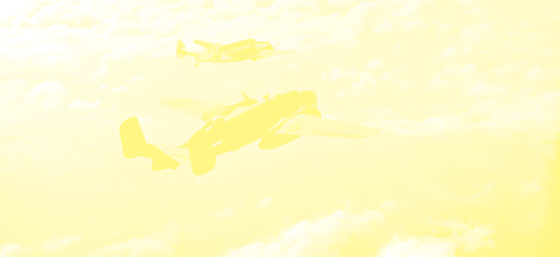
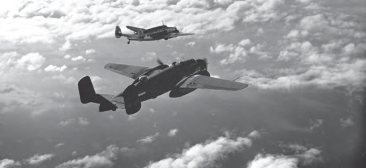

# Ons land tijdens de Tweede Wereldoorlog

## Introducción: Ons land tijdens de Tweede Wereldoorlog

---

### Contenido del Libro de Estudiantes

4Ons land tijdens de

Tweede Wereldoorlog THEMA

---

INLEIDING

Vliegtuigen en bommen. Duikboten en luchtalarm. Een

oorlog is geen fijne tijd. Soldaten van verschillende landen vechten tegen elkaar en het dagelijkse leven is anders. Dit thema gaat over de Tweede Wereldoorlog en hoe het tijdens deze oorlog in ons land was. In de eerste les wordt verteld dat ook ons land bij de oorlog betrokken raakte. In les 2 leer je welke maatregelen werden getroffen voor de veiligheid van ons land. De bauxiet die in ons land werd ontgonnen was heel belangrijk voor de bouw van gevechtsvliegtuigen. Hierover wordt in de laatste les meer verteld.KERNBEGRIPPEN

• wereldoorlog

• bezet

• gouverneur Kielstra

• staat van beleg

• interneren

• gevangenenkamp

• Goslar

• landverraders

• verduistering

• schuilkelders

• luchtalarm

• TRIS

• Schutterij

• dienstplicht

• vrijwilligerskorps

• oorlogsmonument

• Spitfire-fonds

• schaarste

• bauxietindustrie

• Amerikaanse troepen

• vliegveld Zanderij

• militaire basis

Amerikaanse gevechtsvliegtuigen1

54

---

### Imágenes de la Lección

---

### Guía del Profesor - Respuestas y Explicaciones

53

Thema 3 – Verschillende culturen in ons landALGEMENE INTRODUCTIE OP HET THEMA

Dit thema behandelt het multiculturele aspect van onze samenleving. De introductie van

het thema hangt af van de klassensituatie.

Het kan zijn dat u lesgeeft aan een klas waar leerlingen van veel verschillende culturen bij

elkaar zitten. In dit geval kunt u de samenstelling van uw klas als uitgangspunt nemen voor

de multiculturele samenleving van ons land en hoe wij hier allemaal zijn samengekomen.

U kunt bijvoorbeeld vragen aan de leerlingen in de klas om in hun thuistaal “Ik houd van je”

te zeggen.

Geeft u les aan een klas waarin overwegend leerlingen van één cultuur aanwezig zijn, dan

zal de introductie anders zijn. U kunt dan bijvoorbeeld gebruik maken van afbeeldingen 1

en 2 en eerst de verschillende bevolkingsgroepen bespreken, die in ons land wonen en hoe

zij hier gekomen zijn.

TIJDSCHEMA

Voor het thema zijn vier weken beschikbaar. Per les is uitgegaan van 3 x 30 minuten (een

week) aan lestijd. Leerlingen lezen de tekst en maken de opdrachten in de klas.

De overige lestijd (week 4) is voor de verwerkingsopdrachten en evaluatie.

AANDACHTSPUNTEN

Cultuur is een belangrijk onderwerp in onze multiculturele samenleving. Door te praten

over de eigen cultuur en ook die van anderen, leren leerlingen elkaars cultuur kennen en

respecteren. Kennis van en respect voor elkaars cultuur is erg belangrijk in onze samenle -

ving. Het heeft invloed op ons denken en doen en het helpt onze identiteit te vormen.

Houd in gedachten dat het doel van dit thema niet alleen het bijbrengen van de achter -

grond van onze multiculturele samenleving is. Het doel is ook dat de interesse van de

leerlingen voor de eigen en andere culturen wordt opgewekt.

Per leerling kopieert u ‘Kopieerblad 3.1: verwerkingsopdracht 4’ .

Bij elke les zijn er mogelijke bijkomende activiteiten uitgewerkt die u voor, tijdens of op het

einde van de les kunt gebruiken indien u dit wenst.

Na elke les worden er 10 vragen gesteld die individueel of in een groep beantwoord moeten

worden.

LES 1 HOE WIJ HIER OOK SAMENKWAMEN

introductie

U bekijkt samen met de leerlingen de afbeelding bij de inleiding van dit thema. De

inleiding wordt (voor)gelezen of u vertelt waar dit thema over zal gaan.

Aan de hand van afbeelding 2 kunt u toetsen wat de leerlingen nog weten over de komst

van verschillende bevolkingsgroepen naar ons land. Van daaruit maakt u een overstap

naar de les.

activiteit (en)

Aan het begin van deze les geeft u de leerlingen de opdracht de afbeeldingen in de les te

bekijken. In groepjes schrijven ze op wat ze op de afbeeldingen zien. Elk groepje kan één

of meer afbeeldingen beschrijven. Daarna vertellen de groepjes wat er op de afbeelding

uitgebeeld wordt.

In plaats van aan het begin van de les kunt u deze opdracht ook als evaluatie gebruiken.

Zie hiervoor ook verwerkingsopdracht 1.

---

54

Thema 3 – Verschillende culturen in ons landLES 2 HET BELEVEN VAN CULTUUR

introductie

Les 2 gaat over de vrijheid van mensen in het beleven van hun eigen cultuur. Stel de

vraag aan de leerlingen of ze kunnen vertellen wat met cultuur wordt bedoeld en of ze

enkele voorbeelden kunnen opnoemen. U vervolgt door te vertellen dat vroeger niet

iedereen vrij was om de eigen cultuur te beleven. Met wetten en regels werden mensen

onderdrukt in het beleven van hun eigen cultuur.

U kunt het voorbeeld van Poelepantje uit de les aanhalen, of het voorbeeld dat op school

Nederlands gesproken moest worden.

activiteit (en)

In deze les bespreekt u met de leerlingen het recht op vrijheid en de vrijheid van het

beleven van de eigen cultuur. Iedereen beleeft cultuur op zijn of haar eigen manier. U

kunt de leerlingen hierna verwerkingsopdracht 2 laten maken.

Om deze activiteit te beoordelen kunt u de evaluatiewijzer gebruiken. Let op ‘Uitwerking

opdracht’ .

Als er in de buurt van de school een culturele vereniging is, kan hier een bezoek aan

gebracht worden. Dit bezoek moet wel goed voorbereid worden. Er moeten goede

afspraken gemaakt worden en de zaken moeten van tevoren afgestemd worden. Of er

kan iemand van de vereniging worden uitgenodigd op school.

LES 3 ONS LAND, EEN SMELTKROES VAN CULTUREN

introductie

Bekijk en bespreek afbeelding 11 met de leerlingen. Leg het begrip smeltkroes uit. U

kunt ook terugverwijzen naar de eerste les, waarin uitgelegd wordt dat ons land een

multiculturele samenleving is.

U kunt bij deze afbeelding ook het gedicht Wan Bon van Robin Ravales voordragen. Het

volledige gedicht kunt u op internet zoeken. Vraag de leerlingen welke regels van dit

gedicht zij terugzien bij afbeelding 12.

activiteit (en)

In deze les kan naar aanleiding van een (bijna te vieren) nationale dag op school de

volgende opdracht gegeven worden: De leerlingen bespreken ideeën hoe deze culturele

dag op school/ met de klas gevierd kan worden. Deze ideeën worden uitgeschreven en

alle leerlingen leveren daarbij hun eigen bijdrage.

Ook kunt u verwerkingsopdracht 3 laten maken. Daarbij kunt u de leerlingen verdelen in

groepen van maximaal 3. Hierbij is het van belang dat er geen onnodige discussies zijn

over een keuze. Eenmaal is er een keuze gemaakt voor een nationale vrije dag, dan moet

eenieder binnen de groep zich daaraan houden.

Om deze activiteit te beoordelen kunt u de evaluatiewijzer gebruiken. Let op ‘Uitwerking

opdracht’ en ‘Inhoud opdracht’ .Om deze activiteit te beoordelen kunt u de evaluatiewijzer gebruiken. Let op ‘Uitwerking

opdracht’ en ‘Luisterhouding’ . Indien u de opdracht als evaluatie gebruikt, kunt u ook

letten op ‘Inhoud opdracht’ .

---

55

Thema 3 – Verschillende culturen in ons landACHTERGRONDINFORMATIE

Cultuur: Cultuur bestaat uit al die dingen

die mensen denken, doen en hebben:

gewoonten en gebruiken, godsdienst,

normen en waarden, bestaanswijze, muziek,

voorwerpen, eetgewoonten en wijze van

kleden.

(Cultureel) erfgoed: Dit zijn objecten, die

afkomstig zijn uit, of verwijzen naar het

verleden. Er wordt verband gelegd tussen

het verleden, heden en de toekomst. Het

gaat er om dat continuïteit van wat mensen

hebben gedaan en doen zichtbaar blijft en

gewaardeerd wordt.

Erfgoed valt te verdelen in:

• Immaterieel erfgoed: Dit is het culturele

erfgoed dat niet tastbaar is. Het omvat alle

bijzondere elementen van een cultuur,

zoals tradities en volksfeesten, die gene -

ratie op generatie doorgegeven worden.

Immaterieel erfgoed is ‘levend erfgoed’ . Het

omvat sociale gewoonten, voorstellingen,

rituelen, tradities, uitdrukkingen, odo’s en

bijzondere kennis van kruiden of vaardig -

heden die gemeenschappen en groepen

(en soms zelfs individuen) erkennen.

Deze vormen van cultureel erfgoed kunnen

niet beschermd worden door onderhoud

of een plek in een museum. Een vermel-

ding op de culturele erfgoedlijst kan ervoor

zorgen dat een traditie meer aandacht

krijgt en er meer gedaan wordt om het te

laten voortbestaan.

• Materieel erfgoed: Dit bestaat uit tastbare

cultuurtradities of overblijfselen. ofwel

gebouwen en landschappen, bomen en

zaken als boeken, kunstwerken, monu-

menten en begraafplaatsen.

Culturele uitwisseling: Het leren over en

delen van elkaars cultuur, draagt bij aan

wederzijds begrip tussen verschillende

bevolkingsgroepen in een samenleving.

Begrip van andere culturen kan vooroor -

delen en neerkijken op de ander voorkomen.

Uitwisseling met andere culturen is ook een

verrijking van het eigen bestaan: nieuwe

kunstuitingen inspireren en andere inzichten

vergroten de eigen kennis. Culturele uitwis-

seling en activiteiten kunnen op nationaal en

internationaal niveau voorkomen.Cultuurvereniging: Een cultuurvereniging

heeft leden. Zo een vereniging wordt opge -

richt door een verzameling personen met

een gezamenlijk doel. Vaak gaat het daarbij

om een grote liefde voor een bepaalde vorm

van cultuur bijvoorbeeld: muziek, zang, dans,

drama, gebed, padvinderij of het houden van

zangvogels. Maar ook sport zoals bijvoor -

beeld voetbal, atletiek of schaken.

Een cultuurvereniging heeft een bestuur en

er zijn statuten. De statuten zijn de grondre -

gels van de vereniging.

Eenheid: Hiermee wordt bedoeld een

eensgezind, hecht, samenhangend geheel.

Een eenheid kan ook een deel zijn van een

groter geheel.

Johanna Schouten-Elsenhout: Johanna

Isidoro Eugenia Schouten-Elsenhout was

een dichteres. Zij debuteerde in 1962 in het

tijdschrift Soela en kwam daarna met twee

poëziebundels in het Sranan: Tide Ete en

Awese. Zij werd bekend in Nederland en de

Verenigde Staten. Zij hield er voordrachten in

het Sranan.

Johanna Schouten-Elsenhout werd geboren

op 11 juli 1910 in Paramaribo. Zij overleed

op 23 juli 1992 in Paramaribo. In de voortuin

van het Cultureel Centrum Suriname aan de

Henck Aronstraat staat een monument van

haar.

Multiculturele samenleving: Wanneer

verschillende culturen (uit verschillende

landen) vreedzaam naast elkaar bestaan en

leven. We hebben het dan over mensen met

verschillende culturele achtergronden. Ons

land is een multicultureel land: er leven veel

verschillende mensen met verschillende

culturen bijeen. Onze bevolking bestaat

uit veel verschillende bevolkingsgroepen:

Inheemsen, Afro-Surinamers, Javanen,

Hindoestanen, Chinezen, Europeanen en

anderen. Elk met hun eigen culturele achter -

grond. Het bijzondere aan ons land is dat de

culturen harmonieus met elkaar leven. De

verschillende culturen, en de bijbehorende

gewoontes, worden beschouwd als gelijk -

waardig.

---

*Fuente: suriname-history.pdf (estudiantes) y suriname-history-teacher-guide.pdf (profesor)*
