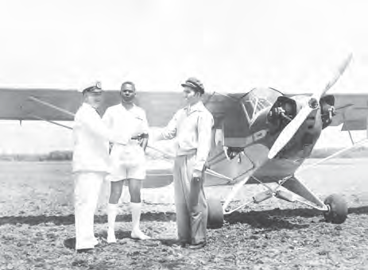
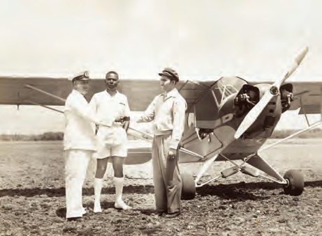
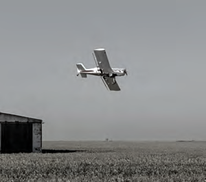
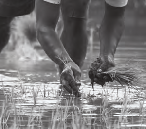

# Ontwikkeling van ons land na 1945

## Lección 1: Ontwikkelingshulp aan ons land

---

### Contenido del Libro de Estudiantes

Ontwikkelingshulp aan ons land

Na afloop van de Tweede Wereldoorlog moesten landen in Europa weer opgebouwd

worden. Grote steden lagen in puin na bombardementen en het dagelijks leven moest weer opgepakt worden. Europa kreeg ontwikkelingshulp van de Verenigde Staten van Amerika. Deze hulp staat bekend als het Marshallplan en was bedoeld voor de wederopbouw van de economie en het herstel van de verwoesting in de door oorlog getroffen landen.1

OPDRACHT

• Wat zie je op de foto?

• Wanneer kan deze foto ongeveer gemaakt zijn?

• Waardoor zijn de gebouwen op de foto zo verwoest?BIJ AFBEELDING 2

Verwoesting na een bombardement2

Ook in ons land vond de regering dat er iets gedaan moest worden om de armoede en de werkloosheid aan te pakken. Hoewel het tijdens de Tweede Wereldoorlog goed leek te gaan met ons land, als gevolg van de export van bauxiet, was dit slechts schijn. Er waren nog steeds veel mensen werkloos en arm. Ook waren veel producten schaars en duur. Daarom ontstond, in overleg met de Nederlandse regering, het voorstel voor ontwikkelingshulp. Het geld voor deze hulp kwam voor een deel ook uit het Marshallplan. En zo werd in 1947 het Surinaams Welvaartsfonds opgericht

Het Welvaartsfonds had als doel ons land tot ontwikkeling te brengen. Voor dit plan had

de Nederlandse regering 40 miljoen Nederlandse gulden beschikbaar gesteld. Het was een plan van ongeveer vijf jaren en er waren verschillende projecten in opgenomen zoals de oprichting van de Volks Credit Bank (VCB) en het Planbureau. Dit bureau was belast met het ontwikkelen en uitvoeren van plannen.

Ook werd onderzoek gedaan naar de natuurlijke hulpbronnen, zoals de hoeveelheid bauxiet in de bodem en welke houtsoorten er in onze bossen voorkomen. Er werden luchtfoto’s gemaakt om ons land in kaart te brengen. In 1959 kwam hierop een vervolg met Operation Grasshopper. Binnen enkele jaren werden in ons binnenland zeven vliegveldjes of airstrips aangelegd.

De vliegveldjes die tijdens Operation Grasshopper werden

aangelegd3

67

Thema 5 | Les 1 – Ontwikkelingshulp aan ons landLes

---

Een van de piloten die betrokken was bij de luchtfoto’s en het aanleggen van de vliegveldjes

was Ronald Kappel. Bij het aanleggen van de vliegveldjes heeft hij als piloot veel vluchten uitgevoerd. Hij was een pionier binnen de Surinaamse luchtvaart. Dat wil zeggen dat hij één van de eerste piloten in ons land was. Het vliegveld Zorg en Hoop, dat tijdens de Tweede Wereldoorlog een militaire basis was, werd uitgebreid. In 1953 werd een stuk grond aangekocht, waar een startbaan werd aangelegd. Van hieruit vindt het binnenlandse vliegverkeer van ons land tegenwoordig nog steeds plaats.Ronald Kappel nam ook deel aan Operation Grasshopper en onder zijn leiding werd een airstrip aan de voet van de Tafelberg aangelegd. Helaas kwam Ronald Kappel om het leven, toen het vliegtuig waarin hij samen met piloot Vincent Fayks zat, neerstortte op 6 oktober 1959. De airstrip bij Tafelberg werd later naar Ronald Kappel vernoemd .

OM TE ONTHOUDEN

• Na de Tweede Wereldoorlog werden landen in Europa met ontwikkelingshulp uit het Marshallplan weer opgebouwd.

• In ons land kwamen ook plannen voor ontwikkeling. Het eerste plan was het Surinaamse Welvaartsfonds.

• Tijdens het Welvaartsfond werd het Planbureau opgericht, voor het bedenken en uitvoeren van plannen.

• Ronald Kappel was pionier binnen de Surinaamse luchtvaart. Hij kwam om het leven bij een vliegtuigongeluk tijdens Operation Grasshopper.

• Tijdens het Welvaartsfonds werd ook de Stichting Machinale Landbouw (SML) en het Plan Wageningen opgericht.

Piloot Ronald Kappel 4Tijdens het welvaartsfonds werden verder in de districten Nickerie en Coronie de verwaarloosde polders hersteld. Ook kwamen er nieuwe bij. Zo werd het Plan Wageningen in het district Nickerie opgezet. Hiervoor werd in 1949 de Stichting Machinale Landbouw (SML) opgericht. Het

plan had als doel het machinaal verbouwen van rijst, voornamelijk door Nederlandse boeren. Binnen vijf jaar werd Wageningen ontwikkeld. Voor die tijd was het een van de modernste, gemechaniseerde rijstbedrijven in de wereld. Er was ook een proefpolder, waar proeven werden gedaan voor de verbetering van verschillende rijstsoorten. Tot 1975 was dit bedrijf in Nederlandse handen. Bij de onafhankelijkheid werd het overgedragen aan Suriname.

Een oude luchtfoto van Wageningen5 OPDRACHT

• Welke plaats zie je op deze foto?

• Vertel wat je op deze foto ziet.

• In welk district is deze foto genomen?BIJ AFBEELDING 5

68

Thema 5 | Les 1 – Ontwikkelingshulp aan ons land

---

VRAGEN

1. Na de oorlog kregen landen in Europa

ontwikkelingshulp.a. Waarom kregen deze landen ontwikkelingshulp?

b. Welk land gaf deze ontwikkelingshulp?

2. Leg uit waarom ook ons land na de Tweede Wereldoorlog ontwikkelingshulp kreeg.

3. Wat is in het algemeen het doel van ontwikkelingshulp?

4. Welke bewering is juist?I. Ons land kreeg ontwikkelingshulp omdat het in de oorlog gebombardeerd was.

II. Ontwikkelingshulp was voor ons land niet nodig, want het ging goed met ons land.

a. Alleen bewering I is juist.

b. Alleen bewering II is juist.

c. Bewering I en II zijn juist.

d. Bewering I en II zijn onjuist.

5. Noem drie projecten uit het Welvaartsfonds op.6. Ronald Kappel was een pionier van de Surinaamse luchtvaart.a. Zoek het woord pionier op in een woordenboek of op het internet.

b. Vertel met eigen woorden wie een pionier genoemd wordt.

7. Wat is niet juist over Ronald Kappel?

A. Hij kwam om het leven bij een vliegtuigongeluk.

B.Hij was een piloot bij de Surinaamse luchtvaart.

C. Onder zijn leiding werden de airstrips in ons binnenland aangelegd.

D.Ronald Kappel nam deel aan Operation Grasshopper.

8. Vertel kort wat het Plan Wageningen inhield.

9. a. Waarvoor staat de afkorting SML?

b. In welk jaar werd dit bedrijf overgedragen aan Suriname?

10. Bekijk de volgende foto’s. Leg uit of je kan spreken van machinale rijstbouw.

1 2 3

69

Thema 5 | Les 1 – Ontwikkelingshulp aan ons land

---

### Imágenes de la Lección

---

### Guía del Profesor - Respuestas y Explicaciones

91

Les

Thema 5 – Ontwikkeling van ons land na 1945Ontwikkelingshulp aan ons land

VRAGEN EN ANTWOORDEN

1. Na de oor log kregen landen in Europa ontwikkelingshulp.

a. Waarom kregen deze landen ontwikkelingshulp?

Landen kregen na de oorlog ontwikkelingshulp, omdat ze na de bombardementen

alles weer moesten opbouwen en het dagelijks leven moest weer op gang komen.

b. Welk land gaf deze ontwikkelingshulp?

Ontwikkelingshulp kwam vanuit de Verenigde Staten van Amerika.

2. Leg uit waarom ook ons land na de Tweede Wereldoorlog ontwikkelingshulp kreeg.

Ons land kreeg na de Tweede Wereldoorlog ook ontwikkelingshulp, omdat er veel

mensen werkloos en arm waren. Vele producten waren schaars en duur.

3. Wat is in het algemeen het doel van ontwikkelingshulp?

Het doel van ontwikkelingshulp is om een land dat in moeilijkheden verkeert, te helpen

opbouwen onder andere door werkgelegenheid te creëren.

4. Welke bewering is juist?

I. Ons land k reeg ontwikkelingshulp omdat het in de oorlog gebombardeerd was.

II. Ontwikkelingshulp was voor ons land niet nodig, want het ging goed met ons land.

a. Alleen bewering I is juist.

b. Alleen bewering II is juist.

c. Bewering I en II zijn juist.

d. Bewering I en II zijn onjuist.

5. Noem dr ie projecten uit het Welvaartsfonds op.

-Oprichting van de Volks Credit Bank (VCB)

-Oprichting van het Planbureau

-Onderzoek naar natuurlijke hulpbronnen

6. Ronald Kappel was een pionier van de Surinaamse luchtvaart.

a. Zoek het woord pionier op in een woordenboek of op het internet.

b. Vertel met eigen woorden wie een pionier genoemd wordt.

De beschrijving kan per leerling verschillen.

Een pionier is iemand die als eerste ergens mee bezig is. Hij of zij verzet baanbrekend

werk en kan niet steunen op ervaringen van anderen.

7. Wat is niet juist over Ronald Kappel?

a. Hij kwam om het leven bij een vliegtuigongeluk.

b. Hij was een piloot bij de Surinaamse luchtvaart.

c. Onder zijn leiding werden de airstrips in ons binnenland aangelegd.

d. Ronald Kappel nam deel aan Operation Grasshopper.

8. Vertel kort wat het Plan Wageningen inhield.

Bij plan Wageningen werden in het district Nickerie nieuwe rijstpolders aangelegd. Hier

werd door Nederlandse boeren machinaal rijst verbouwd.1

---

92

Thema 5 – Ontwikkeling van ons land na 19459. a. Waarvoor staat de afkorting SML?

De afkorting SML staat voor de Stichting Machinale Landbouw.

b. In welk jaar werd dit bedrijf overgedragen aan Suriname?

De SML werd in 1975 overgedragen aan Suriname.

10. Bekijk de volgende tekeningen.

Leg uit of je kan spreken van machinale rijstbouw.

Tekening 1 = machinale landbouw

Tekening 2 = geen machinale landbouw

Tekening 3 = machinale landbouw

Je kunt spreken van machinale rijstbouw in tekening 1 en tekening 3. Tekening 2 is geen

afbeelding van machinale rijstbouw.

---

*Fuente: suriname-history.pdf (estudiantes) y suriname-history-teacher-guide.pdf (profesor)*
