# Ontwikkeling van ons land na 1945

## Lección 2: De stuwdam in de Surinamerivier

---

### Contenido del Libro de Estudiantes

De stuwdam in de Surinamerivier

Na het Welvaartsfonds kwam in 1955 het Tienjarenplan. Dit plan werd uitgevoerd door het

Planbureau. Voor de uitvoering van projecten die in het Tienjarenplan waren opgenomen, heeft Suriname een deel zelf betaald. Het andere deel werd door Nederland betaald.Een belangrijk project tijdens het Tienjarenplan was het Brokopondoplan. De Surinaamse regering wilde een grote waterkrachtcentrale aanleggen in de Surinamerivier. Hiermee zou elektriciteit opgewekt kunnen worden. Het Amerikaanse bauxietbedrijf Alcoa was geïnteresseerd in dit plan. In 1958 werd een overeenkomst gesloten tussen Alcoa en de Surinaamse regering. Alcoa zou een stuwdam aanleggen en ook een fabriek bouwen om bauxiet in ons land te verwerken. Deze fabriek zou het grootste deel van de opgewekte elektriciteit nodig hebben om het aluminium te smelten. Het voordeel voor ons land zou zijn dat er meer werkgelegenheid zou komen en dat met de uitvoer van aluminium meer verdiend kon worden.

Er werd afgesproken dat de stuwdam en de waterkrachtcentrale pas na 75 jaren eigendom

zouden worden van Suriname. Maar Alcoa is in 2015 gestopt met het mijnen van bauxiet in ons land en ook de fabriek werd gesloten. En sinds 1 januari 2020 is de stuwdam officieel overgedragen aan Suriname.2

Een luchtfoto van de stuwdam6OPDRACHT

• Wat zie je op deze foto?

• Wat is een stuwdam?

• In welke rivier werd de stuwdam aangelegd?BIJ AFBEELDING 6

In 1960 werd begonnen met de aanleg van de twaalf kilometer lange dam. Deze dam lag niet bij Brokopondo, maar iets meer naar het zuiden, bij het dorp Afobaka. Vandaar dat de stuwdam ook wel Afobakadam genoemd wordt.

Het Brokopondoplan was ontwikkeld door de Nederlandse waterbouwkundige

professor dr. ir. van Blommestein, naar wie het stuwmeer vernoemd is. Officieel is de naam dus het Professor dr. ir. W. J. van Blommesteinmeer, maar het is meer bekend als het Brokopondostuwmeer. Professor dr. ir. van Blommestein was ook betrokken bij de uitwerking van de ontwatering van het Plan Wageningen, dat genoemd is in de vorige les.

De Afobaka waterkrachtcentrale7OPDRACHT

• Wijs de waterkrachtcentrale aan.

• In welk district is deze foto gemaakt?BIJ AFBEELDING 7

70

Thema 5 | Les 2 – De stuwdam in de SurinamerivierLes

---

Door de aanleg van het stuwmeer werd een zeer groot stuk land onder water gezet. In

dit gebied lagen verschillende Marrondorpen en de mensen die daar woonden, moesten verhuizen. Het ging om ongeveer 5000 mensen die hun huis en woonomgeving moesten verlaten. Door de Surinaamse regering werden voor deze mensen nieuwe dorpen gebouwd, zoals bijvoorbeeld Klaaskreek en Brownsweg. Deze dorpen worden transmigratiedorpengenoemd.

De mensen wilden hun oude dorpen helemaal niet verlaten en pas toen het water begon

te stijgen moesten zij wel vertrekken. De huizen in de nieuwe dorpen waren klein en er waren er niet genoeg. In hun nieuwe huizen kregen de mensen niet eens een deel van de opgewekte elektriciteit waarvoor zij plaats hadden moeten maken. Die elektriciteit liep via grote kabels naar Paranam, waar een aluinaardefabriek en een aluminiumsmelterij waren gebouwd.

Niet alleen de mensen uit het gebied moesten verhuizen, maar ook een heleboel dieren.

Terwijl het water steeg, voeren mensen in boten heen en weer, op zoek naar dieren die door het stijgende water gevangen waren. Met deze acties, bekend als Operatie Gwamba zijn veel apen, miereneters, herten en andere dieren gered, die anders verdronken zouden zijn.

OPDRACHT

• Waarom moesten dieren gered worden?

• Zou jij deel willen nemen aan zo een reddingsactie? Waarom wel of niet?

Klaaskreek, een transmigratiedorp8

OM TE ONTHOUDEN

• In 1955 kwam het Planbureau met het Tienjarenplan.

• Een belangrijk project was het Brokopondoplan. In de Surinamerivier werd een stuwdam aangelegd en een waterkrachtcentrale gebouwd voor de opwekking van elektriciteit.

• Het stuwmeer heet officieel het professor dr. ir. W. J. van Blommesteinmeer. Deze Nederlandse waterbouwkundige professor had het Brokopondoplan geschreven.

• Mensen die in het gebied woonden waar het stuwmeer kwam, moesten verhuizen naar transmigratiedorpen.

• Operatie Gwamba heeft veel dieren in het gebied gered.

71

Thema 5 | Les 2 – De stuwdam in de Surinamerivier

---

VRAGEN

1. Zijn de volgende uitspraken waar of niet

waar?a. Het Tienjarenplan kwam toen het Welvaartsfonds was afgelopen.

b. Het Planbureau is tijdens het Tienjarenplan opgericht.

c. Bij het Welvaartsfonds moest ons land zelf ook een deel van de kosten betalen.

d. Het Planbureau was opgericht om plannen te ontwikkelen en uit te voeren.

e. Het Tienjarenplan was ontwikkeld voor 1955 tot 1965.

2. Vertel kort wat het Brokopondoplan inhield. Wat wilde men bouwen en waarom?

3. Leg uit waarom het Amerikaanse bauxietbedrijf Alcoa wel geïnteresseerd was in het Brokopondoplan.

4. Vul in wat er bij de Brokopondo overeenkomst werd afgesproken.

Alcoa zou een … aanleggen en een fabriek bouwen om … te verwerken. Deze fabriek had veel … nodig om … te smelten.Het voordeel voor ons land was meer … en we konden meer … verdienen.

5. In 1958 werd de Brokopondo overeenkomst gesloten. Noem de twee partijen bij het sluiten van de Brokopondo overeenkomst.6. a. De stuwdam zou pas na 75 jaar van

Suriname zijn. Reken uit in welk jaar dat zou zijn.

b. De stuwdam is per 1 januari 2020 officieel aan Suriname overgedragen. Reken uit hoeveel jaren eerder dan afgesproken de stuwdam aan ons land is overgedragen.

7. Welk antwoord is juist?De officiële naam van het stuwmeer is:

A. Alcoa stuwmeer

B.Brokopondo stuwmeer

C. Professor dr. ir. W. J. van Blommesteinmeer

D.Suriname stuwmeer

8. a. In welke rivier is het stuwmeer

ontstaan?

b. Waarom moesten de mensen die langs deze rivier woonden verhuizen?

9. Welk antwoord is juist?Het verhuizen van een hele groep mensen van een plaats naar een andere noemen we:

A. Emigratie

B.Immigratie

C. Transmigratie

D.Urbanisatie

10. Leg uit wat Operatie Gwamba inhield.

72

Thema 5 | Les 2 – De stuwdam in de Surinamerivier

---

### Imágenes de la Lección

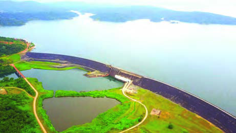

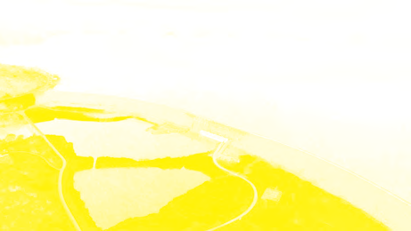

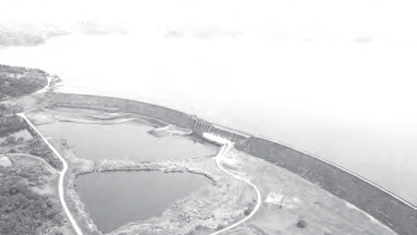

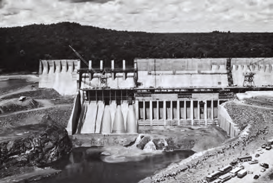

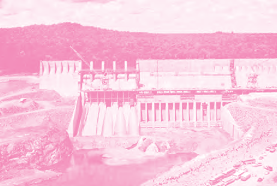

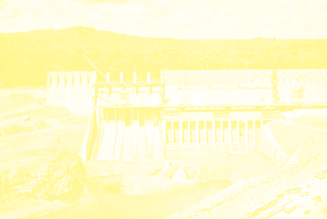

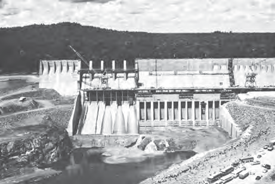

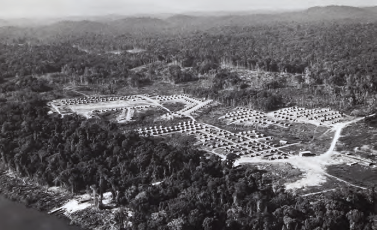

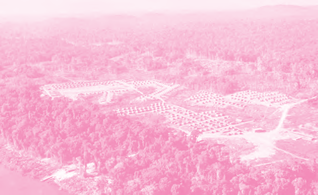

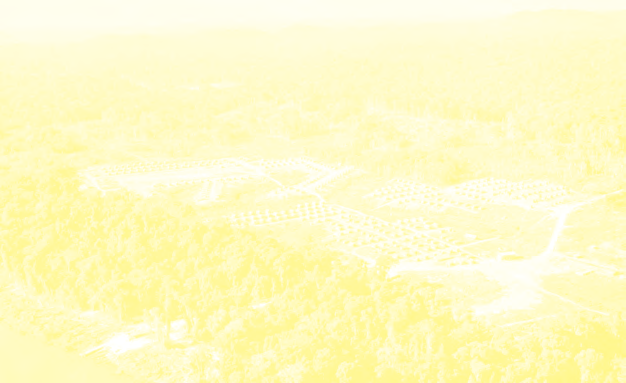

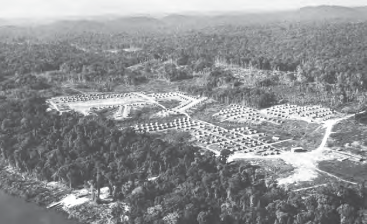

---

### Guía del Profesor - Respuestas y Explicaciones

93

Les

Thema 5 – Ontwikkeling van ons land na 1945De stuwdam in de Surinamerivier

VRAGEN EN ANTWOORDEN

1. Zijn de v olgende uitspraken waar of niet waar?

a. Het Tienjarenplan kwam toen het Welvaartsfonds was afgelopen. Waar

b. Het P lanbureau is tijdens het Tienjarenplan opgericht. Niet waar

c. Bij het Welvaartsfonds moest ons land zelf ook een deel van de kosten betalen.

Niet waar

d. Het P lanbureau was opgericht om plannen te ontwikkelen en uit te voeren. Waar

e. Het Tienjarenplan was ontwikkeld voor 1955 tot 1965. Waar

2. Vertel kort wat het Brokopondoplan inhield. Wat wilde men bouwen en waarom?

Het Brokopondoplan hield in dat er een stuwdam en een waterkrachtcentrale in de

Surinamerivier aangelegd en gebouwd zouden worden om elektriciteit op te wekken.

3. Leg uit waarom het Amerikaanse bauxietbedrijf Alcoa wel geïnteresseerd was in het

Brokopondoplan.

Het Amerikaanse bauxietbedrijf was geïnteresseerd in het Brokopondoplan, omdat ze

een fabriek wilden opzetten om bauxiet te verwerken waarvoor ze elektriciteit nodig

hadden.

4. Vul in wat er bij de Brokopondo overeenkomst werd afgesproken.

Alcoa zou een stuwdam aanleggen en een fabriek bouwen om bauxiet te verwerken.

Deze fabriek had veel elektriciteit nodig om aluminium te smelten.

Het voordeel voor ons land was meer werkgelegenheid en we konden meer geld

verdienen.

5. In 1958 werd de Brokopondo overeenkomst gesloten. Noem de twee partijen bij het

sluiten van de Brokopondo overeenkomst.

1. Alcoa

2. Surinaamse regering

6. a. De stuwdam zou pas na 75 jaar van Suriname zijn. Reken uit in welk jaar dat zou zijn.

1958 + 75 = 2033

b. De stuwdam is per 1 januari 2020 officieel aan Suriname overgedragen. Reken uit

hoeveel jaren eerder dan afgesproken de stuwdam aan ons land is overgedragen.

2033 - 2020 = 13 jaren eerder

7. Welk antwoord is juist?

De officiële naam van het stuwmeer is:

a. Alcoa stuwmeer

b. Brokopondo stuwmeer

c. Professor dr. ir. W. J. van Blommesteinmeer

d. Suriname stuwmeer

8. a. In welke rivier is het stuwmeer ontstaan?

In de Surinamerivier

b. Waarom moesten de mensen die langs deze rivier woonden verhuizen?

Omdat het gebied waar deze mensen woonden onder water gezet werd voor de

aanleg van het stuwmeer.2

---

94

Thema 5 – Ontwikkeling van ons land na 19459. Welk antwoord is juist?

Het verhuizen van een hele groep mensen van een plaats naar een andere noemen we:

a. Emigratie

b. Immigratie

c. Transmigratie

d. Urbanisatie

10. Leg uit wat Operatie Gwamba inhield.

Operatie Gwamba hield in dat de dieren die door het stijgende water vast kwamen te

zitten in bomen of op kleine eilandjes, gered werden.

---

*Fuente: suriname-history.pdf (estudiantes) y suriname-history-teacher-guide.pdf (profesor)*
