# Ontwikkeling van ons land na 1945

## Lección 3: Sociale ontwikkeling

---

### Contenido del Libro de Estudiantes

Sociale ontwikkeling

Bij de verschillende plannen was het de bedoeling om ons land zo tot ontwikkeling te

brengen, dat het volk betere woon- en werkomstandigheden zou hebben. Een land tot ontwikkeling brengen gebeurt natuurlijk niet zomaar. Eerst moet een plan gemaakt worden, een ontwikkelingsplan. In zo een plan staat onder meer wat het doel is en op welke wijze dat doel bereikt zal worden. Ook staat er in wat het gaat kosten, waar het benodigde geld gevonden moet of kan worden en hoeveel tijd er nodig zal zijn voor de uitvoering van verschillende projecten. Bijvoorbeeld het oprichten van bedrijven voor meer werkgelegenheid, het bouwen van scholen om de bevolking goed onderwijs te kunnen geven dat aansluit bij de mogelijke werkgelegenheid. In het plan wordt ook opgenomen hoeveel huizen gebouwd moeten worden, waar er wegen worden aangelegd en ook hoe de gezondheidszorg aangepakt wordt. Ook scholen en onderwijzerswoningen werden gebouwd. Alleen met gezonde mensen en met goed onderwijs kan een land door hard

werken vooruit gaan.3

OPDRACHT

• Vertel wat je ziet op de afbeelding.

• Wijs de onderwijzerswoning aan.

Toen het Tienjarenplan in 1966 afliep, volgden er twee Vijfjarenplannen (1967-1971 en 1972-1976). Ook deze plannen werden door het Planbureau ontwikkeld. Meer dan bij de voorgaande plannen was een deel van het geld bedoeld voor sociale ontwikkeling. Hierbij werd gedacht om onder meer de werkloosheid en de huisvesting van de bevolking aan te pakken. De woningnood in Paramaribo was groot. Er waren veel oude huizen, en ook trokken veel mensen uit de districten naar de hoofdstad. In Paramaribo was er meer werkgelegenheid, beter onderwijs en een meer uitgebreide gezondheidszorg. Als veel mensen van het platteland naar een stad trekken, noemen wij dit urbanisatie.BIJ AFBEELDING 9

Een school met onderwijzerswoning 9

Voorbeeld van een woningbouwproject10Er was dus behoefte aan huizen. Tijdens de ontwikkelingsplannen zijn er daarom ook woningbouwprojecten uitgevoerd. In 1951 werd de Stichting Volkshuisvesting Suriname (SVS) opgericht, voor het bouwen van volkswoningen. Eén van de eerste woningbouwprojecten was Zorg en Hoop. Ook werden er huizen gebouwd in onder andere het Marowijneproject, Beekhuizen en Latour.

73

Thema 5 | Les 3 – Sociale ontwikkelingLes

---

Bij sommige van deze projecten werden Bruynzeelwoningen gebouwd. In 1947 werd

de Bruynzeel Suriname Houtmaatschappij N.V. opgericht, een houtfabriek. Bij dit bedrijf konden mensen ook een huis kopen. Het was eigenlijk een compleet bouwpakket van hout. De huizen konden snel en gemakkelijk in elkaar gezet worden.

Een voorbeeld van een Bruynzeelwoning11OPDRACHT

• Wat voor huis zie je op deze afbeelding?

• Door welk bedrijf werden zulke huizen geleverd?

• Waarom werden er huizen gebouwd?

Er werden niet alleen huizen gebouwd voor de bevolking. Ook werden er verschillende bedrijven opgericht waar mensen konden werken. Er werden ook ziekenhuizen gebouwd. Verder werden de melkcentrale en een sappenfabriek opgericht. En de aluminiumfabriek, waarover in de vorige les geschreven is.

Niet alleen in Paramaribo, maar ook in de

districten, werden projecten uitgevoerd en bedrijven opgezet. Om ervoor te zorgen dat de mensen niet allemaal naar Paramaribo trokken, moest er onder andere voor werkgelegenheid gezorgd worden. Voorbeelden hiervan zijn de bacovenbedrijven in Jarikaba en Nickerie en het oliepalmproject Victoria in

Brokopondo. Bij het oliepalmproject werd

een groot stuk land op de oude plantage Victoria aan de Surinamerivier ontbost en beplant met obepalmen. En er werd een fabriek gebouwd voor de productie van palmolie. Er werd bij al deze projecten ook geld gebruikt voor onderzoek en aanleg van wegen, gebouwen, landbouwgrond en onderhoud.BIJ AFBEELDING 11

Ziekenhuis in aanbouw.12

Aanplant van obepalmen13

OM TE ONTHOUDEN

• In een ontwikkelingsplan is beschreven wat het doel is en op welke wijze het doel bereikt zal worden.

• Met sociale ontwikkeling worden de woon- en werkomstandigheden van de bevolking bedoeld.

• Bij de verschillende plannen waren er ook projecten voor de woningbouw en het opzetten van bedrijven.

• Bruynzeel was een houtmaatschappij in ons land die bouwpakketten voor woningen verkocht.

• Niet alleen in Paramaribo, maar ook in de districten werden projecten uitgevoerd.

74

Thema 5 | Les 3 – Sociale ontwikkeling

---

VRAGEN

1. Geef twee voorbeelden van zaken die

in een ontwikkelingsplan opgenomen kunnen zijn.

2. Wat wordt in het algemeen in een ontwikkelingsplan beschreven?

3. Welk antwoord is juist?Ontwikkelingsplannen werden uitgevoerd, om …

A. de band tussen Nederland en ons land te versterken.

B.de onafhankelijkheid voor ons land te verkrijgen.

C. de verdediging van ons land te verbeteren.

D.de welvaart van ons land te laten toenemen.

4. Hieronder volgen twee uitspraken. Wat vind jij van deze uitspraken?

“Als ik een plan voor ons land zou schrijven, zou ik vooral veel wegen aanleggen en bedrijven oprichten waar mensen kunnen werken. Scholen en huizen zijn niet zo belangrijk. Als mensen werken kunnen ze zelf geld verdienen en hun huizen bouwen. ”

“Als ik een plan voor ons land zou schrijven, zou ik veel scholen bouwen. Als kinderen naar school gaan en goed leren, kunnen ze later beter werk vinden. Ook zou ik een fonds opzetten waar mensen geld kunnen lenen om een eigen bedrijf te beginnen. ”

5. Welk project hoort niet bij sociale ontwikkeling.

A. Bouw van het Academisch Ziekenhuis

B.Oliepalmproject Victoria

C. Operation Grasshopper

D.Woningbouwproject6. Welke bewering is juist?I. De woningnood in Paramaribo nam toe door de urbanisatie.

II. Om urbanisatie tegen te gaan waren er ook projecten in de districten.

A. Alleen bewering I is juist.

B.Alleen bewering II is juist.

C. Bewering I en II zijn juist.

D.Bewering I en II zijn onjuist.

7. Waarom werd de Stichting Volkshuisvesting Suriname opgericht?

8. Hier zie je een tekening van een Bruynzeelwoning.

a. Waarom worden deze huizen

Bruynzeelwoningen genoemd?

b. Van welk materiaal werden deze huizen gebouwd?

c. Waar kwam dat materiaal vandaan?

9. Er werden ook bedrijven opgericht waar mensen konden werken. Hieronder worden voorbeelden genoemd. Welke drie waren in Paramaribo?Academisch Ziekenhuis Melkcentrale

Aluminiumfabriek Sappenfabriek Bacovenbedrijf Victoria

10. Vertel in het kort wat het oliepalmproject Victoria inhield.

75

Thema 5 | Les 3 – Sociale ontwikkeling

---

### Imágenes de la Lección

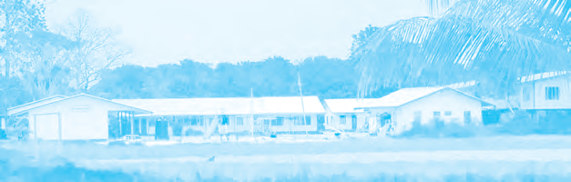

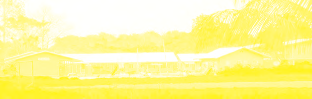

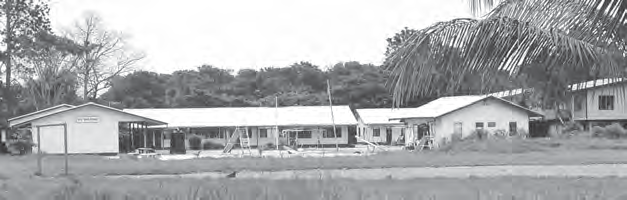

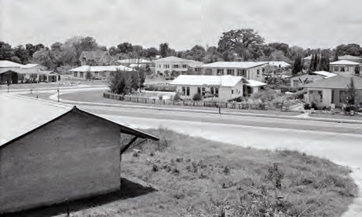

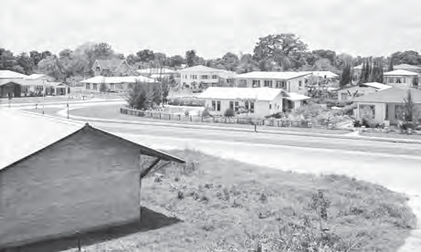

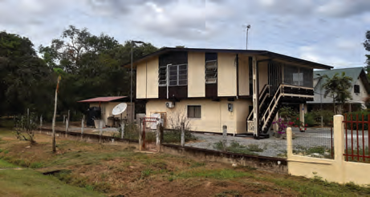

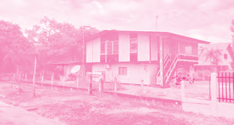

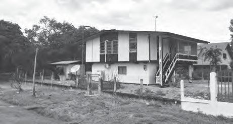

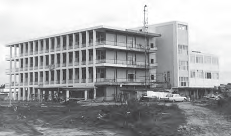

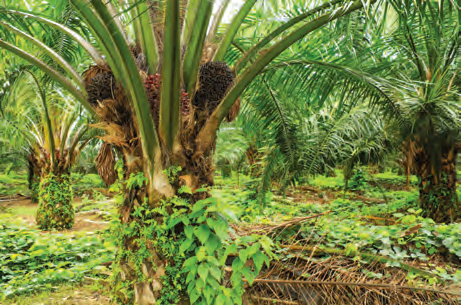

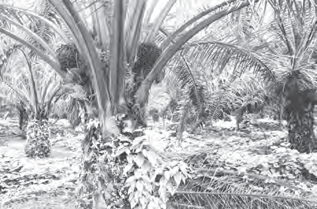

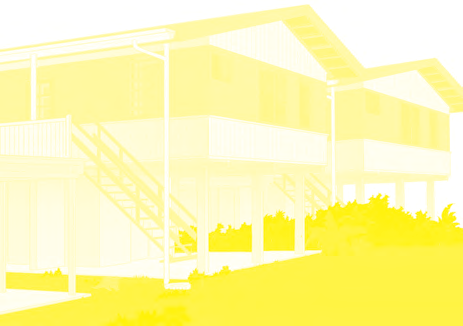

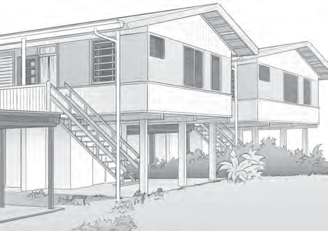

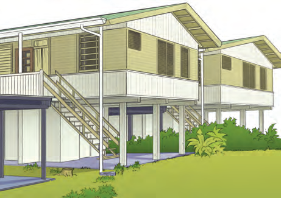

---

### Guía del Profesor - Respuestas y Explicaciones

95

Les

Thema 5 – Ontwikkeling van ons land na 1945Sociale ontwikkeling

VRAGEN EN ANTWOORDEN

1. Geef twee voorbeelden van zaken die in een ontwikkelingsplan opgenomen kunnen zijn.

De antwoorden kunnen per leerling verschillen.

In een ontwikkelingsplan kan bijvoorbeeld staan:

1. welke bedrijven opgericht gaan worden.

2. waar scholen gebouwd moeten worden.

2. Wat wordt in het algemeen in een ontwikkelingsplan beschreven?

In een ontwikkelingsplan is beschreven wat het doel is en hoe dit bereikt zal worden.

3. Welk antwoord is juist?

Ontwikkelingsplannen werden uitgevoerd, om …

a. De band tussen Nederland en ons land te versterken.

b. De onafhankelijkheid voor ons land te verkrijgen.

c. De verdediging van ons land te verbeteren.

d. De welvaart van ons land te laten toenemen.

4. Hieronder volgen twee uitspraken. Wat vind jij van deze uitspraken?

Uitspraak 1: “Als ik een plan voor ons land zou schrijven, zou ik vooral veel wegen

aanleggen en bedrijven oprichten waar mensen kunnen werken. Scholen en huizen zijn

niet zo belangrijk. Als mensen werken, kunnen ze zelf geld verdienen en hun huizen

bouwen. ”

Uitspraak 2: “Als ik een plan voor ons land zou schrijven, zou ik veel scholen bouwen. Als

kinderen naar school gaan en goed leren, kunnen ze later beter werk vinden. Ook zou ik

een fonds opzetten waar mensen geld kunnen lenen om een eigen bedrijf te beginnen. ”

De meningen zullen per leerling verschillen.

5. Welk project hoort niet bij sociale ontwikkeling.

a. Bouw van het Academisch Ziekenhuis

b. Oliepalmpr oject Victoria

c. Operation Grasshopper

d. Woningbouwproject

6. Welke bewering is juist?

I. De woningnood in Paramaribo nam toe door de urbanisatie.

II. Om ur banisatie tegen te gaan waren er ook projecten in de districten.

a. Alleen bewering I is juist.

b. Alleen bewering II is juist.

c. Bewering I en II zijn juist.

d. Bewering I en II zijn onjuist.3

---

96

Thema 5 – Ontwikkeling van ons land na 19457. Waarom werd de Stichting Volkshuisvesting Suriname opgericht?

De Stichting Volkshuisvesting Suriname werd opgericht voor het bouwen van volks-

woningen.

8. Hier zie je een tekening van een Bruynzeelwoning.

a. Waarom worden deze huizen Bruynzeelwoningen genoemd?

Deze huizen worden Bruynzeelwoningen genoemd, omdat ze door de Bruynzeel-

fabriek werden gebouwd.

b. Van welk materiaal werden deze huizen gebouwd?

Van hout

c. Waar kwam dat materiaal vandaan?

Het materiaal kwam van Bruynzeel Suriname Houtmaatschappij N.V., een hout-

fabriek. Het hout was van bomen uit het Surinaamse bos.

9. Er w erden ook bedrijven opgericht waar mensen konden werken. Hieronder worden

voorbeelden genoemd. Welke drie waren in Paramaribo?

O Academisch Ziekenhuis O Melkcentrale

O Aluminiumfabriek O Sappenfabriek

O Bacovenbedrijf O Victoria

10. Vertel in het kort wat het oliepalmproject Victoria inhield.

Voor het oliepalmproject werd een groot stuk grond op de oude plantage Victoria aan

de Surinamerivier ontbost en beplant met obepalmen. Er werd ook een fabriek gebouwd

voor de productie van palmolie.

---

*Fuente: suriname-history.pdf (estudiantes) y suriname-history-teacher-guide.pdf (profesor)*
