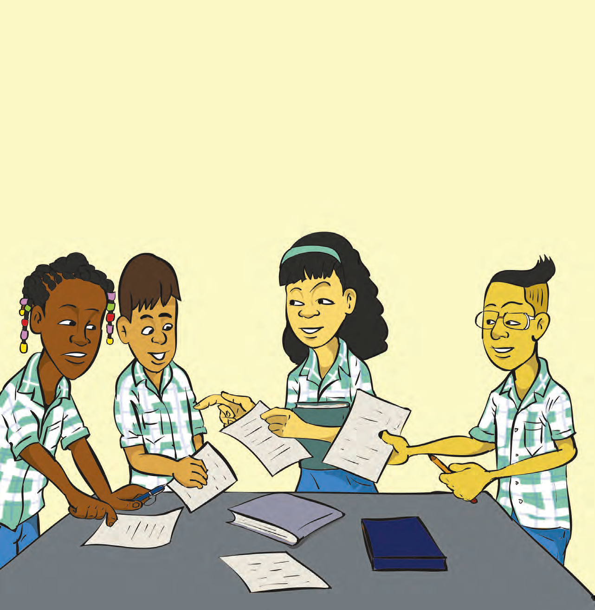
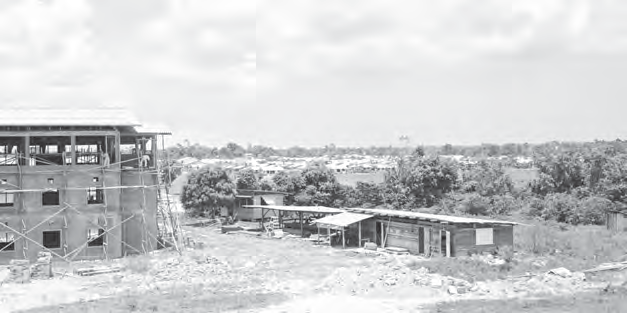
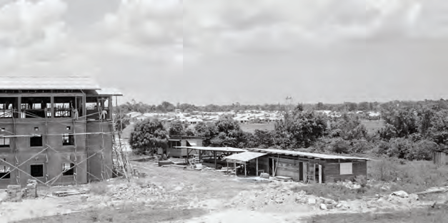

# Ontwikkeling van ons land na 1945

## Introducción: Ontwikkeling van ons land na 1945

---

### Contenido del Libro de Estudiantes

5THEMAOntwikkeling van

ons land na 1945

Bouwen aan een betere toekomst

---

INLEIDING

In dit thema kom je meer te weten over enkele plannen

voor de ontwikkeling van ons land na 1945. In de eerste les wordt verteld waarom er ontwikkelingshulp kwam. Ook over enkele projecten tijdens het welvaartsfonds wordt geschreven. De tweede les gaat over de aanleg van de stuwdam in Brokopondo en de gevolgen daarvan voor de mensen en dieren die in dat gebied woonden. De laatste les behandelt de sociale ontwikkeling, die ook onderdeel was van de ontwikkelingsplannen.KERNBEGRIPPEN

• ontwikkelingshulp

• Marshallplan

• Welvaartsfonds

• Planbureau

• Operation Grasshopper

• Ronald Kappel

• Plan Wageningen

• Stichting Machinale Landbouw

• Tienjarenplan

• Brokopondoplan

• waterkrachtcentrale

• stuwdam

• Professor dr. ir. van Blommestein

• transmigratie

• Operatie Gwamba

• ontwikkelingsplan

• sociale ontwikkeling

• urbanisatie

• woningbouwprojecten

• Bruynzeelwoningen

• oliepalmproject Victoria

Een school in aanbouw1

66

---

### Imágenes de la Lección

---

### Guía del Profesor - Respuestas y Explicaciones

Hieronder kan u de kwartaalopdrachten vinden voor het eerste kwartaal.

Uit de volgende vier opdrachten kiest u minimaal één opdracht die u samen met de

leerlingen uitvoert.

1. COLLAGE

Doel Een onderwerp creatief uitbeelden en daarbij inzicht verkrijgen in het

onderwerp.

Groepsgrootte Twee tot vier leerlingen.

Duur Drie lesuren.

De opdracht wordt gegeven en uitgelegd. De leerlingen krijgen tijd om

er thuis en ook in de klas aan te werken.

Materiaal • Foto’s, teksten, krantenknipsels, oude tijdschriften, stiften,

kleurpotloden, scharen, lijmstiften en papier. U en/of leerlingen

brengen deze materialen van thuis mee.

• Evaluatiewijzer

Werkwijze Tijdens het eerste lesuur wordt de opdracht uitgelegd en worden de

groepen gevormd.

Er wordt per groep een keuze gemaakt voor een onderwerp uit de reeds

behandelde thema’s. Er kan bijvoorbeeld een collage gemaakt worden

over thema 2 (het onderwijs in ons land) of thema 3 (verschillende

culturen in ons land).

U bespreekt het onderwerp met de leerlingen. Stel enkele vragen over

het thema dat reeds behandeld is en spreek af aan welke eisen de collage

moet voldoen.

Leerlingen gaan op zoek naar foto’s en afbeeldingen bijvoorbeeld

in (oude) kranten en tijdschriften. Ook kunnen ze informatie in hun

leerlingenboek zoeken en zelf een stukje schrijven of tekeningen maken.

Van het verzamelde materiaal worden op een creatieve manier collages

gemaakt, welke in de klas worden tentoongesteld.

Evaluatie De werkwijze en de resultaten worden klassikaal besproken.

Beoordeling Gebruik de evaluatiewijzer om deze opdracht te beoordelen. Observeer

‘Uitwerking opdracht’ , ‘Inhoud opdracht’ en ‘Luisterhouding’ .

65

Kwartaalopdrachten – kwartaal 1 KWARTAALOPDRACHTEN – KWARTAAL 1

---

2. KWARTETTEN

Doel Het doel van deze opdracht is om informatie rond een (op te geven)

onderwerp te herkennen, uit elkaar te halen en weer bij elkaar brengen.

Groepsgrootte De klas wordt in viertallen opgesplitst.

Duur Drie tot vier lesuren en tijd om thuis te werken.

Materiaal • Dun karton om kaarten uit te knippen, scharen, tekenspullen,

eventueel (plak)plaatjes en lijm of plakband.

• Evaluatiewijzer

Werkwijze Het aantal viertallen en onderwerpen zijn afhankelijk van het aantal

leerlingen in de klas.

Elk viertal krijgt een deelonderwerp of een vraag uit de behandelde

leerstof. Om het geheugen op te frissen kunt u het gekozen thema kort

samenvatten. Kiest u bijvoorbeeld voor thema 3 (verschillende culturen

in ons land), dan kan elk viertal een andere cultuur kiezen en hierbij vier

kaartjes maken. Voorbeelden van wat er op de kaartjes afgebeeld kan

worden, zijn:

• Klederdrachten

• Gebedshuizen

• Gerechten

• Dans

• Muziekinstrumenten

Per viertal worden vier kaartjes gemaakt. Op elk kaartje staat een foto

of tekening die hun onderwerp in beeld brengt. Dit wordt eerst binnen

het viertal besproken, maar daarna kan iedereen individueel werken aan

haar of zijn kaartje. Hiervoor kunnen plaatjes uit tijdschriften of van het

internet gebruikt worden. De leerlingen kunnen ook zelf een tekening

maken en de kaartjes versieren. Wel moet erop gelet worden dat de

vier kaartjes van een groep een verzameling uitmaken van het gegeven

onderwerp om zo een kwartet te vormen. Om het kwartet te herkennen

kunnen de randen van de vier kaartjes worden gemerkt met dezelfde

kleur en staat het onderwerp duidelijk bovenaan de kaartjes.

Evaluatie Elk viertal presenteert zijn kwartet, waarbij elke leerling individueel over

haar of zijn kaartje vertelt.

Na de presentatie van het hele kwartet kan het een aantal keer in de klas

gespeeld worden in kleine groepjes van drie tot vijf leerlingen.

Beoordeling Gebruik de evaluatiewijzer om deze opdracht te beoordelen. Observeer

‘Uitwerking opdracht’ , ‘Inhoud opdracht’ , ‘Presentatiehouding’ en

‘Luisterhouding’ .

66

Kwartaalopdrachten – kwartaal 1

---

3. ROLLENSPEL

Doel Het doel van deze opdracht is om de inleving in hoe het vroeger was

te ontwikkelen. Ook worden sociale vaardigheden zoals naar elkaar

luisteren en samenwerken geoefend.

Groepsgrootte Afhankelijk van het aantal leerlingen en het gekozen onderwerp,

klassikaal of in meerdere groepen.

Duur Ongeveer vier lesuren (afhankelijk van het aantal groepen).

Het rollenspel zelf kan 10 tot 15 minuten duren.

Materiaal • Afhankelijk van het gekozen onderwerp kan door u of de leerlingen

materiaal van thuis meegenomen of gemaakt worden.

• Evaluatiewijzer

Werkwijze U legt de opdracht uit. Afhankelijk van het gekozen onderwerp en het

aantal deelnemers worden de rollen verdeeld. Als er meerdere groepen

in de klas zijn, kan ervoor gekozen worden dat elke groep een ander

onderwerp speelt. Om het geheugen op te frissen kunt u de gekozen

thema’s kort samenvatten.

De leerstof biedt meerdere mogelijkheden voor een rollenspel. Zoals:

• in thema 1 kan bijvoorbeeld het demonstreren van de arbeiders

uitgebeeld worden en het oppakken van Louis Doedel.

• in thema 1 kan ook het Adviesbureau, dat Anton de Kom oprichtte,

gekozen worden. Men kan daarbij ook uitbeelden hoe hij opgepakt en

opgesloten wordt en uiteindelijk op de boot het land uitgezet wordt.

• In thema 2 kan uitgebeeld worden hoe vroeger onderwijs gegeven

werd aan Inheemse of slaafgemaakte kinderen.

• Thema 3 biedt verschillende mogelijkheden voor een toneelstukje

over cultuur.

U heeft bij deze opdracht de taak om te helpen bij het verdelen van

de rollen. Eventueel kunnen de leerlingen in hun groep zelf de rollen

verdelen. Maar uw rol als begeleider/regisseur is belangrijk. Ook om uit

te leggen wat er ongeveer gespeeld kan en mag worden. Samen met de

groep bespreekt u hoe het onderwerp uitgebeeld zal worden.

Er wordt kort geoefend, waarbij u nog enkele adviezen meegeeft. De

leerlingen krijgen de tijd om hun rol in te studeren.

Evaluatie Het toneelstukje wordt opgevoerd. U kijkt samen met de andere

leerlingen. Na afloop van elk toneelstukje wordt deze in een kringgesprek

besproken. Hierbij mogen de andere leerlingen zeggen wat ze goed en

mooi vonden, of ze begrepen hebben wat er werd uitgebeeld, en wat

misschien anders had gekund.

Beoordeling Gebruik de evaluatiewijzer om deze opdracht te beoordelen. Observeer

‘Uitwerking opdracht’ , ‘Inhoud opdracht’ en ‘Luisterhouding’ .

67

Kwartaalopdrachten – kwartaal 1

---

*Fuente: suriname-history.pdf (estudiantes) y suriname-history-teacher-guide.pdf (profesor)*
