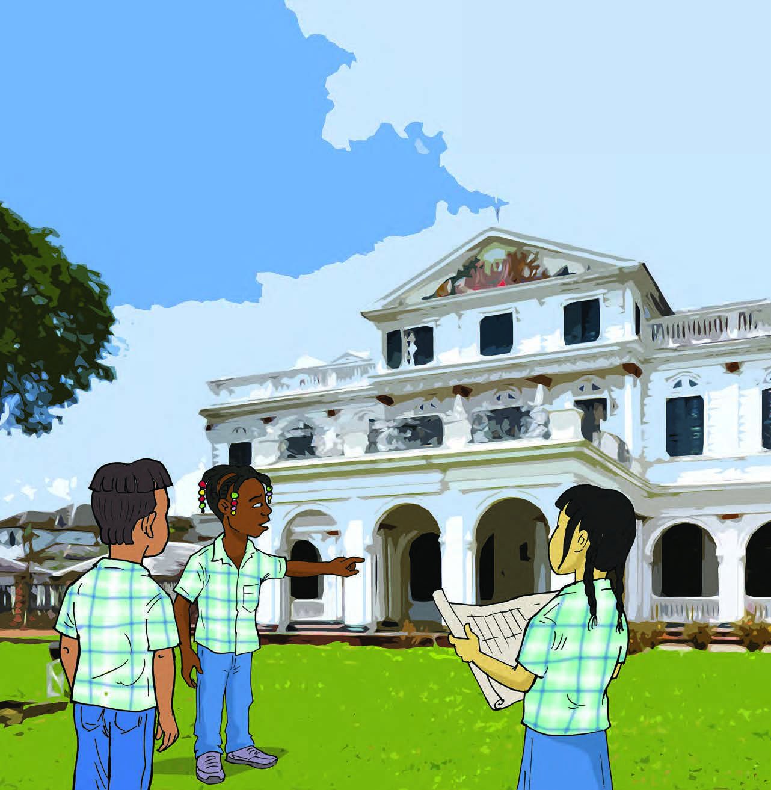

# Hoe ons land werd bestuurd

## Introducción: Hoe ons land werd bestuurd

---

### Contenido del Libro de Estudiantes

6THEMAHoe ons land

werd bestuurd

Van kolonie tot republiek

---

INLEIDING

Een goede leiding is nodig om een school, een vereniging

of een land goed te besturen. In dit thema kom je meer te weten over het bestuur van ons land. In de verschillende lessen wordt verteld hoe dat vroeger was. Zo wordt in les 1 verteld over het bestuur van ons land vanaf de 17e eeuw. In de tweede les krijg je informatie over de veranderingen na de afschaffing van de slavernij en over de invoering van kiesrecht. In de derde les kom je meer te weten over het bestuur en het kiesrecht in ons land na de Tweede Wereldoorlog.KERNBEGRIPPEN

• Geoctrooieerde Sociëteit van Suriname

• Politieke Raad

• minister van Koloniën

• districtscommissaris

• Koloniale Staten

• censuskiesrecht

• Staten van Suriname

• capaciteitskiesrecht

• Statenmonument

• conflicten

• Wim Bos Verschuur

• radiorede

• Unie Suriname

• Ronde Tafel Conferenties

• Ministerraad

• algemeen kiesrecht

• Grace Schneiders-Howard

• autonomie

• Statuut

Ondertekening van het Statuut door de Nederlandse koningin 1

78

---

### Imágenes de la Lección

---

### Guía del Profesor - Respuestas y Explicaciones

77

Thema 4 – Ons land tijdens de Tweede Wereldoorlog 7. Bekijk de foto hierna (zie afbeelding 6 leerlingenboek).

a. Uit w elk land kwam dit schip?

Het schip kwam uit Duitsland.

b. Hoe heet dit schip?

Goslar

c. In welke rivier ligt het wrak?

De Surinamerivier

8. Vertel hoe het schip op de foto bij vraag 7 tot zinken is gebracht.

De stuurman van het schip had een luik opengezet, waardoor water binnenstroomde.

(Het schip is op haar zij gekanteld.)

9. Leg uit waarom Nederland in 1942 gevangenen van Oost-Indië naar ons land liet over -

brengen.

Nederland liet de gevangenen naar Suriname overbrengen omdat de Nederlandse

kolonie Oost-Indië door Japan bezet werd. De mannen waren gevangengenomen omdat

ze ervan werden verdacht landverraders te zijn.

10. Zoek het woord landverrader op in je woordenboek of op het internet. Vertel met eigen

woorden wie een landverrader wordt genoemd.

Een landverrader is iemand die geheime informatie van zijn land doorgeeft aan de

vijand.

Het antwoord kan per leerling verschillen.

---

78

Les

Thema 4 – Ons land tijdens de Tweede Wereldoorlog De veiligheid in ons land

VRAGEN EN ANTWOORDEN

1. Gouverneur Kielstra sloot de mogelijkheid van een luchtaanval op ons land niet uit.

Daarom werden maatregelen getroffen. Welke hoort er niet bij?

a. Bouwen van schuilkelders

b. Inleveren van lampen

c. Oefeningen met luchtalarm

d. Opdr acht tot verduisteren

2. Leg uit wat de maatregel tot verduistering inhield. Leg ook uit waarom die maatregel er

was.

In de avond mocht er geen licht aan, zodat de Duitse vliegtuigen niet konden zien waar

ze bommen konden laten vallen.

3. a. Wie beschermt het land en de burgers tijdens een oorlog?

Tijdens een oorlog worden het land en de burgers beschermd door het leger.

b. Moet een land beschermd worden? Vertel ook waarom je dat zegt.

Ja, een land moet beschermd worden. Uitleg kan per leerling verschillen.

4. Welke bewering is juist?

I. In 1939 werd in ons land de Schutterij opgericht.

II. Surinaamse mannen en vrouwen waren verplicht om in dienst te treden van de

Schutterij.

a. Alleen bewering I is juist.

b. Alleen bewering II is juist.

c. Bewering I en II zijn juist.

d. Bewering I en II zijn onjuist.

5. Zijn de v olgende beweringen waar of niet waar? Leg ook uit waarom je dat zegt.

a. Bij dienstplich t zijn mensen verplicht om in het leger te dienen.

Waar. Mannen van 18 tot 43 jaar werden opgeroepen voor de Schutterij.

b. Vrijwillig in het leger dienstnemen is het tegenovergestelde van dienstplicht.

Waar, vrijwillig is het tegenovergestelde van verplicht.

c. Vrouwen hadden geen dienstplicht. Zij mochten niet in het leger dienen.

Niet waar, de vrouwen hadden geen dienstplicht, maar namen wel deel in het vrijwil-

ligerskorps.

6. Bekijk afbeelding 9 nog eens.

a. Welk monument is te zien?

Het oorlogsmonument.

b. Waaraan herinnert dit monument ons?

Het herinnert ons aan de Tweede Wereldoorlog.

c. Waar staat dit monument?

Dit monument staat aan de Waterkant.2

---

79

Thema 4 – Ons land tijdens de Tweede Wereldoorlog 7. Leg uit waarvoor het Spitfire-fonds was?

Het Spitfire-fonds was voor het inzamelen van geld voor het kopen van een gevechts -

vliegtuig voor Nederland.

8. Waarvoor worden gevechtsvliegtuigen tijdens een oorlog gebruikt?

Deze worden gebruikt om bommen te werpen op gebieden van de vijanden.

9. Neem de v olgende jaartallen over in je schrift. Wat gebeurde er in ons land in die jaren

tijdens de Tweede Wereldoorlog?

Kies uit het tweede rijtje en schrijf het achter het juiste jaartal.

1939 • •bouw oorlogsmonument

1941 • •invoering dienstplicht

1942 • •inzameling Spitfire-fonds

•oprichting Schutterij

10. Kies het juiste antwoord.

De Tweede Wereldoorlog vond plaats in de …

a. eerst e helft van de 19e eeuw.

b. tweede helft van de 19e eeuw.

c. eerste helft van de 20e eeuw.

d. tweede helft van de 20e eeuw.

---

*Fuente: suriname-history.pdf (estudiantes) y suriname-history-teacher-guide.pdf (profesor)*
