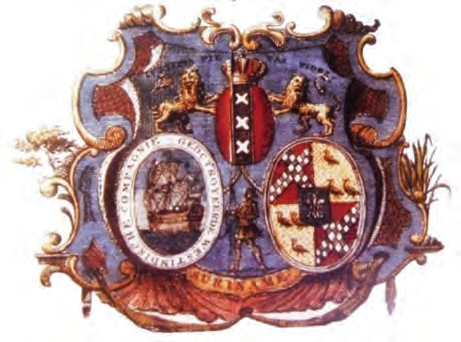

# Hoe ons land werd bestuurd

## Lección 1: De gouverneur en de Politieke Raad

---

### Contenido del Libro de Estudiantes

De gouverneur en de Politieke Raad

In de tijd dat er in ons land nog alleen Inheemsen woonden, hadden de verschillende

groepen hun eigen regels en bestuur. Toen de Europeanen kwamen, namen ze niet alleen het land in bezit, maar maakten ze ook hun eigen wetten en regels. In 1650 werd ons land in bezit genomen door Engelsen onder leiding van Lord Willoughby. Later werd het veroverd door Nederland. Het bestuur van ons land kwam in handen van buitenlandse bestuurders. In 1683 werd de Geoctrooieerde Sociëteit van Suriname opgericht. Deze Sociëteit kreeg toestemming

of octrooi van Nederland om de kolonie te besturen en werd de nieuwe eigenaar van ons land. In het octrooi stond onder meer hoe het bestuur geregeld moest zijn. De gouverneur had het hoogste gezag in de kolonie en werd benoemd door de Sociëteit. Zo werd in 1683 Cornelis van Aerssen van Sommelsdijck gouverneur van ons land.1

De gouverneur werd bij het besturen van het land bijgestaan door de Politieke Raad, ook

wel Hof van Politie genoemd. De leden van de Politieke Raad werden door de gouverneur benoemd. Voor elk lid moest de gouverneur uit twee kandidaten kiezen, die eerst door de blanke kolonisten gekozen waren. Omdat deze raad bestond uit rijke plantage-eigenaren, begrijp je wel dat zij vooral hun eigen belangen dienden. De slaafgemaakten en een heel groot deel van de vrije bevolking in ons land hadden geen enkele invloed op het bestuur. De Politieke Raad moest de besluiten en wetten van de gouverneur goedkeuren, maar zij waren het niet altijd eens met elkaar. Dit kwam omdat de gouverneur de belangen van de Sociëteit diende en de Raad opkwam voor de plantage -eigenaren. Vaker

ontstonden ruzies over bijvoorbeeld de belasting die de kolonisten moesten betalen.

Het wapen van de Geoctrooieerde Sociëteit van Suriname2

Het bestuur van ons land tijdens de Geoctrooieerde Sociëteit van

Suriname3

Geoctrooieerde

Sociëteit van

Surinamegouverneur

Politieke Raadbenoemt

kiezenvormen samen

het bestuur van

ons land

kandidatenblanke

kolonistenOPDRACHT

• Door wie werd het bestuur van ons land

gevormd?

• Vul in: De gouverneur vertegenwoordigde de …

• Vul in: De Politieke Raad vertegenwoordigde de …BIJ AFBEELDING 3

79

Thema 6 | Les 1 – De gouverneur en de Politieke RaadLes

---

De Geoctrooieerde Sociëteit werd in 1795 opgeheven. Nederland werd in dat jaar bezet

door Frankrijk. Ons land kwam in 1799 onder gezag van Engeland te staan. Dit bleef zo tot 1816. Deze periode wordt het Engels tussenbestuur genoemd. Veel veranderde er niet in het bestuur van ons land, alleen waren er in deze periode Engelse gouverneurs in ons land. Een belangrijke maatregel in deze periode was het verbod in 1808 op de handel in slaafgemaakten. Engeland gaf Suriname in 1816 terug aan Nederland, onder voorwaarde dat het verbod op de handel in slaafgemaakten bleef bestaan.

OM TE ONTHOUDEN

• In 1683 werd de Geoctrooieerde Sociëteit van Suriname eigenaar van ons land. Deze Sociëteit bleef bestaan tot 1795.

• Ons land werd in die tijd bestuurd door een gouverneur, bijgestaan door de Politieke Raad.

• In 1816 kwam ons land onder direct gezag van de Nederlandse koning.

• De Nederlandse koning benoemde een Minister van Koloniën, die opdrachten gaf aan de gouverneur.

• Van 1816 tot 1866 was het bestuur van ons land in handen van de gouverneur alleen.

Het paleis van de gouverneur in ons land4

Gebouw van het Ministerie van Koloniën5Vanaf 1816 kwam het bestuur van de kolonie Suriname onder het directe gezag van de Nederlandse koning. Er kwamen toen enkele veranderingen in het bestuur van ons land. In Nederland was er een Raad van Ministers die de koning hielp het land te besturen. Voor de koloniën was er een Minister van Koloniën. Hij gaf opdrachten

aan de gouverneur in de kolonie. In ons land werden de bevoegdheden van de Politieke Raad sterk beperkt. Zij had enkel nog een adviserende taak. Het bestuur van ons land was tot 1866 in handen van de gouverneur alleen. En hij was alleen verantwoording verschuldigd aan de Minister van Koloniën.

OPDRACHT

• In welk land stond dit gebouw?

• Welke taak had de Minister van Koloniën?

• Aan wie gaf de minister opdrachten? BIJ AFBEELDING 5

80

Thema 6 | Les 1 – De gouverneur en de Politieke Raad

---

VRAGEN

1. Neem de tijdlijn over in je schrift.

1600 1700 1800 1900

Plaats de volgende gebeurtenissen in de

juiste volgorde op de tijdlijn:• Oprichting Geoctrooieerde Sociëteit van Suriname

• Opheffing Geoctrooieerde Sociëteit van Suriname

• Periode van Engels tussenbestuur

2. In 1683 werd de Geoctrooieerde Sociëteit van Suriname eigenaar van ons land. Deze Sociëteit bleef bestaan tot 1795. Reken uit hoeveel jaar de Geoctrooieerde Sociëteit van Suriname heeft bestaan.

3. Door wie werd het bestuur van ons land in de 18e eeuw gevormd?1. In Nederland door: …

2. In Suriname door: …

4. Leg uit hoe iemand lid werd van de Politieke Raad.

5. Leg uit waarom de samenwerking tussen de gouverneur en de Politieke Raad niet altijd goed was.

6. Welke bewering over de Politieke Raad is niet juist?

A. Een andere naam voor Politieke raad was Hof van Politie.

B.De gouverneur benoemde de leden van de Politieke Raad.

C. De Politieke Raad vertegenwoordigde de bevolking van ons land.

D.Tussen 1816 en 1866 had de Politieke Raad geen bestuursbevoegdheid.7. De periode van 1799 tot 1816 wordt wel het Engels tussenbestuur genoemd. Leg deze benaming uit.

8. In 1799 kwam ons land onder Engels gezag.a. Hoeveel jaar duurde dit Engels gezag?

b. Welke belangrijke maatregel werd in die periode genomen?

c. Noem het jaartal waarin die maatregel genomen werd.

9. Noem een verschil in de bevoegdheden van de Politieke Raad in de periode voor 1816 en daarna.

10. Welke bewering is juist?I. Het bestuur van ons land werd tussen 1816 en 1866 in Nederland bepaald.

II. Het bestuur van ons land werd tussen 1816 en 1866 gevormd door de gouverneur en de Politieke Raad.

A. Alleen bewering I is juist.

B.Alleen bewering II is juist.

C. Bewering I en II zijn juist.

D.Bewering I en II zijn onjuist.

81

Thema 6 | Les 1 – De gouverneur en de Politieke Raad

---

### Imágenes de la Lección

---

### Guía del Profesor - Respuestas y Explicaciones

106

Les

Thema 6 – Hoe ons landwerd bestuurdDe gouverneur en de Politieke Raad

VRAGEN EN ANTWOORDEN

1. Neem de tijdlijn o ver in je schrift.

1600 1700 1800 1900

Plaats de volgende gebeurtenissen in de juiste volgorde op de tijdlijn:

• Oprichting Geoctrooieerde Sociëteit van Suriname – 1683

• Opheffing Geoctrooieerde Sociëteit van Suriname – 1795

• Periode van Engels tussenbestuur – vanaf 1799 tot en met 1816

2. In 1683 werd de Geoctrooieerde Sociëteit van Suriname eigenaar van ons land. Deze

Sociëteit bleef bestaan tot 1795. Reken uit hoeveel jaar de Geoctrooieerde Sociëteit van

Suriname heeft bestaan.

De Geoctrooieerde Sociëteit van Suriname heeft 112 jaren bestaan. (1795 – 1683 = 112)

3. Door wie werd het bestuur van ons land in de 18e eeuw gevormd?

1. In Nederland door: Geoctrooieerde Sociëteit van Suriname

2. In Suriname door: Gouverneur en Politieke Raad

4. Leg uit hoe iemand lid werd van de Politieke Raad.

De leden van de Politieke Raad werden door de gouverneur benoemd. Voor elk lid moest

de gouverneur uit twee kandidaten kiezen, die eerst door de blanke kolonisten gekozen

waren.

5. Leg uit waarom de samenwerking tussen de gouverneur en de Politieke Raad niet altijd

goed was.

De samenwerking tussen de gouverneur en de Politieke Raad was niet altijd goed, omdat

zij het niet altijd eens waren met elkaar. Dit omdat de gouverneur de belangen van de

Sociëteit diende en de Raad opkwam voor de plantage-eigenaren.

(Anders gezegd: de gouverneur lette vooral op de belangen van de Geoctrooieerde

Sociëteit en de Politieke Raad vooral op de belangen van de plantage-eigenaren)

6. Welke bewering over de Politieke Raad is niet juist?

a. Een andere naam voor Politieke raad was Hof van Politie.

b. De gouverneur benoemde de leden van de Politieke Raad.

c. De Politieke Raad vertegenwoordigde de bevolking van ons land.

d. Tussen 1816 en 1866 had de Politieke Raad geen bestuursbevoegdheid

7. De periode van 1799 tot 1816 wordt wel het Engels tussenbestuur genoemd. Leg deze

benaming uit.

In deze periode was ons land onder gezag van Engeland. Engelse gouverneurs

bestuurden ons land. Het wordt tussenbestuur genoemd, omdat dit Engelse bestuur

tussen twee periodes van Nederlands bestuur valt.

Toelichting voor de leerkracht: eerste Nederlandse bestuur van 1667 tot 1799 en tweede

Nederlandse bestuur van 1816 tot 1975. Het Engelse bestuur ligt ertussen.1

---

107

Thema 6 – Hoe ons landwerd bestuurd8. In 1799 kwam ons land onder Engels gezag.

a. Hoev eel jaar duurde dit Engels gezag?

Dit gezag duurde 17 jaren. (1816-1799 =17)

b. Welke belangrijke maatregel werd in die periode genomen?

Een belangrijke maatregel in deze periode was het verbod op de handel in slaafge -

maakten.

c. Noem het jaar tal waarin die maatregel genomen werd.

In 1808 werd de maatregel genomen.

9. Noem een v erschil in de bevoegdheden van de Politieke Raad in de periode voor 1816

en daarna.

Voor 1816 bestuurde de gouverneur samen met de Politieke Raad ons land. Na 1816 had

de Politieke Raad alleen nog maar een adviserende rol en bestuurde de gouverneur het

land alleen.

10. Welke bewering is juist?

I. Het bestuur v an ons land werd tussen 1816 en 1866 in Nederland bepaald.

II. Het bestuur v an ons land werd tussen 1816 en 1866 gevormd door de gouverneur en

de Politieke Raad.

a. Alleen bewering I is juist.

b. Alleen bewering II is juist.

c. Bewering I en II zijn juist.

d. Bewering I en II zijn onjuist.

---

*Fuente: suriname-history.pdf (estudiantes) y suriname-history-teacher-guide.pdf (profesor)*
