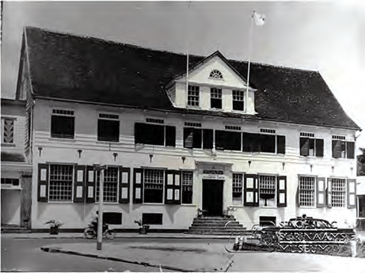
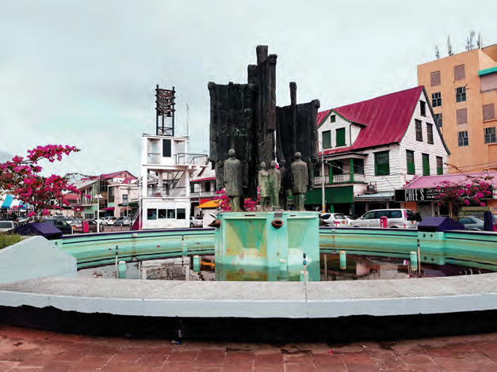
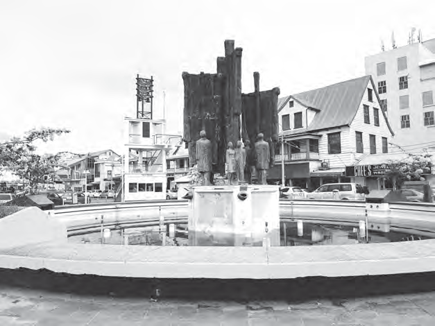

# Hoe ons land werd bestuurd

## Lección 2: Invoering van kiesrecht

---

### Contenido del Libro de Estudiantes

Invoering van kiesrecht

In 1863 werd de slavernij in ons land afgeschaft. Daardoor veranderde veel in onze

samenleving. Vanaf dat jaar waren er in ons land geen slaafgemaakten meer. Na de afschaffing van de slavernij volgden nog tien jaren van Staatstoezicht. Tijdens deze periode werd ons land voor het eerst ingedeeld in districten. De districten kwamen onder leiding te staan van een districtscommissaris. De districtscommissaris werd benoemd door de gouverneur en was de hoogste ambtenaar in een district. Hij was ook het hoofd van de politie in dat gebied en hij moest vooral zorgen voor rust en orde.2

OPDRACHT

• Welke ambtenaar woonde in dit huis?

• Door wie wordt de districtscommissaris benoemd?

• Welke taken had de districtscommissaris?

• Wanneer werd ons land voor het eerst ingedeeld in districten? BIJ AFBEELDING 6

Dienstwoning van een districtscommissaris6

Er vonden nog andere veranderingen in het bestuur van het land plaats. Zo werd het besluit genomen om in ons land de Koloniale Staten in te stellen. De Koloniale Staten vertegenwoordigde het volk van ons land en bestond uit 13 leden. Hiervan benoemde de gouverneur 4 leden, de overige 9 leden werden door middel van het censuskiesrecht gekozen voor zes jaar. De eerste verkiezingen werden op 5 april 1866 gehouden.

In de Koloniale Staten zaten eigenlijk enkel vertegenwoordigers van de rijkste mensen in

ons land, want in die tijd bestond alleen het censuskiesrecht. Dat betekende dat alleen

diegenen die een bepaald bedrag aan belasting betaalden of een bepaald inkomen hadden mochten gaan stemmen. Op deze manier had het allergrootste deel van onze bevolking geen kiesrecht. Bij invoering van dit kiesrecht in 1866 waren er maar 250 burgers in ons land die mochten stemmen.

OPDRACHT

• Welk gebouw zie je op de afbeelding?

• Door wie werd er vergaderd in dit gebouw?

• Reken uit hoe lang geleden de Koloniale Staten werd opgericht.BIJ AFBEELDING 7

Het gebouw waarin de Koloniale Staten vergaderden. Dit gebouw

is helaas afgebrand (maar wordt nu weer opgebouwd).7

82

Thema 6 | Les 2 – Invoering van kiesrechtLes

---

Samen met de gouverneur vormde de Koloniale Staten de regering van het land.

Voorgestelde wetten van de gouverneur werden eerst gekeurd door de Koloniale Staten. In die tijd waren er nog geen ministers. De gouverneur bestuurde het land. De gouverneur werd benoemd en ontslagen door de Nederlandse regering.

In 1937 vonden een paar veranderingen in het bestuur plaats. Zo veranderde de naam van

de Koloniale Staten in Staten van Suriname. Het aantal leden dat zitting had in de staten werd verhoogd naar 15. Hiervan werden tien gekozen en vijf door de gouverneur benoemd.Ook het kiesrecht veranderde. Naast het censuskiesrecht kwam nu ook het capaciteitskiesrecht. Dit kiesrecht werd gegeven aan mensen met minimaal een ULO- diploma. Dit had tot gevolg dat meer mensen konden gaan stemmen. Niet meer alleen de rijke plantage-eigenaren en kolonisten, maar ook onderwijzers en ambtenaren. Toch was het aantal kiezers nog altijd minder dan 2% van de totale bevolking.

In 1966 werd het Statenmonument onthuld op het Vaillantsplein in Paramaribo, op de

hoek van de Keizerstraat en de Heiligenweg. Dit monument werd opgericht ter herdenking aan 100 jaar Koloniale Staten.

OM TE ONTHOUDEN

• Tijdens het staatstoezicht werd ons land verdeeld in districten die onder leiding stonden van een districtscommissaris. De districtscommissarissen werden benoemd door de gouverneur.

• In 1866 werd de Koloniale Staten opgericht en bestond uit 13 leden.

• Negen leden van de Koloniale Staten werden gekozen volgens het censuskiesrecht en vier werden benoemd door de gouverneur.

• Het Statenmonument herdenkt de oprichting van de Koloniale Staten.

• In 1937 veranderde de naam Koloniale Staten in Staten van Suriname en werd het aantal leden verhoogd naar 15.

• Naast het censuskiesrecht werd ook het capaciteitskiesrecht ingevoerd.

Het Statenmonument in Paramaribo8

83

Thema 6 | Les 2 – Invoering van kiesrecht

---

VRAGEN

1. Neem de tijdlijn over in je schrift.

1850 1900 1950

Plaats de volgende gebeurtenissen in de

juiste volgorde op de tijdlijn:• Periode van het Staatstoezicht.

• Instelling Koloniale Staten

• Invoering capaciteitskiesrecht

2. Welke twee gebeurtenissen in het bestuur van ons land vonden plaats tijdens het Staatstoezicht?

A. Oprichting Hof van Politie en instelling van districten.

B.Oprichting Koloniale Staten en instelling van districten.

C. Oprichting Koloniale Staten en invoering algemeen kiesrecht.

D.Oprichting Koloniale Staten en invoering capaciteitskiesrecht.

3. Leg uit welke mensen volgens het censuskiesrecht konden stemmen.

4. Vertegenwoordigde de Koloniale Staten de hele bevolking van ons land? Leg ook uit waarom je dat zegt.

5. Welk antwoord is juist?De Koloniale Staten werden opgericht in 1866. Dit was in de …

A. eerste helft van de 18e eeuw.

B.tweede helft van de 18e eeuw.

C. eerste helft van de 19e eeuw.

D.tweede helft van de 19e eeuw.

6. a. Wanneer werd het Statenmonument

opgericht?

b. Ter gelegenheid van welke gebeurtenis was dit?7. Welke bewering is juist?I. Wetten in ons land werden gemaakt door de gouverneur en de Koloniale Staten.

II. De gouverneur vormde samen met de Koloniale Staten de regering van ons land.

A. Alleen bewering I is juist.

B.Alleen bewering II is juist.

C. Bewering I en II zijn juist.

D.Bewering I en II zijn onjuist.

8. Noem drie veranderingen op die in 1937 plaatsvonden in het bestuur van ons land.

9. Leg uit welke mensen volgens het capaciteitskiesrecht konden stemmen.

10. Neem het schema over in je schrift en vul het in:

Koloniale StatenStaten van Suriname

Jaar van oprichting

Aantal leden

Kiesrecht

84

Thema 6 | Les 2 – Invoering van kiesrecht

---

### Imágenes de la Lección

---

### Guía del Profesor - Respuestas y Explicaciones

108

Les

Thema 6 – Hoe ons landwerd bestuurdInvoering van kiesrecht

VRAGEN EN ANTWOORDEN

1. Neem de tijdlijn o ver in je schrift.

1850 1900 1950

Plaats de volgende gebeurtenissen in de juiste volgorde op de tijdlijn:

• Periode van het Staatstoezicht – 1863-1873

• Instelling Koloniale Staten – 1866

• Invoering capaciteitskiesrecht – 1937

2. Welke twee gebeurtenissen in het bestuur van ons land vonden plaats tijdens het

Staatstoezicht?

a. Oprichting Hof van Politie en instelling van districten.

b. Oprichting Koloniale Staten en instelling van districten.

c. Oprichting Koloniale Staten en invoering algemeen kiesrecht.

d. Oprichting Koloniale Staten en invoering capaciteitskiesrecht.

3. Leg uit welke mensen volgens het censuskiesrecht konden stemmen.

Volgens het censuskiesrecht konden alleen die mensen stemmen die een bepaald

inkomen hadden of een bepaald bedrag betaalden aan belasting.

4. Vertegenwoordigde de Koloniale Staten de hele bevolking van ons land? Leg ook uit

waarom je dat zegt.

Nee, de Koloniale Staten vertegenwoordigde alleen de rijkste mensen in ons land, want

alleen zij mochten stemmen volgens het censuskiesrecht. Het grootste deel van de bevol-

king had geen stemrecht.

5. Welk antwoord is juist?

De Koloniale Staten werd opgericht in 1866. Dit was in de …

a. eerst e helft van de 18e eeuw.

b. tweede helft van de 18e eeuw.

c. eerst e helft van de 19e eeuw.

d. tweede helft van de 19e eeuw.

6. a. Wanneer werd het Statenmonument opgericht?

Het Statenmonument werd opgericht in 1966.

b. Ter gelegenheid van welke gebeurtenis was dit?

Ter herdenking aan 100 jaar Koloniale Staten.

7. Welke bewering is juist?

I. Wetten in ons land werden gemaakt door de gouverneur en de Koloniale Staten.

II. De gouverneur vormde samen met de Koloniale Staten de regering van ons land.

a. Alleen bewering I is juist.

b. Alleen bewering II is juist.

c. Bewering I en II zijn juist.

d. Bewering I en II zijn onjuist.2

---

109

Thema 6 – Hoe ons landwerd bestuurd8. Noem dr ie veranderingen op die in 1937 plaatsvonden in het bestuur van ons land.

a. De naam van de Koloniale Staten veranderde in Staten van Suriname

b. Het aantal leden werd verhoogd van 13 naar 15. 10 werden gekozen en 5 werden

door de gouverneur benoemd.

c. Het kiesrecht veranderde. Naast het censuskiesrecht kwam nu ook het capaciteit-

skiesrecht.

9. Leg uit welke mensen volgens het capaciteitskiesrecht konden stemmen.

Volgens het capaciteitskiesrecht konden mensen met minimaal een ULO-diploma

stemmen.

10. Neem het schema o ver in je schrift en vul het in:

Koloniale Staten Staten van Suriname

Jaar van oprichting 1866 1937

Aantal leden 13 15

Kiesrecht Censuskiesrecht Capaciteitskiesrecht

---

*Fuente: suriname-history.pdf (estudiantes) y suriname-history-teacher-guide.pdf (profesor)*
