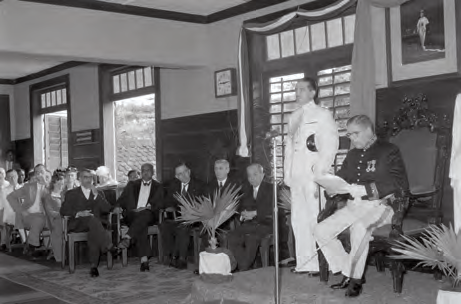
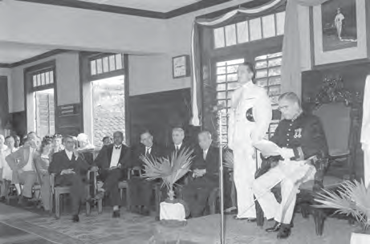
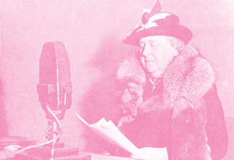
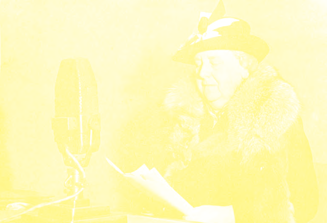

# Hoe ons land werd bestuurd

## Lección 3: Baas in eigen huis!

---

### Contenido del Libro de Estudiantes

Baas in eigen huis!

De gouverneur en de Statenleden waren het niet altijd eens met elkaar. Er waren wel eens

conflicten. De gouverneur werd benoemd door de Nederlandse regering. Hij lette meer op de Nederlandse belangen dan op die van het Surinaamse volk. De Statenleden waren de vertegenwoordigers van het Surinaamse volk. Deze meningsverschillen waren niet nieuw. In les 1 heb je ook al gelezen dat de gouverneur en de Politieke Raad soms ruzie kregen. 3

De conflicten tussen de gouverneur en de Staten namen vooral toe tijdens het bestuur van gouverneur Kielstra. Hij was gouverneur van ons land van 1933 tot 1944. Tijdens de Tweede Wereldoorlog, kondigde hij de staat van beleg af in ons land, toen Nederland bezet werd door Duitsland. In het belang van het land mocht hij doen wat hij goed vond, hij had daarvoor geen toestemming van de Statenleden nodig. Het bestuur werd toen alleen door de gouverneur bepaald. Maar niet iedereen was het altijd met hem eens. Wie te veel kritiek leverde, werd echter opgepakt en in een gevangenis opgesloten. Dit gebeurde bijvoorbeeld met het statenlid Wim Bos Verschuur. Hij was in 1942 gekozen tot statenlid en vanaf het begin was hij een felle tegenstander van de gouverneur. Al voordat hij lid van de Koloniale Staten werd, was Wim Bos Verschuur een actieve strijder voor het volk en zette zich in voor de arbeiders.

Een gouverneur houdt een toespraak voor de Staten van

Suriname9OPDRACHT

• Waar denk je dat de mensen zijn?

• Wijs de gouverneur aan.

• Welke belangen behartigde de

gouverneur? BIJ AFBEELDING 9

Het Statenlid Wim Bos Verschuur10

85

Thema 6 | Les 3 – Baas in eigen huis!Les

---

Toen de oorlog afgelopen was, werd vanuit Suriname bij de Nederlandse regering

aangedrongen op de beloofde veranderingen. Onder andere de organisatie Unie Suriname

drong aan op onderhandelingen over zelfbestuur, onder de leus “Baas in eigen huis” . In 1948 werd begonnen met gesprekken over zelfbestuur met Nederland. Deze gesprekken staan bekend als de Ronde Tafel Conferenties. Twee belangrijke onderwerpen hierbij waren het kiesrecht en het zelfbestuur.

In 1948 werden na de eerste Ronde Tafel Conferentie alvast een aantal veranderingen in het

bestuur van ons land ingevoerd:1. Naast de gouverneur kwam er een groep mensen die samen met hem het land bestuurden. Deze groep heette eerst College van Algemeen bestuur. Vanaf 1950 veranderde de naam in Raad van Ministers of Ministerraad.

2. Het aantal Statenleden werd gebracht op 21. De leden werden voor vier jaar gekozen, volgens het algemeen kiesrecht.

Opening van de Ronde Tafel Conferentie in 194812OPDRACHT

• Waaraan zie je dat er tijdens deze besprekingen letterlijk sprake was van een ronde tafel?

• Waarover werd er tijdens de Ronde Tafel Conferentie van 1948 gesproken?BIJ AFBEELDING 12

Het algemeen kiesrecht hield in dat mensen die de leeftijd van 23 jaar bereikt hadden, mochten stemmen. Later is deze leeftijd verlaagd naar 21 en tegenwoordig is het 18 jaar.

Het kiesrecht dat in 1948 werd ingevoerd was zowel voor mannen als vrouwen. Voor 1948

mochten vrouwen niet stemmen. Ze konden echter wel als Statenlid gekozen worden. De eerste vrouw in ons land, die Statenlid werd was Grace Schneiders-Howard. Zij werd in 1938 gekozen als lid van de Staten van Suriname.Tijdens de Tweede Wereldoorlogproduceerde ons land veel meer bauxiet dan voorheen. Hierdoor verdiende ons land veel geld. Zo had ons land in 1942 voor het eerst sinds 1866 genoeg geld om alle uitgaven zelf te betalen. Op 7 december 1942 werd door de Nederlandse koningin via een radioredeaan de kolonies beloofd dat zij na de oorlog meer inspraak zouden krijgen in het bestuur van hun eigen land. De kolonies zouden zelfbestuur krijgen.

De Nederlandse koningin bij een radiorede11

86

Thema 6 | Les 3 – Baas in eigen huis!

---

In 1954 vond een tweede Ronde Tafel

Conferentie plaats. Op deze vergadering werd over zelfbestuur of autonomie van ons land gesproken. De afspraken werden vastgelegd in een officieel reglement, het Statuut voor het Koninkrijk der Nederlanden. Door het Statuut kreeg ons land zelfbestuur in binnenlandse aangelegenheden. Maar alles wat te maken had met het buitenland, zoals het sluiten van overeenkomsten met andere landen en de verdediging van het koninkrijk bleef in handen van Nederland. Veel mensen waren blij. Ons land kon nu immers zijn eigen zaken regelen. Al gauw bleek echter dat ook na 1954 de invloed van Nederland op ons land groot was. De wens van volledige onafhankelijkheid groeide, hoewel de meningen verdeeld waren. Er waren mensen die zo snel mogelijk de onafhankelijkheid wilden. Er waren ook anderen die vonden dat het land eerst economisch zelfstandig moest zijn om politiek zelfstandig te kunnen worden. Uiteindelijk werd ons land op 25 november 1975 onafhankelijk. Ons land werd op die dag een Republiek. Hierover lees je meer in thema 7.

Grace Schneiders-Howard13

OM TE ONTHOUDEN

• Tussen de gouverneur en de Statenleden waren er wel eens conflicten.

• Wim Bos Verschuur werd in 1942 als statenlid gekozen. Hij had veel kritiek op het beleid van gouverneur Kielstra.

• Na de Tweede Wereldoorlog werden er Ronde Tafel Conferenties gehouden over kiesrecht en zelfbestuur.

• In 1948 werd het algemeen kiesrecht in ons land ingevoerd.

• Grace Schneiders-Howard werd in 1938 het eerste vrouwelijke Statenlid.

• In 1954 kwam het Statuut voor het Koninkrijk der Nederlanden tot stand. Hiermee kreeg ons land autonomie of zelfbestuur.

87

Thema 6 | Les 3 – Baas in eigen huis!

---

VRAGEN

1. a. Vertel met eigen woorden of zoek op

in een woordenboek wat met conflict

bedoeld wordt.

b. Leg uit waarom tussen de gouverneur en de Statenleden conflicten waren.

2. In thema 4 is gesproken over de staat van beleg. a. Wat hield dat ook alweer in?

b. Waarom zal niet altijd iedereen het met de gouverneur eens zijn geweest?

3. Welke bewering over Wim Bos Verschuur is niet juist?

A. Hij had veel kritiek op het beleid van gouverneur Kielstra.

B.Hij kwam op voor het Surinaamse volk.

C. Gouverneur Kielstra liet hem oppakken en opsluiten.

D.In 1942 werd hij door de gouverneur benoemd tot Statenlid.

4. Welke belofte deed de Nederlandse koningin in 1942 aan ons land?

5. Leg uit wat wordt bedoeld met de leus: “Baas in eigen huis. ”

6. Welke twee belangrijke onderwerpen werden tijdens de Ronde Tafel Conferenties besproken?7. Leg uit welke mensen volgens het algemeen kiesrecht in 1948 konden stemmen.

8. Welke bewering over Grace Schneiders-Howard is juist?

A. Zij heeft het vrouwenkiesrecht ingevoerd.

B.Zij was de eerste vrouw die mocht stemmen.

C. Zij was het eerste vrouwelijke Statenlid.

D.Zij werd gekozen volgens het algemeen kiesrecht.

9. a. In welk jaar werd het Statuut in ons

land van kracht?

b. Wat betekende het zelfbestuur voor ons land?

10. Welke bewering is juist?I. Met de autonomie kon ons land over alles zelf beslissen.

II. Veel mensen in ons land waren ontevreden over de autonomie.

A. Alleen bewering I is juist.

B.Alleen bewering II is juist.

C. Bewering I en II zijn juist.

D.Bewering I en II zijn onjuist.

88

Thema 6 | Les 3 – Baas in eigen huis!

---

### Imágenes de la Lección

---

### Guía del Profesor - Respuestas y Explicaciones

110

Les

Thema 6 – Hoe ons landwerd bestuurdBaas in eigen huis!

VRAGEN EN ANTWOORDEN

1. a. Vertel met eigen woorden of zoek op in een woordenboek wat met conflict bedoeld

wordt.

Met conflict wordt ruzie of onenigheid bedoeld.

b. Leg uit waarom er tussen de gouverneur en de Statenleden conflicten waren.

Er waren wel eens conflicten tussen de gouverneur en de Statenleden, omdat de

gouverneur meer op de Nederlandse belangen lette dan op die van het Surinaamse

volk.

2. In thema 4 is gesproken over de staat van beleg.

a. Wat hield dat ook alweer in?

Bij de staat van beleg kreeg de gouverneur alle macht in handen, waardoor hij in zijn

eentje beslissingen kon nemen.

b. Waarom zal niet altijd iedereen het met de gouverneur eens zijn geweest?

Niet iedereen zal het altijd eens zijn geweest met de gouverneur omdat hij vaak

genoeg beslissingen nam in het voordeel van Nederland.

3. Welke bewering over Wim Bos Verschuur is niet juist?

a. Hij had veel kritiek op het beleid van gouverneur Kielstra.

b. Hij kwam op voor het Surinaamse volk.

c. Gouverneur Kielstra liet hem oppakken en opsluiten.

d. In 1942 werd hij door de gouverneur benoemd tot Statenlid.

4. Welke belofte deed de Nederlandse koningin in 1942 aan ons land?

De Nederlandse koningin beloofde dat de koloniën na de oorlog meer inspraak zouden

krijgen in het bestuur van hun eigen land.

(Anders gezegd: De Nederlandse koningin beloofde ons land zelfbestuur.)

5. Leg uit wat wordt bedoeld met de leus: “Baas in eigen huis. ”

Met de leus ‘Baas in eigen huis’ wordt bedoeld dat je in je eigen huis zelf de baas bent. In

je eigen huis heb jij het voor het zeggen. In dit geval wordt met eigen huis ons eigen land

(Suriname) bedoeld.

6. Welke twee belangrijke onderwerpen werden tijdens de Ronde Tafel Conferenties

besproken?

Twee belangrijke onderwerpen bij de Ronde Tafel Conferenties waren het kiesrecht en

zelfbestuur.

7. Leg uit welke mensen volgens het algemeen kiesrecht in 1948 konden stemmen.

Bij het algemeen kiesrecht mochten mensen stemmen die de leeftijd van 23 jaar bereikt

hadden. Later is deze leeftijd verlaagd naar 21 en tegenwoordig is dat 18 jaar.

8. Welke bewering over Grace Schneiders-Howard is juist?

a. Zij heef t het vrouwenkiesrecht ingevoerd.

b. Zij w as de eerste vrouw die mocht stemmen.

c. Zij was het eerste vrouwelijke Statenlid.

d. Zij w erd gekozen volgens het algemeen kiesrecht.3

---

111

Thema 6 – Hoe ons landwerd bestuurd9. a. In welk jaar werd het Statuut in ons land van kracht?

In 1954

b. Wat betekende het zelfbestuur voor ons land?

Dat betekende dat ons land zelf de binnenlandse zaken kon regelen.

10. Welke bewering is juist?

I. Met de autonomie kon ons land over alles zelf beslissen.

II. Veel mensen in ons land waren ontevreden over de autonomie.

a. Alleen bewering I is juist.

b. Alleen bewering II is juist.

c. Bewering I en II zijn juist.

d. Bewering I en II zijn onjuist.

---

*Fuente: suriname-history.pdf (estudiantes) y suriname-history-teacher-guide.pdf (profesor)*
