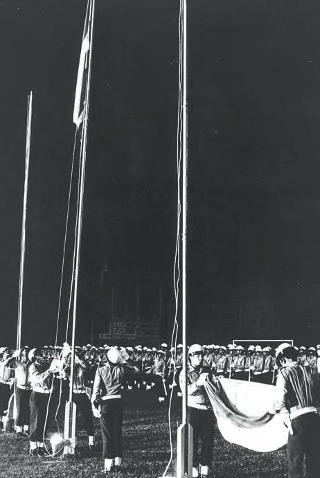
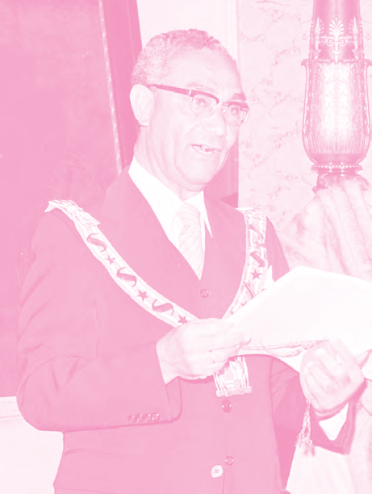
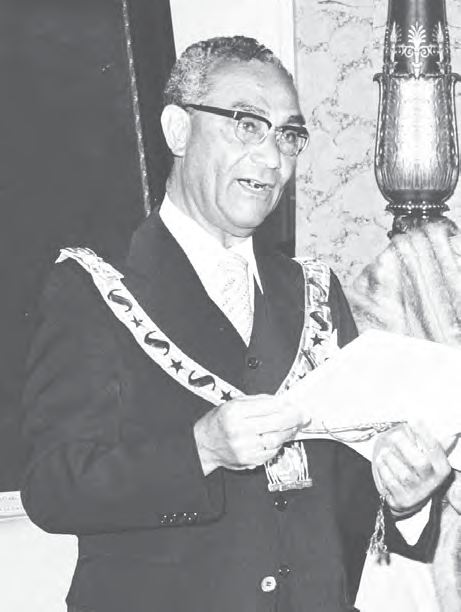
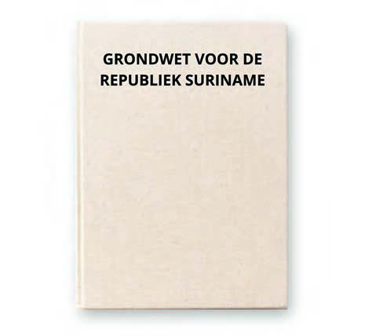
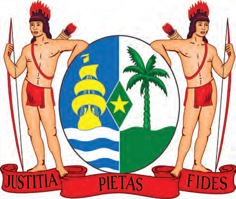

# Ons land, een zelfstandige republiek

## Lección 1: De onafhankelijkheid van ons land

---

### Contenido del Libro de Estudiantes

De onafhankelijkheid van ons land 1

Op 25 november 1975 werd Suriname

onafhankelijk. Vanaf dat moment was ons land geen kolonie meer van Nederland en kon ons land zelfstandig alle beslissingen nemen. Dit gebeurde natuurlijk niet plotseling. Aan deze dag zijn veel gesprekken tussen het bestuur in Suriname en Nederland voorafgegaan. Op 25 november 1975 werd de Nederlandse vlag neergehaald en voor het eerst de nieuwe Surinaamse vlag gehesen. Hierbij werd ook voor het eerst het Surinaamse volkslied met een couplet in het Sranan gezongen.

Suriname werd een Republiek; hiermee

veranderde het bestuur van ons land. Het hoogste gezag lag vanaf de onafhankelijkheid niet langer bij Nederland. Zij benoemden niet langer de gouverneur in ons land. De functie van gouverneur werd opgeheven. De hoogste bestuurder van ons land werd de president. Dr. Johan

Ferrier werd de eerste president. Tot 25

november 1975 was hij gouverneur van Suriname. Onze laatste gouverneur werd dus onze eerste president. Ook de naam van de Staten van Suriname veranderde in het Parlement van de Republiek Suriname. De statenleden werden parlementsleden.

De president is het hoofd van de regering.

Een regering moet het land besturen. Hiervoor zijn er wetten en regels. De belangrijkste wetten en regels in een land zijn vastgelegd in een grondwet. In een grondwet staat onder meer hoe het land bestuurd moet worden. Ook staat in een grondwet welke rechten de burgers in het land hebben. Een grondwet is de basis voor alle andere wetten. Bij de onafhankelijkheid in 1975 kreeg Suriname ook een Grondwet. Zo staat er in onze Grondwet bijvoorbeeld dat kinderen recht hebben op goed onderwijs. Ook staat er dat de mensen in het land het recht hebben om zich te verenigen in organisaties.

Het hijsen van de nieuwe Surinaamse vlag2

Onze eerste president, Johan Ferrier3

93

Thema 7 | Les 1 – De onafhankelijkheid van ons landLes

---

Naast rechten hebben mensen ook

plichten. De plichten zijn ook in de Grondwet vermeld. Bijvoorbeeld de plicht om belasting te betalen. Ook is iedereen verplicht om gehoorzaam te zijn aan het gezag in het land. De regering is op haar beurt verplicht om het land goed te besturen. Ze moet haar bestuur kunnen verantwoorden.

OPDRACHT

• Wat zie je op deze afbeelding?

• Wat staat onder andere in een grondwet?

• Noem een burgerrecht en een burgerplicht.BIJ AFBEELDING 4

OM TE ONTHOUDEN

• Op 25 november 1975 werd Suriname een onafhankelijke Republiek.

• De laatste gouverneur, Johan Ferrier werd onze eerste president.

• De Staten van Suriname veranderde in het Parlement van de Republiek Suriname

• Suriname kreeg een Grondwet, waarin stond hoe het land bestuurd moet worden en ook de rechten en plichten van de burgers.

• De vlag, het volkslied en het wapen zijn onze nationale symbolen.

De Grondwet van 19754

Het wapen van de Republiek Suriname5Bij de onafhankelijkheid kreeg ons land dus een eigen Grondwet en een president. Henck Arron werd de eerste premier van de republiek Suriname. De functie van premier werd in 1987 vervangen door Vicepresident van Suriname. Aan het begin van deze les is al geschreven dat wij ook onze eigen vlag (en andere versie dan de eerste vlag uit 1959) en volkslied kregen. Suriname heeft ook een nationaal wapen. Een wapen is een afbeelding, meestal in de vorm van een schild. Het wapen van ons land zie je op afbeelding 5.

OPDRACHT

• Beschrijf het wapen van ons land

• Waarom denk je dat er twee Inheemsen staan op ons wapenschild?BIJ AFBEELDING 5

De vlag, het volkslied en het wapen zijn de nationale symbolen van ons land. Deze symbolen hebben een speciale betekenis. Ze symboliseren ons land en haar bewoners, niet alleen in ons land, maar vooral ook daarbuiten. Als er bijvoorbeeld sportwedstrijden tussen verschillende landen worden gehouden, zingen de Surinaamse sporters het Surinaams volkslied. Ook zie je de vlaggen van de verschillende landen die meedoen aan de wedstrijden. De afbeelding van het wapen van Suriname zie je bijvoorbeeld op het Surinaams paspoort, maar ook op rijbewijzen en identiteitskaarten.

94

Thema 7 | Les 1 – De onafhankelijkheid van ons land

---

VRAGEN

1. a. Zoek het woord onafhankelijk op in

een woordenboek of op het internet

en leg met eigen woorden uit wat daarmee bedoeld wordt.

b. Wanneer werd Suriname onafhankelijk?

2. Welk antwoord is juist?Bij de onafhankelijkheid werd ons land een …

A. Kolonie

B.Koninkrijk

C. Republiek

D.Rijksdeel

3. Neem over in je schrift en vul in: Suriname werd op … onafhankelijk. Sinds die dag is ons land een … Het bestuur van ons land veranderde. In plaats van een gouverneur kregen wij een … De naam van de Staten van Suriname veranderde in het …Suriname kreeg ook een … waarin onder meer staat hoe het land bestuurd moet worden.

4. Welke bewering is juist?I. Johan Ferrier was de eerste gouverneur van Suriname.

II. Johan Ferrier was de eerste president van Suriname.

A. Alleen bewering I is juist.

B.Alleen bewering II is juist.

C. Bewering I en II zijn juist.

D.Bewering I en II zijn onjuist.5. a. Leg met eigen woorden uit wat een

grondwet is.

b. Wat staat er zoal in een grondwet geschreven?

6. Leg met eigen woorden uit wat rechten en plichten zijn.

7. Welk antwoord is geen burgerrecht?

A. Je eigen mening geven.

B.Het betalen van belasting.

C. Het volgen van goed onderwijs.

D.Oprichten van een vereniging.

8. Noem een plicht van de regering.

9. Noem de drie nationale symbolen van Suriname.

10. Leg uit welke betekenis de nationale symbolen hebben.

95

Thema 7 | Les 1 – De onafhankelijkheid van ons land

---

### Imágenes de la Lección

---

### Guía del Profesor - Respuestas y Explicaciones

120

Les

Thema 7 – Ons land, een zelfstandige republiekDe onafhankelijkheid van ons land

VRAGEN EN ANTWOORDEN

1. a. Zoek het woord onafhankelijk op in een woordenboek of op het internet en leg met

eigen woorden uit wat daarmee bedoeld wordt.

Onafhankelijk betekent niet meer afhankelijk zijn. Wanneer iemand onafhankelijk is

betekent het dat de persoon zelfstandig is.

b. Wanneer werd Suriname onafhankelijk?

Ons land werd onafhankelijk op 25 november 1975.

2. Welk antwoord is juist?

Bij de onafhankelijkheid werd ons land een …

a. Kolonie

b. Koninkrijk

c. Republiek

d. Rijksdeel

3. Neem o ver in je schrift en vul in:

Suriname werd op 25 november 1975 onafhankelijk. Sinds die dag is ons land een

republiek. Het bestuur van ons land veranderde. In plaats van een gouverneur kregen wij

een president. De naam van de Staten van Suriname veranderde in het Parlement (van

de Republiek Suriname).

Suriname kreeg ook een Grondwet waarin onder meer staat hoe het land bestuurd moet

worden.

4. Welke bewering is juist?

I. Johan F errier was de eerste gouverneur van Suriname.

II. Johan F errier was de eerste president van Suriname.

a. Alleen bewering I is juist.

b. Alleen bewering II is juist.

c. Bewering I en II zijn juist.

d. Bewering I en II zijn onjuist.

5. a. Leg met eigen woorden uit wat een grondwet is.

Een grondwet is de basis voor alle andere wetten.

b. Wat staat er zoal in een grondwet geschreven?

In een grondwet staat er geschreven hoe een land bestuurd moet worden. Ook staan

de rechten en plichten van alle burgers in de grondwet genoteerd.

6. Leg met eigen woorden uit wat rechten en plichten zijn.

Rechten zijn regels die aangeven wat je allemaal mag, terwijl plichten de regels zijn die

aangeven wat je allemaal moet.1

---

121

Thema 7 – Ons land, een zelfstandige republiek7. Welk antwoord is geen burgerrecht?

a. Je eigen mening gev en.

b. Het betalen van belasting.

c. Het v olgen van goed onderwijs.

d. Oprichten van een vereniging.

8. Noem een plich t van de regering.

Antwoord kan per leerling verschillen.

Bijvoorbeeld: Een plicht van de regering is om haar burgers goede gezondheidsvoorzie -

ningen te bieden.

9. Noem de dr ie nationale symbolen van Suriname.

De drie nationale symbolen van ons land zijn het volkslied, de vlag en het wapen.

10. Leg uit welke betekenis de nationale symbolen hebben.

Deze drie symbolen symboliseren ons land en zijn bewoners zowel in ons eigen land als in

het buitenland.

---

*Fuente: suriname-history.pdf (estudiantes) y suriname-history-teacher-guide.pdf (profesor)*
