# Ons land, een zelfstandige republiek

## Lección 2: Een staatsgreep in ons land

---

### Contenido del Libro de Estudiantes

Een staatsgreep in ons land 2

De Surinaamse Krijgsmacht in 19756Bij de onafhankelijkheid in 1975 kreeg ons

land ook een eigen leger. De Nederlandse troepenmacht, de TRIS werd opgeheven en de Nederlandse militairen gingen terug naar Nederland. In plaats daarvan werd de Surinaamse Krijgsmacht opgericht met

Surinaamse militairen. Ook Surinaamse militairen die uit Nederland teruggekeerd waren konden in dienst treden. De gebouwen, wapens en voertuigen van de TRIS werden overgedragen aan de Surinaamse Krijgsmacht. Later werd de naam van de Surinaamse Krijgsmacht veranderd in Nationaal Leger.

In de eerste jaren na de onafhankelijkheid werden problemen in ons land duidelijker. Zo was er nog steeds veel werkloosheid en armoede. Ook de woningnood was nog steeds erg hoog. In veel huishoudens kwam er nauwelijks water uit de kraan, viel de elektriciteit vaker uit en deed de telefoon het vaak niet. Onder de bevolking was er veel onrust en ontevredenheid. Voor de regering was het moeilijk om het land goed te besturen, want de verschillende politieke partijen en parlementsleden waren het vaak niet met elkaar eens.

In 1979 was de ontevredenheid in ons land groot. Er waren protesten tegen de regering

vanuit de politieke partijen, de bevolking en de vakbonden. Er was ook protest vanuit de nieuwe krijgsmacht.De militairen vonden dat zij zich, net als andere werknemers, mochten verenigen in een vakbond. Deze vakbond kon dan opkomen voor de belangen van de militairen. Ze richtten daarom de Bond van Militair Kader (BOMIKA) op. De regering wilde de vakbond niet erkennen en gaf in januari van 1980 de opdracht drie bestuursleden aan te houden. De drie opgepakte bestuursleden zouden op 26 februari voor de rechter moeten verschijnen. Maar dat is niet gebeurd, want op 25 februari 1980 namen de militairen de macht over in ons land door middel van een staatsgreep.

Het politiegebouw brandde helemaal af7

96

Thema 7 | Les 2 – Een staatsgreep in ons landLes

---

Op verschillende gebouwen, zoals het munitiedepot en de Membre Boekoe kazerne waren

er gewapende overvallen. Het hoofdbureau van de politie werd beschoten en brandde tot de grond af. Alleen de pilaren zijn blijven staan. Op de plek waar dit gebouw heeft gestaan is later het Monument van de Revolutie opgericht, ter herinnering aan de staatsgreep.De regering die toen aan het bewind was, moest aftreden en het hoogste gezag van ons land kwam te liggen bij het Militair gezag en de Nationale Militaire Raad.

OPDRACHT

• Wat zie je op de afbeelding?

• Welk gebouw stond hier voor 1980?

• Wat is er met dat gebouw gebeurd?

• Vergelijk afbeelding 7 en 8. Welk deel van het gebouw is blijven staan?BIJ AFBEELDING 8

Monument van de Revolutie aan de Waterkant8

Het nieuwe bestuur waarin de militairen de leiding hadden, zei dat ze een revolutieteweeg wilden brengen in ons land. Dat wil zeggen dat er grote veranderingen in onze samenleving en in het bestuur van ons land zouden komen. Gedurende de eerste jaren werden zaken in ons land hard aangepakt. Zoals verbetering van wegen, afwatering en elektriciteit. Ook de oprichting van het Staatsziekenfonds en het bedrijf Staatsolie vonden in deze periode plaats.

Het volk en de militairen zouden samen vooruitgang brengen

voor ons land9

De Nationale Militaire Raad had in 1980 beloofd dat er binnen twee jaren verkiezingen

uitgeschreven zouden worden. Toen dit in 1982 nog niet was gebeurd, nam de ontevredenheid onder de bevolking toe. Ook binnen het leger ontstonden er conflicten. Er werden acties gevoerd en er was protest. De militairen traden soms hard op tegen personen die een andere mening hadden. Het dieptepunt van het harde optreden was op 8 december 1982, toen vijftien personen die het niet eens waren met het beleid de dood vonden.

In binnen- en buitenland werd afkeurend gereageerd op die gebeurtenissen. De

ontwikkelingshulp vanuit Nederland werd stopgezet en ons land kreeg financiële problemen. Er ontstond schaarste aan veel producten en grote delen van de bevolking leefden in armoede. De populariteit van de militairen onder de bevolking nam af.

OM TE ONTHOUDEN

• Bij de onafhankelijkheid kreeg ons land ook een eigen leger, de Surinaamse Krijgsmacht, waarvan de naam later werd veranderd in Nationaal Leger.

• Op 25 februari 1980 vond er een militaire staatsgreep plaats in ons land.

• Tijdens de militaire periode lag de macht in ons land bij het Militair Gezag en de Nationale Militaire Raad.

• Aan de Waterkant in Paramaribo staat het Monument van de Revolutie. Dit monument herdenkt de militaire staatsgreep van 25 februari 1980.

• Tegen personen die een andere mening hadden werd soms hard opgetreden door de militairen.

97

Thema 7 | Les 2 – Een staatsgreep in ons land

---

VRAGEN

1. a. In welk jaar is de Surinaamse

Krijgsmacht opgericht?

b. Wie kon in dienst treden van de

Surinaamse Krijgsmacht?

c. De naam van de Surinaamse Krijgsmacht is later veranderd in ……

2. Noem drie problemen waar de bevolking van ons land in de eerste jaren na de onafhankelijkheid mee te maken had.

3. Waarom werd in 1979 veel geprotesteerd tegen de regering?

4. a. Wanneer vond de staatsgreep in ons

land plaats?

b. Leg uit waarom de militairen een staatsgreep pleegden.

5. Bekijk de foto. Aan welke gebeurtenis herinnert dit monument ons?

A. De brand van het politiebureau.

B.De onafhankelijkheid van Suriname.

C. De oprichting van de Surinaamse Krijgsmacht.

D.De staatsgreep van 25 februari 1980.6. Neem de volgende rijtjes over in je schrift. Wat was de naam van de volksvertegenwoordiging in die jaren? Kies uit de tweede rij en trek een lijn.

1948 – 1975 • •Koloniale Staten

1975 – 1980 • •Nationale Militaire Raad

1980 – 1987 • •Staten van Suriname

•Parlement van de Republiek Suriname

7. Welk antwoord is juist?De hoogste macht in ons land lag in de periode 1980 – 1987 bij …

A. het Militair Gezag.

B.het Parlement van de Republiek Suriname.

C. de President.

D.het volk.

8. Wat wil zeggen een revolutie teweegbrengen?

9. Waarom nam de ontevredenheid van de bevolking na de eerste jaren van de staatsgreep toe?

10. Hoe werd er in binnen- en buitenland gereageerd op het harde optreden van de militairen?

Monument van de Revolutie aan de Waterkant10

98

Thema 7 | Les 2 – Een staatsgreep in ons land

---

### Imágenes de la Lección

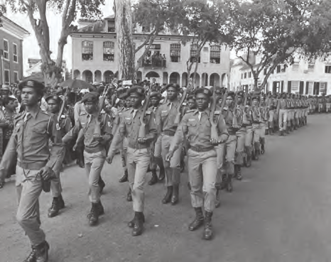

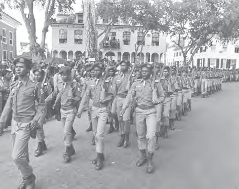

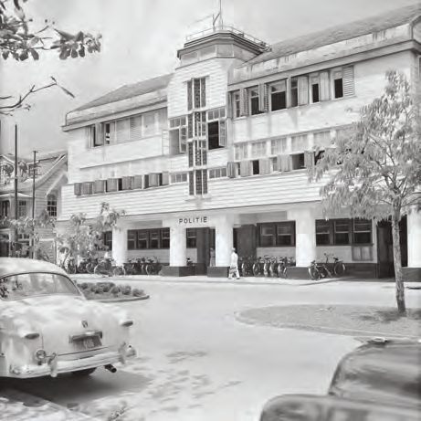

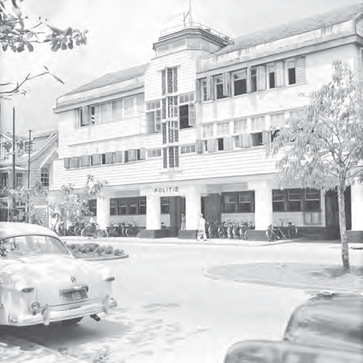

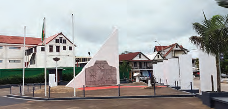

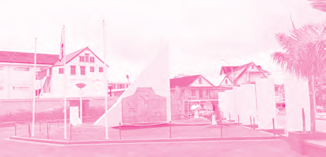

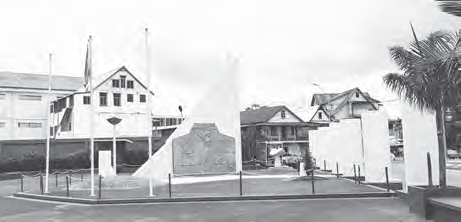

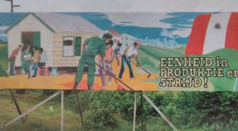

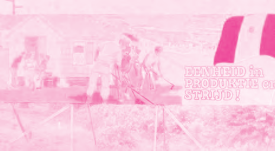

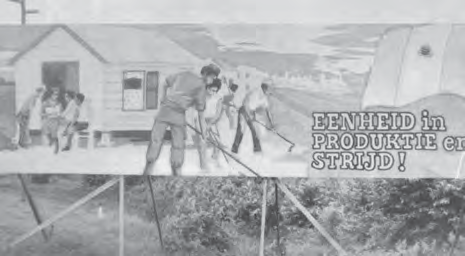

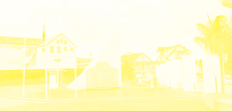

---

### Guía del Profesor - Respuestas y Explicaciones

122

Les

Thema 7 – Ons land, een zelfstandige republiekEen staatsgreep in ons land

VRAGEN EN ANTWOORDEN

1. a. In welk jaar is de Surinaamse Krijgsmacht opgericht?

De Surinaamse Krijgsmacht is opgericht in het jaar 1975.

b. Wie kon in dienst treden van de Surinaamse Krijgsmacht?

Surinaamse militairen in ons land en Surinaamse militairen die uit Nederland terug-

gekeerd waren konden in dienst treden van de Surinaamse Krijgsmacht.

c. De naam van de Surinaamse Krijgsmacht is later veranderd in het Nationaal Leger.

2. Noem dr ie problemen waar de bevolking van ons land in de eerste jaren na de onafhan -

kelijkheid mee te maken had.

De problemen waar de bevolking van ons land in de eerste jaren mee te maken had,

waren: werkloosheid en armoede, hoge woningnood, gebrek aan schoon drinkwater,

goede elektra- en telefoonverbinding.

De leerlingen hoeven er maar drie op te schrijven.

3. Waarom werd in 1979 veel geprotesteerd tegen de regering?

Er werd geprotesteerd tegen de regering omdat er veel ontevredenheid was in ons land.

De regering kon het land niet goed besturen, want de verschillende politieke partijen en

parlementsleden waren het vaak niet met elkaar eens.

4. a. Wanneer vond de staatsgreep in ons land plaats?

De staatsgreep vond plaats op 25 februari 1980.

b. Leg uit waarom de militairen een staatsgreep pleegden.

De militairen pleegden een staatsgreep, omdat 3 van hun bestuursleden werden

gearresteerd door de regering (omdat de regering weigerde de vakbond, opgericht

door de militairen, te erkennen).

5. Bekijk de foto. Aan welke gebeurtenis herinnert dit monument ons? (zie leerlingenboek

afbeelding 10)

a. De brand van het politiebureau.

b. De onafhankelijkheid van Suriname.

c. De oprichting van de Surinaamse Krijgsmacht.

d. De staatsgreep van 25 februari 1980.

6. Neem de v olgende rijtjes over in je schrift. Wat was de naam van de volksvertegenwoor -

diging in die jaren? Kies uit de tweede rij en trek een lijn.

1948 – 1975 • •Koloniale Staten

1975 – 1980 • •Nationale Militaire Raad

1980 – 1987 • •Staten van Suriname

•Parlement van de Republiek Suriname2

---

123

Thema 7 – Ons land, een zelfstandige republiek7. Welk antwoord is juist?

De hoogste macht in ons land lag in de periode 1980 – 1987 bij …

a. het Militair Gezag.

b. het P arlement van de Republiek Suriname.

c. de P resident.

d. het v olk.

8. Wat wil zeggen een revolutie teweegbrengen?

Dat wil zeggen dat er grote veranderingen in onze samenleving en in het bestuur van ons

land zouden komen.

9. Waarom nam de ontevredenheid van de bevolking na de eerste jaren van de staatsgreep

toe?

De ontevredenheid van de bevolking nam na de eerste jaren toe, omdat de beloofde

verkiezingen niet kwamen.

10. Hoe w erd er in binnen- en buitenland gereageerd op het harde optreden van de mili -

tairen?

In binnen- en buitenland werd er afkeurend gereageerd op die gebeurtenissen. Vanuit

Nederland werd de ontwikkelingshulp stopgezet en ons land kreeg financiële problemen.

Er ontstond schaarste van veel producten en er heerste grotere armoede onder grote

delen van de bevolking. De populariteit van de militairen onder de bevolking nam af.

---

*Fuente: suriname-history.pdf (estudiantes) y suriname-history-teacher-guide.pdf (profesor)*
