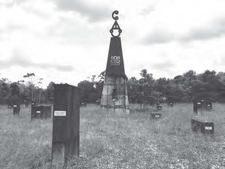
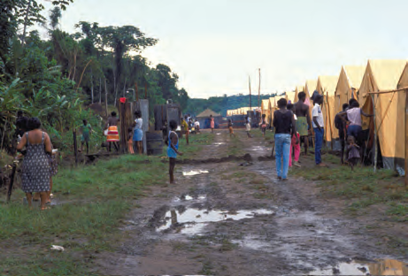
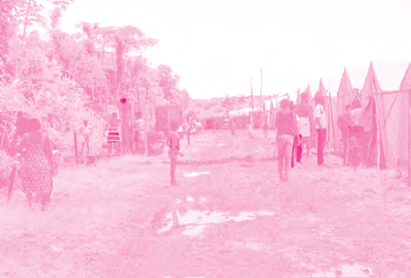
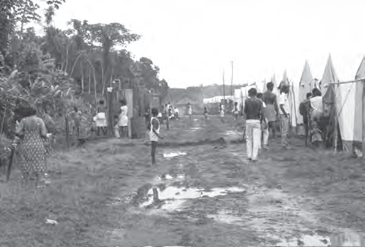

# Ons land, een zelfstandige republiek

## Lección 3: Veranderingen in het bestuur

---

### Contenido del Libro de Estudiantes

Veranderingen in het bestuur

Vanaf 1985 werden gesprekken gevoerd om vrije verkiezingen te organiseren en een

gekozen regering in ons land te hebben. De Militaire Raad en de verschillende politieke partijen wilden graag via vreedzaam overleg komen tot oplossingen. Maar toen brak in juli 1986 de Binnenlandse oorlog uit in ons land, een burgeroorlog. Deze oorlog werd gevoerd tussen het Jungle Commando en het Nationaal Leger. Tijdens deze oorlog werden vooral in het oosten van ons land veel verwoestingen aangericht. Zo werd Albina bijna helemaal vernield en ook dorpen als Pokigron en Moiwana waarbij onschuldige bewoners werden gedood door het Nationale Leger. 3

Moiwana Monument ter herdenking van de slachtoffers van de

Binnenlandse oorlog11

Vluchtelingenkamp in Frans-Guyana12Tijdens de Binnenlandse oorlog kwamen

mensen van de strijdende partijen om het leven. Anderen zijn op de vlucht geslagen. Veel vluchtelingen trokken de grens over naar Frans-Guyana waar ze werden opgevangen in vluchtelingenkampen.In 1987 zijn de strijdende partijen met gesprekken begonnen over het sluiten van vrede, maar pas in 1992 kwam er officieel een einde aan de Binnenlandse oorlog. Er werd een overeenkomst bereikt en in Lelydorp werd het Lelydorp Akkoord getekend. Dit was een belangrijke stap naar vrede en veiligheid in ons land.

OPDRACHT

• Vertel wat je op de afbeelding ziet.

• In welk land is deze foto genomen?

• Waarom vluchtten de mensen weg uit Suriname?BIJ AFBEELDING 12

Tijdens de militaire periode was de Grondwet in ons land buiten werking gesteld. Er werd een voorstel voor een nieuwe Grondwet opgesteld. Dit voorstel werd middels een referendum aan het volk voorgelegd. De burgers mochten hun stem uitbrengen voor of tegen de nieuwe Grondwet. In september 1987 werd de nieuwe Grondwet door het Surinaamse volk goedgekeurd. Een paar maanden later werden verkiezingen gehouden.

OPDRACHT

• In welk jaar werd in Suriname een referendum gehouden?

• Waarover werd bij het referendum gestemd?

99

Thema 7 | Les 3 – Veranderingen in het bestuurLes

---

Met de Grondwet van 1987 vond een aantal veranderingen in het bestuur van Suriname

plaats. Het Parlement heette vanaf toen De Nationale Assemblee (DNA). Er zijn 51 leden die door het volk worden gekozen bij de algemene verkiezingen. De leden van de Nationale Assemblee worden ook wel volksvertegenwoordigers genoemd.De leden van de Nationale Assemblee kiezen de president en de vicepresident. De regering wordt gevormd door de president, de vicepresident en de Ministerraad. De president staat aan het hoofd van de regering en hij benoemt en ontslaat de ministers. De ministers hebben elk de leiding over een ministerie. Samen vormen de ministers de Ministerraad. Aan het hoofd van de Ministerraad staat de vicepresident. De vicepresident is ook de vervanger van de president.

Om de vijf jaar worden verkiezingen gehouden waaraan verschillende politieke partijen

meedoen. Bij een verkiezing stemmen mensen op personen, die op de lijst staan van een

politieke partij. De personen die gekozen worden, zijn de volksvertegenwoordigers of DNA leden.

OM TE ONTHOUDEN

• In 1986 brak in Suriname de Binnenlandse oorlog uit, een strijd van het Jungle Commando tegen het Nationaal Leger.

• Tijdens deze oorlog werden dorpen en vestigingsplaatsen vernield en vielen er slachtoffers. Ook sloegen mensen op de vlucht.

• Pas in 1992 kwam er officieel een eind aan de Binnenlandse oorlog met het Lelydorp Akkoord.

• In 1987 kreeg ons land een nieuwe Grondwet en werden algemene verkiezingen gehouden.

• Bij verkiezingen mogen mensen stemmen op kandidaten van politieke partijen. Zo worden de leden van De Nationale Assemblee gekozen voor een termijn van vijf jaar.

REGERING

Staat aan het hoofd vanBenoemt en ontslaat

kiezen

Kiezen 51 volksvertegenwoordigersPRESIDENT

VICE-

PRESIDENT

DNA: DE NATIONALE

ASSEMBLEE

HET SURINAAMSE

VOLKMINISTER-

RAAD

Het bestuur van ons land13

100

Thema 7 | Les 3 – Veranderingen in het bestuur

---

VRAGEN

1. Neem over in je schrift en vul in:

In juli 1986 begon de strijd van het …

tegen het Militair Gezag. Er brak een … uit, waarbij er vooral in het … van ons land veel verwoest werd. Plaatsen werden vernield en er vielen ook doden. Veel mensen … weg, naar bijvoorbeeld Frans-Guyana. Daar werden ze opgevangen in …

2. a. Wat wordt bedoeld met een akkoord

bereiken?

b. Hoe heet het akkoord dat gesloten werd tussen de regering en het Jungle Commando?

3. Reken uit hoe lang de Binnenlandse oorlog heeft geduurd.

4. Welke bewering is juist?I. Tussen 1980 en 1987 was onze Grondwet buiten werking gesteld.

II. In 1987 kreeg ons land voor het eerst een eigen Grondwet.

A. Alleen bewering I is juist.

B.Alleen bewering II is juist.

C. Bewering I en II zijn juist.

D.Bewering I en II zijn onjuist.

5. a. Zoek in een woordenboek of het

internet het woord referendum op.

b. Leg met eigen woorden uit wat met een referendum wordt bedoeld.

6. Welke bewering is juist?I. In ons land werd in 1987 een referendum gehouden.

II. Het referendum van 1987 ging over een nieuwe Grondwet.

A. Alleen bewering I is juist.

B.Alleen bewering II is juist.

C. Bewering I en II zijn juist.

D.Bewering I en II zijn onjuist.7. Neem over in je schrift en vul in:

In 1987 kreeg ons land een nieuwe … Er vonden verandering plaats in het … van ons land. Het parlement veranderde in … Er zijn … leden, die gekozen worden door het volk. De gekozen leden worden daarom ook wel … genoemd. Iedere vijf jaar zijn er … waaraan verschillende politieke partijen deelnemen.

8. Om de vijf jaar worden in Suriname verkiezingen gehouden. Op wie mag de bevolking dan stemmen?

A. De ministers

B.De president

C. De vicepresident

D.De volksvertegenwoordigers

9. De regering van ons land wordt gevormd door de:1. …2. …3. …

10. Wie zijn de huidige president en vicepresident van Suriname?

101

Thema 7 | Les 3 – Veranderingen in het bestuur

---

### Imágenes de la Lección

---

### Guía del Profesor - Respuestas y Explicaciones

124

Les

Thema 7 – Ons land, een zelfstandige republiekVeranderingen in het bestuur

VRAGEN EN ANTWOORDEN

1. Neem o ver in je schrift en vul in:

In juli 1986 begon de strijd van het Jungle Commando tegen het Militair Gezag. Er brak

een burgeroorlog uit, waarbij er vooral in het oosten van ons land veel verwoest werd.

Plaatsen werden vernield en er vielen ook doden. Veel mensen vluchtten weg naar

bijvoorbeeld Frans-Guyana. Daar werden ze opgevangen in vluchtelingenkampen.

2. a. Wat wordt bedoeld met een akkoord bereiken?

Met het bereiken van een akkoord wordt bedoeld dat men tot overeenstemming

kwam. Eindelijk een oplossing vinden, waar de partijen het allemaal mee eens zijn.

b. Hoe heet het ak koord dat gesloten werd tussen de regering en het Jungle

Commando?

Het akkoord dat gesloten werd tussen de regering en het Jungle Commando heet het

Lelydorp Akkoord.

3. Reken uit hoe lang de Binnenlandse oorlog heeft geduurd.

De Binnenlandse oorlog heeft zes jaren geduurd. (1986-1992)

4. Welke bewering is juist?

I. Tussen 1980 en 1987 was onze Grondwet buiten werking gesteld.

II. In 1987 kreeg ons land voor het eerst een eigen Grondwet.

a. Alleen bewering I is juist.

b. Alleen bewering II is juist.

c. Bewering I en II zijn juist.

d. Bewering I en II zijn onjuist.

5. a. Zoek in een woordenboek of het internet het woord referendum op.

b. Leg met eigen woorden uit wat met een referendum wordt bedoeld.

Met referendum wordt bedoeld dat je je mening mag geven of je het eens of oneens

bent met een voorstel.

6. Welke bewering is juist?

I. In ons land werd in 1987 een referendum Gehouden.

II. Het r eferendum van 1987 ging over een nieuwe grondwet.

a. Alleen bewering I is juist.

b. Alleen bewering II is juist.

c. Bewering I en II zijn juist.

d. Bewering I en II zijn onjuist.3

---

125

Thema 7 – Ons land, een zelfstandige republiek7. Neem o ver in je schrift en vul in:

In 1987 kreeg ons land een nieuwe Grondwet. Er vonden verandering plaats in het

bestuur van ons land. Het parlement veranderde in De Nationale Assemblee. Er zijn 51

leden, die gekozen worden door het volk. De gekozen leden worden daarom ook wel

volksvertegenwoordigers genoemd. Iedere vijf jaar zijn er verkiezingen waaraan verschil-

lende politieke partijen deelnemen.

8. Om de vijf jaar w orden in Suriname verkiezingen gehouden. Op wie mag de bevolking

dan stemmen?

a. De ministers

b. De president

c. De vicepresident

d. De volksvertegenwoordigers

9. De regering van ons land wordt gevormd door de:

1. President

2. Vicepresident

3. Raad van Ministers

10. Wie zijn de huidige president en vicepresident van Suriname?

Antwoord hangt af van het schooljaar waarin dit boek gebruikt wordt.

---

*Fuente: suriname-history.pdf (estudiantes) y suriname-history-teacher-guide.pdf (profesor)*
