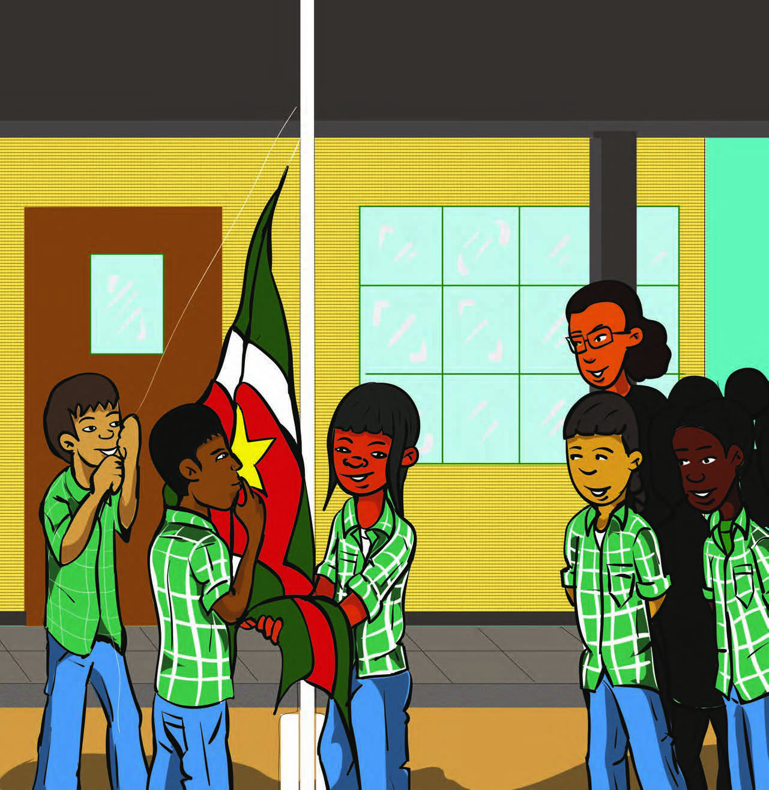
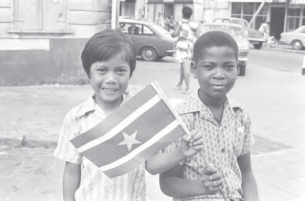
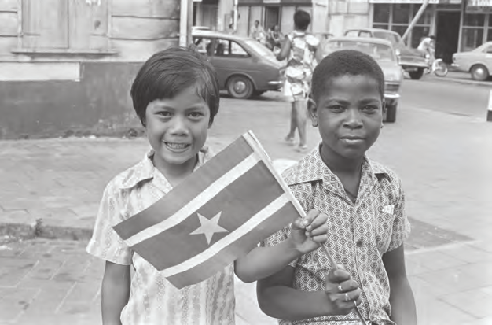

# Ons land, een zelfstandige republiek

## Introducción: Ons land, een zelfstandige republiek

---

### Contenido del Libro de Estudiantes

7Ons land, een zelfstandige

republiekTHEMA

---

INLEIDING

Op school wordt iedere dag de vlag gehesen. Deze mooie

vlag is sinds 1975 onze nationale vlag. In 1975 werd ons land onafhankelijk. Daar gaat dit thema over. In de eerste les wordt verteld over de onafhankelijkheid en de nationale symbolen die ons land toen kreeg. In de tweede les leer je dat in 1980 in ons land een staatsgreep werd gepleegd. In 1986 brak er ook een burgeroorlog uit. Over die oorlog en over de vrede die werd gesloten, wordt in de derde les verteld.KERNBEGRIPPEN

• onafhankelijk

• Republiek

• president

• Johan Ferrier

• Parlement

• Grondwet

• nationale symbolen

• Surinaamse Krijgsmacht

• Nationaal Leger

• BOMIKA

• staatsgreep

• Militair Gezag

• Nationale Militaire Raad

• revolutie

• Jungle Commando

• burgeroorlog

• Moiwana

• vluchtelingen

• Lelydorp Akkoord

• referendum

• De Nationale Assemblee

• politieke partijen

Bij de onafhankelijkheid kreeg ons land ook een nationale vlag1

92

---

### Imágenes de la Lección

---

### Guía del Profesor - Respuestas y Explicaciones

91

Les

Thema 5 – Ontwikkeling van ons land na 1945Ontwikkelingshulp aan ons land

VRAGEN EN ANTWOORDEN

1. Na de oor log kregen landen in Europa ontwikkelingshulp.

a. Waarom kregen deze landen ontwikkelingshulp?

Landen kregen na de oorlog ontwikkelingshulp, omdat ze na de bombardementen

alles weer moesten opbouwen en het dagelijks leven moest weer op gang komen.

b. Welk land gaf deze ontwikkelingshulp?

Ontwikkelingshulp kwam vanuit de Verenigde Staten van Amerika.

2. Leg uit waarom ook ons land na de Tweede Wereldoorlog ontwikkelingshulp kreeg.

Ons land kreeg na de Tweede Wereldoorlog ook ontwikkelingshulp, omdat er veel

mensen werkloos en arm waren. Vele producten waren schaars en duur.

3. Wat is in het algemeen het doel van ontwikkelingshulp?

Het doel van ontwikkelingshulp is om een land dat in moeilijkheden verkeert, te helpen

opbouwen onder andere door werkgelegenheid te creëren.

4. Welke bewering is juist?

I. Ons land k reeg ontwikkelingshulp omdat het in de oorlog gebombardeerd was.

II. Ontwikkelingshulp was voor ons land niet nodig, want het ging goed met ons land.

a. Alleen bewering I is juist.

b. Alleen bewering II is juist.

c. Bewering I en II zijn juist.

d. Bewering I en II zijn onjuist.

5. Noem dr ie projecten uit het Welvaartsfonds op.

-Oprichting van de Volks Credit Bank (VCB)

-Oprichting van het Planbureau

-Onderzoek naar natuurlijke hulpbronnen

6. Ronald Kappel was een pionier van de Surinaamse luchtvaart.

a. Zoek het woord pionier op in een woordenboek of op het internet.

b. Vertel met eigen woorden wie een pionier genoemd wordt.

De beschrijving kan per leerling verschillen.

Een pionier is iemand die als eerste ergens mee bezig is. Hij of zij verzet baanbrekend

werk en kan niet steunen op ervaringen van anderen.

7. Wat is niet juist over Ronald Kappel?

a. Hij kwam om het leven bij een vliegtuigongeluk.

b. Hij was een piloot bij de Surinaamse luchtvaart.

c. Onder zijn leiding werden de airstrips in ons binnenland aangelegd.

d. Ronald Kappel nam deel aan Operation Grasshopper.

8. Vertel kort wat het Plan Wageningen inhield.

Bij plan Wageningen werden in het district Nickerie nieuwe rijstpolders aangelegd. Hier

werd door Nederlandse boeren machinaal rijst verbouwd.1

---

92

Thema 5 – Ontwikkeling van ons land na 19459. a. Waarvoor staat de afkorting SML?

De afkorting SML staat voor de Stichting Machinale Landbouw.

b. In welk jaar werd dit bedrijf overgedragen aan Suriname?

De SML werd in 1975 overgedragen aan Suriname.

10. Bekijk de volgende tekeningen.

Leg uit of je kan spreken van machinale rijstbouw.

Tekening 1 = machinale landbouw

Tekening 2 = geen machinale landbouw

Tekening 3 = machinale landbouw

Je kunt spreken van machinale rijstbouw in tekening 1 en tekening 3. Tekening 2 is geen

afbeelding van machinale rijstbouw.

---

93

Les

Thema 5 – Ontwikkeling van ons land na 1945De stuwdam in de Surinamerivier

VRAGEN EN ANTWOORDEN

1. Zijn de v olgende uitspraken waar of niet waar?

a. Het Tienjarenplan kwam toen het Welvaartsfonds was afgelopen. Waar

b. Het P lanbureau is tijdens het Tienjarenplan opgericht. Niet waar

c. Bij het Welvaartsfonds moest ons land zelf ook een deel van de kosten betalen.

Niet waar

d. Het P lanbureau was opgericht om plannen te ontwikkelen en uit te voeren. Waar

e. Het Tienjarenplan was ontwikkeld voor 1955 tot 1965. Waar

2. Vertel kort wat het Brokopondoplan inhield. Wat wilde men bouwen en waarom?

Het Brokopondoplan hield in dat er een stuwdam en een waterkrachtcentrale in de

Surinamerivier aangelegd en gebouwd zouden worden om elektriciteit op te wekken.

3. Leg uit waarom het Amerikaanse bauxietbedrijf Alcoa wel geïnteresseerd was in het

Brokopondoplan.

Het Amerikaanse bauxietbedrijf was geïnteresseerd in het Brokopondoplan, omdat ze

een fabriek wilden opzetten om bauxiet te verwerken waarvoor ze elektriciteit nodig

hadden.

4. Vul in wat er bij de Brokopondo overeenkomst werd afgesproken.

Alcoa zou een stuwdam aanleggen en een fabriek bouwen om bauxiet te verwerken.

Deze fabriek had veel elektriciteit nodig om aluminium te smelten.

Het voordeel voor ons land was meer werkgelegenheid en we konden meer geld

verdienen.

5. In 1958 werd de Brokopondo overeenkomst gesloten. Noem de twee partijen bij het

sluiten van de Brokopondo overeenkomst.

1. Alcoa

2. Surinaamse regering

6. a. De stuwdam zou pas na 75 jaar van Suriname zijn. Reken uit in welk jaar dat zou zijn.

1958 + 75 = 2033

b. De stuwdam is per 1 januari 2020 officieel aan Suriname overgedragen. Reken uit

hoeveel jaren eerder dan afgesproken de stuwdam aan ons land is overgedragen.

2033 - 2020 = 13 jaren eerder

7. Welk antwoord is juist?

De officiële naam van het stuwmeer is:

a. Alcoa stuwmeer

b. Brokopondo stuwmeer

c. Professor dr. ir. W. J. van Blommesteinmeer

d. Suriname stuwmeer

8. a. In welke rivier is het stuwmeer ontstaan?

In de Surinamerivier

b. Waarom moesten de mensen die langs deze rivier woonden verhuizen?

Omdat het gebied waar deze mensen woonden onder water gezet werd voor de

aanleg van het stuwmeer.2

---

*Fuente: suriname-history.pdf (estudiantes) y suriname-history-teacher-guide.pdf (profesor)*
